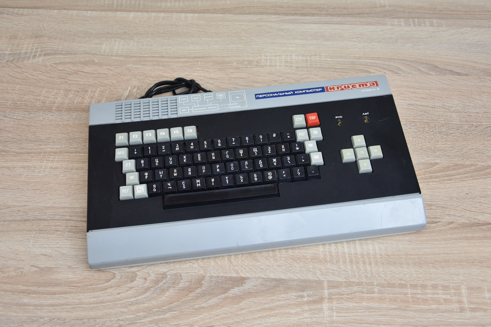

## История

Компьютер «Криста-2» это предыдущая, промежуточная версия компьютера [Вектор 06Ц](../vector06c). Отличительные особенности этого компьютера от «Вектор 06Ц»:

- Центральный процессор работает на более низкой частоте, которая составляет 2,5 МГц.
- Изображение формируемое компьютером на стандартом телевизоре не может быть отображено полностью по ширине.
- Нет возможности изменять палитру цветов. У компьютера 16 фиксированных цветов.
- Формат хранения программ на магнитной ленте с «Вектор 06Ц» несовместим.
- Видеорежим высокого разрешения 512×256 несовместим. Отличается порядок расположения точек в байте.
- Есть дополнительный видеорежим 1024×256.
