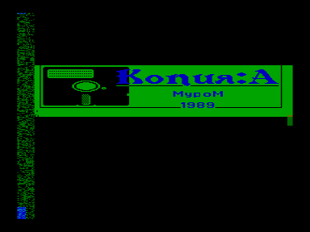
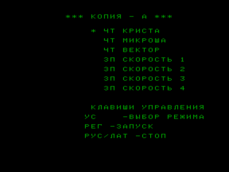

Копировщик «Копия А» предназначен для копирования файлов в форматах «Криста-2», «Микроша», «Вектор-06Ц» в формат «Кристы-2».

Входит в состав ПО базовой кассеты ПК «Криста-2».

Клавиши управления:

РУС/ЛАТ	— стоп

СС ( РЕГ )	— запуск

УС	— выбор режима (чтение/запись)

Файлы:

CopyA.wav — формат «Криста-2» (с  заставкой)

CopyA.r5f — для запуска с адреса 5F00h ([Эмулятор «Virtual Vector»](../virtual_vector))

Файлы получены из wav c оригинальной кассеты (оцифровал fan):

[http://sblive.narod.ru/ZX-Spectrum/Krista2/Krista2.htm](http://sblive.narod.ru/ZX-Spectrum/Krista2/Krista2.htm)

Примечание:

На втором скриншоте выключены плоскости 1 и 3.

