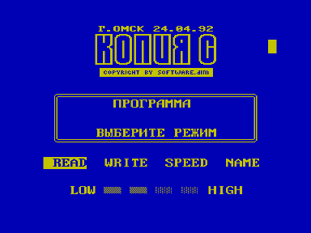

Программа осуществляет копирование файлов в формате «Криста-2». Управление программой простое и не требует описания. Здесь будут даны рекомендации по выбору скорости.

Как показала длительная практика, оптимальными скоростями на «Кристе» являются 2 и 3 (две или три засвеченные полоски). При большей скорости записи не будут считаны стандартным ПЗУ «Кристы», при меньшей — Альтернативным. Для ПК «Вектор» эти скорости соответственно 1 и 2.

Если сразу после запуска нажать WRITE, копировщик скопирует сам себя в формате «Криста-2».

