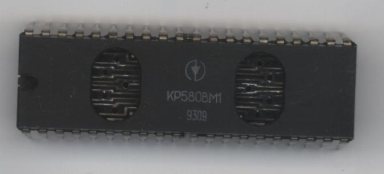

В архиве находится описание системы команд процессора КР580ВМ1 и краткая инструкция по его установке в Вектор от Masterpiece.
На векторе есть по крайней мере одна программа, использующая возможности КР580ВМ1 — intro к игре [Колобиха](../kolobiha) от SES.
Дополнительная информация по программному определению типа процессора приведена в [Scaner №5](../scaner/5).

Процессор КР580ВМ1 поддерживается в [Эмулятор «Virtual Vector»](../virtual_vector) начиная с версии 5.58.

В архиве представлена таблица для ассемблера The Telemark Assembler (TASM) Version 3.2 (автор Thomas N. Anderson), позволяющая компилировать программы для процессора КР580ВМ1 (подготовил [Иван Городецкий](../../authors/ivagor)).

Cм. также:

[«Точность эмуляции КР580ВМ1»](http://zx.pk.ru/showthread.php?t=11062)

[«Загадочный проц КР580ВМ1»](http://zx.pk.ru/showthread.php?t=310)

