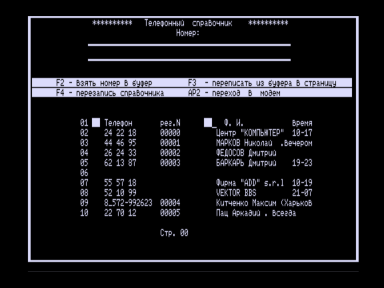
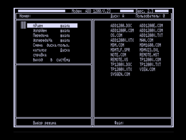

Программа ADD1200 предназначена для:

— приема и передачи файлов по выделенному телефонному каналу;

— записи принятых файлов на НМЛ (магнитофон);

— чтения файла с НМЛ для передачи.

Терминальная программа TP1200V.COM предназначена для доступа на узел ADD HOST, реализованный на базе IBM совместимого компьютера с модемом ADD MD1200.

Примечание: глючит в T-34, поэтому образ диска загрузочный с ОС F51.

