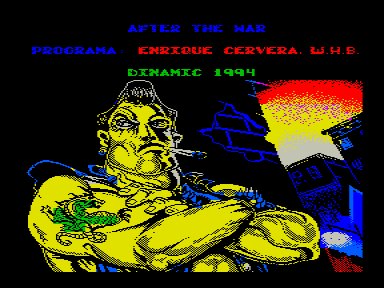
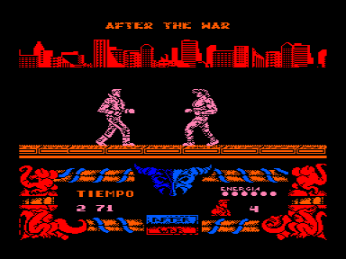

Розовый мужик идет по улице и дерется с другими розовыми мужиками.
Побежденный — аннигилируется.
Мужики подходят по очереди.
В игре использована графика из спектрумовской версии After the War, но полноценной адаптацией ее назвать нельзя.

