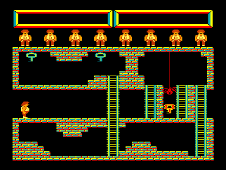

Ambal — игра, аналогичная игре Montezuma's Revenge на компьютере Atari.
Управляя главным героем нужно пройти все лабиринты подземелья, не напоровшись на его обитателей (змей, черепов и пауков), попутно собирая различные предметы (мечи, топоры, звездочки).

Ambal M — усовершенствованная версия игры Ambal, в ней исправлены все ошибки бывшие в оригинальном Ambal-е (непроходимые залы, отсутствие цели и др.)

В архиве также лежат многожизненные версии.

См. также [Death in the Pyramid](../demosfan/1999/death_in_the_pyramid).

