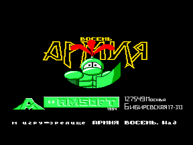
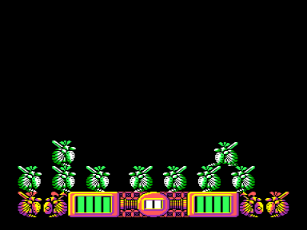

Игра-зрелище.
Цель ее в том, чтобы «бойцы прошли на территорию противника.
За один ход вы должны выставить одного солдата около своей части экрана.
Всего есть 4 вида воинов, но у вас может и не быть всех.
Количество солдат распределяется случайным образом».

