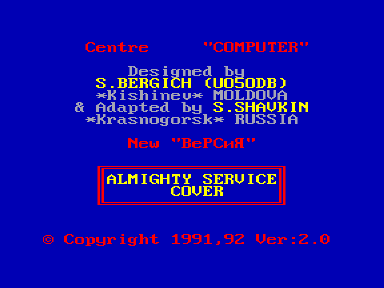
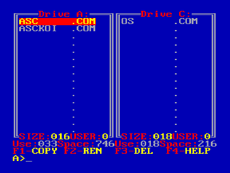

Файловый менеджер ASC.

В архиве представлено несколько версий + исходники.

Рекомендуется использовать в [МикроДОС 3.1 (BIOS 3.1 ABC)](../microdos/3.1).

## Краткое описание программы

Программа ASC представляет собой универсальную сервисную программу для работы с файловой системой Микро ДОС.
Она имеет удобный интерфейс пользователя и позволяет даже новичку полноценно работать с ДОС.
В основу программы легла популярная на компьютерах IBM PC программа NORTON COMMANDER.

## Основные возможности программы

- копирование отдельных файлов
- копирование с переименованием
- групповое копирование
- копирование по маске
- переименование файлов
- удаление файлов
- групповое удаление файлов
- удаление по маске
- отображение директорий двух дисков либо двух USERов одного диска в текущих окнах
- выбор диска или USERа в окне
- установка активного диска
- просмотр и редактирование текстовых файлов посредством встроенного дискового текстового редактора RETEX
- вызов подсказки
- полная информация о состоянии диска (объем свободной и занятой памяти, текущий USER, объем текущего либо помеченных файлов)
- отмена любых режимов

## Как это делать?

| Клавиши | Действие |
| --- | --- |
| F1 | копирование |
| F2 | переименование |
| F3 | удаление |
| F4 | помощь |
| CC+F1 | директория правого окна |
| CC+F2 | директория левого окна |
| CC+F3 | редактирование файла |
| CC+F4 | выбор USERа |
| ТАБ | смена текущего диска |
| ПС | пометка файлов |
| CC+ПС | пометка по маске |

