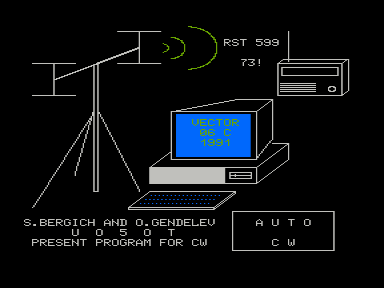
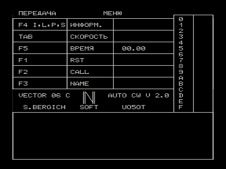

Программа позволяет работать телеграфом на радиостанции в автоматическом режиме на прием и передачу.
Программа может быть использована для самостоятельного изучения азбуки морзе.
Работа в эфире превращается в приятное времяпровождение, так как обладает отличными сервисными возможностями.

В образах записана версия AUTO CW V 2.0 (Кишинев, 1991), подписанная «S.BERGICH SOFT, UO5OT».

# Инструкция к программе AUTOCW.COM

Программа позволяет работать телеграфом на радиостанции в автоматическом режиме на прием и передачу.
Программа может быть использована для самостоятельного изучения азбуки Морзе.
Работа в эфире превращается в приятное времяпровождение, так как обладает отличными сервисными возможностями.

## Заполнение служебной таблицы

После загрузки программы AUTOCW.COM[^1] и нажатия на клавишу ПРОБЕЛ вам необходимо заполнить служебную таблицу следующими данными.

### 1. Скорость передачи на ключе

После нажатия клавиши ТАБ курсор появляется в месте, где необходимо указать скорость передачи (от 30 до 4000 знаков в минуту), и нажать клавишу ВК.

### 2. Текущее время

Нажимаем клавишу F1[^2] и затем клавишами СТРЕЛКА ВЛЕВО или СТРЕЛКА ВПРАВО устанавливаем текущее время и нажимаем клавишу ВК.

### 3. Позывной вашей радиостанции

Нажимаем клавишу F2 и после появления курсора вводим позывной радиостанции.
Завершается ввод клавишей ВК.

### 4. Имя оператора

Нажимаем клавишу F3 и после появления мигающего курсора вводим свое имя.
Завершается ввод клавишей ВК.

## Заполнение служебных буферов заготовками выражений и сообщений

Программа AUTOCW.COM позволяет использовать в работе 16 предварительно заполненных текстом буферов для передачи их корреспонденту в случае необходимости.
Для заполнения выбранного буфера необходимо:

1. Последовательно нажимаем клавиши F4 и I.
   В верхней клетке таблицы появляется слово INPUT, после чего необходимо нажать номер выбранного буфера, и курсор появляется в нижнем большом прямоугольнике, в который заносится необходимый текст.
   После окончания ввода нажимаем клавишу ВК.
2. На индикаторе рабочих буферов напротив заполненных буферов появляется светящийся прямоугольник.
   Аналогично можно заполнить все остальные буфера.
   Для просмотра содержимого того или иного буфера необходимо нажать клавиши F4 и P, затем номер выбранного буфера.
   Текст буфера появится в нижнем прямоугольнике.

## Переключение режимов работы программы

| Клавиши | Действие |
| ------- | -------- |
| СТР | Переключение режимов: прием / передача. |
| СТРЕЛКА ВЛЕВО / ВВЕРХ | Включение выбранного режима. |
| АР2 и номер буфера | Выдача в эфир содержимого выбранного буфера. |
| АР2 и L | Выдача в эфир позывного радиостанции. |
| АР2 и N | Выдача в эфир имени оператора радиостанции. |
| АР2 и T | Выдача в эфир текущего времени (час, мин). |
| АР2 и R | Выдача в эфир сигнала RST. |
| F4, S и номер буфера | Запись содержимого буфера на магнитофон. |
| F4, S и O | Запись аппаратного журнала на магнитофон. |
| F4 и T | Очистка экрана. |
| F4 и ПРОБЕЛ | Вывод аппаратного журнала на экран. Нажатием клавиши ПРОБЕЛ можно приостанавливать вывод. |
| F4 и C | Вход в режим изменения цвета символов и фона. Клавишами СТРЕЛКА ВЛЕВО и СТРЕЛКА ВПРАВО установить желаемый цвет символов и фона. В заключение нажать клавишу ВК. |
| УС | Нажатие и удержание приводит к выходу в меню без остановки процесса приема / передачи. |

