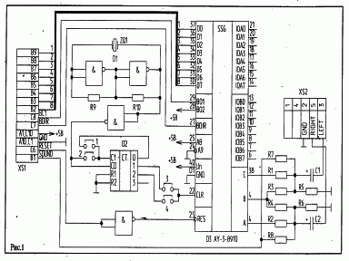

Схема подключения AY-3-8910 к разъему «ПУ» БПЭВМ «Вектор-06Ц».

Публикация из журнала Радиолюбитель №6 1996г.

См. также:

[Музыкальный сопроцессор «Вектора-06ц» и «Кристы-2» (Омск))](../ay_omsk),

[Музыкальный сопроцессор AY-3-8910 (Саттаров)](../ay8919sat).

