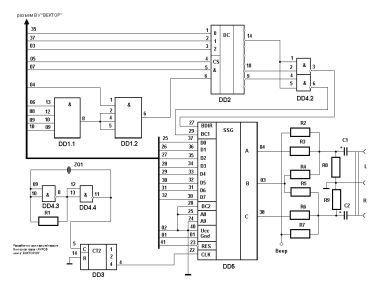

Музыкальный стереофонический трехканальный сопроцессор для персональных ЭВМ «Вектор-06ц» и «Криста-2». В архиве также представлена одноименная публикация из журнала Радиолюбитель №5 1995г и фото печатной платы.

См. также:

[Музыкальный сопроцессор AY-3-8910 (Саттаров)](../ay8919sat),

[Музыкальный сопроцессор AY-3-8910 "R-SOUND" (Беларусь))](../ay_kostinevich).

