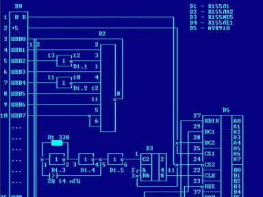

Кировский компьютерный центр «Виктория» представляет!

Новая аппаратная разработка для «Вектора»!

П Р О Г Р А М М И Р У Е М Ы Й   Г Е Н Е Р А Т О Р

(М У З Ы К А Л Ь Н Ы Й   С Т Е Р Е О - С О П Р О Ц Е С С О Р)

Д Л Я   Б П Э В М   «В Е К Т О Р - 0 6 Ц»

А У - 3 - 8 9 1 0

Применение: БПЭВМ «Вектор-06Ц» (адаптация музыки с «ZX-Spectrum 128 кбт»)

(с) Design by Саттаров В.

Технические характеристики:

3 независимых музыкальных канала (стерео музыка) + генератор «белого шума»

2 (или 1) параллельных порта ввода/вывода

16 градаций амплитуды

16 форм волного пакета

Основная частота - 1.7734 Мгц

Диапазон воспроизводимых частот: от 27 Гц до 110 Кгц

Частоты волнового пакета: от 0.1 Гц до 6 Кгц

Частота генератора шума: от 3 Кгц до 110 Кгц

См. также:

[Музыкальный сопроцессор «Вектора-06ц» и «Кристы-2» (Омск))](../ay_omsk),

[Музыкальный сопроцессор AY-3-8910 "R-SOUND" (Беларусь))](../ay_kostinevich).

