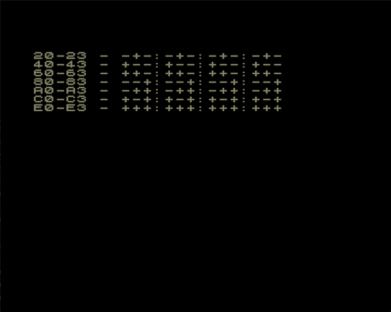

Тест расширений квазидиска Баркаря.

Проверяет все возможные комбинации обращения "адресностью" для всех четырех областей диска.
Работает сравнительно долго, придется подождать.
Даже если на экране ничего не происходит, это не признак окончания теста, надо дождаться появления циферок и плюсов/минусов.

Четыре колонки - это четыре области.

Знаки в каждой колонке соответствуют участкам памяти: 8000-9FFF,A000-DFFF,E000-FFFF

Т.е. -+- значит, что в данном случае подключилась только область A000-DFFF

См. также [Тест расширений Баркаря](../double_edd)

