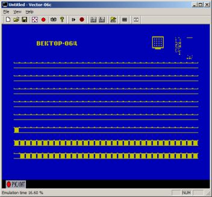

Многоплатформенный эмулятор «Башкирия-2М» полноценно эмулирует «Вектор-06ц» и другие отечественные компьютеры.

После запуска эмулятора надо выбрать «Вектор-06ц» или «Вектор-06ц-Z80» из списка эмулируемых компьютеров.

## Клавиши «Вектора-06ц»

| Клавиши | Действие |
| --- | --- |
| F11 | БЛК+ВВОД (холодный старт) |
| F12 | БЛК+СБР (тёплый старт, запуск загруженной программы) |

Например, для загрузки с образа дискеты надо кликнуть на иконку дискеты, выбрать .fdd-файл.
После чего, удерживая одновременно F1+F2, нажать на F11 и отпустить не раньше, чем будет выполнена загрузка.
Когда замигает индикатор РУС/ЛАТ, нажать на F12.

## «Горячие» клавиши

| Клавиши | Действие |
| --- | --- |
| F9 | ускорение эмуляции (при удержании) |

## Клавиши дебаггера

| Клавиши | Действие |
| --- | --- |
| F4 | запустить до курсора |
| F5 | запустить |
| F8 | один шаг |
| Shift+F8 | запустить до следующей команды |
| F9 | точка останова |
| Ctrl+G | перейти к другому адресу (дизассемблер, дамп) |
| Break | прервать исполнение, войти в дебаггер |

Shift+F8 удобно выполнять на ldir, call и проматывать циклы, если они заканчиваются условным jmp.
Иногда не срабатывает, приходится использовать F4 на следующей команде, источник бага не найден.

## Бейсик

В начальный загрузчик встроен интерпретатор Бейсика версии 2.5.
Для запуска нажать F11, удерживая F3.
Эмулятор поддерживает работу с файлами при помощи команд CLOAD, CSAVE, BLOAD, BSAVE, что создаёт видимость работы с магнитофоном.

## Загрузка «с магнитофона»

Поддерживается загрузка из WAV-файлов 8 и 16 бит, моно и стерео (с усреднением сигнала).
Частота дискретизации роли не играет.

## Эмулируемые компьютеры

Агат-7, Апогей, Башкирия-2М, БК-0010, Ириша, Корвет, Лик, Лик-2, Львов, Микро-80, Микроша, Орион-128, Орион-Про, Партнер, ПК-6128ц, ПК-8000, Радио-86РК, Специалист, Спектр-001, ЮТ-88, Вектор Старт-1200, Вектор-06ц, ZX Spectrum 48 и 128.

С помощью этого эмулятора сделаны практически все скриншоты Базиса.

