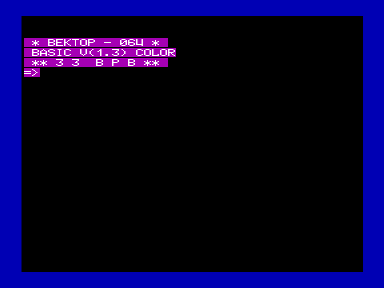

basic13.r0m - оригинальный файл

basic13v.r0m - исправленный файл для работы в режиме 256x256

(по адресу 0x251E вместо 0xF1 записано 0xE1)

На фото (обложка журнала Радио №10-1987) — один из создателей «Вектор-06Ц», Донат Темиразов, отлаживает программу в этой версии Бейсика.

