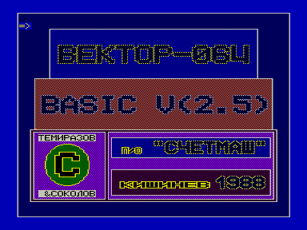

Интерпретатор Бейсика, входящий в базовую поставку ПО к «Вектору-06Ц» на аудиокассете.
Исходный вариант (basic25.r0m) не работает на векторе с адаптером z80.

Также приложены версии:

basic25z.r0m - адаптация к z80, авторы [Иван Городецкий](../../../authors/ivagor) и [Александр Тимошенко](../../../authors/timsoft).

bas25zay.r0m - Тоже самое, что и basic25z.r0m, только PLAY играет не через ВИ53, а через Sound Tracker (Иван Городецкий, 14.07.2009)

