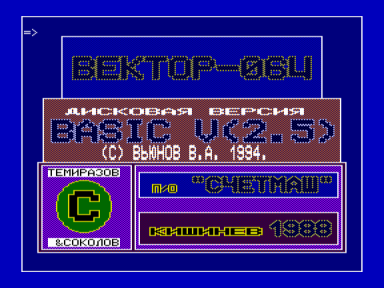

Это дисковая версия BASIC v2.5, полностью совместимая с "кассетной".
После за пуска выводится заставка и промт "=>".
Теперь директивы CLOAD, CSAVE, BLOAD, BSAVE, MERGE работают с дисками, директива VERIFY выдает каталог нужного диска.

Синтаксис директив такой:

````
1. директива CLOAD -
    CLOAD"D:FILENAME"[R]
        где D - имя диска (обязательно !),
        FILENAME - имя файла (расширение всегда .BAS),
        R - необязательная директива автозапуска.
    Пример: CLOAD"A:REKLAMA"R
2. директива CSAVE -
    CSAVE"D:FILENAME"
3. директива MERGE -
    MERGE"D:FILENAME"
4. директива BSAVE -
    BSAVE"D:FILENAME",НАЧ.АДР.,КОН.АДР
        где НАЧ.АДР. и КОН.АДР. десятичные или шестнадцатирич
        ные числа,расширение файла всегда .BIN.
    Пример: BSAVE"C:SCREEN0",&8000,&FFFF
5. директива BLOAD -
    BLOAD"D:FILENAME",АДР.ЗАГРУЗКИ
  Есле нужного файла нет на диске,выводится сообщение об ошибке "НЕВЕРНЫЙ АР-
ГУМЕНТ",так же выводятся сообщения о других ошибках в этих директивах.
6. директива VERIFY["D:"] -
    Без аргумента директива вызывает сброс дисковой подсистемы,не
    обходима при смене дискеты.Если есть аргумент,где D - имя дис
    ка,то выводит каталог этого диска.
    Пример: VERIFY"C:"
````

Примечания:
1. При работе с директивами BLOAD, BSAVE нужно учитывать, что при обмене с дисками, самой маленькой единицей измерения длины выгружаемого-загружаемого кода является не один байт, а одна запись (128 байт).

2. К сожалению, разработчиками Бэйсика не была заложена возможность ис пользования в качестве аргументов вышеперечисленных директив,строковых переме нных,в крайнем случае,для загрузки произвольного файла,можно использоввать с- ледующий метод,-в начале программы зарезервировать строку с директивой загруз ки файла, например:
```
	1 GOTO 10:REM ПЕРЕХОД НА НАЧАЛО ПРОГРАММЫ
	2 BLOAD"A:12345678",ADR:REM ЗАРЕЗЕРВИРОВАННАЯ СТРОКА
```

Теперь нужно лишь узнать адрес памяти, где находится аргумент директивы строки номер 2, и записать по этим адресам необходимые параметры, например оператором POKE, для того чтобы загрузить нужный файл. В качестве адреса загрузки можно ис пользовать значение переменной ADR.
3. В интерпретаторе исправлена ошибка при работе с шестнадцатиричными числами, теперь ими можно свободно пользоваться. Для удаления программ из памяти, рекомендую пользоваться директивой "DELETE,", а не "NEW", тогда директива MERGE будет всегда работать правильно.
4. Выход в РДС из Бэйсика, посредством БЛК+ВВОД.


