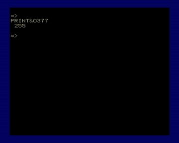

BASIC 2.61 для Вектора-06Ц

Исправлены ошибки/недоработки, присутствовавшие практически во всех клонах Бейсика 2.5:

2.55 — 08.06.2019

1. Данная версия совместима с процессорами 580ВМ80, 580ВМ1, z80 и 1821ВМ85. Причем в отличие от других версий здесь есть полная совместимость и по константам чтения/записи на магнитофон.

2. В процедуре вывода символов в некоторых столбцах знакоместо было шире чем нужно на 1 пиксел.

3. Использование 16ричных чисел со знаком «&amp;» без обрамляющих скобок было очень ограничено и возможно только в двух случаях: или в конце строки или перед запятой.

Теперь шестнадцатиричные числа можно использовать без скобок наравне с десятичными за исключением номеров строк.

Парсинг 16ричных чисел с двумя и более цифрами выполняется быстрее, чем 10чных, поэтому использование целых чисел в 16ричном виде позволяет ускорить выполнение программы.

4. Оператор CLOAD, который позволяет загружать программы на бейсике без имени (программы с именем он тоже загружает, если начать загрузку после того как пройдет имя, что легко определить на слух) теперь сразу после старта бейсика готов к работе с магнитофоном и не требует предварительных команд CLOAD"" или BLOAD""

2.56

5. Исправлена ошибка парсера аргумента, возникавшая при подстановке в качестве аргумента токена оператора. Спасибо Игорю Титарю за багрепорт. Эта ошибка была во всех клонах BASIC 2.5 кроме BASIC-M (автор Фролов В.).

2.57

6. Исправлена ошибочная работа оператора INPUT при вводе значений символьных переменных - теперь токенизация не выполняется.

2.58

7. Теперь при печати текста в режиме LINE BS не происходит «лишнего» скролла.

8. Исправлен RENUM (эта ошибка еще из оригинального бейсика-микрон).

2.59

8.1. RENUM окончательно доисправлен.

8.2. Теперь RENUM не добавляет пробел между оператором и номером строки.

9. В два раза уменьшена задержка междру автоповтором символов.

2.60

10. Исправлена ошибка быстрого ввода при нажатии АР2 и после этого УС+СС+буква. Спасибо Игорю Титарю за багрепорт.

11. Ускорены базовые арифметические операции (умножение, деление, сложение и вычитание). Т.к. более сложные математические функции используют базовые, то они тоже ускорятся.

2.61 — 19.06.2019

12. В GET убрана проверка на сохранение картинки в области переменных.

13. Убраны лишние проверки. Лишними они стали после исправления п.5.

4. В функцию &amp; наряду с поддержкой шестнадцатеричных чисел добавлена поддержка восьмеричных чисел - &amp;Oвосьмеричное_число. Диапазон как и у шестнадцатеричного варианта - два байта, т.е. от &amp;O0 до &amp;O177777

Также немного ускорено выполнение программы за счет оптимизации некоторых процедур Бейсика.

Быстрый старт без заставки.

Бейсик упакован, что ускоряет его загрузку на реал с магнитофонного входа.

2.62 — 21.06.2021

- Процедуры обмена с магнитофоном вернулись на «классические» адреса, что дает совместимость при перехвате магнитофонных операций с Бейсиком 2.5 (не требуется адаптация эмуляторов для данной версии Бейсика).

- Ускорен скроллинг при выводе текста.

- Более эффективный упаковщик ZX0 вместо MegaLZ.

- в комплекте bas262.wav - файл для быстрой (13.5 секунд, для сравнения rom2wav при параметрах по умолчанию генерирует wav длительностью 90 секунд) загрузки в реал через магнитофонный вход с автозагрузкой.

2.63

18. Толерантность к внедрению в обработчик прерывания.

2.70

19. Оптимизированы: поиск строки; поиск переменной; рисование и стирание точек (сказывается не только на графических операторах, но и на выводе символов); изменение цвета; определение цвета точки; PUT; некоторые другие мелочи.

2.71

20. Оптимизированы POKE,SCREEN0,SCREEN3 (для случаев когда изменяется более чем одно значение); рисование линий; PAINT; CIRLCE (особенно эллипсы); умножение; много мелких оптимизаций.

2.72

21. В PAINT частично реализована более быстрая пиксельно-байтовая заливка; ускорено определение цвета точки (быстрее работают GET, PAINT, POINT); чуть сократил CIRCLE.

2.80

22. Убран быстрый набор по УС+СС+буква. В связи с этим заметно сократился размер бейсика в упакованном виде.

23. Таблица синусов для дуг в CIRCLE переведена в компактный вид (48 байт вместо 256) при полном сохранении исходной точности. CIRCLE медленнее чем в 2.72 на 0.2-0.5%

24. Резко ускорен PAINT (почти в 6.5 раза быстрее basic 2.5). Исправлена ошибка PAINT (2.72), которая могла проявляться в некоторых условиях при заполнении экрана с заворотом.

2.81

25. Ускорено умножение и некоторые служебные математические процедуры.

26. Немного ускорены FOR..NEXT и RETURN.

2.82

27. Заметно ускорены рисование эллипсов и LINE BF/BS.

28. Немного ускорены paint, рисование дуг и кругов, вывод символов и деление.

29. Микрооптимизации вызова процедуры проверки типов (в разборе арифметических выражений, AND/OR, FOR), процедуры сравнения, процедуры проверки знака.

30. PAUSE теперь дает почти одинаковую задержку на всех типах процессоров (8080/580ВМ1, 8085, z80).

31. Процедура обмена слов при рисовании дуг от большего угла к меньшему теперь не использует стек и не запрещает прерывания.

2.83

32. Исправлена (незначительная) ошибка в SCREEN4 (задание скорости обмена с магнитофоном).

33. Исправлено рисование эллипсов при очень маленьких значениях отношения осей (ошибка появилась в 2.82). Скорость рисования эллипсов немного увеличилась.

34. Новая более быстрая процедура деления для плавающей точки.

35. Сильно сокращена и ускорена процедура целочисленного деления использующаяся при рисовании сжатых по вертикали эллипсов и в SCREEN4.

36. Вернул быстрый набор по УС+СС+буква.

37. Убрал поддержку восьмеричных чисел (была в 2.61-2.82).

2.84

38. Вернул восьмеричные числа (подробности в 2.61 п.14)

39. Доработал поддержку шестнадцатеричных и восьмеричных чисел, теперь после них может идти и оператор THEN.

2.85

40. Таблица перекодирования в QWERTY (SCREEN5,1) преобразована в компактную форму. Теперь POKE и PEEK не могут обращаться к этой таблице (диапазон 640-767).

41. Несколько мелких оптимизаций.

42. Ускорены PUT и GET.

43. Немного ускорены: проверка следующего символа, умножение, сложение/вычитание и обработчик прерываний.

2.86

44. Исправлена ошибка в оцифровщике номеров строк (появилась в 2.70) - в некоторых случаях оцифровщик мог пропустить и неправильно перевести в число слишком большие номера.

45. Околоматематические микроускорения: сравнение, оцифровка номеров строк.

2.87

46. Исправил (ошибка появилась в 2.86) и ускорил ON.

47. Добавил в инициализатор распаковщика очистку памяти программы.

2.88

48. Ускорены вывод символов, LINE BF/BS.

49. Немного ускорены: сравнение чисел, обработчик прерываний, изменение цвета рисования точки.

50. Исправлена ошибка разрешения доступа к плоскостям в PAINT при использовании знчений цвета заливки и бордюра с предыдущего вызова PAINT.

2.89

51. Оцифровщик номеров строк переведен обратно на "стандарт Microsoft" 0-65529 и ускорен.

52. Вернул "старый" (новый был с 2.57) вариант обработки токенов при вводе символьных переменных в INPUT. Исправлено сообщение об ошибке при вводе неправильной строки в INPUT.

53. Чуть ускорен пропуск конца строки.

2.891

54. Исправлен ("С-") и доработан PLAY.

55. Доработана проверка на переполнение в делении.

56. BEEP теперь звучит практически одинаково на различных процессорах.

57. Исправлено ошибочное отъедание лишнего свободного места при вводе строки/EDIT.

Быстрый старт без заставки.

Бейсик упакован, что ускоряет его загрузку на реал с магнитофонного входа.

В комплекте bas2891.wav - файл для быстрой (13.6 секунд) загрузки в реал через магнитофонный вход.

Автор модификации - Иван Городецкий, Уфа 08.06.2019-05.08.2023

