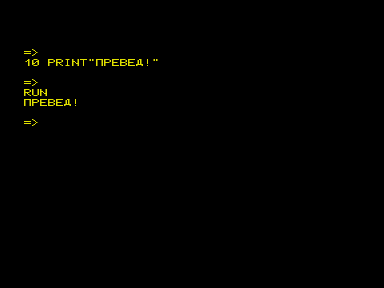
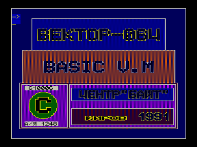

Дальнейшее развитие интерпретатора Бейсик, совместимое с версией 2.5.
Новые возможности: названия строк, поиск параметров, перемещение блоков, трассировка, разделение экрана, мерцание символов, вывод русских букв в негативе.

Не получил широкого распространения, т.к. не поддерживал дисковых операций, уже актуальных на то время. Распространялся центром «Компьютер» в формате, защищенном от копирования.

В архиве представлено две версии (ломаная Кишиневская и модифицированная Кировская), а также обрывки описания Basic-M.

## Описание программы Basic M

> Расшифровка сохранившегося фрагмента фирменной документации (`basicm.txt`).
> Текст обрывается на середине раздела «Метки строк»: разделов 7-C оглавления в архиве нет.

### Оглавление

1. Общее описание
2. Оператор FIND
3. Оператор MOV
4. Оператор PLAY (музыка + мерцание)
5. Другие операторы
6. Метки строк

*(далее текст утрачен)*
7. Работа программы прерывания
8. Аргументы операторов LIST, EDIT по умолчанию
9. Клавиатура и печать
10. Сужение экрана
11. Оператор SCREEN
12. Сообщения об ошибках

### Общее описание

Предлагаемая версия BASIC M является расширением резидентной версии BASIC (BASIC 2.5) и предназначена для работы с большими по объёму программами.
Программы резидентной версии могут без каких-либо изменений работать в BASIC M.
Исключение составляют лишь программы со сложными музыкальными фразами.
В таких программах достаточно увеличить длину строкового пространства на 100-200 единиц, для чего в программе ищутся все операторы CLEAR (например, с помощью команды `FIND CLEAR`), аргументы которых увеличиваются на несколько сотен.

В BASIC M также исключены все команды работы с принтером по причине отсутствия последнего у большинства владельцев «Вектор 06Ц».

Объём занимаемой памяти BASIC M не превышает аналогичного параметра резидентной версии, что достигнуто за счёт более экономного использования памяти и переработки программ.

Соотношение возможностей BASIC M и BASIC V 2.5 можно проиллюстрировать таблицей:

| Операторы | Только в BASIC M | В BASIC M и в BASIC V 2.5 | Только в BASIC V 2.5 |
| --- | --- | --- | --- |
| Общие | ELSE, RETURN, `<строка>`, разделение экрана на окна, мерцание | GOTO, GOSUB, PRINT, CLS, DATA, FOR и др. | LPRINT |
| Отладочные | FIND, MOV, метки строк, подпрограмма прерываний, вывод русских букв в негативе и др. | EDIT, LIST, DELETE, RENUM, NEW | LLIST |

### Оператор FIND

Оператор FIND отличается от EDIT тем, что находит и выводит строку (строки) не по порядковому номеру, а по заданному фрагменту.

**Формат:** `FIND <искомый фрагмент строки>`

**Выполнение:** выводятся поочерёдно строки с данным фрагментом.
Курсор фиксирует начало найденного фрагмента.
Выведенную строку можно изменить произвольным образом.
После нажатия «ВК» изменённая строка вводится и одновременно выводится строка со следующим найденным фрагментом.
Если до нажатия «ВК» в строку не внесено изменений, то текст программы не изменяется.
Окончание действия команды - после нахождения всех фрагментов или после нажатия F1.
Таким образом FIND можно использовать для исправления или же просмотра части строк текста программы.

**Примечание.** Во фрагменте могут использоваться служебные слова, но обязательно целиком.
FIND не воспринимает порядковый номер каждой рассматриваемой строки, поэтому цифры начального номера не должны фигурировать в задаваемом фрагменте.

**Пример:** `FIND CLEAR` выведет все строки, где есть слово CLEAR.

### Оператор MOV

Иногда возникает необходимость поменять порядок следования строк в тексте программы.
Для этих целей в BASIC M используется оператор MOV.

**Формат:** `MOV <номер первой строки перемещаемого текста>, <номер последней строки перемещаемого текста>, <номер строки, после которой размещается перемещаемый фрагмент>`

**Действие:** перемещается фрагмент текста на новое место.
После перемещения автоматически происходит перенумерация строк.
Аргументы операторов GOTO, GOSUB и других, содержащих номера перемещаемых строк, меняются автоматически так, что к этим строкам сохраняются обращения и после перемещения.

**Пример.** Текст программы до MOV:

```basic
10 СТРОКА 1:ON I GOTO 10, 20, 30, 40, 50
20 СТРОКА 2
30 СТРОКА 3:GOTO 40
40 СТРОКА 4:GOTO20
50 СТРОКА 5
```

После директивы `MOV 30,40,10` текст программы:

```basic
10 ON I GOTO 10, 40, 20, 30, 50
20 СТРОКА 3:GOTO 30
30 СТРОКА 4:GOTO 40
40 СТРОКА 2
50 СТРОКА 5
```

### Оператор PLAY (музыка + мерцание)

PLAY сохраняет все возможности резидентной версии, кроме того есть возможность создавать эффект мерцания.
Для этого в музыкальном макроязыке вводятся две новые команды:

- `)` - переключение со второй палитры на первую;
- `(` - обратное переключение.

Цвета первой и второй палитры задаются соответственно с помощью операторов `SCREEN 0,...` и `SCREEN 1,...`, по правилам резидентной версии.
Переключение палитры можно задать по любому из трёх каналов, используемых PLAY, или сразу по нескольким.

Время переключения зависит от числа и длительности нот и пауз между скобками.
Для многократного переключения палитр (эффекта мерцания) необходимо музыкальную фразу закончить значком повторения `R`.

Длина записи мелодии ограничивается длиной символьной переменной (255 символов), что намного превышает длину в резидентной версии.
Музыкальная фраза хранится в строковом пространстве.

**Пример:**

```basic
10 C=200:FOR I=0 TO 1:SCREEN I,0,C,C,C,C
,C,C,C,C,C,C,C,C,C,C,C:NEXT
20 SCREEN 1,0,0,0
30 COLOR2:PRINT'НЕ МЕРЦАЮЩАЯ НАДПИСЬ'
40 COLOR1:PRINT'МЕРЦАЮЩАЯ НАДПИСЬ'
50 PLAY'A(B)R'
60 GOTO60
```

**Примечание.** Музыкальная фраза должна оканчиваться нотой или символами `P`, `R`.
Мерцание можно сопровождать звуком, для чего между `)` и `(` ставятся звучащие ноты.
Если в музыкальной фразе встречаются только `)`, `(`, `P`, `R`, то мерцание не сопровождается звуком.

### Другие операторы

**ELSE.** Оператор ELSE используется в той же строке, что и IF.
Если выражение, стоящее после IF, ложно, то выполняются команды, стоящие после ELSE.
В противном случае эти команды пропускаются.

**RETURN `<номер строки>`.** По команде RETURN `<номер строки>` происходит выход из подпрограммы, но управление передаётся не оператору, вызвавшему подпрограмму, а строке, написанной после RETURN.

### Метки строк

При составлении программ с большим числом ветвлений, переходов, подпрограмм возникает неудобство, связанное с необходимостью запомнить большое количество номеров строк, к которым имеются обращения в тексте программы.
Ситуация осложняется ещё и тем, что номера строк могут измениться при перенумерации.
Это создаёт неудобства в работе и делает текст программы трудно читаемым.

В BASIC M предусмотрена возможность ввода имён (меток) строк и работы с ними.

#### 1. Синтаксис

Имя начинается обязательно с русской буквы в начале строки или после значка `:` и заканчивается первым значком `:` или же в конце строки.

**Пример:**

```basic
10 НАЧАЛО ПРОГРАММЫ
20 НАЧАЛЬНЫЕ ПРИСВОЕНИЯ:Y=0:N=10
30 FOR I=1ТО10:УВЕЛИЧЕНИЕ Y:Y=Y+N^N:NEXT
:КОНЕЦ ЦИКЛА
```

Целесообразно размещать имена в начале строки.
При работе программы имена игнорируются (см. также SCREEN 8), поэтому последние могут использоваться как комментарии.
Отличие от комментариев, начинающихся после REM, состоит во взаимозаменяемости номеров строк и имён, что достигается с помощью нескольких средств.

#### 2. Оператор LIST

Оператор LIST может работать в двух режимах: обычный (= резидентная версия) после команды `SCREEN 7,0` и в режиме вывода после номера строки её имени.
Последний режим включается после команды `SCREEN 7,1`.
В этом режиме при выводе текста после номера строки пишется:

1. если нет строки с таким номером - `?` (ошибка);
2. если строка без имени - ничего не пишется;
3. если строка с именем - `<имя строки>`.

Таким образом текст программы становится наглядным и дополнительно контролируется наличие строк, к которым имеется обращение.

**Пример.** После директив `SCREEN7,0` и `LIST`:

```basic
10 ON I GOTO 10, 20, 30, 40
20 СТРОКА НОМЕР 20: X=0
40 Y=0:СТРОКА НОМЕР 40
```

После директив `SCREEN7,1` и `LIST`:

```basic
10 ON I GOTO 10, 20/СТРОКА НОМЕР 20, 30/?, 40/СТРОКА НОМЕР 40
20 СТРОКА НОМЕР 20:X=0
40 Y=0:СТРОКА НОМЕР 40
```

#### 3. Замена номеров именами

При вводе с клавиатуры директивы или строки в BASIC M предусмотрена возможность использования вместо номеров строк их имён.
Для чего вместо номера строки пишется косая черта `/` и имя…

> *Далее текст утерян*




