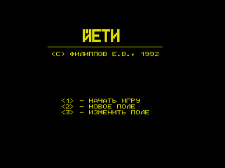

Спрайтовая мультипликация для BASIC 2.5 v01.
На скриншотах игра Йети, которая сделана при помощи BASS.

### Инструкция
(04.07.2009 Иван Городецкий)

#### Кратая информация по запуску демонстрационных программ пакета BASS

Для запуска разных демонстрашек нужно перейти в соответствующую область пользователя (USER).

Выбор области пользователя (USERа):
```
U номер
```
Например выбор USERа 2:
```
U 2
```
USER 1 - Редактор спрайтов GEASS

Запуск с загрузкой примеров знакогенераторов:
```
<GEASS.SUB
G
```
В самом GEASS клавиши 4-8 - выбор знакогенератора

USER 2 - игра ЙЕТИ

Сначала запускаем дисковый Бейсик
```
BASD или BASDZ
```
Уже из бейсика
```
RUN"JETI"
```

USER 3 - игра ЙЕТИ с подпрограммами на ассемблере

Сначала запускаем дисковый Бейсик
```
BASD или BASDZ
```
Уже из бейсика
```
RUN"JETI"
```
USER 4 - анимация "бегущая кошка"

Сначала запускаем дисковый Бейсик
```
BASD или BASDZ
```
Уже из бейсика
```
RUN"CAT"
```
Выход из бейсика в ДОС
```
BYE
```
BASDZ.COM - вариант дискового бейсика, который работает и на КР580 и на Z80, адаптация Городецкого И.

BASDFP: Версия дискового бейсика для квазидиска Баркаря

GEASSD: Версия редактора спрайтов для квазидиска Баркаря



