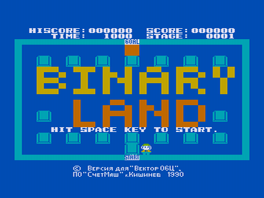
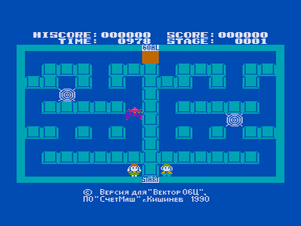

Игрок должен объединить двух влюбленных героев.
Препятствием на их пути являются пауки, которых можно уничтожить из баллончика.
Игрок контролирует двух героев сразу, основная задача состоит в том, чтобы заставить их собраться около сердца в верхней части экрана и тем самым завершить уровень.
Дополнительными трудностями является таймер, ограничивающий время прохождения и то, что герои перемещаются зеркально друг друга.
В качестве фоновой музыки используется мелодия из песни «Je te veux» (Erik Satie) написанной в 1897 году.

