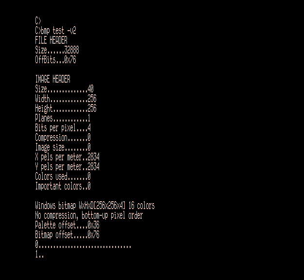

Программа для конвертации из BMP в Векторовские форматы.

Поддерживает на входе палитровые OS2/Windows BMP 1,4,8 BPP с RLE4, RLE8 и без компрессии.

На выходе создаёт копию экрана с BPP 1-4 и «совместимый» формат экрана с BPP8 в низком или высоком разрешении для Вектора или Кристы (битовая чётность).

Конвертит в форматы Draw, Карандаш и Рембрандт

Может инвертировать биты плоскостей, цвета палитры (или совместно), менять порядок плоскостей на обратный (палитра следует за этой опцией автоматически).
Позволяет сдвигать изображение на пиксел в обоих координатах для низкого и высокого разрешения а также переворачивать изображение зеркально в обоих осях координат.

Поддерживает конвертацию из RGB888 в BGR233 с децимацией или через генератор цветового пространства.
Есть опции для создания «чёрно-белого» изображения, тонирования и управления цветовым весом.

Возможно написание собственных модулей по всему pipeline обработки, от конвертации «из» до конвертации «в» и управления цветовым пространством/выбором цветов палитры (прога состоит из независимых оверлеев, загружаемых в соответствии с опциями пользователя).

Есть конфиг (по CP/М традиции - это область внутри самого бинарника) и опция просмотра текущих настроек по умолчанию.
Также есть система помощи по опциям (разбита на категории: конвертация, преобразование цветов и т.д). Всего - больше 40 опций.

Программа должна работать на любом CP/M &ndash; совместимом компе с TPA > 40K и i8080 и выше.

В архиве образ векторовского флопика с длинной демой некоторых возможностей проги. Запускать с диска A, после загрузки МикроДОС по промпту нажать `ВК`.
Работать дема будет на диске C для быстроты, cодержимое которого перед этим отформатируется.

