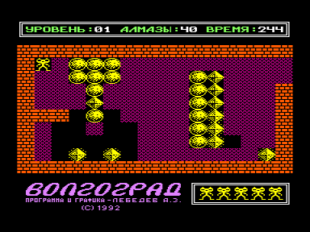

Первая версия знаменитого Болдера. Из-за сложной системы защиты, эту игру очень сложно запустить в эмуляторах.

bolder.rom — бинарник оригинальной игры, в эмуляторах не запускается
boldercr.rom — кракнутый бинарник для быстрого запуска в эмуляторах
bolder.wav — оригинальный болдер в wav, для загрузки в эмуляторы b2m и vector-06c
bolder.mp3 — оригинальный болдер в mp3, например для загрузки с плееров в аппаратный эмулятор вектора (автор svofski) на Altera DE1

См. также [другие версии](../).

