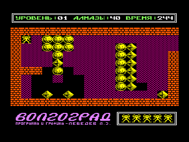

Оптимизированный вариант игры [Болдер](..) для ПК «Вектор-06Ц». См. также [Болдер++](../plus_plus).

Автор оригинальной версии: Андриан Зиновьевич Лебедев, Волгоград, 1991

Автор оптимизированного варианта: Иван Городецкий, Уфа, 2011

Отличия от оригинальной версии:

1. Игровой процесс в режиме «турбо» ускорен в два раза по сравнению с оригинальной версией, а «обычный» (цветной или моно) режим — в два с половиной раза.

Теперь «обычный» и турбо режимы в 99.99% случаев одинаковы по быстродействию.

Если сравнивать с [Болдер-М](../bolderm) и [Болдер-2](../bolder2), то данная версия быстрее в два раза.

Типичное количество кадров в секунду:

Болдер (оригинальная версия, «обычный» режим)	— 5 FPS

Болдер (оригинальная версия, режим турбо)	— 6.25 FPS

[Болдер-М](../m) и [Болдер-2](../2) — 6.25 FPS

[Болдер+](../plus) 					- 12.5 FPS

2. Главный герой теперь не «застывает» при скроллинге игрового поля в режимах цвет и моно.

3. Реклама, имевшаяся в оригинальной версии, удалена.

Версия 1.0 — 30.04.2011

Первый оптимизированный вариант

Версия 1.1 — 01.05.2011

Дополнительная оптимизация еще на 25%

