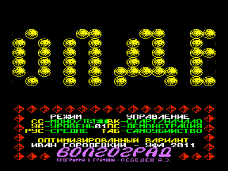
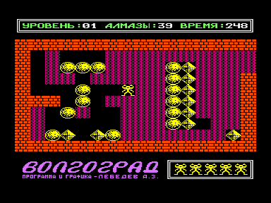

Болдер++ — оптимизированный вариант игры Болдер (и Болдер+) для ПК «Вектор-06Ц».

Автор оригинальной версии: Андриан Лебедев, Волгоград, 1991

Автор оптимизированного варианта (Болдер+ и Болдер++): Иван Городецкий, Уфа, 2011

Отличия от оригинальной версии:

1. Добавлен выбор скорости - "Быстро", "Средне", "Медленно" (вариант "Медленно" новой версии близок к скорости "Турбо" оригинальной версии). Игровой процесс (при скорости "Быстро") в двухцветном варианте ускорен более чем в три раза по сравнению с оригинальной версией, а цветной режим - почти в пять раз.
2. Добавлен выбор стартового уровня.
3. Главный герой теперь не "застывает" при скроллинге игрового поля в цветном режиме.
4. Реклама, имевшаяся в оригинальной версии, удалена.

Сравнительное время проигрывания демонстрации прохождения первого уровня.

Режим "Моно" (в оригинальном Болдере — "Турбо"):

Болдер (оригинальная версия) — 134 секунды

Болдер+ — 78 секунд

Болдер++ (Быстро) — 42 секунды

Болдер++ (Средне) — 79 секунд

Болдер++ (Медленно) — 116 секунд

Цветной режим:

Болдер (оригинальная версия) — 205 секунд

Болдер+ — 78 секунд

Болдер++ (Быстро) — 44 секунды

Болдер++ (Средне) — 81 секунда

Болдер++ (Медленно) — 118 секунд

Болдер++ в режиме "Моно" при скорости "Быстро" большую часть времени обеспечивает скорость 25 кадров в секунду.

Болдер+

Версия 1.0 — 30.04.2011

Версия 1.1 — 01.05.2011

Болдер++

Версия 1.0 — 19.06.2011

