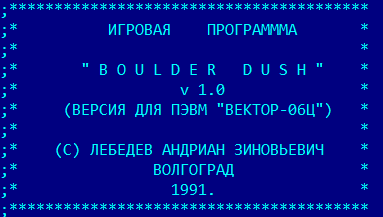

Цель этого  описания — избавить  программиста от  кропотливого труда и дать ему сразу  конечный продукт  этих  изысканий на  конкретных примерах программ. Описание будет очень  полезно и тем, кто уже имеет опыт работы на других компьютерах, а сейчас стал заниматься «Вектором».

Исходники bolderа, к сожалению, без графики и без уровней. Графика и знакогенератор сравнительно легко вытаскиваются из «релизного» [Болдер](../bolder/1), с уровнями несколько сложенее.

Данный справочник был опубликован в журнале «ПК для всех»:

2(2)’94 — Состав и назначение портов ввода-вывода ПК «Вектор-06Ц»

              Байтовая структура изображения, режимы экрана, скроллинг экрана, кодирование цветов, бордюр

              Аппаратные прерывания БПЭВМ «Вектор-06Ц»

7(3)’94 — Управление принтером

             Опрос клавиатуры

             Взаимодействие БПЭВМ «Вектор-06Ц» с магнитофоном

В номере 7(3)’94 написано:  «в следующем номере Вы познакомитесь с музыкальными возможностями &#132;Вектора&#147;», но этого следующего номера у меня нет. Есть большая вероятность, что он вобще не выходил, т.к. у этого журнала в 1994 году явно возникли серьезные проблемы.

С полным вариантом справочника можно ознакомится в [InVector](../../invector):

invector19 — Глава 1. Состав и назначение портов ввода/вывода ПК «Вектор-06Ц»

invector20 — Глава 2. Байтовая структура изображения, режимы экрана, скроллинг экрана, кодирование цветов, бордюр

invector21 — Глава 3. Аппаратные прерывания БПЭВМ «Вектор-06Ц»

invector22 — Глава 4. Опрос клавиатуры

invector23 — Глава 5. Музыкальные возможности «Вектора-06Ц»

invector24 — Глава 6. Взаимодействие БПЭВМ «Вектор-06Ц» с магнитофоном

invector25 — Глава 7. Управление принтером

Также две главы были опубликованы в журнале Радиолюбитель:

09/92 — «Вектор-06Ц». Управление принтером

10/92 — Взаимодействие БПЭВМ «Вектор-06Ц» с магнитофоном

См. также [Справочное руководство по компьютеру «Вектор-06Ц» (Черезов)](../../cherezov) и [Секреты «Вектора» и «Кристы»](../../svk)

