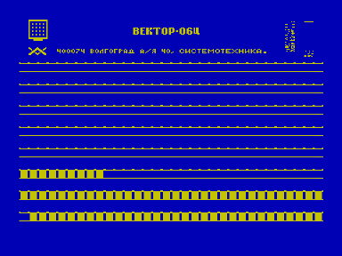

Альтернативный начальный загрузчик ПЭВМ «Вектор-06Ц» (2048 байт).

Волгоград, «Системотехника».

Предположительно является модификацией кишиневского 2 Кб загрузчика - [Загрузчик «Вектор-06Ц.02» (базовый, 2048 байт, Кишинев)](../kish2).

## Возможности загрузки

1. Квазидиск
2. МППЗУ (8, 16, 32 Кб)
3. Дисковод (А)
4. Магнитофон

## Недокументированные возможности

1. Загрузка с адаптера локальной сети.
2. Если после загрузки программы нажать одну из клавиш `F1`-`F5`, `АР2`, `СТР`, стрелка «влево-вверх» - на экран будет выведен адрес разработчика.
3. Убрана возможность запустить загрузчик без очистки ОЗУ (удерживая `УС`).

## Авторы материала

Загрузчик оцифровал при помощи [ROM-REAPER (копировщик загрузчика)](../../romreaper): Иван Городецкий, iig1@mail.ru

Материал подготовил: Александр Тимошенко, timsoft@mail.ru, [http://vector06c.narod.ru](http://vector06c.narod.ru)
