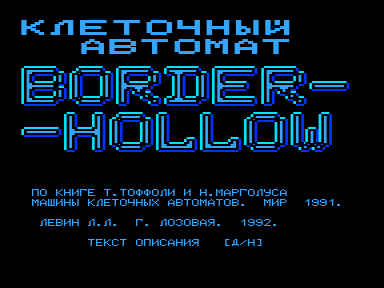
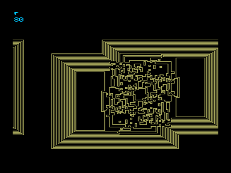

Модель клеточного автомата Border-Hollow.
Программа позволяет исследовать поведение произвольно заданной колонии.

«Правило &#132;Border-Hollow&#147; &ndash; двухфазное &ndash; на первой (нечетной) фазе, каждый  высвеченный пиксел увеличивается до квадрата 3x3.
На второй (четной) фазе, наоборот &ndash; в случае обнаружения квадрата 3x3, его центральный пиксел гасится».

