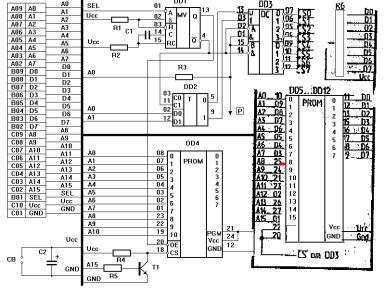

Картридж — это внешняя память ПЭВМ, типа кассеты или дискеты, но для загрузки программ из картриджа не нужно ничего, кроме него самого. Вы втыкаете картридж в разъем «ПУ» и включаете ПЭВМ. Нажимаете кл. F2 и ВВОД-БЛК и — о, чудо! — перед Вами красивое меню программ, «зашитых» в эту внешнюю память. Вы легко выбираете нужную программу (или две-три сразу!) и запускаете ее мгновенно. Объем картриджа от 32 до 192 Кбайт в зависимости от количества и типа (D27256 или D27512) установленных м/с ПЗУ.

Схема и описание опубликованы В.Шашковым в сборнике «Радиолюбитель. Ваш компьютер 5/96». См.также [Сборник публикаций из журнала «РЛ. Ваш компьютер»](../rl_your_pc).

На сегодняшний день не поддерживается ни одним эмулятором.

