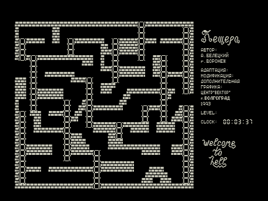

[Пещера](../peschera) не смогла избежать участи, уготованной любой мало-мальски приличной программе того времени.
Это — одна из модификаций игры, на сей раз некую «дополнительную графику» приписывает себе безличный кооператив.

Управляя человечком нужно, спасаясь от чертей, собрать все клады на каждом этапе.

| Клавиша | Действие |
| - | - |
| ТАБ | стрельба влево |
| ПС | стрельба вправо |
| ЗБ | выбор фона игры |

См. [Пещера](../pescher1), Пещера.

