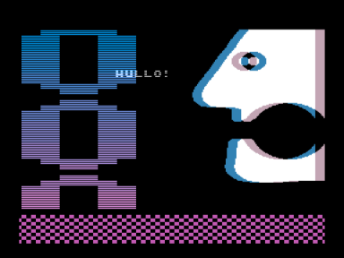

8 Bit Snail — Fast Intro, показана на фестивале Chaos Constructions 2009.
4-е место в конкурсе ZX/Oldskool Demo.

Музыка: Flash In Paradise/Prog Master ([http://zxtunes.com/author.php?id=584](http://zxtunes.com/author.php?id=584))

На CC09 была показана версия, которая работала только на [Векторе-06ц](../vector06cc_leaflet).
В настоящем архиве две обновленные версии, обе работают на настоящем Векторе-06ц и эмуляторах.
Для работы версии со звуком требуется квазидиск.

8 Bit Snail на pouet.net: [http://pouet.net/prod.php?which=53805](http://pouet.net/prod.php?which=53805)   и DemoZoo: [https://demozoo.org/productions/55228/](https://demozoo.org/productions/55228/)

