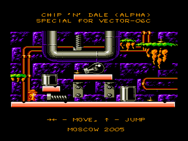

Альфа-версия игры.
Вся графика портировалась с NES из игрушек «Tom &amp; Jerry» и «Chip &amp; Dale 2».
Пока можно просто походить (и попрыгать) по красивым экранам (полноценная 16-ти цветная графика с наложением спрайтов на фоновое изображение).
Архитектура движка основана на принципе Tile-Map.
Тайлы имеют размер 8x8 пикселей и 16 цветов.
Из них строится карты фона и спрайтов.

