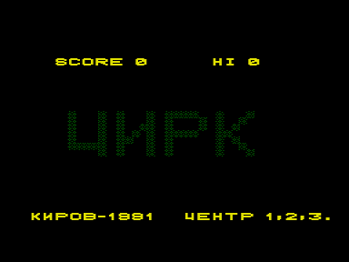
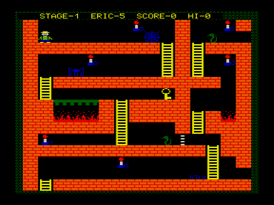

...Это был не обычный цирк, а мексиканский.
Действие в нем происходило не на арене, а внутри ацтекской пирамиды, заселенной пауками, змеями и ключами.
Кроме того в Цирке нету зрителей и артистов, а представление дает за всех один клоун, Эрик.
Собственно, почему это место называют цирком Эрику никто не сказал.
Да он и не спрашивал никого, ведь ни единой живой души в Цирке больше нет&#133;

Авторство явно нигде не указано.
Но характерный стиль исполнения, специфическая музыка, всё &ndash; указывает на то, что эта программа принадлежит перу Казакова.

См. также идентичную программу [Клад](../klad2).

