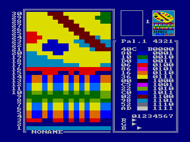
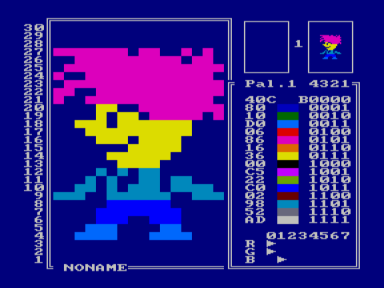

В архиве три версии: 1.0, 1.0M, 1.1

Screen pages:

1: E000..FFFF

2: C000..DFFF

3: A000..BFFF

4: 8000..9FFF

Palette commands:

<Cursor>         - move cursor.

<Space>          - set RGB or return.

<Shift>+<Number> - select palette.

<Esc>            - change mode.

Editor commands:

<Esc>            - change mode.

<Cursor>         - move cursor.

<Spase>          - set pixel.

<R/L>+<Cursor>   - move cursor &amp; set pixel.

<Ctrl>+<Cursor>  - shift screen.

<Ctrl>+<Number>  - screen page view.

<Ctrl>+<C>       - clear screen.

<Ctrl>+<I>       - inverse screen.

<Ctrl>+<H>       - HEX-editor.

<Ctrl>+<R>       - change left &amp; right.

<Ctrl>+<F1>      - insert horisontal line.

<Ctrl>+<F2>      - delete horisontal line.

<Ctrl>+<F4>      - insert vertical line.

<Ctrl>+<F5>      - delete vertical line.

I/O commands:

<Ctrl>+<N>       - rename screen.

<Ctrl>+<O>       - save screen &amp; palette.

<Ctrl>+
       - load screen &amp; palette.

<Ctrl>+<M>       - load screen only.

Memory commands:

<Shift>+<Number> - select memory screen.

<Shift>+< -»    - view next memory screen.

<Shift>+«- >    - view previouse memory screen.

<Ctrl>+<S>       - save screen to memory.

<Ctrl>+<L>       - load screen from memory.

<Ctrl>+<X>       - change screen &amp; memory.

