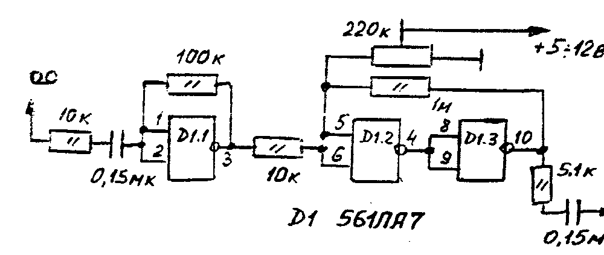
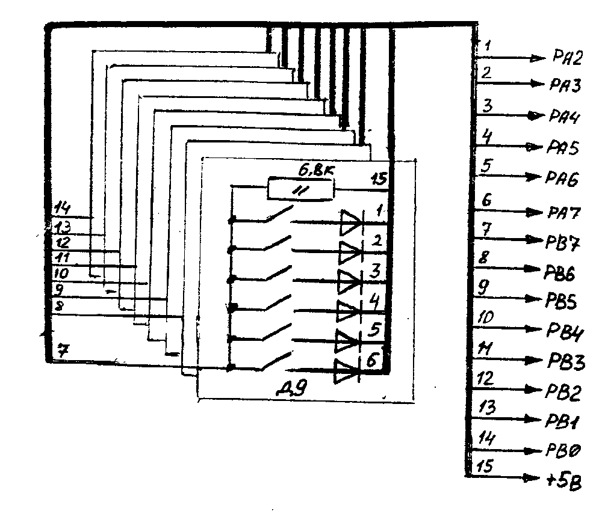
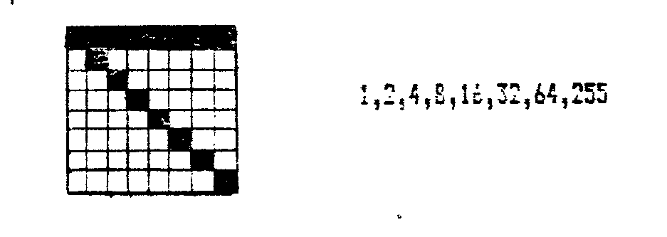
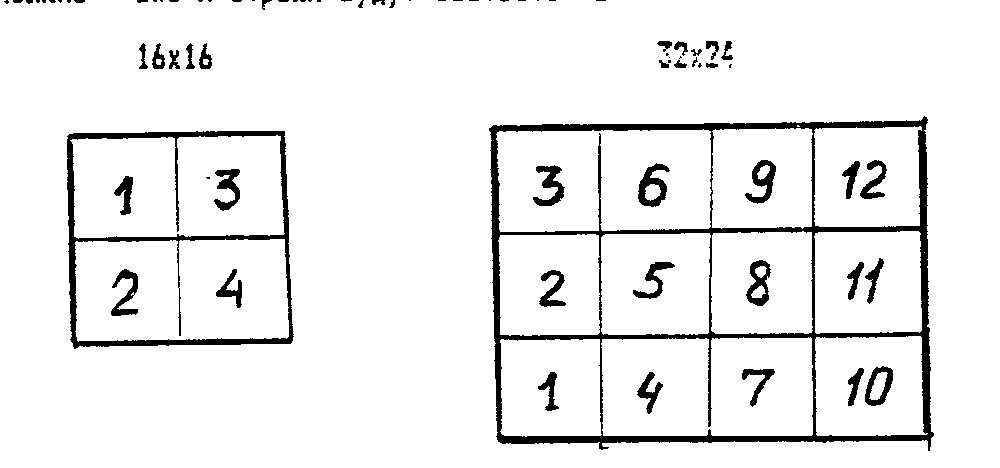
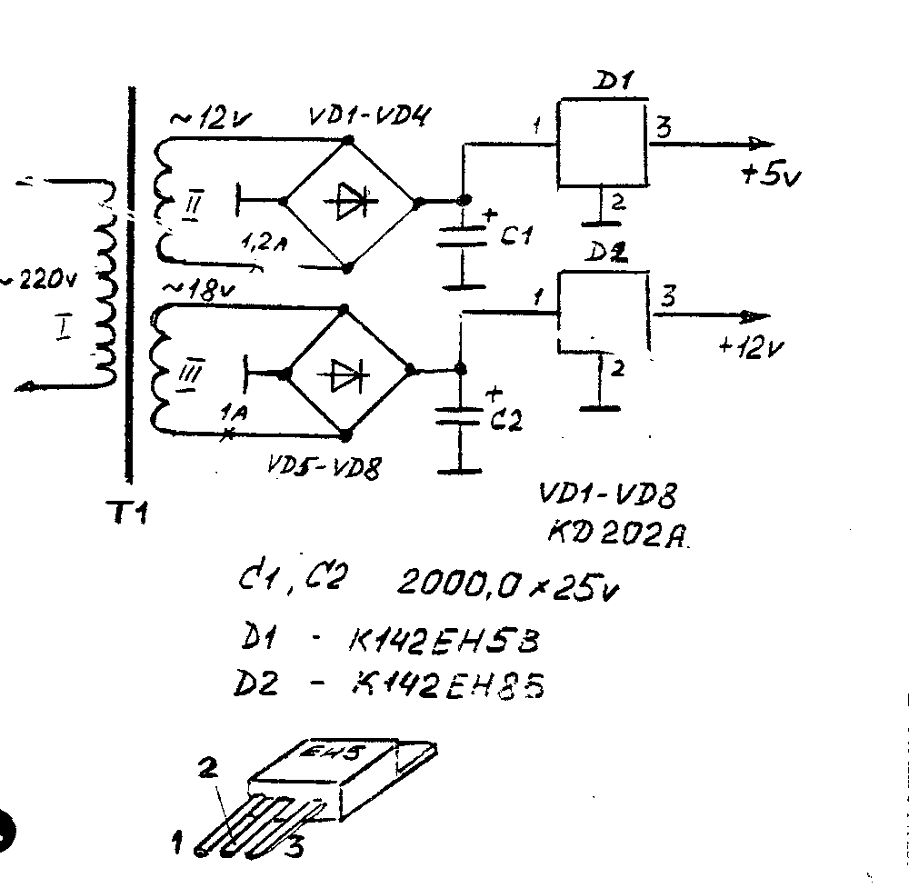

## От редакции

Уважаемые владельцы домашних компьютеров и те, кто хотел бы его приобрести, вы держите в руках первый, сигнальный выпуск бюллетеня COMAN.
Что означает COMAN?
Это — COMputer ANimation — КОМп'ютерная АНимация.
Создание красочных игровых и мощных системных программ (а так же их распространение), оригинальные устройства радиоэлектроники и многое другое — это мы.

Что побудило нас приступить к выпуску бюллетеня?
Вы прекрасно знаете, что издания, посвященные теме ДПК растут как грибы и умирают как бабочки.
Это связано с тем, что, как правило, издают их те, кто достаточно далек от комп'ютеров или ориентируется на профессиональные ПК.
Наши надежды на журналы «ZX+» и «Байтик» не оправдались.
«ZX+» умер, а выпуск 4-х номеров «Байтика» в год, да еще с полугодовым опозданием — это, по меньшей мере, несерьезно.
Информация должна быть «горячей», т.е. приходить к потребителю сразу после своего рождения.
Иначе она просто становится неактуальной.

Что Вы найдете на страницах «COMAN»?
Все, что может быть связано с домашним комп'ютером: короткие программы, советы, описания новых программ, инструкции к системным и игровым программам, заметки и выдержки из дефицитных «комп'ютерных» книг, новости, реклама, описание различных «примочек», превращающих ПК из игрушки в мощный инструмент, вопросы-ответы и т.п.
Кроме того, на наших страницах мы будем печатать «букварь» программиста, с помощью которого вы научитесь писать программы сами.
Это не только описание какого либо языка или его операторов, применяемых программистом «вообще».
Это будет описание технологии создания программ, начиная от замысла, заканчивая получением гонорара за хорошую программу.
Через год, владелец полной подшивки бюллетеня станет обладателем уникальной информации о том как стать программистом, что где продается, что творится в комп'ютерном мире, энциклопедии полезных советов.

Конечно, конкретно каждого интересует именно его тип комп'ютера и информация к нему, поэтому вы хотите знать, о каких ПК будет идти речь.
В основном мы будем говорить о 4-х типах ПК: «Вектор», «Львов», «Радио-86РК» и «ZX-Spectrum».
Именно они составляют 70-80 % парка ДПК.
В самое ближайшее время планируем заняться «Поиском».
Но это не означает, что мы не будем печатать информацию по БК-0010-0011, «Партнеру», «Весте», «Хобби» и других, если только их владельцы будут снабжать нас информацией и рекламой.
Кроме того, будет печататься очень много информации «универсального» характера, которая будет полезна владельцу любого комп'ютера.
Например приемы программирования, сценарии игр, советы по ремонту, описание устройств и многое другое.

Мы с большой благодарностью примем от вас различные заметки с опытом, вашими пожеланиями и предложениями поднять ту или иную тему.
Что будет печататься в бюллетене, зависит также и от вас.

**Нам нужна обратная связь!**

Если вам стало хоть немного интересно, вы спросите, как часто будет выходить бюллетень, сколько он стоит и как его получить.
Бюллетень — издание непериодическое, но мы планируем выпускать его каждые 2-3 недели, что бы у вас всегда была свежая информация.
Рассылка производится в конвертах, каждому подписчику персонально, независимо от места жительства.
Стоит бюллетень 6 рублей с пересылкой.
Этот номер выслан вам без предварительной оплаты.
Но если он вам понравился и вы хотите впредь получать бюллетень, мы просим оплатить этот номер и последующие номера, сколько вы хотите получить, по 6 рублей за номер.
Как произвести оплату?
Почтовый перевод следует отправить по адресу:

> 111402 Москва а/я 20 Тимошенко К.А.

с обязательной пометкой — «за бюллетень».

Но скажем честно, нам гораздо удобнее будет получить оплату в конверте или бандероли, т.к. на почте часто не бывает денег для оплаты переводов.
На вопрос, почему бы не принимать оплату на расчетный счет, откроем небольшой секрет.
В самое ближайшее время начнет работу акционерное общество открытого типа, акции которого вы тоже сможете купить и поучаствовать в его прибылях.
Р/счет его еще не открыт, а использовать чужой...

Советуем оплатить побольше номеров, особенно если вы живете в одной из НГ этого С, и вам светит «своя валюта».
Этим самым вы избавите себя от хлопот по переводу денег из одних в другие и информационного голода.

Пересылка в страны Прибалтики стоит 5 руб., поэтому желающим получать наш бюллетень, следует оплатить из расчета 10 руб. за номер.

Мы обращаемся так же к тем, кто может содействовать более широкому распространению бюллетеня.
Мы готовы продать вам любое количество (более 5 экз.) по оптовой цене — 3 рубля, для того что бы вы продали его в своем городе по установленной вами цене и немного на этом заработали (а может и много).
Вы можете открыть свое дело, занявшись распространением бюллетеня и программ, предлагаемых «COMAN».

Сообщаем также, что мы публикуем рекламные об'явления, но с условием, что если ваши услуги конкурируют с нашими, цены на них не должны быть демпинговыми.
Оплата за рекламу по договоренности, возможен бартер.

Мы поможем вам освоить ваш комп'ютер, и кто знает, может быть именно благодаря нам вы выберете стезю профессионального программиста или начнете применять комп'ютер не только для игр, но и для своей работы, учебы и в быту.

При переписке с нами, просим задавать вопросы конкретно, а при желании получить ответ, просим прикладывать конверт со своим адресом.
Если ваш вопрос «стандартный», то вы найдете ответ на него на страницах бюллетеня, хотя и с небольшим опозданием.
Адрес для переписки тот же:

> 111402 Москва а/я 20 «COMAN», тел. (095) 946-4097

## «COMAN» предлагает

Программы для ПК «Вектор», «Львов», «Радио-86РК», «ZX-Spectrum».
Средняя цена одной программы — 10 руб.
Но не спешите заказывать каталоги.
Каталоги будут публиковаться в бюллетене.
Выписывайте бюллетень!

### Продаем

| Товар | Цена |
| --- | --- |
| Аудиокассеты C-90 (Корея) | 40 руб/шт. |
| Дискеты 5'25" (USA) | 45 руб/шт. |
| Джойстик (ручка анатомич.) | 220 руб/шт. |
| Дисковод ЕС5323.01 (ИЗОТ) 720 Кб | 2700 руб/шт. |
| Контроллер дисковода к ПК «Вектор» | 1200 руб/шт. |
| Контроллер дисковода к ПК «ZX-Spectrum» и совместимых с ним | 1500 руб/шт. |

Для покупки этих товаров необходимо выслать оплату плюс 15 руб за пересылку по адресу:

> 111402 Москва а/я 20 Тимошенко К.А.

Наложенным платежом товары не высылаются.

### Приобретаем оптом

Аудиокассеты, дискеты, дисководы, микросхемы памяти (ОЗУ, ПЗУ), разместим заказ на изготовление печатных плат.

**Предлагаем свои услуги по представительству ваших интересов в Москве и по приобретению и реализации товаров, радиодеталей и пр.**

## Хит-парад

По многочисленным просьбам владельцев ПК мы вводим рубрику «ХИТ-ПАРАД».
Мы просим вас назвать самую лучшую, на ваш взгляд программу (или программы), которые у вас есть.
Не забудьте назвать тип вашего ПК.
На основе ваших ответов будет сформирован ХИТ.
Он позволит начинающим ориентироваться, какие программы являются лучшими, а программистам узнать, какие программы больше нравятся потребителям.

Итак:

| ВЕКТОР | ЛЬВОВ | РАДИО-86РК | ZX | БК0010 | ??????? |
| --- | --- | --- | --- | --- | --- |
| 1. ??? | 1. ??? | 1. ??? | 1. ??? | 1. ??? | 1. ??? |
| 2. ??? | 2. ??? | 2. ??? | 2. ??? | 2. ??? | 2. ??? |
| 3. ??? | 3. ??? | 3. ??? | 3. ??? | 3. ??? | 3. ??? |

## «Чужие» становятся «своими»

Иногда, при покупке программ «на стороне», владелец ПК сталкивается с ситуацией, когда программы не считываются.
Причин тому может быть много.
Если это дефект ленты, то, как говорится, «ловить нечего», если нет спецсредств.
Но как показывает практика, 70-90 % «заезженных» или записанных с малым уровнем записи программ, удается вытащить на свет с помощью простого, но чрезвычайно эффективного устройства, схему которого мы приводим.
Изготовление его по силам даже школьнику.
Но если вы желаете, то можете приобрести его и у нас, цена — 55 рублей + 15 рублей пересылка.
Кстати, это устройство поможет вам сделать копию с защищенных программ по методу «магнитофон — магнитофон».

## Клавиатура к «MUZIK BOX»

Мы «исправляемся», и публикуем схему клавиатуры к популярной программе «MUZIK BOX».
Эта программа, как известно, превращает ПК «Вектор» в 4-х октавный музыкальный инструмент.
Подключив клавир к раз'ему «ПУ», вы доставите массу удовольствия себе, близким и соседям.
Если у вас нет этой программы, приобретите ее у нас!

## Правила заказа программ в «COMAN»

Для того, что бы заказать у нас программы, необходимо составить их список (в том порядке, в каком вы хотите расположить их на кассете), подсчитать их стоимость, прибавить стоимость кассеты (или кассет; одна C-90 — 40 руб.), прибавить стоимость пересылки (15 руб.).

Не забудьте в заказе указать свой адрес.
Заказ высылается письмом, а оплата переводом по адресу:

> 111402 Москва а/я 20 Тимошенко К.А.

Если вы не можете отправить перевод, оплата может быть выслана бандеролью или заказным письмом.
В этом случае срок выполнения заказа составит 1-3 дня.

Выполнение заказа начинается только после получения оплаты.
Срок выполнения заказа — 7-10 дней (без пересылки).
Наложенным платежом заказы не высылаются.

Если вы высылаете свою кассету, постарайтесь, что бы она была не сильно изношеной.
Старую запись ОБЯЗАТЕЛЬНО сотрите, новую кассету распакуйте и перемотайте.

COMAN специализируется на выполнении заказов по почте, поэтому звонками типа «...да я тут рядом, к вам под'еду..» просим не беспокоить.
Когда мы откроем фирменную лавочку, мы сообщим об этом на страницах бюллетеня.

Цены в первой части указаны на 1991 г., сейчас они скорректированы следующим образом:

| Старая цена | Новая цена |
| --- | --- |
| до 4 руб. вкл. | 5 руб. |
| 5-9 руб. | 10 руб. |
| 10-14 руб. | 15 руб. |
| 15-19 руб. | 20 руб. |
| 20-24 руб. | 30 руб. |
| 25-30 руб. | 40 руб. |
| >30 руб. | 50 руб. |

## Новые программы для «Львова»

| Индекс | Название | Описание |
| --- | --- | --- |
| S22 | МУЗЫКАЛЬНЫЙ РЕДАКТОР (35р) /ап/ | Позволит вам быстро подобрать мелодию к вашей программе. Вы расставляете ноты на нотном стане и редактор ее воспроизведет, а так же выдаст ее коды для Бейсика или Ассемблера. Инструкция — в следующем бюллетене. |
| S23 | ОФОРМИТЕЛЬ (30р) /2858В/ | Вы хотите, что бы ваши программы были оформлены «по фирменному»? Эта программа «пристыкует» вашу графическую заставку к любой программе — на Бейсике или в кодах. И эта заставка красиво развернется во время ввода. Заставку можно нарисовать «Мультком» или фантастически мощным графическим редактором. |
| S24 | ПИКАССО (50р) /ап/ | Возможности этого редактора позволяют нарисовать спрайт любой сложности и размеров за несколько минут. Некоторые его способности: перо неограниченных размеров, создание цветной маски, «резиновые» линии, прямоугольники и эллипс, заливка, исключающая проливание, с возможностью отмены, «лупа» 32x32 пиксела, изменение размера букв и редактирование знакогенератора, сдвиги изображения на пиксел, перевороты изображения, совместимость с «Мультком», «Ассемблером 90 и 91», Монитором, возможность подбора палитр в процессе редактирования и многое другое. Подробная инструкция — в ближайшем номере. |

## Игровые программы в кодах

| Индекс | Название | Описание |
| --- | --- | --- |
| C42 | РЫБАК (10р) /ап/ | Рыбак, сидя в лодке, должен наловить побольше рыбы и настрелять побольше уток. |
| C43 | КОНЬ (10р) /ап/ | Вы — жокей, и участвуете вместе со своим любимым скакуном в «Большом Дерби». |
| C44 | УТКА (10р) /ап/ | Вы попали в самый сезон утиной охоты. |
| C45 | БАРМЕН (15р) /ап/ | Вы работаете барменом в пивной, которая очень популярна, от посетителей нет отбоя. Рекетиры тоже вниманием не обделят... |
| C46 | ВОЗДУШНЫЙ ШАР (10р) /ап/ | Поймав «свой» ветер, надо собрать на воздушном шаре всех туристов. |
| C47 | СЛАЛОМ (10р) /ап/ | Попробуйте-ка выиграть соревнование по слалому! |
| C48 | БАНАН (10р) /ап/ | Папуас должен собрать урожай бананов, но на земле его ждут дикие звери. |
| C49 | АЛИ-БАБА (10р) /ап/ | Али-Баба должен охранять сокровища от разбойников и избегать встречи с главарем. |
| C50 | БАШНЯ (10р) /ап/ | Человечек, уворачиваясь от камней, должен забраться на самый верх башни. |
| C51 | ЖУК (10р) /ап/ | Жук, спасая свою жизнь, должен отбиваться от хищных бабочек камнями. |
| C52 | АРКАНОИД (25р) /ап/ | Великолепная по интересу и оформлению игра. 50 раундов! Известный «Попкорн» — жалкое подобие АРКАНОИДА! (внимание — 5 блоков!) |
| C53 | КОРОНА (20р) /ап/ | Вас предстоят труднейшие испытания, прежде чем вы заслужите право надеть корону. |
| C54 | САФАРИ (20р) /ап/ | Вы охотитесь в Африке на диких зверей, а они охотятся на вас... |
| C55 | ПОЛЕТ (10р) /ап/ | Ваш гидросамолет должен совершить рейд в глубокий тыл врага. |
| C56 | ВУЛКАН (10р) /ап/ | С минуты на минуту произойдет извержение вулкана, и вы должны успеть спасти всех. |
| C57 | COLUMNS (10р) /ап/ | Игра, похожая на ТЕТРИС, но фигурки надо подбирать не по форме, а цвету. |
| C58 | ТОТАМИ (15р) /ап/ | Используя приемы карате, надо согнать противника с тотами. |
| C59 | BREACH (20р) /ап/ | Десантник должен предотвратить взрыв планеты, которую заминировали враги. Ядовитые черви, вертолеты, пушки, мины, кислотные облака и бешеные роботы — все есть в этой игре. |
| C60 | ГИББОН (15р) /ап/ | Гиббон, бегая по лабиринтам, должен собрать ананасы за короткое время. Есть редактор экрана, с помощью которого вы сами можете сконструировать «этажи». |
| C61 | АРКТИКА (15р) /ап/ | Вам надо сначала одеть голого полярника, а затем переправить его на полюс. |
| C62 | РИКОШЕТ (10р) /ап/ | Вы попали на армейский полигон, где идут стрельбы. Будьте осторожны! |
| C63 | ПОЖАРНИК (15р) /ап/ | Вам надо потушить дом и спасти людей из огня. Огонь быстро распространяется по этажам, но грамотный пожарник не знает преград! |
| C64 | POOL (20р) /ап/ | Вы любите играть в бильярд? В настоящий? Тогда эта игра для вас! |
| C65 | КРОТ (20р) /ап/ | Надо помочь кроту выбрать правильную дорогу в жизни, вовремя подкормить и накопить побольше денег. Не заскучаешь! |
| C66 | MOON BASE (20р) /ап/ | Летающие тарелки нападают на ваш лунный рудник, обрушивая град бомб и воруют ваши запасы энергии, добытой таким трудом! |

## Подарки от «COMAN»

Вы уже знаете, что многие новые программы — с защитой, снять копию с них довольно хлопотно.
Хотя уже появились доморощенные пиратские копировщики.
«COMAN» решил сделать подарок — большинство предлагаемых программ — саморазмножающиеся.
Это значит, что сразу после ввода, вам предлагается сделать копию, нажав клавишу F2 — программа перепишет сама себя.
Если вы нажмете любую другую клавишу, будете играть как обычно.
Кроме того, откроем секрет — программа «Буря в пустыне» (C6) — тоже с саморазмножением!
Если после загрузки, во время звучания музыки держать нажатой клавишу «Ц», то появится надпись «ГОТОВ» и после нажатия любой клавиши будет выдана копия программы.
Согласитесь, подарок неплохой!

## Инструкция к графическому редактору GRED (ПК «Вектор»)

Редактор обеспечивает создание изображений размером 8x8, 16x16, 32x24 пиксела.
Запись-чтение с магнитной ленты осуществляется при режиме 32x24 пиксела.

После запуска программы, необходимо выбрать режим.
В процессе работы на экране выделяются линза и поле.
Курсор всегда находится в линзе, управление — клавишами стрелок.
При необходимости установить или удалить точку нажимается «пробел».
Переход в режим обработки изображения по нажатию `<ПС>`.

В этом режиме предусмотрена выдача кодов изображения.
Для режима 8x8 будет выдана строка, в которой в десятичных числах описано изображение спрайта.
Первое число соответствует нижней строке, второе — второй снизу и т.д.
Например:

Полученные коды можно использовать в Бейсике при помощи оператора SCREEN3 или POKE.

Такой же принцип положен в основу получения кодов для спрайтов 16x16 и 32x24.
Эти спрайты разбиваются на более мелкие — 8x8 и строки будут соответствовать:

Можно также инвертировать изображение или очистить экран.

Переход в режим записи изображения на магнитную ленту осуществляется последовательным нажатием клавиш «АР2» и «0».
Чтение — нажатием «АР2» и «1».
Вывод кодов производится по директиве BLOAD.

Из редактора можно выйти в Бейсик, однако созданное изображение при этом уничтожается.

> Вы наверняка уже знаете о существовании «РЕМБРАНДТА» — нового графического редактора.
> Рассказ о нем — в ближайшем выпуске бюллетеня.
> Спешите приобрести!

> Ваши замечания и пожелания с нетерпением ждут по адресу:
> 111402 Москва а/я 20
> и по телефону: (095) 946-4097 (с 8 до 18 мск.)

## ZX-Spectrum

Этот ДПК является одним из самых распространенных.
Но хотя по нему выпущено масса литературы, владельцы испытывают не только информационный голод, но и аппаратный.
Это связано с тем, что существует несколько десятков (!) модификаций ZX.
Программно они совместимы между собой, но аппаратно...
Диапазон достаточно широк, от простейших «Ленинградов», предназначенных, в основном, для игрушек, до «Пентагонов-128 Кб» и «АТМ-512 Кб».
Поэтому мы обращаемся к вам с просьбой, сообщить нам, каким «Спектрумом» вы располагаете.
Это позволит нам выделить наиболее распространенные, начать рассказывать о их оснащении дисководом, музыкальными процессорами и т.д.

Начиная с этого выпуска, мы будем отводить одну полосу под перечень программ для ZX.
А поскольку их в нашем арсенале более 2000, печатать их мы будем очень долго.
Скажем сразу, мы записываем не сборниками, как делают многие, а выборочно, по вашим заказам.
При заказе учитывайте, что на одну кассету C-90 умещается, в среднем, 15 программ.
Цена копии одной программы — 10 руб.

Итак, начали.

| | | | |
| --- | --- | --- | --- |
| Z1 | Spitfire 2 | Z2 | Hype Raid |
| Z3 | Mach 3 | Z4 | Grid Iron 2 |
| Z5 | Havoc 2 | Z6 | Spherica |
| Z7 | Dizzy 4 | Z8 | Impossamole (+ lev.) |
| Z9 | Afrikan Trail Simul. | Z10 | Yogi Bear Escape |
| Z11 | Zombi | Z12 | Top Cat |
| Z13 | Iron Man | Z14 | Jungle Warrior |
| Z15 | Hostages (+levels) | Z16 | Prof. Tenis Simulator |
| Z17 | Jackson City | Z18 | Sea Hawk |
| Z19 | Tokyo Gang | Z20 | Jai Alai |
| Z21 | Edd the Duck | Z22 | Master Brain |
| Z23 | Dragon Bredd | Z24 | Welltris |
| Z25 | Elven Warrior | Z26 | Champ. Sprint Racing |
| Z27 | T I T L | Z28 | 3D - Labirint |
| Z29 | Manch. United (+ lev) | Z30 | Toyota Celica at Rally |
| Z31 | Twinz | Z32 | Lord of Crom |
| Z33 | Johny Reb 2 | Z34 | First Past the Post |
| Z35 | Garfield 2 | Z36 | Stuntrinner (+lev) |
| Z37 | Predator 2 (+lev) | Z38 | Brain Sport |
| Z39 | Mythos | Z40 | Astion Fighter |
| Z41 | Sidewinder 2 | Z42 | Poseidon |
| Z43 | Atom Ant | Z44 | T-Bird |
| Z45 | Xenophobia (+lev) | Z46 | Brazing Thunder |
| Z47 | Talisman 2 | Z48 | Gun Head |
| Z49 | Specimen | Z50 | Billy Kid |
| Z51 | Cirkus | Z52 | Golden Axe (+lev) |
| Z53 | Elephant Antic | Z54 | Magic Basketball |
| Z55 | Gregory | Z56 | F-16 Falkon Fighter |
| Z57 | M. Resistance (+lev) | Z58 | Snow Strike (+lev) |
| Z59 | TF-COPY | Z60 | PASCAL |
| Z61 | LISP | Z62 | Master File |
| Z63 | RUSSIAN CODE | Z64 | Music |
| Z65 | ART-STUDIO | | |

(продолжение в следующих выпусках)

ПК ZX печально знаменит как комп'ютер-игрушка, программировать на нем немного сложнее, чем например на ПК с процессором 580.
Да и 40-ка клавишная (в большинстве случаев) клавиатура к этому не располагает.
Нам известны люди, имеющие ZX уже несколько лет, но так и не освоившие более 6-10 клавиш, позволяющих загрузить программу и играть.
Стоит ли нам затевать разговор на темы программирования на ZX, о его устройстве, о его процессоре, о прикладных и игровых программах и как с ними обращаться?
Ждем ответов.

### ZX-Spectrum с дисководом

Существуют несколько способов оснащения этого ПК дисководом.
Первый из них, т.н. Бета-диск.
В этом случае ПЗУ с Операционной Системой размещается на плате контроллера и доработки ПК незначительные.
Но подобным контроллером хорошо оснащать те модификации, у которых имеется системный раз'ем, куда выведены шины адреса и данных.
Кроме того, такое подключение чувствительно к длине соединяющих кабелей.

Другой способ — замена ПЗУ, находящихся в самом ПК.
Бейсик в этом случае можно загружать и с диска.
Подобным методом можно доработать практически любой «ZX».
Такой способ, на наш взгляд, более предпочтительный, т.к. не накладывает никаких ограничений ни на модификацию, ни на длину кабеля, идущего к дисководу (в разумных пределах, разумеется, 0,5 - 0,7 м).
Кроме того, такой способ дешевле (в рекламе на 1-й странице указана именно его цена).

## Жив, курилка!

Ужасный рост цен и неистребимое желание творить своими руками, отсрочили кончину компьютеров типа «РАДИО-86РК».
Не вдаваясь в обсуждение его достоинств и недостатков, скажем, что и из него можно сделать человека.
Начиная со следующего номера мы начнем печатать материал о том, как переделать «эркашку» в цветной (8 цветов!) и при этом обеспечить 100% программную совместимость с нецветными РК.
Те, кто уже загорелся желанием, могут запастись следующими деталями: м/с 155ЛИ1 и 155ЛА3 — по 1-й шт.; транзисторы КТ315 — 2 шт.; любые высокочастотные диоды (напр. КД522) — 3 шт.

А пока мы начинаем печатать каталог программ к «Радио-86РК» и совместимых с ним.
Правила заказа — в этом же номере.
В скобках указана цена копии в рублях.
В заказе просим ОБЯЗАТЕЛЬНО указывать индекс программы.

| Индекс | Название | Комментарий |
| --- | --- | --- |
| PK1 | KARATE (5) | Необходимо отбить десант оружием и карате. |
| PK2 | PUSHER (5) | Надо расставить ящики по своим местам. |
| PK3 | ALIAZ-1 (5) | Лабиринты, алмазы, ключи... |
| PK4 | SPACE GAMES (5) | Надо защитить базу от метеоритов. |
| PK5 | MOON PATROL (5) | Приключения на Луне. |
| PK6 | SOS (5) | Надо спасти всех терпящих бедствие. |
| PK7 | SOS-2 (5) | Спасательные работы продолжаются. |
| PK8 | КОСМИЧЕСКИЕ НАСЕКОМЫЕ (5) | Вы попали на планету, которая кишит неземными паразитами. |
| PK9 | САПЕР-1 (5) | Приключения сапера на минном поле. |
| PK10 | САПЕР-2 (5) | Те же и спрятанный клад. |
| PK11 | МЕШАНИНА (5) | ПК путает буквы в слове, ваша задача отгадать его и исправить за короткое время. |
| PK12 | СМЕРТЕЛЬНЫЙ ПУТЬ (5) | Игра похожая на «МИННОЕ ПОЛЕ». |
| PK13 | РЕЙН (5) | Надо спасти реку от экологического бедствия одновременно обучаясь работе на клавиатуре. |
| PK14 | WAY TO HELL (5) | Отличная игра семейства «лабиринтовых». |
| PK15 | BINGO (5) | Убегая от «молотилки», надо с'есть все ягодки в лабиринте. |
| PK16 | X-BALL (5) | Мальчик собирает деньги, избегая мячей. |
| PK17 | RUN'S HOUSE (5) | Лифтер собирает призы между снующими вверх-вниз лифтами. |
| PK18 | DOWN MAN (5) | Приключения в подвижном лабиринте. |
| PK19 | СТАЛКЕР (5) | Великолепная «стрелялка». |
| PK20 | PENTIS (5) | Игра типа «ТЕТРИС», но фигурки из 5-ти кубиков, а не из 4-х. |
| PK21 | ВАМПИРЫ (5) | Надо заложить вампиров камнями. |
| PK22 | WOOD (5) | Мальчик собирает в лесу призы. |
| PK23 | ROCKER (5) | Путешествуя по лабиринту, смотрите не завалите самого себя камнями. |
| PK24 | STOP KRAN (5) | Поезд потерял управление! Надо его остановить, но это очень не просто. |
| PK25 | MAZE (5) | Логическая игра. |
| PK26 | FORMULA (5) | Хотите поучаствовать в гонках ФОРМУЛА-1? |
| PK27 | БЕГУЩИЕ ЯЙЦА (5) | Надо вовремя ловить падающие яйца. |
| PK28 | DIGGER-1 (5) | Вы роете лабиринты сами в поисках клада. |
| PK29 | RISE-1 (5) | Вам надо пройти 7 лабиринтов. |
| PK30 | BALL (5) | Управляя мячом, надо выбивать призы. |
| PK31 | BOMBER (5) | Надо уничтожить об'екты противника. |
| PK32 | ROOM (5) | Путешествуя по дому, собирайте призы. |
| PK33 | РЕДАКТОР к игре ROOM (5) | Для конструирования комнат. |
| PK34 | STRANGERS (5) | Отражение десанта инопланетян. |
| PK35 | ПАСТУХ (5) | Надо построить загон и загнать стадо. |
| PK36 | WAY (5) | Очень динамичная игра. |
| PK37 | DIGGER (5) | Игра похожая на PK28, но с более развитым сюжетом. |
| PK38 | CUBERNOID (5) | Забавное существо бегает по лабиринтам. |
| PK39 | ПВО (5) | На ваш об'ект налетели вражеские вертолеты. |
| PK40 | B.E.S.T. (10) | Экранный редактор, позволяющий написать текст программы, оттранслировать ее, запомнить на МЛ. |
| PK41 | DUMPCOR (10) | Экранный монитор, позволяющий оперативно набирать текст программы в кодах, редактировать его и отлаживать программу. |
| PK42 | БИБЛИОТЕКА — ЗАПИСНАЯ КНИЖКА (10) | Позволяет делать записи, компоновать их по каким либо признакам. Запуск программы последовательный — «G», затем RUN. |
| PK43 | ОПИСАНИЕ БИБЛИОТЕКИ (5) | Запись в формате БИБЛИОТЕКИ. |

(продолжение в следующем выпуске)

Все эти программы в кодах и могут разместиться на 1-й C-90.

Мы обращаемся к владельцам ПК «Радио-86РК» или совместимых с ним с просьбой, какую информацию они хотели бы прочесть на страницах бюллетеня.
О расширении ПЗУ, ROM-диске, RAM-диске, контроллере дисковода.
Дело в том, что достаточно много информации было опубликовано в журнале «Радио».
Хотя после рождения монстра — «Ориона» материалы по «РК» стали редкостью, нам бы не хотелось повторяться.

## Дисковод

Вожделенной мечтой многих владельцев ПК является дисковод.
Достоинства его не требуют комментариев.
Без дисковода любой ПК как бы еще не компьютер, поскольку не позволяет оперативно работать с базами данных — а именно это, как нам кажется, определяет, является ли комп'ютер пригодным для профессионального использования, (а вовсе не обилие различных языков программирования, как думают начинающие).
Создание игровых программ высокого уровня так же превращается в тяжкий труд без дисковода.
О проблемах работы с магнитофоном вообще можно не упоминать.

Мы начинаем рассказывать о дисководах, что это такое, как его подключить к ПК и как с ним работать.
Самому дисковод изготовить невозможно, поэтому не будем влезать к нему вовнутрь.
Скажем только, что принцип записи-чтения в нем практически не отличается от магнитофона.
Запись осуществляется на радиальные дорожки, которые делятся на сектора.
Каждый сектор имеет заголовок, контрольную сумму и т.д.
На каждой дискете (ГМД) несколько дорожек выделено под СИСТЕМУ (мы имеем в виду, работа будет вестись в ОПЕРАЦИОННОЙ СИСТЕМЕ).
На этих системных дорожках находятся управляющие программы, каталог диска, таблица размещений и пр.
Дисковод сам по себе — «глупое» устройство.
Управляет им специальная программа — ДРАЙВЕР.
Это не имя, так называют управляющие программы.
Но и она не самая «главная», над ней — ОПЕРАЦИОННАЯ СИСТЕМА (ОС).
Рассказ о ОС мы начнем несколько позже, когда вы уже вплотную с ней столкнетесь, а пока займемся устройством, которое выполняет команды драйвера и обеспечивает работу дисковода.
Это КОНТРОЛЛЕР ДИСКОВОДА.
Следует предупредить, что каждый ПК требует своего контроллера, драйвера и ОС.
Пока мы будем рассказывать о КД к «Вектору», как наиболее распространенному и мощному отечественному ДПК.

Схема контроллера будет опубликована в следующем выпуске, а те, кто будет собирать его сам, может запасти следующие м/с (по 1-й шт. каждой, все серии 555 или 1533): ЛА2; ЛА3; АП6; ЛИ1; ЛЛ1; ЛН1; ТМ9; ИД14; ЛП11; ТМ2; ИЕ10; ЛН2; ЛП9; ЛЕ1; ИР16; ИЕ5.
А также м/с 1818ВГ93 — сердце контроллера.
Потребуется кварц — 8 МГц.
Чертеж печатной платы опубликовать не сможем, поэтому запаситесь «слепышом» для проводного монтажа, или приобретите готовую п/плату у нас (150 руб.).
Заинтересованным можем предложить фотошаблоны.
М/схемы можете заказать и у нас, правда по ценам рынка + наша работа.
Цена одной м/с около 10 руб., ВГ93 — 150 руб., кварц 45 р.
Таким образом, самодельный КД обойдется вам в 600-650 руб. (с раз'емами, резисторами, конденсаторами, плоскими кабелями).

Но КД — достаточно капризная в наладке вещь...
О том как его наладить, мы расскажем в 3-м выпуске, а пока можете заняться изготовлением блока питания дисковода и контроллера.
Схема блока проста, но надежна за счет применения интегральных стабилизаторов 142ЕН5 и ЕН8.
Их вы тоже можете заказать у нас (стоимость каждой 15 руб.).
Разместить стабилизаторы следует на радиаторах 250-350 квадратных сантиметров каждый.
Трансформатор — любой, имеющий две обмотки на 12 и 18 В по 1,2 - 1,5 А.
Постарайтесь применить трансформатор небольших размеров, лучше тороид.

