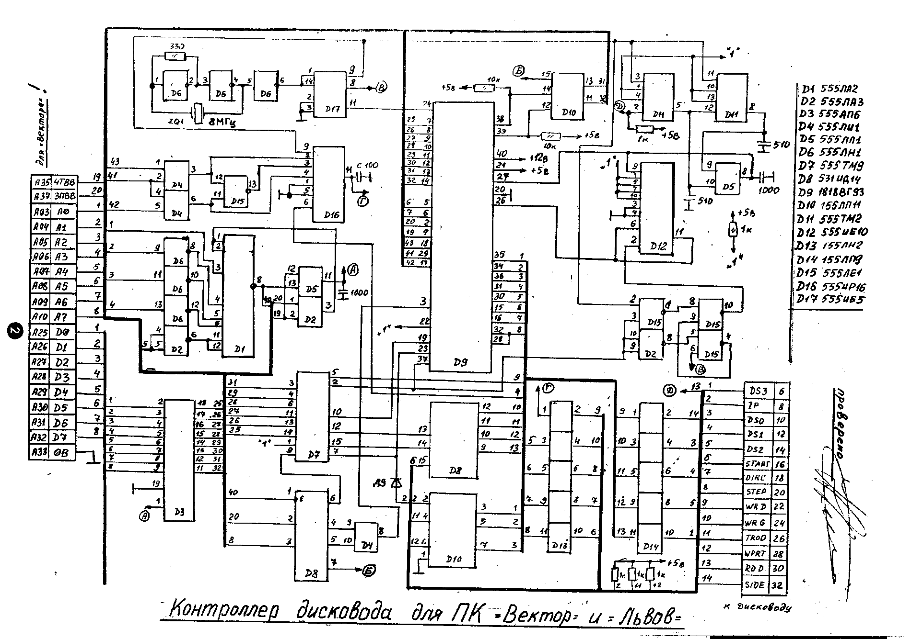
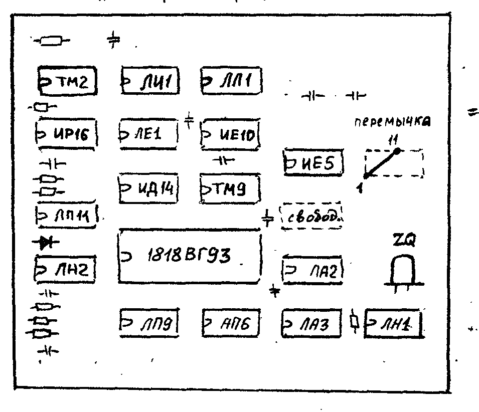
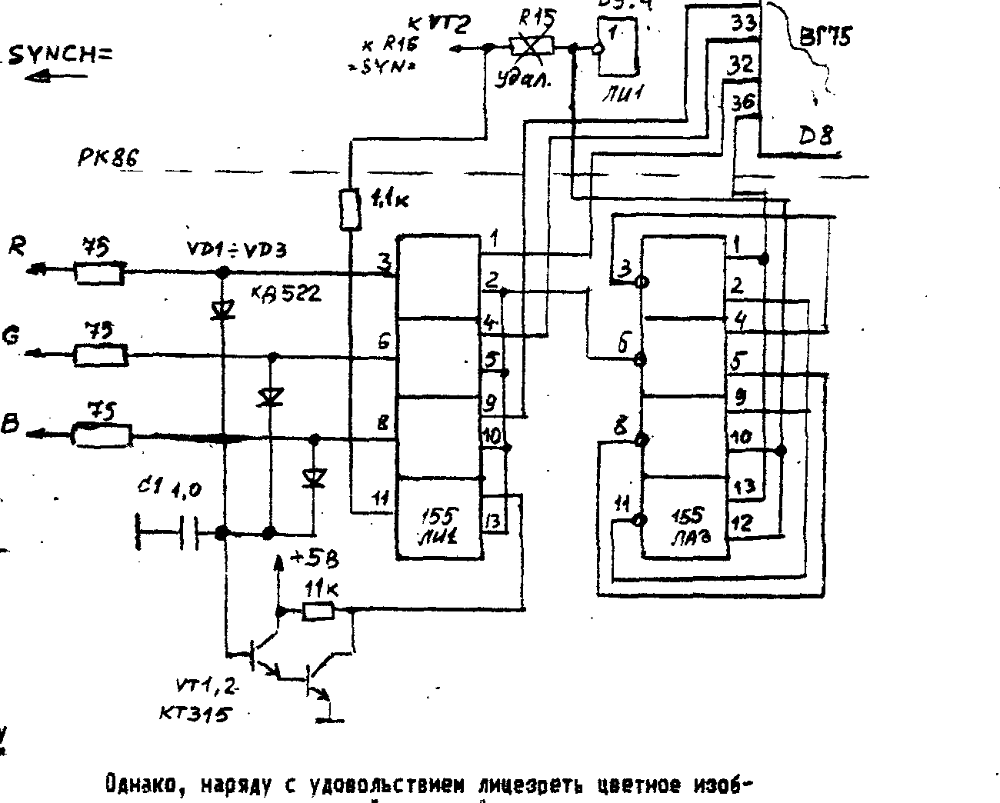
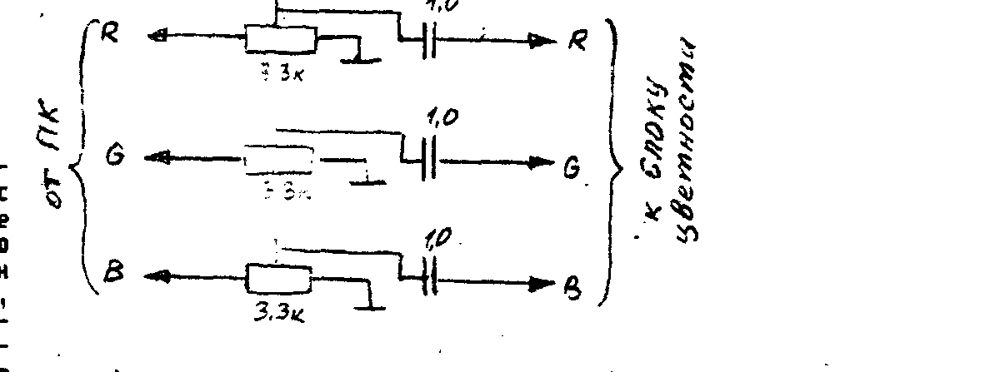

Информационный бюллетень «COMAN», 111402 Москва а/я 20, т. 946-4097.

## Вексель

Господа!
Судя по всему, до конца года большинство стран т.н. СНГ введут свою валюту.
Мы крайне заинтересованы в том, что бы не только сохранить свои связи с вами, но и всячески их расширить.
Однако введение национальных валют может существенно этому навредить.
Переводы будут заблокированы, а курсы самодельных денег — непредсказуемы.
Пример Прибалтики стоит перед глазами.
Для нас это будет означать сокращение рынка сбыта, для вас — информационный и программный голод.
И вы и мы этого не хотим.
Как защититься от этого?
На наш взгляд, эту угрозу можно практически устранить, если вы приобретете


Что это такое?
Вексель — это долговое обязательство, которое обеспечивается всем имуществом лица или фирмы, продавшей вексель.
Мы как бы берем у вас в долг, и ваши деньги не спят, а работают.
Что дает вексель вам?
Купив вексель, вы можете быть уверены, что мы всегда готовы выкупить его обратно (кому охота ходить в долгах?).
Кроме того, за каждый полный месяц (30 дней), пока вексель находится у вас, он становится для нас дороже на 5 (пять) процентов.
Например, купив у нас вексель на 100 рублей в августе, в декабре вы можете требовать с нас за него 122 рубля, а в августе 1993 года — 180 руб. (80 процентов годовых — согласитесь, это О-О-Очень неплохо).

Вексель обезличен, т.е. вы можете передать, продать его любому лицу, отдать в наследство и т.д.
Таким образом, это спасает ваши деньги от инфляции и позволяет не прерывать наши экономические отношения из-за игры политиков.
Заказывая у нас программы или какие либо товары, вы можете расплачиваться векселями (с учетом процентов, разумеется).
Вместо того, что бы платить почте за переводы, или пересылать деньги в конвертах, подвергаясь риску быть ограбленным нашей славной почтой, вы вкладываете в конверт заказ, вексель — и no problem.

Мы планируем продавать векселя в «мелкой расфасовке» по 100 рублей, для удобства расчетов.
Количество векселей на одного человека или организацию — неограничено.

Как приобрести векселя.
Для этого надо выслать по адресу:

> 111402 Москва а/я 20 Тимошенко К.А.

любую сумму, кратную 100 рублям (100, 300, 800, 5000 и т.д.) п/переводом, а лучше бандеролью (только не говорите почтовикам, что вы отсылаете), с пометкой — «ВЕКСЕЛЬ».
В день получения вам будут высланы векселя, заверенные подписью руководителя и печатью фирмы.
Подробности вы можете выяснить по телефону (095) 946-40-97 с 8 до 18 мск.

**НЕ УПУСТИТЕ ВОЗМОЖНОСТИ СОХРАНИТЬ НАШИ СВЯЗИ, СБЕРЕЧЬ СВОИ ДЕНЬГИ И ПОМОЧЬ НАМ!**

## Самые «горячие» программы!

### Для ПК «Львов»: C67 CHEESE /ап/ (25 руб)

На первый взгляд сюжет не сложен — мышка должна бегать по лабиринту, поедать сыр, собирать деньги (для перехода в другой лабиринт, их более 50!).
Оригинально решен вопрос с дополнительными жизнями — иногда появляется любовница нашего мыша и дает потомство (встреча с ней обязательна — она не святая).
За мышью ведет охоту КАПКАН, смачно клацая челюстями.
Это вам не те два тупых кота из «Мауса».
Капкан здесь — это интеллектуальный механизм уничтожения мышей.
Иногда он не оставляет никаких шансов, блокируя решетками (он это умеет) любые пути к побегу, и тогда ваши (вернее мышиные) движения больше напоминают агонию.
Но старый и мудрый Крыс знает как обмануть любой капкан!

Игра отлично оформлена графически и музыкально, очень динамична.
Ей уготовлено достойное место в ХИТ-ПАРАДЕ!

### Для ПК «Вектор»: C 1-80 LIBERATOR (30руб) ROM-формат

Вы — командир танка (хотя и рядовой) и должны освободить достаточно большую территорию (60 экранов).
Вражеские доты и пехота палят из всех видов оружия, а вертолеты головы поднять не дают.
В случае попадания, ваш танк выходит из строя постепенно, гусеницы... пушка... поворот башни...
Она, кстати, управляется автономно от корпуса, можно утюжить пехоту и одновременно стрелять вбок по дотам.
Не забывайте пополнять боеприпасы, горючее и ремонтироваться.

Противник тоже не спит, и периодически обстреливает освобожденную территорию ракетами СКАД, после чего тут же ее оккупирует.
Так что если вы хотите дослужиться хотя бы до «прапора», не просто стреляйте, а ищите установки СКАД.
В этом вам помогут карты, которые можно захватить во вражеских штабах.

Управление: стрелки, пробел, `^`, `<стр>`, `<F5>`, `<АР2>`, `F3`.
Советуем вам вначале научиться водить танк на свободном месте.

## Музыкальный редактор для «Львова»

МР предназначен для создания и редактирования различных музыкальных фрагментов для их дальнейшего использования как самостоятельно, так и в программах на бейсике и в кодах.
Редактор получился достаточно «приемистым», несмотря на то, что ПК не имеет таймера и извлекает звуки при помощи параллельного порта.
Даже не имеющий муз. образования может достаточно быстро написать мелодию, особенно если у него есть ноты.

Работа с редактором начинается из ОСНОВНОГО режима.
В этом режиме работают функции:

| Клавиша | Функция |
| --- | --- |
| F0 | просмотр |
| F1 | очистка |
| F2 | запись в буфер |
| F3 | воспроизведение |
| F4 | редактирование |

Перед началом работы необходимо очистить буфер и перейти в режим записи.
После этого следует выбрать маркером длительность ноты (левый нижний угол экрана), после чего нажать «пробел».
Затем выберите НОТУ или НОТЫ ДИЕЗ и снова нажмите пробел.
После чего надо установить маркер на нотном стане и опять-таки пробелом выбрать ноту.
Затем ее надо ЗАФИКСИРОВАТЬ (`<ВК>`), или ОТМЕНИТЬ (при ошибке) клавишей `<ЗБ>`.
После фиксации выбирайте следующую ноту и т.д.
Если введенная нота последняя в мелодии, нажмите `<F5>` для выхода в меню.

Опробовать мелодию на звук можно нажав `<F3>`.
После проигрыша вы снова окажетесь в меню.

Если потребуется коррекция нот, то следует перейти в редактирование (`<F4>`).
Появившийся маркер надо установить на редактируемую ноту, нажать пробел.
Нота исчезнет и появится маркер, как в режиме `<F2>`.
Выбрав длительность и т.д., установите ее на выбранное место.
После чего вы автоматически выходите в меню.

Наконец мелодия подобрана, и вы хотите просмотреть буфер и переписать его для размещения в программе.
Нажав `<F0>` вы получите таблицу, в которой отображаются порядковый номер ноты, ее длительность и тон.
Причем информация выдается одновременно в 10-тичной и 16-тиричной системе — для Бейсика и кодов.
Для просмотра используйте клавиши стрелок вверх/вниз.

Коды мелодии можно также записать на МЛ в формате BLOAD.
Для выхода в этот режим нажмите клавишу `<^>`.
Работа с магнитофоном стандартная.

Для программистов: массив длительностей и тональностей начинается с адреса 2000H и может «тянуться» до 7FFFH.
При написании программ на Ассемблере или в кодах можете пользоваться следующей программой:

```
коды              Ассемблер
01 00 20    MUZ:  LXI,B 02000H
0A          MUZ1: LDAX B
6F                MOV L,A
03                INX B
6F                LDAX B
65                MOV H,L
CD 1E F8          CALL 0F81EH
03                INX B
C2 ......         JNZ MUZ1
C9                RET
```

Как понимаете, программа может быть размещена в любом месте, но в случае переноса в другие адреса надо изменить адреса перехода и начала буфера с нотами и длительностями.

Мы можем печатать в газете короткие мелодии в виде нот или таблиц.
Они вам могут пригодиться при написании игр.
И не только для «Львова».
Ну как, стоит?
Ждем ваших ответов.

> ВНИМАНИЕ тех, кто покупает у нас программы.
> Иногда, по самым разным причинам, некоторые программы не удается считать.
> Просим не делать из этого трагедии — у нас не идеальная электросеть, маг. ленты и т.д.
> Что делать, если такое случилось.
> Если таких программ 1-3, или менее 10%, не стоит отсылать кассету обратно — мы перепишем их заново бесплатно при следующем заказе.
> Только приложите бланк заказа.

## Новый вид услуг

Мы прекрасно понимаем, как тяжело приобрести ту или иную радиодеталь, микросхему, прибор да и просто какую либо вещь людям, живущим вдалеке от крупных городов.
В то же время на рынке или в магазине в Москве есть ВСЕ.
Поэтому мы готовы приобрести ЭТО и выслать вам, где бы вы не жили.
Причем комиссионные будут минимальные:

- 5% на покупку менее 1001 руб.
- 3% — свыше 1001 руб. + 15 руб. за пересылку.

Покупка осуществляется за ваши деньги (т.е. предоплата).
Естественно, оплата производится после согласования цен письменно или по телефону.

Заказать вы можете АБСОЛЮТНО ЛЮБУЮ вещь; от радиодеталей до автомобилей и самолетов.
Для того, что бы узнать текущие цены на товар, необходимо прислать к нам запрос.
Однако, для того, что бы исключить праздные запросы «просто так», мы будем отвечать только на те запросы, в которые 1) вложен конверт для ответа, и 2) 10 рублей в этом конверте.
Если вы будете что либо приобретать, эти 10 руб. идут в зачет.
А если нет — и суда нет.

## Контроллер дисковода для ПК «Вектор» и «Львов»



На соседней странице опубликована схема контроллера дисковода к ПК «Вектор».
Так что можете начинать паять.
О том, как ее настроить, мы напишем в следующем выпуске.
Хотим предупредить, что настройка невозможна без системной дискеты.
На этой дискете находятся Операционная Система (ОС), генератор системы (для записи ОС на другие дискеты) и несколько утилит (системных программ), необходимых для нормальной работы.
Постарайтесь в ближайшее время приобрести у нас системную дискету.
Цена ее — 100 рублей с пересылкой.
Переводы направлять по адресу: 111402 Москва д/вост., Тимошенко К.А. с пометкой — «за системную дискету».
О том, что находится на СД и как этим пользоваться так же в следующем номере.

Для тех, кто приобрел у нас печатную плату или собирается это сделать, публикуем расположение элементов на ней.
Но монтаж ведите сверяясь с принципиальной схемой.



ВНИМАНИЕ тех, кто приобрел у нас готовые контроллеры.
К сожалению в текст загрузчика попали ошибки.
Просим произвести исправления:

1. По адресу загрузчика 177H есть «98», надо — «90».
2. По адресу загрузчика 180H есть «FF», надо — «FE».

Эти ошибки приводят к очень длительному запуску ОС.

### Владельцы «Львова»!

Вы тоже близки к тому, что бы подключить к своему ПК дисковод.
Работа над адаптацией CP/M к «Львову» близится к завершению (октябрь-ноябрь).
Схема контроллера НИЧЕМ НЕ ОТЛИЧАЕТСЯ от опубликованной!
Можете собирать или приобретать готовый.
Советуем также приобрести дисковод поскорее, т.к. цена на него постоянно растет.

## Комп'ютер! Слушай мою команду!

Наш читатель Пономарев П.Б. из города Ахтубинска предложил оригинальное использование ПК в качестве акустического реле.
Ему часто приходится производить табличные расчеты, а принтера пока нет.
И что бы не отрываться от записи и не шарить глазами по экрану в поисках значений, он написал короткую программу, при помощи которой ПК выдает очередное значение только после сигнала голосом.
Магнитофон в это время включен на запись с включенным микрофоном.
Но можно сделать и простейший микрофонный усилитель.

Немного пофантазировав, можно добавить в программу временную или частотную фильтрацию, или настроить на свой голос или кодовую фразу.
Тогда программа, в которую в ы вставите такой «клич», будет работать только под управлением своего «хозяина», которого узнает по голосу.
Текст программы написан на Бейсике «Вектора», но она будет работать на любом ПК, если правильно указать адрес порта ввода с магнитофона.
Аналогичную по назначению программу можно написать и на Ассемблере.
Мы будем очень благодарны вам, если вы поделитесь с нами (и со всеми читателями) своими изысканиями.

```basic
10 X=INP(1)
20 IF X>230 THEN 10
30 BEEP 5,0
40 FOR J=1 TO 20:OUT 1,240:NEXT J
50 PRINT"TEST-";I
60 I=I+1:GOTO 10
```

Программа настолько проста, что не нуждается в каких либо комментариях.
Но идея — великолепна!

> COMAN ПРЕДЛАГАЕТ
> Раз'емы СНП34С-90(135)В — вилка («папа») (ответная часть системного раз'ема ПК «ВЕКТОР»).
> Цена одного раз'ема — 50 руб.
> Оплата (+15 руб. пересылка) — обычным порядком.

## «Радио-86РК»: вариант не для дальтоников

Все нижесказанное в равной мере относится не только к «Радио», но и к аналогичным ему («Апогей», «Электроника КР», «Микроша», «Квант», «Спектр» и т.п.), использующих м/с 580ВГ75.

Не вдаваясь в рассуждения о том, что цветной ПК лучше черно/белого, сразу приступим к делу.

Палитра будет состоять из 8-ми цветов: черный, белый, красный, фиолетовый, зеленый, желтый, синий, голубой.
Кроме того, имеется возможность вывода символа (цветного) на черном фоне, на цветном фоне, создание непрерывных цветных изображений («синее море», «зеленая трава» и т.д.).

Схема узла цвета приведена ниже.
Нумерацию элементов мы приводим согласно схеме «РК», опубликованной в «Радио».
Если у вас другой ПК, то сверьтесь со своей схемой, т.к. одинаковые по назначению узлы имеют примерно одинаковое схемное решение.
Думаем, что это не составит для вас труда.



Однако, наряду с удовольствием лицезреть цветное изображение, создаваемое вашим «цифровым» другом на экране, на вас может свалиться ряд проблем, незнакомых доселе.
Это прежде всего подключение к модулю цветности телевизора.
Надо отследить уровень сигнала и фазу.
Иногда придется еще его и инвертировать.



О том, как работать с цветным бейсиком и как делать программы цветными — в следующий раз.
Но очень нетерпеливые могут сами прочитать об управлении контроллером ЭЛТ — микросхемой 580ВГ75.

Нам очень хочется знать, описание каких устройств вы хотите видеть на наших страницах.
Это могут быть кодеры цветного сигнала, для подключения через антенну, модемы — для связи между ПК по телефонной линии, и многое другое.
Просим так же не забывать и о ХИТ-ПАРАДЕ.
Все это позволит сделать бюллетень «COMAN» еще более интересным, хотя судя по откликам и подписке, он вам нравится.

## Букварь программиста

Выполняя свое обещание, мы начинаем рассказывать о том, как создаются программы.
Разные, игровые и прикладные.
Хотя, на первый взгляд, такой литературы предостаточно, но она либо ориентирована на какой то конкретный язык или тип ПК, либо наоборот, охватывает программирование глобально, по принципу: мол, есть, ребята, на свете комп'ютеры.
Мы же хотим рассказать об этом, что называется, «с манной каши», и не опираясь на какой то конкретный тип ПК.
Одни и те же действия мы будем описывать как на Бейсике, так и на Ассемблере.
Причем будем стараться использовать «универсальные» операторы, которые есть во всех версиях Бейсика.
Ассемблер универсальный язык изначально (для процессоров фирмы Intel).
Любой процессор правильно понимает команды, если они написаны для него или младшей версии процессора.
Т.е. программа для 580-го процессора «пойдет» на Z-80 и 8086 и т.д.
Поэтому, изучив Ассемблер процессора 580 (Intel 8080), вы, в принципе, сможете написать программу и для IBM PC.

Но вообще говоря, для программиста главное не язык программирования (хотя и это очень много значит), а алгоритм программы, т.е. ЧТО НАДО ДЕЛАТЬ.
И если программист четко себе представляет это, считайте, половина пути позади.
Для вас сейчас самое главное, научиться составлять АЛГОРИТМ программы.
Начинать надо с самых простейших программ, работающих по принципу «если то, то это».

Но игровая программа начинается не с этого.
Алгоритм — это уже средство реализации, когда известно, что делать.
Игровая программа начинается со СЦЕНАРИЯ (прямо как в кино).
Именно сценарий (или сюжет) программы определяет ее успех.
Сценарий может быть реализован более или менее удачно, оптимально или нет, но если сюжет развит и «затягивает», программа не остается без внимания.
Важную роль играет и оформление программы.
Мы часто получаем письма «...я написал программу, там все трах!..бах..!..космические корабли...пираты... и т.д.».
Получаем копию — по экрану еле ползают какие то квадратики, а вся игра заключается в том, что бы вовремя нажать одну кнопку или держать ее все время нажатой.
Название у этой игры конечно «крутое», обычно заимствованное у супер-боевика, типа «Рембо» или «Терминатор» и т.п.
Мы не против таких названий, однако подобным играм больше подошли бы названия «Нажми кнопку», «Убей квадратик» и «Как разбить клавиатуру за один вечер».

Но вернемся к сценарию.
Для того, что бы не навязывать своего, и не брать за основу уже готовые игры, мы предлагаем вам срочно прислать нам свой вариант какого либо сюжета.
Это может быть ЛЮБОЙ сюжет на ЛЮБУЮ тему.
Выбрав более подходящий, мы начнем его «расписывать».
Желательно, что бы он был «открытый», т.е. с возможностью продолжения и конечно, не слишком примитивный.
Хотя и стрелялки могут быть интересными.

Расписывать эту игру мы будем очень подробно, с учетом различных приемов программирования, а так же с рассказом об архитектуре различных ПК и процессоров.
Начнем же мы, конечно, с процессора К580ВМ80.
Это самый простой процессор, но если вы поймете, как он работает, остальные не будут вам страшны.
Просим вас сообщить, стоит ли публиковать его архитектуру и систему команд.
Просто на это уйдет целая страница, а опубликована она была уже 100 раз в различной литературе.
Хотя печатать ее в COMAN-бюллетене будет, конечно, более удобно для вас, т.к. не надо ничего искать (букварь — так букварь).
Но учтите, ваше молчание мы будем расценивать как то, что вам эта рубрика не интересна и мы ее «прикроем».
Хотя судя по тому, что мы очень много продаем программ типа «Ассемблер», «Монитор» и «Графический редактор», предназначенных для СОЗДАНИЯ программ, а не для развлечения, и как мало появляется новых программ, то складывается впечатление, что эти программы приобретаются для коллекции (или обмена).
Нам интересно знать, хотите ли вы научиться пользоваться этими программами.
Это не такой простой вопрос, как кажется.
Просто если вы хотите их освоить, то знайте, что фирма COMAN приобретает авторские программы (при условии эксклюзивного распространения) за приличные гонорары — 1000 - 10.000 рублей за программу.
И вы, при желании, можете приобрести очень приличную специальность программиста не выходя из дома, и не заплатив за обучение, а наоборот, неплохо подзаработав на нем.
Профессия программиста чрезвычайно перспективна, даже резкий рост цен не снизил спроса на программы.
И если вы еще достаточно молоды что бы думать о будущем, советуем вам поразмышлять на эту тему.
Работой мы вас обеспечим.
Но если вы решились, хотим предупредить, что труд программиста — это тяжелый труд.
Здесь очень трудно имитировать результаты, а некомпетентность видна невооруженным глазом.

(продолжение в следующем номере)

## Продолжение каталога для «ZX-Spectrum»

| | | | |
| --- | --- | --- | --- |
| Z66 | Golf 2 (part 1) | Z67 | Golf 2 (part 2) |
| Z68 | Popeye 2 | Z69 | Stardust |
| Z70 | Mutant Zone | Z71 | Angel Nieto (+l) |
| Z72 | Black Tiger (+l) | Z73 | Gremlin 2 |
| Z74 | Total Eclipce 2 | Z75 | Interalia |
| Z76 | Super Kid in Space | Z77 | Kendo Warrior |
| Z78 | Prince Climsu | Z79 | Lorna (+level) |
| Z80 | Master Blaster | Z81 | Time Machine |
| Z82 | Ethnipod | Z83 | E-Motion |
| Z84 | Miami Cobra | Z85 | Wacky Darts |
| Z86 | Dynasty Wars (+l) | Z87 | Poseidon |
| Z88 | Hive | Z89 | Prowler |
| Z90 | Buggy Ranger | Z91 | Mr. GAS |
| Z92 | Puzzinic | Z93 | Ulises |
| Z94 | Full Throttle 2 | Z95 | Painter |
| Z96 | Tomas Tank Engine | Z97 | Riptoff |
| Z98 | Ninja Massacre | Z99 | Helter Skelter |
| Z100 | Kwik Snax | Z101 | Prof. Tennis Tour |
| Z102 | 3D-Kit Game | Z103 | Dick Tracy (+l) |
| Z104 | B. Stir Crazy (+l) | Z105 | Pneumatic Hammers |
| Z106 | World Cup Meneger | Z107 | War Machine |
| Z108 | Bumpy | Z109 | Chess Master 2000 |
| Z110 | Knight Force (+l) | Z111 | Donald's Alpihabet |
| Z112 | Sabrina | Z113 | Dizzy 3.5 |
| Z114 | Tie Break | Z115 | Sector 90 |
| Z116 | Satan | Z117 | Turtles |
| Z118 | MOT-1 | Z119 | Lotus Es. Turbo (+l) |
| Z120 | Klax | Z121 | Arcade Fruit Mach. |
| Z122 | Super Trans Am | Z123 | 3D-Snooker |
| Z124 | Piggy Punks | Z125 | Egg Head |
| Z126 | B. Volleyball (+L) | Z127 | Pit Fighter (+L) |

(продолжение следует)

> Стоимость 1-й копии — 10 руб.
> На одну кассету C-90 помещается 15 программ.
> Стоимость кассеты — 40 р.
> Запись производится в порядке, указанном в заказе.
> Стоимость пересылки заказа — 15 руб.

## Контейнер для пересылки

Мы иногда получаем бандероли в таком виде, что возникает уверенность, будто их пинали ногами от самого места отправки до нашей почты.
И если бумага все стерпит, а магнитофонная кассета вещь более или менее «дубовая» (основной удар на себя принимает коробка кассеты), то дискета явно плохо будет себя чувствовать, если по ней походят.
Для того, чтобы устранить механические повреждения дискет и кассет, советуем вам приобрести (можно и у нас, при заказе) пластмассовую коробку для хранения магнитной ленты на катушке №18.
Дискеты и кассеты, переложенные поролоном, «доезжают» в такой коробке в отличном состоянии.

## Простой способ защиты

Если ваш ПК и блок питания не имеет системы защиты от перенапряжения, сделать ее можно самому.
Достаточно включить по цепи питания стабилитрон на напряжение превышающее номинал на 0,5-1 вольт.
В случае подачи высокого напряжения, стабилитрон сгладит импульс или проб'ется и устроит короткое замыкание.
Но блок питания чинить легче, чем сам комп'ютер...

## О журнале «Байтик»

В связи с тем, что нас «достали» звонки и письма по поводу «БАЙТИКА», сообщаем следующее:

1. Мы имеем весьма косвенное отношение к этому журналу, поскольку лишь рекламировали его (мы не издатели, не учредители, не владельцы) и не несем никакой ответственности за его выход, рассылку и т.д.
2. По последним сведениям, редакция «Байтика» переехала, почтовый адрес ПРЕЖНИЙ, телефоны 207-4314 и 124-9849. Обрывайте телефоны им, а не нам.
3. Произошедшее лишь подтверждает очень высокую эффективность рекламы, размещенной в наших бюллетенях и программах, что следует иметь в виду рекламодателям.

Просим откликнуться владельцев ПК «ПОИСК».
Теперь то вы убедились, что ваш комп'ютер лишь весьма отдаленно напоминает самую слабую модификацию IBM PC/jr?
Но не горюйте.
Напишите нам и мы вам поможем.
