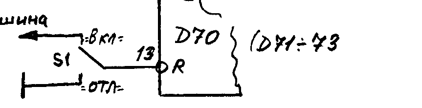
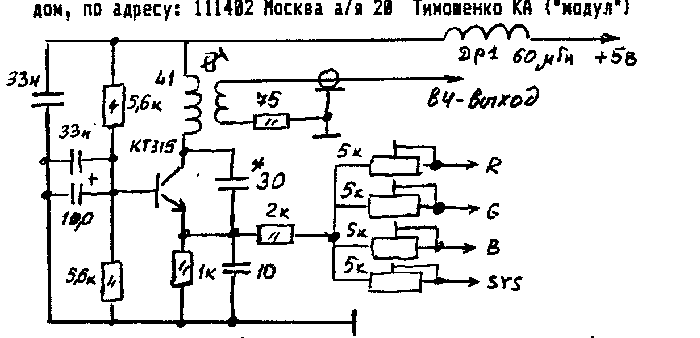
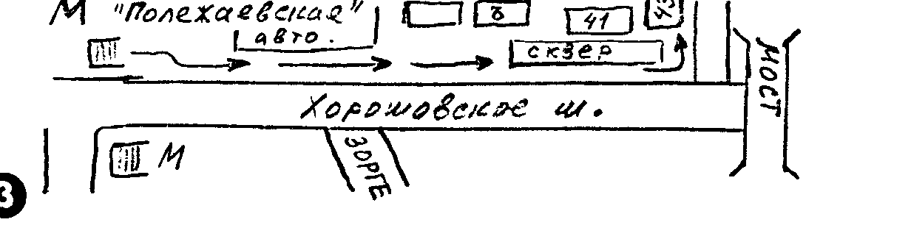
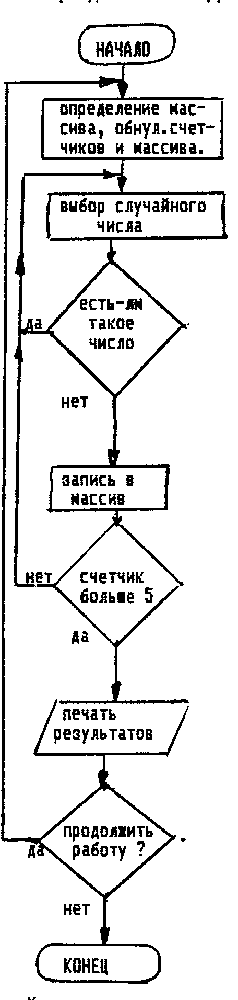

Информационный бюллетень «COMAN», 111402 Москва а/я 20, т. 946-4097.

## Настройка контроллера дисковода

В предыдущем номере была опубликована схема контроллера дисковода для ПК «Вектор» и «Львов» (для «ZX-SPECTRUM» постараемся опубликовать в ближайших номерах).
Адаптация CP/M для «Львова» пока еще не закончена, поэтому эта статья в основном предназначена для владельцев «Вектора», а «Львовцы» смогут к ней вернуться через пару месяцев.

При монтаже постарайтесь каждую м/схему зашунтировать по питанию конденсатором 0,047 - 0,068 мкф.
Соединительные кабели от ПК к контроллеру и от контроллера к дисководу постарайтесь делать не длиннее 30-50 см.

ВНИМАНИЕ!
Владельцы ПК «ВЕКТОР-СТАРТ-1200» должны распаять раз'ем, ведущий к ПК в соответствии со своей схемой (отличной от «Вектор-06ц»).

Кроме того, потребуется немного доработать «Вектор-1200», установив переключатели, позволяющие отключать экранные плоскости видеоОЗУ, тем самым расширяя память под ОС.
Иначе работа станет невозможной из-за помех на экране.
Кстати, эта доработка будет полезной и для различных программ, например «СИП» или «Шахматы».



КАТЕГОРИЧЕСКИ ЗАПРЕЩАЕТСЯ ПОДАВАТЬ НАПРЯЖЕНИЕ +5 В. ПРИ ОТСУТСТВИИ +12 В.
УСТАНОВИТЕ ЗАЩИТУ ОТ ПЕРЕНАПРЯЖЕНИЯ (см. «COMAN»-2).

Перед тем, как приступить к наладке контроллера, необходимо загрузить МОНИТОР-ОТЛАДЧИК и набрать программу первоначальной активизации CP/M.
Дело в том, что «Вектор» не имеет другого загрузчика, кроме ROM, и при запуске может принимать только программы ROM.
У владельцев «Вектора-06-02» имеется первоначальный загрузчик МИКРО/ДОС, но он несовместим с нашей системой.
Набор осуществляется директивой S.

### Программа первоначальной активизации CP/M

```
100  00 00 00 21 16 01 11 00 30 0E FF 7E 12 13 23 0D
110  C2 0B 01 C3 00 30 CD 45 30 3E 2D 32 E5 30 3E 01
120  32 6B DC 21 00 01 22 6C DC 31 80 00 CD 67 30 2A
130  6C DC 11 00 01 19 22 6C DC 21 E5 30 35 CA 00 01
140  3A 6B DC 3C 32 6B DC FE 11 DA 16 30 21 6A DC 34
150  3E 01 32 6B DC CD A6 30 C3 16 30 AF 32 6A DC D3
160  1E 3E 1C D3 1E 3E D8 D3 FE DB FE 1F DA 53 30 3E
170  08 D3 FE CD D7 30 11 98 3A CD D0 30 C9 3E 0F 32
180  E7 30 F3 11 8B 30 2A 6C DC EB 3A 6B DC D3 BE 0E
190  C0 3A E4 30 B7 C2 87 30 3E 82 C3 89 30 3E 8A D3
1A0  FE DB 1E A1 CA 8B 30 DB 9E FA 99 30 12 13 E9 DB
1B0  FE E6 1C C8 21 E7 30 35 C2 6C 30 C9 3A 6A DC B7
1C0  1F 32 E6 30 3E 00 17 32 E4 30 B7 CA BF 30 3E 0C
1D0  D3 1E C3 C3 30 3E 1C D3 1E 3A E6 30 D3 9E 3E 18
1E0  D3 FE CD D7 30 C9 7A B3 C8 1B C3 D0 30 DB FE 17
1F0  DA D7 30 DB FE 1F DA DD 30 C9 00 2D CD 9D 0F 32
```

После набора, запишите его на МЛ в формате ROM — это будет первоначальный загрузчик.
Команда выгрузки: `#O>1,1,0`.
Предупреждаем, что этот текст, прошитый в ПЗУ и установленный вместо штатного загрузчика результата не дадут.

Как показывает практика настройки нескольких сот контроллеров, если применяются заведомо исправные м/схемы, детали и дисковод, питание не «фонит» и кабели выполнены витой парой или через земли, а также нет ошибок монтажа, контроллер еще до настройки уже начинает работать.
С ошибками, неустойчиво, но правильно реагирует на команды.

Наладка контроллера осуществляется в пять этапов: 1) Генератор; 2) Управление интерфейсом; 3) Тракт позиционирования; 4) Тракт чтения; 5) Тракт записи.
О том, что перед наладкой надо проверить монтаж и убрать «сопли» даже не говорим.

### Генератор

После подачи напряжения осциллографом проверяют наличие меандров на выходах Д17/9,8,11 с частотой 4,2,1 МГц соответственно.
Проверить наличие синхронизации на Д9/24, Д11/2,12, Д12/2, Д16/9.

### Управление

Подключив контроллер к ПК, убедитесь, что тот не нарушил работу ПК.
Т.е. нет замыканий по шинам адреса и данных.
Загрузив и запустив Начальный Загрузчик (НЗ), проверяют наличие импульсов на Д1/8.
В случае их отсутствия проверяют исправность Д6, Д2 и наличие сигнала ЧТВВ на Д2/3,2.
Проверяют наличие импульсов выборки на Д8/1, Д9/3.
Проверяют наличие сигнала RD на Д9/4.
На Д9/19,23,37 должна установиться «1».
Необходимо проверить наличие импульсного сигнала на Д3/1, поступающего с Д5/11.

Об исправности модуля управления можно судить по загоранию светодиода на дисководе, что означает, что дисковод выбран.
Кстати, о выборе дисковода.
Проверьте, что бы дисковод был установлен как № 0, т.е. самым младшим.
Для этой цели обычно служат перемычки на штырьковом переключателе дисковода.
Он располагается рядом с системным раз'емом.

### Тракт позиционирования

При запуске НЗ, головка дисковода должна установиться на нулевую дорожку.
Перед этим полезно вручную осторожно переместить головку ближе к центру (нулевая дорожка находится ближе к краю дискеты).
Если при запуске НЗ головка не спозиционировала на 0-ю дорожку, проверяют наличие сигнала STEP на выходе Д14/6, Д9/15 и на раз'еме дисковода (на плате дисковода).
Следует проверить правильность прохождения потенциала DIRC через Д13 на НГМД.
При отсутствии свечения светодиода проверить наличие «0» на контакте 10 НГМД, Д14/4, Д8/12, Д8/13,14, Д7/12,15, Д13/10.
На Д9/35 при включенном двигателе должны наблюдаться импульсы с периодом 200 мс (сигнал INDEX, поступающий с дисковода).

### Тракт чтения

При запуске НЗ, если в дисководе находится системная дискета (СД), должна произойти загрузка Операционной Системы (ОС).
Загрузка длится 3-5 сек.
Экран очищается, и появляется надпись:

```
CPM 40K VERS 2.2
A>
```

Это означает, что загрузка прошла нормально.
Иначе ПК зависает, на экране «мусор» и т.п.
Если именно так и произошло, проверьте при очередной попытке чтения прохождение сигнала RD DATA с 30 НГМД на Д11/2,12, Д5/9,10, Д9/27, Д12/9.
На Д9/26 должен быть меандр с периодом 4 мкс, на Д12/2 поступают синхроимпульсы с Д15/10 с частотой 4 МГц.
Проверяют прохождение сигнала DRQ, INT через Д10 на Д3/11,12.
Если все сигналы проходят, попробуйте «поиграть» емкостями на выходах Д11/5,8 (330-750 пф).

После нормальной загрузки можно посмотреть каталог диска.
Это делается командой DIR.
Выглядит это так:

```
A>DIR <ВК>
```

После этого на экране появится список программ, имеющихся на диске.
Запускать на выполнение можно только программы (файлы) с расширением .COM, т.е. в машинных кодах.
Например: `A>FORMAT <ВК>` или `A>ROMOUT` и т.д.

### Тракт записи

После загрузки системы следует запустить программу FORMAT (она обязательно есть на СД).
После ее запуска, вам будет сделано предупреждение, что при форматировании все программы на диске уничтожаются и вам предлагается сменить дискету, что вы и должны незамедлительно сделать.
После чего нажмите клавишу «Y» и на вопрос «какого об'ема выбрать сектор», нажмите `<2>`, т.е. 256 байт/сектор.
В этом случае емкость дискеты составит 640 Кбайт.
Начнется форматирование дискеты.

Если форматирование не идет вообще, проверьте наличие сигнала записи на 22 НГМД, сигнал «разрешения записи» на 24 НГМД (дискета, разумеется, без заклееного окошка).
Низкий потенциал появляется на 1/5 сек раз в 15 сек.
Проверяют наличие сигнала WD на Д9/31, Д16/6,11, Д13/2.

Если программа форматирования идет, но после некоторых секторов останавливается или выдается сообщение BAD SECTOR, то проверьте модуль предкомпенсации, прохождение сигналов SL, SR с Д9/17,18 на Д16/2,3,4 через Д4 и Д15.
До 43 дорожки Д16/2,4 должны быть «0», а на Д16/3 «1».
После 43-й дорожки на них должны поступать сигналы сдвига SL, SR.

### Доводка

Если форматирование прошло успешно, практически наладку можно прекратить и работать.
Но те, у кого есть утилита (т.е. системная программа) DSKTST могут «вылизать» свой контроллер.
Дело в том, что при работе, ОС читает с дискеты раз 10, пока не прочитает правильно.
А при тестировании — только 1 раз.
Поэтому те, у кого тестирование проходит без проблем, могут не беспокоится за качество работы своего дисковода.

После запуска DSKTST на вопрос CMD: введите S, затем F, затем «W».
Информация при этом уничтожается.
После этого дайте команду R.
При ошибках будут выдаваться сообщения BAD SECTOR и SECTOR NOT FOUND.
Если при многократном выполнении чтения сбои происходят на одних и тех же секторах, то неисправен тракт записи, если на разных — проверьте тракт чтения.
Устойчивой записи добиваются подбором емкости на Д16/11 (50-200 пф).

Следует также заметить, что настроенные контроллеры при смене дисковода иногда требуют подстройки, поэтому если вы приобрели готовый контроллер, то проверьте его работу на своем дисководе, и при необходимости произведите подстройку.

Судя по откликам, данная конструкция контроллера зарекомендовала себя как надежная и неприхотливая.
Некоторые оценивают ее даже выше, чем контроллер МИКРО/ДОС.
Мы не стали держать схему в секрете, она достаточно проста, а значит обречена на популярность.
Смотрите не отставайте!

## Графический редактор «Пикассо» для ПК «Львов ПК01»

Сейчас, когда число пользователей этого редактора стремительно растет, настало время немного рассказать о нем.

В отличии от «Мульта», который был задуман как развлекательно-прикладная программа, рассчитанная как на программистов, так и для развлечения, «Пикассо» предназначен для того, чтобы создавать спрайты к программам, заставки и т.д.
Хотя совместимость с «Мультом» не закрывает и развлекательное направление.
Эта инструкция — одноразовая, т.к. обращение с ГР настолько просто, что через 2-3 часа работы вы полностью освоитесь.

Структура ГР построена так, что бы из любой текущей функции, можно было сразу перейти к любой другой, требующейся в данный момент.
Для облегчения и напоминания, назначение функции и клавиша ее вызова обозначены пиктограммами (хотя желание оставить рабочее поле больших размеров и отразилось на их качестве).
Итак, загрузите ГР «Пикассо» и начнем.

Сразу после загрузки производится проверка контрольной суммы, и если все в порядке, вверху экрана появляется ряд пиктограмм.
Текущий режим выделяется красным цветом.
Крайняя левая пиктограмма показывает АКТИВНЫЙ ЦВЕТ, т.е. каким цветом будет рисовать перо, элементы, заливка.
Если нажать `<М>`, то рисование и заливка будут осуществляться МАСКОЙ, но о самой маске — ниже.

**Клавиша `<C>`** — очистка всего рабочего поля каким-либо цветом.
При этом работают клавиши R, G, B, `<СТР>`.

**Клавиша `<1>`** — Рисование пером.
Точка ставится пробелом.
Размер пера практически не ограничен.
Изменение размера при одновременном нажатии `<СУ>`+`<стрелки>`.
Это позволяет использовать его и как «ластик».
Если нажать `<1>` повторно, то рисование будет осуществляться ОПУЩЕННЫМ пером.
Для его поднятия снова нажмите `<1>`.
При смене цвета и при переходе к другим функциям, перо автоматически поднимается.

**Клавиша `<2>`** — Редактирование МАСКИ.
Маска это как бы скрытый рисунок, всегда присутствующий на экране, а перо или заливка его «проявляет».
Например, вам надо нарисовать «кирпичную» стену, причем конфигурация ее очень сложная и при этом сохранить порядок кирпичей.
Можно нарисовать небольшой спрайт и параллельным переносом рисовать стену.
Но можно создать маску из кирпичей и обведя контур стены, заливкой закрасить всю стену «кирпичами».
Порядок будет идеальный.
Дело в том, что маска в данном случае представляет собой элемент 16x16 пиксел, который при «проявлении» циклически повторяется.
Для удобства редактирования, он увеличен.
Можно очистить его нажав `<СУ>`+`<цвет>`, и редактировать `<курсор>`+`<цвет>`.

**Клавиша `<3>`** — Рисование линий.
Линии здесь «резиновые», т.е. фиксируется один конец `<пробелом>`, а второй движется за указателем курсора.
Это позволяет подобрать оптимальное положение линии и зафиксировать ее повторным нажатием `<пробела>`.
Отмена линии — `<ЗБ>`.

**Клавиша `<4>`** — Рисование прямоугольников.
Они здесь тоже «резиновые».
Сначала пробелом фиксируется левый нижний угол, затем после подбора нужного размера — сам прямоугольник.
Отмена — `<ЗБ>`.

**Клавиша `<5>`** — Рисование эллипсов.
Пробелом фиксируется центр будущего эллипса, стрелками выбирается размер и эксцентриситет и повторным нажатием фиксируется сам эллипс.
Отмена — `<ЗБ>`.
Это чрезвычайно полезная функция, т.к. рисование «круглых» предметов «вручную» на «Львове» тяжело из-за эксцентриситета его видеоконтроллера.
И хотя мелкие эллипсы не всегда красивы, они являются прекрасной «рыбой», и при доводке «линзой» становятся идеальными.

**Клавиша `<6>`** — Заливка.
Применен оригинальный механизм, который устранил такое неприятное явление, как «проливание краски», которое обычно портит весь рисунок.
Здесь его испортить просто невозможно.
Во-первых, нет понятия «цвет границы».
Краска (активный цвет или маска) просто «обтекает» все неоднородности, т.е. те цвета, отличные от того, на котором началась заливка.
Во-вторых, программа проверяет наличие границ и при обнаружении «дырки» просто остановит заливку.
Можно заливать пространство между 2-мя вертикальными линиями — получится прямоугольник.
В третьих, перед заливкой программа на всякий случай запоминает содержимое рабочего поля и если вам просто не понравился результат заливки, то можете вернуться к исходному состоянию нажав `<ЗБ>`.

**Клавиша `<7>`** — Лупа («линза»).
Для прорисовки мелких об'ектов удобна лупа (увеличение в 4 раза).
Размер редактируемого изображения 32x32 пиксела.
Войдя в режим, наведите лупу на об'ект и нажмите пробел.
Появится увеличенное и реальное изображение об'екта.
По окончании редактирования снова нажмите клавишу `<7>` — вернетесь в меню.

**Клавиша `<8>`** — Символьный режим.
Предназначен для «печатанья» букв и др. символов обычного и увеличенного размера.
Размер изменяется при помощи `<СУ>`+`<стрелки>`.
Выход из этого режима при помощи клавиши `<^>`.

**Клавиша `<9>`** — Редактирование знакогенератора.
При написании программ иногда требуется изменить начертание некоторых символов или создать «фирменный» шрифт.
При входе в этот режим появляется «окно», и нажав какую либо клавишу, вы можете отредактировать тот или иной знак.
`<пробел>` в этом случае «зажигает» или «гасит» пиксел в изображении знака.
Выход из этого режима также по нажатии `<^>`.

**Клавиша `<0>`** — Запоминание для переноса.
Если вы рисуете что то, состоящее из одинаковых элементов или готовитесь к реверсам, при помощи этого режима можно размножить или переместить изображение.
Установив размер рамки (`<СУ>`+`<стрелки>`) и выбрав об'ект, нажмите пробел и переместив рамку в нужное место, вновь нажмите пробел.
Изображение об'екта будет точь в точь как исходное.

**Клавиша `<R>`** — Реверс.
Этот режим позволяет получить зеркальное изображение об'екта, что несомненно удобно при рисовании спрайтов, которые должны двигаться в разные стороны.
Размер реверсируемого изображения выбирается `<СУ>`+`<стрелки>`, а сам реверс `<ВР>`+`<стрелки>`.

**Клавиша `<S>`** — Сдвиг.
Эта функция позволяет сдвигать изображение внутри выбранной рамки по кольцу.
Управление `<СУ>` и `<ВР>` + `<стрелки>`.
Эта редко применяемая, на первый взгляд, функция просто незаменима, когда надо обеспечить плавное (через 1-2 пиксела) движение об'екта или сделать наклонный шрифт.
Когда надо нарисовать большой спрайт, размером больше чем рабочая область, фрагмент рисуют в ней, а затем сдвигают в сторону.
Для этого нажимают пробел, появляются две горизонтальные линии, ограничивающие спрайт по вертикали.
Горизонтальный размер его 256 пикс.

**Клавиши `<P>` и `<F>`** — Палитра и фон.
Выбрав одну из этих функций, вы можете сразу создавать спрайты в том виде, в каком они должны быть в программе, если вы собрались изменять стандартную палитру и фон.
Перебор палитры и фона клавишами `<вверх/вниз>`.

**Клавиша `<F1>`** — Чтение файла с магнитной ленты.
Файлы (записанные самим ГР) могут быть двух видов.
Типа «S» — т.е. Спрайт (BLOAD).
В этом случае, после приема и сверки контр. суммы, в левом верхнем углу рабочего поля появляется рамка, размером с принятый спрайт.
При помощи стрелок его можно «оттащить» в другое место и зафиксировать при помощи пробела.
Затем можно принимать другой спрайт.
Файл типа «Z» — содержимое знакогенератора.
Если у вас свой, неповторимый знакогенератор, то создав его один раз и сохранив его на МЛ, вы можете затем просто подгружать по мере необходимости.
Мы предлагаем создать библиотеку шрифтов для «Львова» (ведь этим знакогенератором можно пользоваться не только в ГР), поэтому с благодарностью примем ваши разработки шрифтов в обмен на уже имеющиеся.

**Клавиша `<F2>`** — Запись на МЛ.
После активизации этой функции надо выбрать об'ект вывода (`<СУ>`+`<стрелки>`) и нажать `<^>`.
Если надо вывести спрайт размером больше рабочего поля, пользуются приемом, как при сдвиге.
Затем следует выбрать `<вверх/вниз>` формат вывода.
Он может быть следующим:

B — BLOAD — для использования в мониторе, для Бейсика-графического, для сохранения и последующей загрузки и т.д.
Информация в файле следующая:

| нач. адр (2Б) | кон. адр (2Б) | байт в строке (1Б) | число строк (1Б) | ТЕЛО СПРАЙТА | байт в строке (1Б) | число строк (1Б) | N палит (1Б) | N фон (1Б) |
| --- | --- | --- | --- | --- | --- | --- | --- | --- |

A (зеленая) — Вывод в формате «Ассемблера-91».
Кстати, «Пикассо» исправляет ошибки, допущенные в Асс-91 и Асс-90.
Поэтому им можно пользоваться без каких либо ограничений.

A (синяя) — Вывод в формате «Ассемблера-90».
В обоих случаях метка спрайта будет совпадать с его именем.

M — Вывод в формате Мультипликатора.
Затем вы можете загрузить спрайт в «Мульт» и на его основе сделать мультфильм.
Причем ввод такого спрайта модифицирует сам «Мульт», снимая у него ограничение на размер кадра.

Z — вывод знакогенератора, для последующей загрузки или самостоятельного использования.

S — выбор скорости записи файла (по умолчанию — 800).

После выбора формата нажмите `<ВК>`, и укажите адрес, с которого вы хотите вывести спрайт (для BLOAD-формата), а так же имя спрайта.
По окончании вывода вам будет сообщен размер спрайта и его контрольная сумма.

Автор этой программы — А.К. Попов, г. Москва, «COMAN».

> Мы приносим свои извинения всем подписчикам, которые считают, что мы публикуем недостаточно материала именно по их комп'ютеру.
> Малый об'ем бюллетеня не позволяет нам развернуться, а желание делать статьи логически завершенными приводит к некоторым перекосам, которые мы постараемся устранить.

## Программы для «Львова» (все в кодах)

| Индекс | Название | Описание |
| --- | --- | --- |
| C68 | STEP (20руб.) /ап/ | Герой попал на реку в самый разгар ледохода. Течение постоянно сносит его, а сил для прыжков и спасательных кругов не так много. Но их можно найти на льдинах. Там же вас ждут и призы. Динамичная и красочная игра. |
| C69 | GAPPER (20руб.) /ап/ | Очень динамичная и веселая игра. Управляя своим героем, надо успеть обежать все квадратики по периметру, уворачиваясь от Бяки. Бяка тоже не промах, спать не даст! 21 уровень! |
| C70 | ОРЕЛ (25руб) /ап/ | Сначала вам надо пробраться к лестнице, под градом камней, которые сбрасывают орлы. Они же постараются вас спихнуть с нее. Но если вы одолели эти препятствия, постарайтесь оседлать какую-либо птицу. Если и это вам удалось, тут уж не зевайте, только успевайте подхватывать мешки с золотом... и уворачиваться от собратьев вашего крылатого «коня». |
| C71 | ПОПКОРН (10 руб.) | Довольно распространенная игра, по сюжету напоминающая АРКАНОИД. |
| C72 | ДИГГЕР (10 руб.) | Крот, прогрызая ходы, собирает призы. Но по его же ходам, за ним гонятся гнусные животные. |
| C73 | BOULDER DASH (20руб.) | Полиэкранная игра, в которой забавный лягушонок собирает алмазы и уворачивается от камней. Смотрите не завалите самого себя! |

Из писем: «...почему вы не пишете контрольную сумму?».
Потому, что многие программы — с автоматической проверкой правильности считывания (а/п).
При неправильной загрузке происходит перезапуск ПК, что бы не плодить ошибок.

## Программы для «Вектора» (все в ROM-формате)

| Индекс | Название | Описание |
| --- | --- | --- |
| 1-81 | БОЛДЕР (20руб.) | Сюжет аналогичен (1-71), но игра сделана полиэкранной. Надо не только решать каким образом пробраться к алмазам, но и не забыть, где выход. |
| 1-82 | ROCK MAN (15руб.) | Еще один похожий сюжет, но решен по другому. На экране много комнат, и с какой начинать, решайте сами. |
| 1-83 | ЛАБИРИНТ (15 руб.) | Паучок собирает призы в запутанном лабиринте, избегая встречи со злым червяком. |
| 1-84 | GAPPER (20 руб.) | Сюжет, аналогичный игре для «Львова». |
| 1-85 | PUTUP-БЕССМЕРТНЫЙ (10руб) | Доработанная (не нами) версия игры, для тех, кто хочет стать асом PUTUP-а. Количество жизней у вас неограничено! |
| 1-86 | CHIP (20руб.) | Экранный редактор для тех, кто любит рисовать радиосхемы на комп'ютере. |
| 1-87 | МОНИТОР-МОНСТР (30руб) | Инструмент для «ЛОМА» чужих программ. Вводит программы из ROM и позволяет их редактировать. Инструкция будет опубликована. |
| 1-88 | МАСТЕР РЕВЕРСИ (50 руб.) | Эту программу купят немногие. Но те кто купят, по достоинству оценят ее мощь, юмор и умение подстраиваться под партнера. Диапазон интеллекта программы настраивается от «бестолкового» до «мастера», великолепный сервис делает ее приятным партнером. Те кто любит игру РЕВЕРСИ (ОТЕЛЛО) — это для вас путь к совершенству. |
| 1-89 | FORMULA ONE (30 руб.) | Вы — пилот знаменитого болида — автомобиля «ФОРМУЛЫ-1». Конечно, вы не А. Прост и не знаменитый Мэнсел, но все же... В квалификационном заезде вам подберут соперника такого же уровня, как и вы, и тогда уж не зевайте! 3-х мерная графика, сложные трассы, хитрая система соревнований (в них обязательно надо выиграть). |
| 1-90 | COPY 3.1 (20руб) | Копировщик без сброса при ошибке. |
| 1-91 | COPY 4.1 (30руб) | Сервисный копировщик без сброса при ошибке, с выдачей имени программы, кол-ва блоков и инструкцией. |

ВНИМАНИЕ!
Многие владельцы сетуют на то, что мы записываем программы с 1-м проходом, а не с двумя, и это здорово снижает надежность считывания.
Мы согласны с этим, но при массовом тиражировании, мы производим копирование не на «Векторе», а на IBM PC, иначе захлебнемся в заказах.
Поэтому технологически нам проще сделать 2-3 копии, но с одним проходом, чем одну с двумя.
Программы с защитой от копирования мы прописываем минимум 2 раза, а если позволяет место на МЛ, то и больше.
Не жалейте денег на кассеты! мы будем делать запись с дублем.
Кроме того, мы предлагаем вам копировщики, которые не сбрасывают программу в случае ошибки при приеме, и вы сможете попытаться загрузить еще и еще, пока не достигните результата.
А имея в запасе дубль, вы ГАРАНТИРОВАННО СЧИТАЕТЕ КОПИИ, даже если она с одним проходом.
Если произошел сбой, возьмите вторую копию и запустите примерно с того же места (но можно и с начала, не сбрасывая предыдущую запись).
Даже если запись совсем плохая, меняя копии, вы загрузите программу.
Это более хлопотно, чем запись с двойным проходом, но более надежно, т.к. при «зажевывании» не спасает даже двойной проход.

## Экспресс-информация

Господа, не надо вам об'яснять, в какое время мы живем.
Цены постоянно изменяются из-за инфляции.
Мы также вынуждены это делать, т.к. много товаров у нас — не нашего производства.
Поднимает цену поставщик — поднимаем мы.
Поэтому прежде чем что то купить (контроллер, дисковод, кассеты и т.д.) советуем вам позвонить и узнать текущие цены.
А если вы отправляете оплату «медленной скоростью», т.е. почтовым переводом, то за время его путешествия цены так же могут измениться.
Просим это учитывать.

НО! ЦЕНЫ НА ПРОГРАММЫ МЫ НЕ МЕНЯЕМ!

Кроме того, из-за этой чехарды с ценами, иногда возможны небольшие задержки в выполнении заказов (как например с контроллерами дисководов).
После того, как поставщик поднимает цены, мы, естественно, пытаемся найти более «дешевого» поставщика.
Иногда это удается, иногда нет, но на это требуется время.

А пока цены на 1 сентября 1992 г. (в руб.):

| Товар | Цена |
| --- | --- |
| Кассеты C-90 | 45 |
| Дисковод 5323.01 | 3200 |
| Контроллер к «Вектору» | 1500 |
| 1818ВГ93 | 250-300 |
| Дискеты 5'25" | 50 |
| Контроллер к «ZX-Spectrum» | 2000-2200 |

## ВЧ-модулятор

Наша почта постоянно приносит письма, в которых поднимается вопрос о подключении ПК к телевизору.
Причем не только по низкой частоте, но и через антенный вход.
В самом деле, вы идете к кому-то заниматься или в гости едете надолго, но не можете без своего ПК провести ни дня.
Не брать же с собой еще и телевизор.
Или близкие хотят посмотреть телепередачу по «большому» телевизору, в то время когда вам надо срочно что то посмотреть, а «маленький», кухонный телевизор простаивает.
То ли дело — ВЧ-модулятор.
Уж антенный вход есть у любого телевизора, даже у импортного.
Хотя следует предупредить, что качество изображения немного хуже чем при НЧ-подключении, но тоже очень высокое.

Пока мы опубликуем схему черно/белого модулятора, т.к. она достаточно проста и является уже «классикой».
При исправных деталях наладки не требуется, только подстройка на требуемый канал ТВ (2-11).
Катушка L1 на пластмассовом каркасе Ø 8мм с латунным сердечником, 5 витков ПЭВ 0,6мм с шагом 1,5 мм.
L2 — катушка связи, 2 витка ПЭЛШО 0,15 мм.
Положение — рядом или поверх L1.
Экспериментируя с ее положением, можно добиться отменного качества изображения.

Тем, кому лень самому собирать, могут приобрести готовый, цена его 180 руб. с пересылкой.
Оплата — почтовым переводом, по адресу: 111402 Москва а/я 20 Тимошенко К.А. («модул»).



Для того, что бы различать цвета на экране, хотя бы по уровню яркости, вам надо будет их свести в один сигнал.
Это делается при помощи подстроечных резисторов.
Нарисовав на экране картинку, содержащую все цвета вашего ПК, вы можете поставить в соответствие каждому свой уровень яркости.
Кстати, когда вы пишете сам текст программы, то лучше пользоваться черно/белым ТВ, т.к. у него значительно меньше уровень рентгеновского излучения.

## Ну наконец то!

НАМ УДАЛОСЬ СНЯТЬ ПОМЕЩЕНИЕ ПРИГОДНОЕ ДЛЯ НАС И УДОБНОЕ ДЛЯ ВАС!!!
КАК НАС НАЙТИ?

План нарисован, об'ясняем, как им пользоваться.
На метро, первый вагон из центра.
В подземном переходе НАЛЕВО, мимо магазина «АВТОЗАПЧАСТИ» и редакции «КОММЕРСАНТ» (7 мин.).

> АДРЕС: Хорошовское шоссе, д 43-б кв 61
> тел. (095) 195-3833 с 10 до 18 мск.

ВСЕ, ЧТО МЫ ПРОДАЕМ, ВЫ МОЖЕТЕ КУПИТЬ ЗДЕСЬ!!!



## Букварь программиста

Похоже, мы немного погорячились, потребовав у вас сценарий какой либо игры.
Пока не прислано ни одного.
Да и сложновато начинать учиться сразу с игры.
Тем более, пока мы должны научиться составлять АЛГОРИТМ.
Что бы не брать для тренировки совсем уж никчемную задачу, давайте напишем программку, которая будет подбирать для нас 5 случайных чисел в диапазоне от 1 до 36 включительно.
Числа не должны повторяться.
Как вы догадались, речь идет о «Спортлотто».
Программа, кстати, вполне работоспособна и ее можно будет применять на практике (при крупном выигрыше не забудьте про «COMAN»).
Сегодня мы напишем программу на Бейсике, т.к. генератор случайных чисел в Ассемблере — это отдельный разговор.

Итак, начнем писать программу «Миллион».
Вначале сделаем ее очень простой («прозрачной»), а затем будем добавлять сервисные вставки.
Идея программы изложена выше, как будет выглядеть алгоритм.
Описывать операторы Бейсика мы не будем, обычно при покупке ПК прилагается его описание и назначение этих операторов вы посмотрите сами.
Если кого-то интересует литература по Бейсику, обращайтесь к нам.



Любая программа начинается с подготовки.
Это определение массивов, куда будут складываться результаты, установка счетчиков, заголовок и т.д.
Для ясности мы будем в каждой строке писать только по 1-му оператору.
В нашей программе подготовка — это строки 1000 - 1300.
Такой большой номер строк выбран нарочно, что бы потом можно было безболезненно делать вставки.
Как видите, обнуление массива производится циклом (1100-1200).
Затем мы выбираем число (1400).
Но генератор выдает случайные числа от 0 до 1, поэтому нам надо его «растянуть» до 36, округлить (взять целую часть) и застраховаться от 0.
Это делают операторы в строках 1400 - 1700.
Затем надо проверить, есть-ли такое число в массиве.
Это делается циклом в строках 1800-2000.
И если такое число будет найдено, придется отправляться за новым, на 1400.

А если нет, то смело можно записать его в массив и прибавить к счетчику единицу (ИНКРЕМЕНТ) (2100-2200).
После этого надо посмотреть, не готова-ли наша комбинация и не пора ли брать и зачеркивать карточку.
Если не готова (K<6), то выбираем еще одно число и все повторяется.
А если готова (K=6! переполнение!) то можно и результаты вывести на экран (2400 - 2500).

Но, как известно, мало кто играет с одной карточкой, да и вариантов на ней два.
Поэтому надо задать вопрос — «не выдать-ли еще одну комбинацию?».
Это делается в строке 2600.
А в следующей — анализируется ответ.
И если он утвердительный, то программа переходит на свое начало.
Любой другой расценивается как отрицательный.

Текст программы:

```basic
1000 DIM A(5)
1100 FOR I=1 TO 5:A(I)=0
1200 NEXT I
1300 K=1
1400 S=RND(1)
1500 S=S*35
1600 S=INT(S)
1700 S=S+1
1800 FOR I=1 TO 5
1900 IF S=A(I) THEN GOTO 1400
2000 NEXT I
2100 A(K)=S
2200 A(K)=K+1
2300 IF K<6 THEN GOTO 1400
2400 FOR I=1 TO 5
2500 PRINT A(I);:NEXT I
2600 INPUT" ЕЩЕ? (Y/N)",B$
2700 IF B$="Y" THEN GOTO 1100
2800 END
```

Конечно, для тех, кто знает Бейсик, эта программа примитивна, но мы начинаем с «каши», понятной всем и приводим программу для того, чтобы вы оценили степень отличия процесса программирования на Бейсике и на Ассемблере.
Тем же, кто начинает с «0», советуем внимательно изучить текст и постараться понять назначение КАЖДОГО оператора и символа.
Не бойтесь экспериментировать и заменять значения.

## Всегда в продаже!

- Дискеты 5'25" MD-2DD, 96TPI, SONY (и анал.)
- Аудиокассеты C-90 (MAXWELL или анал.)
- Дисковод EC5323.01 (80 дор. 2-х стор.)

ВНИМАНИЕ!
ВПЕРВЫЕ У НАС В ПРОДАЖЕ ЧИСТЯЩИЕ ДИСКЕТЫ (цена — 100 руб. с перес.)

Если вы бережете свой дисковод и хотите продлить жизнь его головок в 3-5 раз, с'экономить немало средств и повысить надежность его работы (чтения/записи) — купите эту дискету!

Цены изменяются постоянно (инфляция!) поэтому, перед покупкой уточните цены по телефону (095) 946-4097 или письменно.
Не забудьте конверт для ответа!

## От Бейсика к Ассемблеру

ВНИМАНИЕ!
Те, кто хочет освоить язык Ассемблер!
Только что из типографии!
Вышла книга С.Н. Текотева «ОТ БЕЙСИКА К АССЕМБЛЕРУ».

(С.Н. Текотев известен владельцам «Львова» как автор «Мульт», «Мон+», «Асс91», «Буря в пустыне» и т.д.)

В книге, по аналогии с Бейсиком, рассказывается об Ассемблере, приемах программирования на нем, приведены конкретные программы.
Для тех, кого интересует рубрика «Букварь программиста», книга будет очень полезна, т.к. избавляет нас от необходимости рассказывать о процессоре и его работе.
Мы будем просто давать ссылку на конкретные примеры в книге.
Спешите приобрести!

Книга ВЫСЫЛАЕТСЯ НЕМЕДЛЕННО!
Стоимость книги — 50 руб. с пересылкой.
При покупке оптом цена договорная, в зависимости от количества, пересылка — за наш счет.

Оплату высылать по адресу: 111402 Москва а/я 20 Тимошенко Константину Андреевичу «за книгу».

## МП «Бытовик» предлагает

При изготовлении различных устройств и «примочек» для своего ПК, настоятельно советуем пользоваться САКЕТАМИ (панельками под микросхемы).
Замена дефективной м/с на исправную — 5 секунд вместо утомительной пайки с риском повредить печатную плату.

Розетки под интегральные микросхемы всех типов:

| Тип | PC-14 | -16 | -18 | -20 | -24 | -28 | -40 | -40(дюйм.) |
| --- | --- | --- | --- | --- | --- | --- | --- | --- |
| Цена | 8,90 | 10,50 | 11,60 | 12,70 | 15,80 | 18,60 | 29,40 | 38,70 |

- Раз'емы типа IBM-PC XT/AT (пара «папа-мама»): 25-ти контактные — 415 руб., 9-ти контактные — 310 руб.
- Переходник 9/25 контактный — 455 руб.
- Телевизионный штекер (пара штеккер/гнездо) — 14,60 руб.
- Раз'ем СНП-101-25 (пара) — 385 руб.
- Телефонная вилка ВТМ и розетка РТШ-4 (комплект) — 69,40 руб.

Заявки направлять по адресу: 443011 г. Самара а/я 7719, тел. (846-2) 58-82-66.

## Хит-парад

Как подсчитываются очки?
Очень просто.
Например приходит список программ из 5-ти названий.
Первая программа получает 5 очков, 2-я — 4 очка и т.д.
В списках более 10 берутся первые 10 программ.
Такая методика позволяет не только оценить программу, но и степень ее распространенности, узнать, заметили ли ее или она осталась незамеченной.

ИТАК, ПЕРВЫЕ ИТОГИ:

| № | Львов | Вектор |
| --- | --- | --- |
| 1 | СУПЕРЛАБИРИНТ (40) | PUTUP (37) |
| 2 | БУРЯ В ПУСТЫНЕ (30) | ТЕТРИС (30) |
| 3 | BOULDER DASH (21) | АДСКОК (27) |
| 4 | ТЕТРИС (18) | ГРОТОХОД (22) |
| 5 | КАРАТЕ (10) | ПЛАНЕТА ПТИЦ (20) |

Вы не согласны?
Ждем Ваших списков в «ХИТ-ПАРАД».

А заодно ответьте на следующие вопросы:

1. Что вы предпочтете купить: НОВУЮ ПРОГРАММУ без защиты за 30-50 руб. или с защитой за 10-30 руб.
2. Об'ем бюллетеня явно недостаточен для 4-х и более типов ПК. Даже при выпуске 2 номеров в месяц информация «рвется», статьи слишком коротки. В то же время увеличение об'ема вызывает увеличение стоимости и продолжительности времени подготовки выпуска.

Каким вы бы хотели видеть бюллетень (об'ем, форма — газета, журнал и т.д.), и за какую цену вы готовы его покупать?
Просим ответить серьезно, а не «толстый, цветной, каждый день и бесплатно», больше реализма и с учетом инфляции.
За 6 руб. мы можем обеспечить только то, что вы имеете.
Учитывая, что конверт стоит 1 руб. 20 коп.
Пока... Ну пока.
