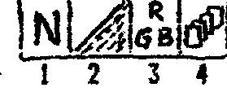
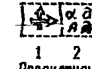

Информ-бюллетень фирмы «COMAN», тел. (095) 195-38-33.
111402 Москва а/я 20, Хорошовское ш., д 43-б кв 61.

## Экспресс-информация

Напоминаем еще раз, что открыт новый офис фирмы, расположенный по адресу: метро «Полежаевская», Хорошовское шоссе, д 43-б кв 61.
Здесь вы можете приобрести все, что мы продаем.
Тел. 195-38-33.
Почтовый адрес прежний.

Прежний телефонный канал (946-4097) так же остается за фирмой, но будет задействован для МОДЕМНОЙ СВЯЗИ.
Читайте «COMAN» и мы будем держать вас в курсе событий!

## Новые услуги фирмы «COMAN»

Если вам надо приехать в Москву, но вы не знаете, где остановиться и переночевать, звоните нам сейчас же!

К вашим услугам: квартиры гостеприимных москвичей или отдельные комнаты.
Возможен полный пансион (питание и т.д.).
Если вам надо много ездить — вас ждут ГАЗ-24 с водителями, которые отлично знают Москву.
Вас встретят прямо на вокзале!
Мы так же отметим ваше командировочное удостоверение и выпишем оправдательные финансовые документы.
Если вы заключите с нами договор, то возможна оплата по б/налу.

И ВСЕ ЭТО ЗА ОЧЕНЬ УМЕРЕННУЮ ПЛАТУ!
СКАЖИТЕ ОБ ЭТОМ ВСЕМ СВОИМ ЗНАКОМЫМ!
У ВАС ТЕПЕРЬ ЕСТЬ В МОСКВЕ «РОДСТВЕННИКИ» У КОТОРЫХ МОЖНО ОСТАНОВИТЬСЯ.

## Вниманию наших читателей

Сейчас, когда число подписчиков «COMAN-INFO» достигло значительного числа, есть смысл подвести первые промежуточные итоги.
Подписчики делятся на две большие группы, примерно равные.
Первая — это те, кто нам верит и подписывается на 10-50 номеров.
Им нечего беспокоиться, никакое повышение цен на наше издание им не грозит, разве что в случае такой же инфляции, как в начале 91-го г.
Другую же группу, которая подписывается на 2-3 номера вперед, скорее всего ждет ползучее повышение цен.
Дело в том, что деньги за 20-30 номеров не лежат, а работают и компенсируют инфляционные потери.
Мелкие же суммы (3 номера — 18 руб. цена мороженого), не успевают за инфляцией.
Поэтому если вы подписываетесь на бюллетень (впервые или продолжаете подписку), постарайтесь оплатить побольше номеров.
Вам же выгоднее!
Кстати, большое число «долговременных» подписчиков подстегивает нас выпускать бюллетень почаще (надо отрабатывать денежки).

НАПОМИНАЕМ, что для подписки на бюллетень необходимо выслать любую сумму, из расчета 6 рублей (пока 6 рублей) за один номер ПОЧТОВЫМ ПЕРЕВОДОМ по адресу:

> 111402 Москва а/я 20 Тимошенко К.А.

Напишите свой обратный адрес очень разборчиво, лучше печатными буквами и укажите, с какого номера вы хотите получать бюллетень.

Мы не несем ответственности за деньги высланные в конвертах, бандеролях и т.д.
Практически все бандероли в наш адрес приходят вскрытыми.
Мы вынуждены от них отказываться, что бы нас не обвинили в хищении вложения.
Поэтому суммы до 2-3 тысяч лучше высылать переводом, свыше — переправлять с оказией или лично, с заказом непосредственно в офис.

## Всякая всячина

- Надоевшую музыку в «POOL» (Вектор), можно выключить (или включить), нажав клавишу `<АР2>`. Сила удара — `<F4/F5>`.
- Если одновременно нажать клавиши `<Т>` и `<СБР>` в ПК «Львов», то на экране появятся контрольные суммы ПЗУ. Советуем переписать их в свою рабочую тетрадь, т.к. ППЗУ-УФ иногда «слепнут», т.е. теряют информацию.
- Если в «LIBERATOR» (Вектор) стрелять по пехоте, то может появиться горючее, доты «дают» снаряды, блиндажи и пр. ремонтные базы.
- Нас одолевают вопросами совместимости ПК между собой. ПК «Вектор», «Львов», «Радио-86», «Spectrum» несовместимы между собой. Правда существуют эмуляторы «РК86» для «Вектора» и «Львова», но это убогие программы, о которых даже не стоит говорить. Единственное, что эти ПК могут задействовать друг от друга, это графика. Но и для этого надо писать специальные программы, воспринимающие «вражеский» формат записи. На наш взгляд, проще нарисовать такую же картинку (а лучше свою) с помощью мощных граф. редакторов, тем паче, что они уже есть. Это «Рембрандт», «Пикассо» и «Артстудио». Если вы еще не приобрели их, постарайтесь сделать это поскорее. В «Букваре программиста» мы будем работать только с ними!

## Обзор системных программ для ПК «Львов-ПК01»

Получив впервые наш каталог для ПК «Львов», его владелец, как правило, испытывает муки выбора, что заказать из системных программ.
Попытаемся кратко раз'яснить, что к чему.

Все системные программы можно разбить на несколько групп.

**«Ассемблеры».**
Предназначены для написания программ на ассемблере, редактирования текста и трансляции его в машинные коды.
Нам известны «Асс-90», «Асс-91», «Редактор-ассемблер», «SYSTEM», и другие, как правило, адаптированные с «РК86».
Наиболее мощный из этих программ — «Асс-91».
Правда, у начинающих некоторую трудность освоения вызывает стенографический набор текста.
Но зато освоив его, они понимают всю его прелесть.
Тем более, что мы продаем его с достаточно подробной инструкцией.
Пиратские копии, как понимаете, никакими инструкциями не снабжаются.
«Асс-91» позволяет создать тексты длиной 35 Кб, что при трансляции дает текст программы 6-8 Кб.
А это уже приличная программа.

**«Мониторы».**
Эти программы предназначены для работы непосредственно с машинными кодами.
В основном это отладка программ, подбор различных констант.
Правда есть программисты, которые пишут программы сразу в кодах.
Надо сказать, что это достаточно трудно, т.к. небольшие изменения алгоритма приводят к почти полному «перелопачиванию» адресов, пересылок.
Для страховки от этого программисты вставляют «пустышки», но и потом такие программы, как правило, изобилуют «БП» — безусловными переходами.
На наш взгляд, наиболее мощным является «Монитор-плюс».
Хотя он сам великоват по размеру (8Кб), но его сервис и встроенный граф. редактор, делают его очень мощным инструментом, особенно в руках профессионала.
Микромонитор «АРС», наоборот, занимает менее 1 Кб. и располагается в самом верху ОЗУ, предоставляя пользователю 45 Кб.
Причем начиная с адреса 0000H.
Иногда это очень удобно.
«АРС» позволяет вводить файлы без имени, т.е без заголовка.
При создании программ, состоящих из нескольких блоков, для редактирования нет необходимости вводить всю программу, можно ввести только нужный блок.
Остальные мониторы предоставляют пользователю возможность просмотра памяти, ее коррекции, ввода и пр.

**«Графические редакторы».**
Они предназначены для создания спрайтов, заставок и т.д.
До недавнего времени программисты использовали два редактора «Граф. редактор» (S9) и «Мульт».
Однако первый работает только в десятичных адресах и только в режиме «линза», что несовсем удобно.
Второй имеет «грубо» фиксированные размеры и наоборот, не имеет «линзы».
Появление на свет «Пикассо» наконец-то дает возможность программистам быстро и качественно рисовать спрайты и вставлять их прямо в текст программы на Ассемблере.

**«Копировщики».**
Предназначены для копирования программ.
Здесь следует очень четко разделять копировщики программ без защиты и копировщики программ с конкретным видом защиты.
Проблема это достаточно сложна, что бы посвятить ей отдельную статью в одном из ближайших номеров.
Скажем только, что один из наиболее популярных копировщиков — «ТУРБО», копирует незащищенные программы, но зато все — в кодах, на Бейсике.

**«Вспомогательные программы».**
Эти программы обычно призваны решать какие-то конкретные задачи.
Смысл их обычно ясен из названия программы.
Плодятся такие программы как грибы, по мере надобности.
Рассмотрим некоторые из предлагаемых нами к продаже.
«Ренумерация» — предназначена для изменения номера строки в программе на Бейсике.
Это необходимо тогда, когда надо сделать вставку, но «свободных» строк уже нет.
«DATA» служит для вставки подпрограмм в кодах в программу на Бейсике.
«SPEED» — изменяет константы вывода на МЛ и передает управление обратно в Бейсик.
Позволяет экономить магнитную ленту.
«SMALL» — подменяет управление знакогенератором и заменяет его, вводя маленькие буквы, что позволяет разместить в строке 60-65 символов.
«ДОКТОР» предназначен для восстановления «заезженных» программ, незащищенных, разумеется.
Если программы по каким-то причинам вводятся с ошибкой, причем каждый раз другой, «ДОКТОР» поможет отловить ее и устранить.

Часто спрашивают, какие программы надо купить, что бы самому начать писать программы на Ассемблере или в кодах.
Поэтому мы приводим минимальный список программ, необходимый для программиста:

1. Ассемблер-91; для написания текстов программ на Ассемблере, их редактирования, трансляции в машинные коды.
2. Монитор-плюс; для отладки программ, подбора констант, корректировки спрайтов, дизассемблирования и т.д.
3. Пикассо; для создания спрайтов, заставок, знакогенераторов и ввода всего созданного в Асс-91 для последующей трансляции.

Остальные системные программы являются лишь вспомогательными, и вы их можете докупать по мере надобности.

## Графический редактор «Рембрандт» для ПК «Вектор»

В этой инструкции приводятся правила по работе с ГР, форматы записи и т.д.
Запомните общие положения, которые действительны в любой функции ГР:

1. Выбор функции и действие — клавиша «пробел».
2. «Шаг назад» (предыд. функция или меню) — клав. `<АР2>`.
3. Перемещение — стрелки курсора.
4. Фиксирование левого нижнего угла рамок и т.п. — `<F1>`.

После загрузки и проверки контрольной суммы, вы выходите в основное меню.
Надо сказать, что редактор построен в виде «дерева», где осн. меню — ствол, различные подменю — ветки, от которых, в свою очередь, так же могут отходить ветки потоньше, и т.д.
Но для перехода с ветки на ветку вовсе не обязательно лезть через ствол, можно сразу «перепрыгивать».
В этом вам помогут команды, которые высвечиваются в служебном поле.
Каждый может работать так, как ему удобнее.

Итак, ОСНОВНОЕ МЕНЮ.
Для удобства пронумеруем основные подменю:


### 1. Палитра

Выбрав этот режим, мы попадаем в подменю, которое так же пронумеруем.
Каждая из этих функций то же содержит подменю.
Выбрав одну из них, переходим непосредственно к функциям.



**1.1. Выбор палитры.**
Можно «заготовить» перед работой до 6-ти палитр.
Выбор — стрелки и пробел.
Редактирование палитр см. ниже.

**1.2. Выбор маски.**
Можно выбрать уже готовую маску (режим 1.2.1) или уже отредактированную, или режим редактирования маски (1.2.2).
При выборе маски учтите, что выбранная маска становится активной.


**1.3. Выбор цвета и редактирование палитры.**
Удобнее, однако, пользоваться клавишей `<F2>`, работающей из любого режима.

**1.4. Включение/выключение экранных плоскостей** (то же `<СТР>`).
Не для всех спрайтов требуется 16 цветов палитры, поэтому для экономии памяти и увеличения быстродействия программ, можно задействовать не все плоскости.
На рабочем поле при отключенных плоскостях будет реальное изображение.
Напоминаем, 1-я плоскость имеет адреса с E000H, 2-я с C000H и т.д.

### 2. Знаковый режим

Имеет 2 подрежима.
Первый — печатанье букв активным цветом или маской.
Изменение размера через `<F1>` и стрелки.
Переключение РУС/ЛАТ — клавишей `<F5>`, при этом изменяется цвет бордюра (для индикации режима).
Переключение с прописного на строчный режим — клавишей РУС/ЛАТ.
Режим 2.2 — РЕДАКТИРОВАНИЕ ЗНАКОГЕНЕРАТОРА.
В служебном окне высвечивается знак, и пробелом можно его отредактировать.



### 3. Операции с пером

Режим 3.1 РИСОВАНИЕ ПЕРОМ.
Перо оставляет след при нажатии на пробел.
Рисование осуществляется активным цветом или маской.
Размеры не ограничены.


**3.2. Поднимание/опускание пера.**
Рисовать можно опущенным пером.
Состояние пера отображается в служебном окне.
Удобнее пользоваться клавишей `<F3>`.
При смене режима или цвета перо автоматически поднимается.

**3.3. Рисование стандартных элементов** содержит подменю, из которого можно выбрать тот или иной элемент.


3.3.1 РИСОВАНИЕ ОТРЕЗКОВ.
Фиксируется один конец, другой движется за маркером.
После выбора оптимального положения фиксируется второй конец отрезка.
Если при этом режиме «перо опущено», то фиксация первого конца автоматическая — рисуется ломаная линия.

3.3.2 РИСОВАНИЕ ПРЯМОУГОЛЬНИКОВ.
Изменение размеров через `<F1>`.

3.3.3 РИСОВАНИЕ ЭЛЛИПСОВ.
Размеры и форма изменяются.

3.3.4 и 3.3.5 ФИКСАЦИЯ ТОЧКИ и СТИРАНИЕ СЛОЖНОЙ ЛИНИИ.
При рисовании сложных спрайтов иногда требуется стереть тонкую линию (в 1 пиксел) проведенную на уже нарисованном фоне.
Эти режимы значительно облегчают эту задачу.
Достаточно пометить точку «ДО КАКИХ ПОР СТИРАТЬ» и выбрать начало стирания, как линия будет уничтожена, а фон останется нетронутым.
Стирание будет производиться до первой неоднозначности, как то раздвоение, прерывание, утолщение, смена цвета.

**3.4. Заливка.**
Применен оригинальный алгоритм заливки, полностью исключающий «проливание».
Заливку можно остановить нажатием `<УС>`, т.к. процесс исскуственно замедлен.
Для утвердительного ответа на вопрос «Вы уверены?» нажмите «Y» или «Д».

### 4. Лупа

Позволяет детально прорисовывать мелкие изображения.
Размер 32x32 пиксела, увеличение в 4 раза.
Реальное изображение об'екта — в служебном окне.

### 5. Специальные операции (сдвиги, повороты и т.д.)


**5.1. Копирование об'екта.**
Выбираете рамкой об'ект (размеры рамки изменяются), после запоминания можете переместить и размножить многократно.

**5.2. Операции кольцевого сдвига.**
Содержит подменю.
Назначение функций ясно из пиктограмм.
Особый интерес представляет режим 5.2.5 ПОВОРОТ НА 90 градусов вправо.


**5.3. Операции смещения** так же содержит подменю, достаточно красноречивое.
При смещении крайняя строка в рамке, с той стороны, куда направлено смещение теряется, а крайняя строка с другой стороны — дублируется.
Эти режимы полезны для написания наклонных шрифтов.


**5.4. Инверсия изображения.**
Здесь происходит инверсия всех цветов внутри рамки.

**5.5. Реверс изображения.**
В этом режиме можно создать изображение зеркальное исходному, что очень полезно при создании двунаправленных спрайтов.
Рамкой выбираете об'ект.
Если затем переместить рамку горизонтально то получите горизонтальный реверс, если вертикально — то, соответственно, вертикальный.

**5.6. Закрашивание** всего поля активным цветом.

### 6. Работа с устройствами памяти, ввод и вывод спрайтов

**6.1. Задание имени спрайта.**
Работает забой, после набора нажать `<ВК>`.


**6.2. Чтение с магнитофона.**
При входе в этот режим, выберете формат, в котором записан файл (6.2.2), включите (выключите) палитру принимаемого файла (6.2.3) и перейдите в режим приема (по пробелу) — 6.2.1.
Ввод спрайта начинается всегда с левого верхнего угла поля.
Форматы для чтения совпадают с форматами для записи, см. ниже.


**6.3. Запись на магнитофон.**
Для сохранения результатов своего труда на магнитной ленте, выберете формат записи, а затем сам об'ект вывода.
Горизонтальный размер спрайта кратен 8-ми пикселам (1 байт).


ВНИМАНИЕ!
В реализуемой магнитофонной версии ГР на месте работы с дисководом стоят заглушки, т.е. работа заблокирована.
Через несколько месяцев в продажу поступит версия «РЕМБРАНДТА», усовершенствованного и приспособленного для работы с дисководом.
Причем версии будут адаптированы как для «МИКРОДОС», так и для «CP/M-34 и 53» (фирмы «COMAN»).
Те, кто приобрел ГР у фирмы «COMAN», получат существенную скидку в цене (50-70%).
Пиратские копии льгот не дают.

### Форматы записи и их физический смысл

ГР имеет пять форматов, для максимального использования его возможностей.

ФОРМАТ 1: Информация выводится в формате Монитора-Отладчика.

| 15цв. 15 байт палитры | 00цв. | 1 байт разм X | 1 байт разм Y | 1 байт плоскости | 1-я строк. плоск. 1 |
| --- | --- | --- | --- | --- | --- |
| 1-я строка плоск. 2 | .... | 1-я строка плоскости 4 | 2-я строка плоск. 1 | 2-я строка плоск. 2 | ! |

В байте плоскостей, в младшей тетраде, на месте задействованных плоскостей стоят «1», например: xxxx0011.
Это означает, что спрайт лежит в 1-й и 2-й плоскости.

ФОРМАТ 2 отличается от первого только интерпретацией байта плоскостей.
В этой же тетраде определяются не задействованные плоскости, а общее количество плоскостей, начиная с 1-й.
Например байт xxxx0011 означает, что задействовано 3 плоскости, 1, 2, и 3-я.

ФОРМАТ 3 предназначен для совместимости между «РЕМБРАНДТОМ» и ГР «COMAN» (в каталоге под номером 1-4).
Это позволяет использовать уже когда-то созданные заготовки.

ФОРМАТ 4 предназначен для ввода и вывода знакогенератора, который создан при помощи ГР.
Создав свой «фирменный» шрифт, вы сможете пользоваться им в любых других программах.

ФОРМАТ 5 (только на вывод) предназначен для вывода спрайта в формате «MICRON» (редактора-ассемблера), для использования непосредственно при написании программ на Ассемблере.

Несмотря на кажущуюся громоздкость и обилие функций, работать с «Рембрандтом» легко и просто.
Особенно при наличии инструкции.
Поработав в нем 2-3 часа, вы полностью освоитесь и про другие графические редакторы вряд ли вспомните.

А если вы еще не купили «РЕМБРАНДТА» — спешите!
Цена копии (с дублированием) — 50 руб.
Номер в каталоге — 1-79 «Рембрандт».

## Вниманию тех, кто заказал у нас контроллеры и дисководы

Нам удалось закупить большую партию микросхем 1818ВГ93 для контроллеров, и не очень дорого.
В течении октября все заказы на контроллер будут выполнены и по старой цене.

С дисководами немного сложнее, т.к. цена на него постоянно растет и уже достигла 4000 руб.
Поэтому либо вам придется доплатить, либо нам вернуть вам деньги.
Просим сообщить свое решение.

Для прочих сообщаем, что цена на м/с 1818ВГ93 — 250 р.; контроллер дисковода для ПК «Вектор» и «Львов» — 1600 р. в комплекте с системной дискетой; дисковод 5323.01 — 4000 р.

В СВЯЗИ СО СТРАННЫМ «ЛОМОМ» ПОСЫЛОК И БАНДЕРОЛЕЙ НА ПОЧТЕ ДЕНЬГИ БАНДЕРОЛЬЮ И ПИСЬМАМИ ПРОСИМ НЕ ВЫСЫЛАТЬ.

БАНДЕРОЛИ ПРОСИМ ВЫСЫЛАТЬ ПО АДРЕСУ:

> 123308 Москва д/востреб. Тимошенко К.А.

ПОЧТОВЫЕ ПЕРЕВОДЫ И ПИСЬМА НАПРАВЛЯТЬ ПО ПРЕЖНЕМУ АДРЕСУ!

> 111402 Москва а/я 20

## Эй! Владельцы ПК «Львов»! Ваш комп'ютер — с дисководом!

> даже немножечко — чайная ложечка
> это уже хорошо!
> ну а тем более — полный горшок!
> (Винни-Пух)

Наконец закончена адаптация Операционной Системы CP/M (читается си-пи-эм).
ОС адаптирована в полном об'еме, что значит в вашем распоряжении будут десятки и сотни отличных утилит (системных программ).

Основные характеристики ОС для «Львова»:

ОЗУ, предоставляемая пользователю — 32 Кб.
(под этим следует понимать об'ем, предоставляемый единовременно.
Если ваша программа «лезет» на диск, в вашем распоряжении весь диск.)

Емкость дискеты (5'25") — 360 Кб.
(удалось реализовать только одинарную плотность записи, но и 360 Кб — это 1,5 кассеты, а учитывая, что дискета стоит ДЕШЕВЛЕ кассеты и вы в любое время можете получить МГНОВЕННЫЙ доступ к любому файлу, без утомительного ввода и ошибок... нет слов...)

Количество одновременно работающих дисководов — 2 (вообще-то 4, но больше 2-х обычно никто не использует).

Для запуска ОС вам потребуется:

1. Перед началом работы загружать НАЧАЛЬНЫЙ ЗАГРУЗЧИК с магнитофона (ок. 200 байт).
2. ИЛИ заменить ПЗУ в самом комп'ютере (подробности и текст прошивки — в следующих номерах), но тогда вы теряете Бейсик. Но «Львовский» Бейсик все равно уже никуда не годится, т.к. не умеет общаться с дисководом.
3. ИЛИ посадить новую ПЗУ «верхом» на старую и поставить переключатель на выбор ПЗУ «дисковод — магнитофон». Подробности так же в следующих номерах.

Все имеющиеся у вас программы можно будет «слить» на диск после ЭЛЕМЕНТАРНОЙ доработки, о которой мы расскажем.
Доработка под силу любому, даже не знакомому с программированием.

А пока можете приобрести СИСТЕМНУЮ ДИСКЕТУ (100 руб. с пересылкой).
Не забудьте указать, что СД для «Львова», что бы вам по ошибке не выслали СД для «Вектора».

Напоминаем текущие цены:

| Товар | Цена |
| --- | --- |
| Дисковод | 4000 руб. |
| Контроллер | 1600 руб. |
| П/плата для контроллера | 150 руб. |
| 1818ВГ93 | 250 руб. |
| 142ЕН5, ЕН8 | по 25 руб. |
| Остальные м/с | в среднем по 10-15 руб. |
| Кассета C-90 | 50 руб. |

(18.10.92)

## Хит-парад

| № | «Вектор» | «Львов» | «ZX-Sp.» | «РК-86» |
| --- | --- | --- | --- | --- |
| 1 | DOWN TO EARTH | Буря в пуст. | ELITE | BOULDER |
| 2 | PUTUP | Суперлабиринт | BARBARIAN | CROSSFIRE |
| 3 | БОЛДЕР | ТЕТРИС | ROBOCOP | Рулетка |

Просим при любом обращении в «COMAN» писать свой маленький хит (не более 5-ти программ).
Результаты мы будем регулярно печатать.

Отвечаем владельцам «Спектрумов», жалующихся на недостаток информации по их ПК в нашем бюллетене: десятки кооперативов издали уже сотни тонн макулатуры по вашему ПК; описывать игры мы никогда не будем, т.к. считаем своей задачей научить человека ПОЛЬЗОВАТЬСЯ ПК, РАБОТАТЬ с ним, а не оглупить его обилием игр типа «Убей их всех!»; количество материалов по тому или иному типу ПК прямо пропорционально активности читателей — владельцев этого типа ПК.

## Давайте разберемся...

К нам иногда приходят письма такого плана: «...комп'ютер у меня слабый (РК86, «Львов», «Вектор», «Спектрум» и т.д.), но скоро я куплю мощный (тот же список), и вот тогда!».
А что тогда?
Наш бюллетень работает по нескольким ПК, многие нас за это ругают, многие хвалят, нам бы хотелось уделить немного места обзору ПК.

**«Мощность» ПК.**
Под этим понимают способность ПК производить те или иные действия или предоставлять пользователю те или иные возможности.
Мощность — это общая характеристика.
Не следует забывать, что сам ПК — кусок железа, и его мощность реализуется только в совокупности с хорошей программной и соответствующей аппаратной поддержкой.

**Процессор** — мозг ПК.
Z-80, применяемый в «Синклерообразных», конечно мощнее 580-го.
Но его мощь проявляется только в специальных программах, использующих его возможности, а они доступны только знающим архитектуру процессора и своего ПК.
Для начинающего эта мощь — за семью печатями.
Начинать программировать лучше с 580-го, он абсолютно открыт и доступен.

**Об'ем ОЗУ** — определяет об'ем программ, которые может использовать программист.
У «РК86» — 32 Кб, «Вектор» — 64 Кб, «Львов» — 64 Кб, «Спектрум» — 48 Кб.
Из этого об'ема следует вычесть ВИДЕО-ОЗУ (она определяет графические способности).
Часто пишут: «..ну когда же вы напечатаете о расширении ОЗУ до 128Кб (256Кб)?».
Простите, вы что, эти 128 Кб с магнитофона собираетесь вводить?
У кого лечитесь?
Сидеть ждать 15-20 минут, а затем констатировать — не ввелось, ошибка.

Расширять ОЗУ есть смысл тем, у кого есть дисковод.
Да и то, если работа идет на профессиональном уровне.
А если есть хорошее программное обеспечение, типа «Макроассемблер», то и расширение — мало что дает, хотя надо отметить, с ним приятнее.
Но оно не жизненно необходимо, это уже роскошь.

Расширение ПЗУ — другое дело.
И то, только в тех случаях, когда нет дисковода или денег на его покупку.
Кассета с ПЗУ 64 Кб сейчас стоит около 2500 руб. 16 Кб менее 1000 руб.
Кроме того, его можно докупать по частям.
Использовать его имеет смысл тогда, когда вам постоянно необходима одна (или несколько) программ, например Бейсик, Редактор текста и т.д.
Мы будем об этом писать.

**Графика** — определяет восприятие программ.
Сравним графические возможности ПК: «Вектор» — 256x256, возможно 512x256, цветов 16, палитра 256; «Львов» — 256x256, цветов 4, палитра 8; «Спектрум» — 256x192, цветов 8, палитра 16; РК86 — 64x128 цветов 8, палитра 8 (имеется в виду цветной вариант).
Как видим, самый мощный — «Вектор».
Так почему-же порой картинки на «Спектруме» кажутся лучше?
Во-первых, «Спектрум» выводит свою графику на уменьшенный размер экрана, поэтому она более отчетлива.
Если вы залезете внутрь своего монитора или телевизора и соответствующими регуляторами сожмете изображение по вертикали и горизонтали до размеров синклеровского, то ваши спрайты будут еще лучше, а не хуже.
Во вторых, графика многих программ на «Синклере» создается художниками-профессионалами, наработан большой опыт.
А на «Вектор» и «Львов» программы создаются в основном любителями-дилетантами.
А восприятие мира и образов в г. Константиновке и г. Волгограде, сами понимаете, разное.

**Клавиатура и джойстик.**
Только «Синклер» имеет убогую клавиатуру в 40 клавиш (правда более дорогие модели имеют уже 64 и более).
Для нормальной же работы необходимо иметь полную клавиатуру и 10-15 функциональных клавиш.
Что касается джойстика, то здесь наоборот, «Синклер» среди лидеров.
Он имеет порт джойстика, большинство программ адаптировано под джойстик.

**Возможности расширения.**
Они определяют дальнейшую судьбу ПК, его популярность.
Для «Вектора» и «Львова» этот вопрос снят, на них адаптирован дисковод со стандартными CP/M и МикроДос.
Это сделало их почти профессиональными ПК с соответствующими возможностями.
«Стандартность» этих ПК гарантирует им долгую жизнь.
Сложнее с «Синклером».
Каждый производитель «лепит» под свои нужды, и «Синклером» называют все, что способно потреблять «программы для синклера».
Про создание своих, речи, как правило, не идет.

Еще сложнее с РК86.
Применение в нем контроллера ВГ75 накладывает определенные ограничения на использование системной шины.
Если и будет разрабатываться контроллер (для РК86, Апогея, Партнера, и пр. совместимых), то только при условии финансирования вами этой разработки.
Тому, кто может себе позволить купить комплект дисковод-контроллер (6000 руб), можно посоветовать купить «Вектор» или «Львов», для которых все это уже сделано.

Если же вы душой прикипели к своей «эркашке», то сообщите нам о вашей готовности финансировать адаптацию CP/M для РК86.
По нашим оценкам, это будет стоить примерно 20-30 тыс. руб, и если найдется хотя бы 100 желающих иметь на ней дисковод, то мы либо организуем подписку на адаптацию, либо просто предложим купить контроллер, а через 2-3 месяца вышлем системную дискету.
Пишите или звоните (095) 195-3833 (8-18 мск).

## Букварь программиста

В прошлый раз мы написали программу на Бейсике.
И похоже «попали в струю».
По стране шагает «Лотто МИЛЛИОН».
В нашей программе потребуются минимальные переделки, что бы заставить программу выкидывать 6 номеров из 49, а не 5 из 36.
Но, думаем, вы внесете изменения сами, для тренировки.
А мы приступаем к программированию на Ассемблере.
Спешить не будем, т.к. книга «От Бейсика к Ассемблеру» только начинает рассылаться.

Следует сказать, что программирование на Ассемблере требует иного подхода, нежели программирование на Бейсике.
Асс. язык НИЗКОГО уровня, т.е. программирование идет на уровне регистров процессора и программист должен очень четко знать, что делает его процессор в каждый момент времени.
Когда на Бейсике вы пишете оператор `FOR I=1 TO 20:.....:NEXT I`, вы не задумываетесь, что и как будет делать интерпретатор Бейсика, встретив этот оператор, какие ячейки выделять под переменную «I», как организовывать счетчики и следить за их переполнением.
Вас интересует результат работы этого оператора.
Скажем сразу, что в Ассемблере такой «лафы» не будет.
Вы САМИ должны будете следить за всеми своими переменными, САМИ отслеживать количество проходов в вашем цикле, САМИ следить за состоянием флагов и обрабатывать их.

Вы спросите, зачем он тогда нужен, этот ассемблер?
Затем, что создавая программу на Ассемблере, вы можете использовать скоростные и аппаратные возможности вашего ПК на 100 %.
Используя же Бейсик, ваш ПК «выжимает» только 0,1% (одна десятая процента) скорости и аппаратно поддерживает лишь то, что разрешает ему данная интерпретация Бейсика.
Использование различных «компиляторов» так же мало что дает.
Ну делает программу исполняемой без загрузки интерпретатора, ну увеличивает скорость до 1-5 %.
Но шедевры программирования рождаются только на Ассемблере.
Сравните, скорость выполнения программы на Бейсике — 300-350 операторов/сек., а на Ассемблере 300-500 тысяч!
Вторым огромным преимуществом Ассемблера является экономия памяти.
В хорошей программе каждый(!) байт имеет «суть и вес».
Например, в IBM PC, текст на Паскале занимает 50 Кб, откомпилированная программа (тип .EXE) тоже 50 Кб, а программа, оттранслированная с Ассемблера точно такого же назначения — 700-800 байт!
В домашних ПК каждый байт на счету, их всего то чуть больше 65000.
Ну хватит агитации, начинаем изучение Ассемблера.

Прежде всего, заведите себе рабочую тетрадь, в которую будете записывать все наши и ваши программистские опусы с ОЧЕНЬ подробными комментариями.
Затем, выберите себе системную программу-Ассемблер, с которой вы будете работать, желательно с инструкцией пользователя.
Для «Вектора» это скорее всего «Редактор-ассемблер», для «Львова» — «Асс-91», для «Радио 86РК» — «Микрон».
Внимательно ознакомьтесь с инструкцией, а лучше поупражняйтесь в наборе операторов (если вы их не знаете, можете набирать всякую ахинею).
К следующему занятию вы должны четко себе представлять, как писать текст в вашем редакторе, начинать транслирование, исправлять ошибки, снова переходить в редактор, т.е. освоить инструмент для работы.

Если есть возможность и литература, посмотрите устройство процессора, назначение его регистров (в книге это стр. 8), а так же архитектуру своего ПК.
Там необходимо знать распределение ОЗУ, стандартные п/программы Монитора, если он есть, как работает видеоконтроллер вашего ПК.
Мы об этом тоже будем писать, но в сжатом виде, только самое основное и по мере надобности.

Скажем сразу, что мы не будем рассказывать об операторах Ассемблера, они достаточно подробно описаны в книге.
Основной упор мы сделаем на правила написания программ, комментарии к ним, процессы ввода/вывода на внешние устройства и экран, обработке графики и т.д.
А пока начнем с основных правил написания текста на Ассемблере.

Текст программы на Асс. пишут в несколько столбцов (их называют ПОЛЯ).
Начнем слева направо.
Поле меток.
В асс., как и в Бейсике, строки метят.
Только в Бейсике должна быть пронумерована каждая строка и только цифрой, что определяет порядок обработки строк или переходы, а на Асс. метка может быть длиной до 6 символов, причем первый — не цифра.
Строку (оператор) метят в том случае, если на нее будет производится ссылка или совершаться переход.
После метки обязательно ставят двоеточие.

Затем идет поле команды или директивы и ее атрибутов, если они присутствуют.
Затем, после точки с запятой, может быть написан комментарий.
Транслятор при работе игнорирует его, на длину программы он никак не влияет, но отбирает память у исходного модуля, поэтому особо не увлекайтесь.

Обычно текст программы начинается директивой «ORG».
Она определяет, с какого адреса разместить программу.
Вот пример текста программы на ассемблере:

```
        ORG 900H
START:  MVI A,0  ;акк. = 0
        END
```

Надеемся, что вы поскорее постараетесь приобрести книгу «От Бейсика к Ассемблеру» и вдоволь насмотритесь примеров.

## Толкучка

В нашем бюллетене — новая рубрика — ТОЛКУЧКА.
Здесь продается ВСЕ, кроме Родины, оружия и наркотиков.
Реклама вашего товара размещается БЕСПЛАТНО, если продажа происходит через фирму «COMAN».
Наши комиссионные просто смешны — 3-5%.
Если вы хотите продавать сами, то реклама платная, по договоренности, возможен бартер.
Пишите и звоните!

- Продам ОПРЕДЕЛИТЕЛИ НОМЕРА звонящего к Вам абонента. Самые совершенные версии, импортный корпус телефона. Гарантия и подробная инструкция. Цена 4500 р., оптом — 4200 р. Обращаться в «COMAN».
- Продам СЧЕТЧИКИ РАСХОДА ЛЕНТЫ, механические, от «Маяк 231,232» и т.п., новые. Цена 15 р/шт. Обращаться в «COMAN».
- УЧИТЬСЯ НЕ СТЫДНО! СТЫДНО НЕ УЧИТЬСЯ! Приглашаем в Москву на учебу. Срок — от 1-й недели, обеспечиваем проживание. Выдаем гос. дипломы и удостоверения. Обучение по следующим направлениям: правила и нормы безопасной эксплуатации об'ектов, подведомственных ГОСГОРНАДЗОР-у (6000 руб.); бухучет с изучением западных принципов работы для начинающих (4000 р.) и повышающих квалификацию (8000 р.); аттестация промыш. лабораторий на право самостоятельного проведения мониторинга (5000 руб.). Обращаться в «COMAN».
- Продам колготки женские отечеств. производства. Цвет черный и серо-коричневый. Размер 48 и 50. Оптом и в розницу. Розничная цена — 65 руб. Обращаться в «COMAN».
- Продам порошок для приготовления коктейлей (молочных, фруктовых, тоник к алкогольным и т.д.) фирмы «CLIM-FAST» (USA) с сертификатом качества. Один пакетик на 350 мл воды. В упаковке 8 пакетиков по 33 г. или 6 по 60 г. (на 0,6 л). Оптом и в розницу. Цена — 200 р. Обращаться в «COMAN».
- ВНИМАНИЕ СТУДИИ КАБЕЛЬНОГО ТЕЛЕВИДЕНИЯ! Устройство наложения логотипа на видеоизображение. Ваш фирменный знак, реклама и т.д. присутствуют на экране вместе с фильмом, клипом и пр. Возможно подключение комп'ютера для создания бегущей по экрану строки, динамичного дубляжа и параллельного показа рекламных комп'ютерных роликов. Возможно создание логотипа по эскизу заказчика или поставка вместе с ПЭВМ и соответствующими программами. Изготовление рекламных комп'ютерных роликов по вашему сценарию или теме. ЭТО ТО, ЧТО ВАМ НАДО! Цена 5000 руб. нал. или 7000+20% безнал. Обращаться в «COMAN».
- Продам СПОРТИВНЫЕ КОСТЮМЫ (Сирия). Хлопок/акрил 50%/50%. Мужские и женские. Размеры 48-50-52. Цвет черный, серый, голубой, синий. Оптом (1400-1300 р) и в розницу. Обращаться в «COMAN».
- Продам ОПЕРАЦИОННЫЕ УСИЛИТЕЛИ КР140УД1101. Неогранич. количество. Рознич. цена — 15 р., опт. — 11 р. Обращаться в «COMAN».
- Владельцы цветных мониторов «Электроника 32ВТЦ -201,202»! Производим переделку вашего монитора в мультисистемный (PAL-SECAM-NTSC) для видеомагнитофона (по НЧ) — 3000 руб. Высокочастотный блок превратит ваш монитор в цветной телевизор (6000 р). Обращаться в «COMAN».
- Внимание владельцев профессиональных IBM PC! Устанавливаем на ваш PC систему обмена информацией между удаленными об'ектами по телефонным и др. каналам. Стоимость 50.000 руб плюс 5000 за каждый удаленный об'ект. Протокол V22, V42. Обращаться в «COMAN».
- ПРОДАМ ПРИНТЕРЫ типа «Электроника МС6312», струйная головка, малые габариты и никаких проблем с подключением к ПК «Львов» или «Вектор». Продам также струйные головки к принтерам. Цена 4500 р. Обращаться в «COMAN».

Внимание!
Фирма «COMAN» готова представлять ваши интересы или интересы вашей фирмы в Москве и в других регионах.
Поездки и командировки нынче очень дороги, вам будет выгоднее иметь в столице надежного партнера в нашем лице.
Мы поможем вам установить контакты с оптовыми поставщиками товаров народного потребления, организовать их доставку в ваш регион.

ДЕЛАЙТЕ СВОЙ БИЗНЕС ВМЕСТЕ С НАМИ!

«COMAN-INFO» 111402 Москва а/я 20 т. (095) 195-3833
