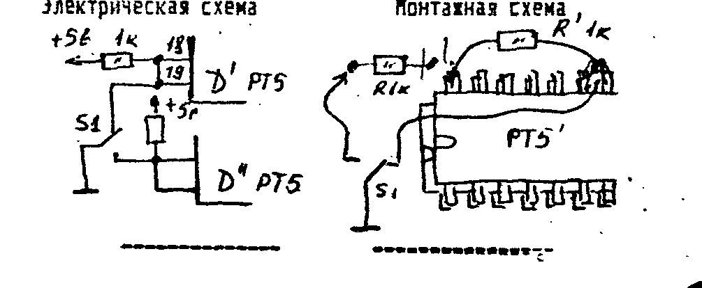
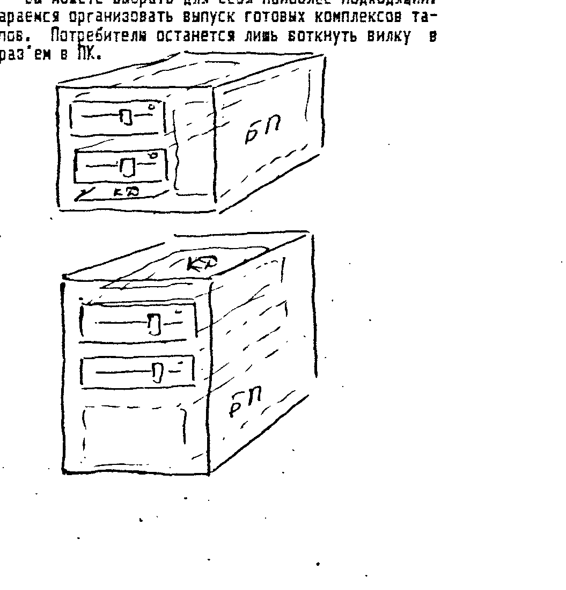
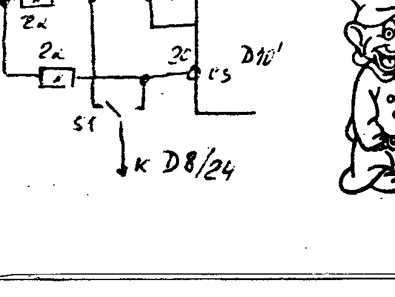

ИНФОРМ-БЮЛЛЕТЕНЬ ФИРМЫ «COMAN», Москва, тел. (095) 195-3833.
Москва, Хорошевское ш. д 43-б кв 61; 111402 Москва а/я 20.

## Экспресс-информация

В связи с очередным повышением тарифов на почтовые услуги, при расчете стоимости заказа, просим оплачивать 25 рублей за пересылку бандероли.

Мы работаем по следующему графику: понедельник, среда, четверг — с 8-00 до 19-00; вторник, пятница, суббота — с 15-00 до 19-00.
Звонить по телефону в это же время.

ВНИМАНИЕ тех, кто приобрел или сам собрал контроллер дисковода (см. схему в COMAN-2).
В схеме емкость конденсатора, подключенного к выводу 8 м/с Д5 (555ЛА1) указана 1000 пф.
Надо — 100 пф.

## CP/M 53 для ПК «Вектор»

Разработана улучшенная версия CP/M для ПК «Вектор» — CP/M 53.

Преимущества: размер ОЗУ пользователя — 53 Кб., полная совместимость с предыдущей версией, улучшенный сервер пользователя («затыкание» таймера при загрузке от ПЗУ, возможность работы с такими программами, как DBASE, «C», PL-1, ФОРТРАН и пр.).

Новым покупателям системная дискета с CP/M-53 высылается автоматически.
Те, кто приобрел ранее CP/M-34, могут приобрести новую версию, выслав 100 рублей по адресу:

> 111402 Москва а/я 20 Тимошенко К.А. с пометкой «Сист. диск для Вектора».

Никаких доработок в контроллере не требуется.
Вам достаточно сгенерировать новую систему на дискету с предыдущей версией и заменить утилиты ввода/вывода в формате ROM.
Они поставляются на системной дискете.

Приводим текст магнитофонного загрузчика системы CP/M-53.

```
100  00 00 00 F3 3E 01 D3 04 3E C3 32 38 00 21 76 DD
     22 39 C0 31 80 00 CD 58 01 3E 28 32 F8 01 3E 01
     32 FC 01 21 00 B8 22 FD 01 CD 7A 01 2A FD 01 11
     00 01 19 22 FD 01 21 F8 01 35 CA 00 CE 3A FC 01
     3C 32 FC 01 FE 11 DA 29 01 21 FB 01 34 3E 01 32
     FC 01 CD B9 01 C3 29 01 AF 32 FB 01 D3 1E 3E 1C
     D3 1E 3E D8 D3 FE DB FE 1F DA 66 01 3E 08 D3 FE
     CD EA 01 11 98 3A CD E3 01 C9 3E 0F 32 FA 01 F3
     11 9E 01 2A FD 01 EB 3A FC 01 D3 BE 0E C0 3A F7
     01 B7 C2 9A 01 3E 82 C3 9C 01 3E 8A D3 FE DB 1E
     A1 CA 9E 01 DB 9E FA AC 01 12 13 E9 DB FE E6 1C
     C8 21 FA 01 35 C2 7F 01 C9 3A FB 01 B7 1F 32 F9
     01 3E 00 17 32 F7 01 B7 CA D2 01 3E 0C D3 1E C3
     D6 01 3E 1C D3 1E 3A F9 01 D3 9E 3E 18 D3 FE CD
     EA 01 C9 7A B3 C8 1B C3 E3 01 DB FE 17 DA EA 01
     BD FE 1F DA F0 01 C9 00 2D CA D2 0F 32 FA 01 F3
```

Набор, как догадались, в Мониторе-Отладчике, с адреса 100H, вывод в формате ROM командой `#O>1,1,0`.

Но те, кто хочет вообще порвать с магнитофонным прошлым, могут приобрести ПЗУ с загрузчиком CP/M.
Его цена с пересылкой — 75 рублей.
На переводе не забудьте сделать пометку «за ПЗУ».

Устанавливается новое ПЗУ «верхом» на старое, но с максимальным зазором (поскольку нагревается очень).
Все ножки м/с припаиваются к штатной: 1-я к 1-й, 2-я ко 2-й и т.д. кроме 18 и 19.
Эти ножки об'единяются и подтягиваются резистором 1 кОм на 24-ю ножку (+5В).
Затем следует установить микропереключатель и распаять 3 провода согласно схеме.
Если операция прошла успешно, то теперь в одном положении переключателя работает загрузчик ROM, в другом — дисковый загрузчик.



## Отладка и настройка контроллера дисковода

(суровое, но необходимое продолжение, начало в COMAN-3)

Надо отметить, что мы, производя контроллеры в полукустарных условиях, стараемся настроить их максимально тщательно.
Однако, потребитель, приобретая контроллер, эксплуатирует его в условиях, отличных от тех, в которых он настраивался.

Вообще говоря, когда речь идет о настройке КД, следует иметь в виду, что настраивается комплекс из компьютера, КД, блока питания КД и дисковода и самого дисковода.
Наша задача сделать так, что бы КД «не ссорился» со всеми остальными.
Если вы собираете КД сами, «с нуля», то многие нюансы настройки вы учитываете при его первичной отладке.
Если же вы приобретаете готовый, с клятвенными заверениями фирмы о том, что он настроен и «идет с пол-тыка», а придя домой вы обнаруживаете, что он не очень «идет», настроение у вас, скажем мягко, немного портится, и вы поминаете нас «тихим ласковым» словом.
Хорошо если вы недалеко, приехали, поменяли, приехали, поменяли и т.д. до тех пор, пока случайно не наткнулись на тот, что вам нужен.
А если далеко?
Тогда попробуйте провести отладку сами.
Но рекомендации действительны только тогда, когда вы уверены, что все остальные компоненты комплекса работоспособны.
Особенно дисковод и блок питания.

Если ОС не загружается, проверьте, очень тщательно, нет ли ошибок в тексте загрузчика, который вы набрали.
Нет?
Отлично!
Далее, посмотрите, установлен ли конденсатор емкостью 1000 пф на выводе 11 м/с Д5 (555ЛА1).
Он не обязателен, и устанавливается в процессе настройки.
Если его нет, попробуйте его установить, варьируя емкость от 500 до 3000 пф.

Если это не помогает, то попробуйте «разнести» землю на раз'еме, который подключается к ПК.
На «Векторе» земля выведена на несколько выводов.
Постарайтесь подключиться к каждому из них, равномерно распределив земляные провода.
Если есть такая возможность, постарайтесь укоротить системную шину КД до минимума (20-30 см или меньше).
Радикальным средством может также стать установка резисторов 50-75 Ом, включенных в разрыв шины данных на одном из концов кабеля (всего 8 шт.).
К положительным результатам может привести и замена м/с 555ЛН2 на м/с 155ЛН2.
Но это уже крайний случай.

Данные меры могут вдохнуть жизнь в самый «дохлый» КД.
После успешной загрузки ОС запустите программу FORMAT и заменив дискету на чистую и заведомо хорошую, проведите пробное форматирование.
Если оно прошло успешно, можете считать, что вы победили этот контроллер.

Мы приводим несколько вариантов компоновки дисковода, БП, и КД.
Вы можете выбрать для себя наиболее подходящий.
Мы же постараемся организовать выпуск готовых комплексов таких же типов.
Потребителю останется лишь воткнуть вилку в розетку и раз'ем в ПК.



Приносим извинения за качество эскизов.

## ПК «Львов» — с дисководом

Из прошлого номера вы знаете, что к ПК «Львов» удалось подключить дисковод и адаптировать CP/M.
Расскажем, как это сделать.

Прежде всего, надо немного упростить сам контроллер, а именно исключить инверсию сигнала на элементах 13,12/Д6 и 4,5,6/Д2.
Для этого необходимо перерезать дорожки на плате возле выходов 12/Д6 и 6/Д2 и соединить эти дорожки с входами этих инверторов — 13/Д6 и 4,5/Д2 соответственно.

Кроме этого необходимо распаять системную шину контроллера на раз'ем «Внеш. 1» комп'ютера.
Внимание, назначение сигналов указано для КД, а не для «Львова», не путайте, т.к. они не совпадают.

| Сигнал КД | Номер конт. «Внеш. 1» |
| --- | --- |
| ЧТВВ | 3 |
| ЗПВВ | 55 |
| A0 | 25 |
| A1 | 31 |
| A2 | 52 |
| A3 | 54 |
| A4 | 56 |
| A5 | 19 |
| A6 | 17 |
| A7 | 23 |
| Д0 | 43 |
| Д1 | 39 |
| Д2 | 35 |
| Д3 | 33 |
| Д4 | 37 |
| Д5 | 41 |
| Д6 | 45 |
| Д7 | 47 |
| Общий ВВ | 18 |

Все вышесказанное относится к тем, кто собирает контроллер самостоятельно.
Если же вы приобретаете готовый, то на нем уже проведены необходимые доработки.

Так же как и в «Векторе», для первоначальной активизации CP/M, вам необходим начальный загрузчик.
Его можно разместить либо в ПЗУ, либо загружать с магнитофона.
Текст магнитофонного загрузчика можно набрать в мониторе и вывести на ленту как программу.
Затем, перед работой с дисководом, загружать ее командой `BLOAD"",R`.
Текст загрузчика:

```
3000  31 00 00 CD 45 30 3E 1F 32 DD 30 3E 01 32 E1 30
3010  21 00 90 22 DB 30 CD 69 30 2A DB 30 11 00 01 19
3020  22 DB 30 21 DD 30 35 CA 00 A6 3A E1 30 3C 32 E1
3030  30 FE 0A DA 16 30 21 DF 30 34 3E 01 32 E1 30 CD
3040  9D 30 C3 16 30 AF 32 DF 30 32 DE 30 D3 E4 3E 5C
3050  D3 E4 3E D8 D3 E0 DB E0 1F DA 56 30 3E 08 D3 E0
3060  CD C7 30 11 58 1B C3 D4 30 11 87 30 2A DB 30 EB
3070  3A E1 30 D3 E2 DE C0 3A DE 30 B7 C2 83 30 3E 82
3080  C3 85 30 3E 8A D3 E0 DB E4 A1 CA 87 30 DB E3 FA
3090  95 30 12 13 E9 DB E0 E6 1C C8 C3 69 30 3A DF 30
30A0  B7 1F 32 E0 30 3E D0 17 32 DE 30 B7 CA B6 30 3E
30B0  4C D3 E4 C3 BA 30 3E 5C D3 E4 3A E0 30 D3 E3 3E
30C0  1C D3 E0 3D C2 C3 30 DB E0 17 DA C7 30 DB E0 1F
30D0  DA CD 30 C9 7A B3 C8 1B C3 D4 30 54 54 00 00 00
```

Но удобнее, конечно, работать с микросхемой.
Как вы знаете, подключить ее можно двумя способами.

1. Вынуть из панельки ПЗУ (Д10) и вставить новую. В этом случае при нажатии `<СБР>` будет загружаться ОС с дискеты. Но при этом вы расстаетесь с Бейсиком «Львова». Что бы этого не произошло, необходимо перед заменой ПЗУ вывести Бейсик на магнитную ленту командой `BSAVE"BASIC"0000,3000`. Затем, загрузив его в монитор и немного доработав, можно разместить его на диске и загружать с диска, а не из ПЗУ. Правда работать этот Бейсик будет по прежнему только с магнитофоном. Для работы с диском вы сможете приобрести другой Бейсик. Но он не «игрушечный», а инженерный, работает только с псевдографикой.
2. Можно и не удалять ПЗУ, а распаять их вместе (но так, что бы входили в панель), и выбор ПЗУ осуществлять переключателем. Смотри электрическую схему.

Стоимость ПЗУ с загрузчиком (с пересылкой) — 125 руб.



## Тестирование ОЗУ в ПК «Львов»

Имеющиеся в ПК «Львов» встроенные подпрограммы, позволяют в случае возникновения какой либо неисправности в ПК, произвести проверку его работоспособности, в частности, провести тест ОЗУ (см. руководство по эксплуатации п 6.1.6.).
Но этот тест не позволяет определить дефективную микросхему.
Да и эффективность самого теста во многом оставляет желать лучшего.
Поиск неисправной микросхемы при помощи тестера или, в лучшем случае, осциллографа, особенно если м/с не сгорела, а лишь «сбоит» в некоторых ячейках, дело, как говорят, для настоящих мужчин.

Нашей фирмой разработана и опробована эффективная ТЕСТ-программа, позволяющая быстро обнаружить дефектную м/схему ОЗУ.
В качестве исходного алгоритма выбран линейный тест «МАРШ».
Его достоинство — небольшое время контроля и эффективность обнаружения характерных неисправностей ОЗУ (отсутствие записи, ложная запись и т.д.).
Коды предлагаемой программы приведены в таблице.
Сама программа должна быть записана в ППЗУ типа 573РФ2 или аналогичной.
ТЕСТ-МИКРОСХЕМА перед началом тестирования устанавливается в колодку на печатной плате ПК, вместо м/с Д10.
Контроль ОЗУ начинается сразу после включения питания комп'ютера и продолжается около 20 секунд.
Если контроль завершился успешно и дефективных ячеек ОЗУ не обнаружено, выдается музыкальный сигнал.
При обнаружении дефекта раздается сигнал низкого тона и на контактах 25, 27, 29, 31, 33, 35, 37, 39 раз'ема X2 (PA7, PA6, ...,PA0, см. электрическую схему ПК), будут установлены высокие уровни напряжения («1»), что позволяет определить конкретную дефектную м/схему.
Например, если неисправна Д19, подключенная к разряду «0» шины данных, то лог. единица будет установлена на контакте 39 (PA0) X2, если неисправна Д22 (шина данных 3), то на 33 (PA 3).
На остальных контактах будет «0».
Дефектных м/схем может быть несколько, поэтому следует проверить все контакты.

Эффективность ТЕСТ-программы проверена на практике, при ремонте нескольких ПК «Львов».
Причем отмечены случаи, когда встроенные тест-программы «Львова» не отмечали дефектов, а данная программа выявляла их с первого захода.

Текст ТЕСТ-программы:

```
0000  C3 03 C0 D3 B0 3E 88 D3 C3 3E 8A D3 D3 3E 02 D3
0010  C2 3E 8F D3 C1 AF D3 C0 21 00 00 3E 55 77 AE C2
0020  33 C1 3E AA 77 AE C2 33 C1 01 00 02 11 FF BF 21
0030  00 00 71 7D BB C2 3A C0 7C BA 23 C2 32 C0 21 00
0040  00 79 AE C2 33 C1 79 2F 77 7D BB C2 50 C0 7C BA
0050  23 C2 41 C0 21 00 00 79 2F AE C2 33 C1 71 7D BB
0060  C2 65 C0 7C B4 23 C2 57 C0 2B 79 AE C2 33 C1 79
0070  2F 77 7D B4 C2 69 C0 62 6B 23 2B 79 2F AE C2 33
0080  C1 71 7D B4 C2 7A C0 0E FF 05 C2 2C C0 3E FD D3
0090  C2 01 00 02 11 FF 7F 21 00 40 71 7D BB C2 A2 C0
00A0  7C BA 23 C2 9A C0 21 00 40 79 AE C2 33 C1 79 2F
00B0  77 7D BB C2 B8 C0 7C BA 23 C2 A9 C0 21 00 40 79
00C0  2F AE C2 33 C1 71 7D BB C2 CD C0 7C BA 23 C2 BF
00D0  C0 2B 79 AE C2 33 C1 79 2F 77 7D B7 C2 D1 C0 7C
00E0  FE 40 C2 D1 C0 62 6B 23 2B 79 2F AE C2 33 C1 71
00F0  7D B7 C2 E8 C0 7C FE 40 C2 E8 C0 0E FF 05 C2 94
0100  C0 79 D3 C2 31 00 BF 01 1E C1 0A FE 01 CA 1D C1
0110  6F 03 0A 57 03 C5 CD 1E F8 C1 C3 0A C1 76 26 28
0120  00 14 26 28 22 3C 00 14 26 3C 00 14 1D 3C 00 14
0130  1E 78 01 D3 C0 21 7B 00 11 FF FF 44 4D 3E FF D3
0140  C2 1B 7A B3 CA 1D C1 0B 78 B1 C2 41 C1 3E FE D3
0150  C2 44 4D 1B 7A B3 CA 1D C1 0B 78 B1 C2 53 C1 C3
0160  3D C1
```

Если у вас нет своей микросхемы, или вам не на чем ее «прошить», обращайтесь в «COMAN»! (150 руб.)
Схема программатора ППЗУ — в следующем номере!

А вы знаете, что в Бейсике «Львова» есть оператор «BAUD», позволяющий изменять скорость вывода на МЛ.
Если задать `BAUD 0`, то скорость будет стандартная, а `BAUD 1` увеличивает ее в 2 раза!
При приеме программы ничего менять не надо, ПК сам настроится на нужную скорость.

## Об'являем конкурс

На разработку эмблемы фирмы «COMAN».
Эмблема должна быть несложной в повторении, желательно одноцветной, легко узнаваемой, оригинальной (без плагиата известных фирм), отражающей основное направление деятельности фирмы — комп'ютеры и все, что с ними связано, либо стиль эмблемы (товарного знака) должен навевать мысли о комп'ютерах.

На девиз фирмы, так же отражающий направление работы фирмы.
Девиз д.б. в одно предложение, легко запоминающимся, из тех, что всегда сидят в голове (можно с юмором), типа «МММ — нет проблем» и т.д.

Премии — по 1000 рублей.

## Работаем с дисководом в CP/M

У вас есть дисковод, контроллер, блок питания, системная дискета и вроде бы это все работает, выводя на экран загадочные буковки и значки.
Что делать дальше?

После появления на экране промпта (есть такое слово) в виде «A>», ОС ждет от вас какой либо команды.
Это может быть либо встроенная команда CP/M, либо утилита (т.е. системная программа, использующая CP/M как основу), либо имя командного файла.

К встроенным командам относятся:

**DIR** — директорий диска.
После набора и нажатия `<ВК>` на экран выводятся имена всех файлов, размещенных на этом диске и их расширения (.COM, .TXT и т.д.).
Это самая часто используемая команда.

**REN** — команда переименования файла.
Формат следующий: `A>REN НОВОЕ.XXX=СТАРОЕ.XXX <ВК>`, после чего старому файлу будет присвоено новое имя.
Это позволит вам присваивать имена по определенному признаку, что в последствии может быть полезно для сортировки.

**ERA** — команда уничтожения файла на диске.
Формат: `A>ERA PROBA.TXT`, после нажатия `<ВК>` файл PROBA.TXT будет уничтожен.
Используется для удаления «мусора» с диска.

**TYPE** — команда просмотра на экране содержимого файлов, обычно текстовых.
Приостановить вывод можно нажатием на клавиши `<УС>+<C>`, возобновить — `<УС>+<Я>`.
Нажатие других клавиш приводит к прерыванию программы и выходу в ОС.

Существует еще ряд встроенных команд, но они очень специфичны и о них как нибудь позже.

**КОМАНДНЫЕ ФАЙЛЫ** — это исполняемые файлы в машинных кодах с расширением .COM.
Для того, чтобы запустить этот файл в работу, достаточно указать его имя и нажать `<ВК>`.
ОС считает этот файл с диска и передаст ему управление.
Все игры в кодах, которые вы загрузите с МЛ или приобретете — это командные файлы.
Но вернемся к утилитам.

К основным утилитам, без которых и с дисководом не жизнь, относятся:

**FORMAT** — утилита форматирования новых (или почти новых) дискет.
При форматировании уничтожается вся информация на диске, проводится разметка диска, после чего он готов к работе.
На «Векторе» следует выбирать формат 256 байт/сектор, на «Львове» уже и без вас все выбрано.
Следует быть внимательным, и вовремя сменить дискету, что бы не отформатировать дискету, с которой вы загрузили саму программу форматирования.

**SYSGEN** или **SYS** — программы генерирования ОС на дискету.
Для удобства, что бы можно было загружаться с каждой дискеты, а не только с системной, на диск «генерят» ОС.
Причем не обязательно на только что отформатированную.
Можно записать ОС и на диск с записью.
После запуска программы вам будет предложено сменить дискету и по нажатию клавиши произойдет запись ОС на первые дорожки диска.

**DIP** и **PIP** — утилиты копирования файлов с дискеты на дискету.
При работе с дисководом всегда полезно иметь дубль дискеты (не вторую копию на этой же дискете под другим именем, а именно на другой дискете).
Программа DIP позволяет производить копирование файлов на одном или двух дисководах.
Для осуществления копирования необходимо дать команду:

```
A>DIP A:=A:NAME.XXX
```

Это значит, что копирование будет производиться с дисковода A на дисковод A и после считывания файла, вам надо будет заменить дискету в дисководе, после чего на нее осуществится запись.
При копировании на 2-х дисководах, например с A на B команда будет выглядеть так: `A>DIP B:=A:NAME.XXX`.

При копировании можно задать проверку записи и сравнение ее с исходным файлом.
Это делается при помощи параметра [V].
А копирование группы файлов, можно заменять общий признак значком «*», например:

```
A>DIP B:=A:*.COM[V]
```

означает, что будут копироваться все файлы с расширением COM с диска A на диск B, с проверкой.

Утилита PIP работает аналогично, но только копирует на двух дисководах.

Перед запуском утилит копирования, полезно перезапустить систему, иначе возможны всевозможные недоразумения.
Утилиты копирования позволяют проделывать различные «финты», но рассказ об этом позже.

Программы приема и записи на диск информации с магнитной ленты нельзя в полной мере назвать утилитами, т.к. они работают только с нашей версией CP/M (вернее, проверялись).
Поэтому остановимся на них подробнее, заодно рассмотрим процесс адаптации программ с МЛ на диск.

В операционной системе CP/M действует железное правило.
ВСЕ ПРОГРАММЫ ДОЛЖНЫ:

1. РАСПОЛАГАТЬСЯ С АДРЕСА 100H;
2. ИМЕТЬ ТОЧКУ СТАРТА В НАЧАЛЕ.

Если программа отвечает этим требованиям, то процесс переноса ее с МЛ на диск занимает ровно столько времени, сколько требуется для ее загрузки с магнитофона.
Разумеется речь идет о незащищенной программе.

На «Векторе» для этой цели служит программа «ROM153.COM».
Для ее запуска и записи на диск принимаемого файла в формате ROM следует набрать команду:

```
A>ROM153 NAME.COM
```

где под NAME подразумевается имя, под которым вы хотите разместить принимаемую программу.
После нажатия `<ВК>` дисковод немного пожужжит, а ПК коротким звуком возвестит о своей готовности принять преамбулу формата ROM и программу.
При успешной загрузке на экране появится надпись о том, что записана такая-то программа и расположена она в таких-то адресах.
Принятую программу можно сразу запустить, что бы удостовериться в ее работоспособности.

На «Львове» для аналогичной задачи существует «TAPEIN».
Пользуются ею следующим образом.
Запустив эту программу из системы, следует ответить на вопрос, под каким именем вы хотите разместить ее на диске.
Затем следует ввести имя принимаемого файла, либо просто нажать `<ВК>`, для приема первого встретившегося файла (в кодах), и включить магнитофон.
После приема, ПК сообщит о контрольной сумме и если она вас устраивает, нажмите `<Y>` для размещения файла на диске.
Если же она отличается от расчетной, следует повторить ввод, нажав перед этим `<N>`.

НАПОМНИМ, что речь идет о программах, которые отвечают вышеупомянутым требованиям.
Как быть, если программа «не того»?
Спокойно!
Читайте дальше!

К счастью, подавляющее большинство программ для «Вектора» именно так и построено, с адреса 100H и стартом в начале.
И тут, как говорят, NO PROBLEM.
Но также существует немного программ, начинающихся с 0-го блока.
Конечно, они загружаются, но они не работают после загрузки.
Есть три пути решения задачи:

1. Пропустить эту программу через «Архиватор» (если у вас ее нет, вы можете купить ее у нас). Архиватор ее упакует и сделает с сотого адреса. Но тут вас подстерегает другая опасность — при запуске ее с диска время распаковки достаточно велико (от 10 сек. до 1-2 мин.).
2. Загрузив эту программу в Монитор-Монстр со смещением, дописать к ней короткую программку, которая после запуска разместит основную программу в нужных адресах и передаст ей управление.
3. Купить у нас готовую дисковую копию программы. Причем, если вы уже покупали ее у нас в магнитофонной версии, то она обойдется вам всего за полцены.

Труднее дело обстоит (как всегда) с ПК «Львов».
В связи с его «оригинальной» архитектурой, ВСЕ программы располагаются и имеют точку старта где угодно, кроме адреса 100H.
Но дело поправимое.
Архиватора на «Львове» пока нет, поэтому остается только два выхода: 1) купить у нас готовую дисковую копию (условия см. выше) или 2) самому доработать программу (если она не защищена) в соответствии с нижеизлагаемой методикой.

Загрузив программу в какой-либо Монитор или АРС, необходимо опуститься на 16 байт ниже и набрать следующую программу в кодах:

```
21 xx xx E5 21 xx xx 11 10 01 01 xx xx C3 1F E1
   |________|    |________|       |________|
   точка старта  реальный адрес   об'ем прогр.
   программы     начала программы в байтах
                                  (16-ти ричн.)
```

После доработки надо выгрузить программу на МЛ с любой точкой старта (ОС ее все равно проигнорирует).
На диск эта программа загружается TAPEIN по известной методике и становится работоспособной (с диска).

Когда делаете копии программы на диске, постарайтесь сразу скопировать ее на запасной диск.
Вообще, перед работой полезно сделать копию всего диска, особенно если вы собираетесь не играть, а именно работать.

В процессе рассказа о CP/M мы будем упоминать те или иные утилиты.
Если их у вас нет, вы можете приобрести их у нас.
Список утилит будет опубликован в следующем номере, с указанием цен.
Постараемся выпустить его поскорее.

Если у вас подключен к ПК принтер (любого типа), просим прислать нам распайку кабеля, т.к. имеем очень много запросов, но не имеем принтеров данных типов.
Делитесь опытом!

## Хочу программ!


После проведенного нами опроса по поводу защиты программ, можно сделать кое какие выводы.
Как и ожидалось, отвечавшие разделились на две большие группы.
Одни предпочитают покупать программы без защиты чуть дороже, другие — с защитой, но дешевле.
Удручает тот факт, что довольно много корреспондентов отметило, что лучше всего, когда новые программы достаются бесплатно.
Оно и понятно, от Совка мы недалеко ушли, лучше украсть, чем задешево купить.

Желая угодить и тем и этим, мы решили новые программы выпускать в двух вариантах: с защитой и без нее, или продавать ГЕНЕРАТОР программы, т.е. спец. программу, которая генерирует ЗАЩИЩЕННУЮ программу.

Хотим отметить, что предыдущая защита — это не защита, а баловство.
Кроме того, существует несколько радикальных методов защиты, дающих высокий эффект.

Все эти меры, как понимаете, являются вынужденными.
Пиратство на «Векторе» и «Львове» начинает приобретать угрожающие размеры.
Если так пойдет дальше, то коммерческое программирование на этих ПК потеряет всякий смысл.
Единственное, чего добьются пираты, так это того, что новые программы будут появляться все реже и реже, а цена их будет все выше и выше.
К кооп. «Электрон» она, например, около 100-120 руб. за программу.

Аргументы в пользу «Спектрума», по поводу того, что пиратство там норма жизни, не имеют под собой никаких оснований, поскольку 99,9% программы — западные, и деньги за эти программы авторы получили не у нас, а ТАМ.
А «Вектор» и «Львов» одинокие, совковые ПК, и Запад для нас программы писать не будет на эти компьютеры.
Поэтому покупая программы у пиратов, знайте, что вы наносите вред не только фирме-производителю, но и себе.

Некоторые скажут, сами-то хороши, в каталоге полно чужих игр.
Во-первых, не так уж и полно, во вторых, мы начинаем продавать эти игры только через год, после того, как они «вышли», давая фирмам заработать.
В третьих, не мы это начали.
Те кто помнит наш самый первый каталог, видели, что там нет ни одной чужой игры.
Немного времени прошло и нам стали предлагать наши-же игры.
Причем не одиночки, а «фирмы».
Поэтому мы и идем на такие меры с целью компенсации потерь.

Пользуясь случаем, хотим предложить различным организациям, промышляющим подобным бизнесом, а они наверняка читают этот бюллетень, следующее.

**ДАВАЙТЕ ПРЕКРАТИМ НАНОСИТЬ ВРЕД ДРУГ ДРУГУ!**

Начиная с текущего состояния (например с 1.01.93) заморозим свои каталоги и будем пополнять их только за счет собственных разработок.
Если государство (или государства) не защищают наших интересов, давайте защищать их сами.
Нет ничего проще, чем выявить пиратские каналы распространения программ, достаточно скрыто нумеровать копии и изредка производить контрольные покупки у пиратов.
А затем просто перестать продавать программы в те регионы, где пиратство особо в ходу.

Можете считать это официальным предложением по поводу создания Лиги Производителей Программных Продуктов (ЛППП, не путать с МММ).
Авторов так же просим откликнуться.

ЖДЕМ ВАШЕЙ РЕАКЦИИ, ГОСПОДА!

Многие так же спрашивают, на каких условиях наша фирма сотрудничает с авторами программ.
Отвечаем.
Мы сотрудничаем только со штатными авторами, т.е. теми, кто пишет только для нас и за нормальные деньги.
Тех, кто хочет продать нам свою программу в кодах или на Бейсике просим написать нам, а лучше выслать рекламную версию своей программы для оценки сюжета и графики.
Но напоминаем, что мы принимаем программы только на условиях эксклюзивного тиражирования.
Если вы продали свою программу в какую либо фирму или поделились с другом и не можете за него поручиться, то не стоит беспокоиться.
После покупки, программа некоторое время «вылеживается» и появление ее или ее модификации на рынке раньше, чем мы начинаем ее продавать, автоматически освобождает нас от уплаты гонорара, согласно одного из пунктов контракта.
На вопрос, а нет ли нам резона самим устроить небольшую утечку, что бы не платить гонорар, можем заверить, что нет такого резона.
Прибыль от продажи программы больше, чем «с'экономленный» гонорар, а выплаченный вовремя и полностью, он стимулирует автора на новые свершения.

> Бюллетень «COMAN-INFO» фирмы «COMAN».
> Цена 10 руб.
> 111402 Москва а/я 20, тел. (095) 195-38-33 (подписная).

## Хит-парад

| № | Львов | Вектор |
| --- | --- | --- |
| 1 | АРКАНОИД (41) | DOWN TO EARTH (39) |
| 2 | БУРЯ В ПУСТЫНЕ (32) | БОЛДЕР (35) |
| 3 | СУПЕРЛАБИРИНТ (30) | ПЛАНЕТА ПТИЦ (23) |
| 4 | ТЕТРИС (15) | АДСКОК (17) |
| 5 | POOL (13) | COOCIE (15) |

Владельцы других типов ПК проявляют безобразную пассивность.
Кому хуже?
Число материалов по тому или иному типу прямо пропорционально числу полученных писем.

## Программы для ПК «Львов» (коды)

| Индекс | Название | Описание |
| --- | --- | --- |
| C74 | CAVE /8600A/ | Путешествие по пещере с приключениями. Без защиты. (20 руб.) |
| C75 | МЯЧИК /C0200 + 3856/ | Управляя забавным мячиком в сложном лабиринте, надо добиться успеха. Без защиты. (20 руб.) |

ВНИМАНИЕ ВСЕХ ЗАИНТЕРЕСОВАННЫХ.
МЫ ПРОДАЕМ ГЕНЕРАТОРЫ ЗАЩИЩЕННЫХ ПРОГРАММ, либо НЕЗАЩИЩЕННЫЕ ПРОГРАММЫ (с C1 по C73) по цене 10-ти копий программы.
Например, программа C36 Суперлабиринт, цена 10 руб.
Генератор программы будет стоить 10 x 10 = 100 руб.
Одновременно с покупкой генератора вам высылается лицензия от фирмы изготовителя на право тиражирования данной программы.

## Программы для ПК «Вектор» (ROM)

| Индекс | Название | Описание |
| --- | --- | --- |
| 1-92 | ТЕТРИС-О | 3-х мерный тетрис, вид стакана сверху. Без защиты. (20 руб.) |
| 1-93 | COOCIE | Повар должен загнать продукты в кастрюлю, а мусор — в мусорный бак. Без защиты. (20 руб.) |
| 1-94 | POLYGAME | Здесь вам предлагают целое меню игр. Среди них ТЕТРИС, ПЕНТИКС, COLUMNS, ТЕТРИС с постоянно мешающей козявкой, и оригинальный ТЕТРИС ТЕТ-А-ТЕТ, т.е. для двоих. На экране два стакана, и если одному из игроков удается заполнить сразу две строки, то у другого на две строки прибавляется завалов. Во всех тетрисах можно задавать начальные завалы. Без защиты. (30 руб.) |
| 1-95 | DOWN TO EARTH | Необходимо очистить от мусора планеты. Сюжет напоминающий БОЛДЕР. Без защиты. (20 руб.) |
| 1-96 | SHOP TOUR | Те, кому понравилась «Формула 1», могут прикупить своеобразное развитие этой игры. Правда тут вам предстоит не просто гонять на машине, а еще и заниматься торговлей, покупая товары в одних городах и продавая в других. Таким образом вы зарабатываете на бензин и на жизнь. Биржевые сводки вы можете получить нажав `<пробел>`. Им же вы можете остановить машину возле биржи. Осуществить куплю-продажу можно при помощи `<СС>` и `<стрелки>`, разворот выполняется `<ноже>`. Постарайтесь найти средство против конкурентов, они здорово сбивают цены на товары. С защитой — 50 руб. Без защиты — 300 руб. |

## Изменение цен

Заканчивается ВСЕ, даже дешевая бумага, дешевые кассеты и дискеты и дешевые полиграфические услуги.

Начиная с номера 6 нашего бюллетеня, он будет стоить ДЕСЯТЬ РУБЛЕЙ по подписке.
Как мы и говорили, тем, кто подписался на много, беспокоиться нечего.
Но те, кто продлевает подписку или подписывается впервые, должны учесть, что первые 5-ть номеров стоят 6 руб., последующие — 10 руб.
Начиная с 01.12.92 г. расчет будет вестись именно по этим расценкам.

ВНИМАНИЕ ТЕХ, КТО ВЫСЛАЛ ДЕНЬГИ на кассеты, дискеты и прочее по ценам августа.
Не будьте наивными и не считайте наивными нас.
С тех пор доллар вырос в 2,5-3 раза.
Соответственно выросли цены на импортные товары.
Так например, на 01.12.92 цены следующие:

| Товар | Цена |
| --- | --- |
| C-90 (MAXWELL) | 120 руб. |
| C-90 (SONY) | 500 руб. |
| Дискета 3M (USA) | 120 руб. |
| ИЗОТ (DS/QD) | 40-50 руб. |
| МК-60-5 | 80 руб. |

Просим не считать эти цены продажными, т.к. они постоянно изменяются.
При заказе просим учитывать возможное повышение.
Если такового не случилось, сдача будет возвращена.
Поэтому выславшим деньги они либо будут возвращены, либо выслан заказанный товар, но в пропорции к оплате.

Претензии — к правительству, проводящему политику избиения рубля и играющему на понижение.
