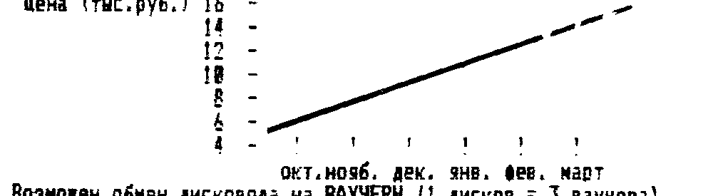
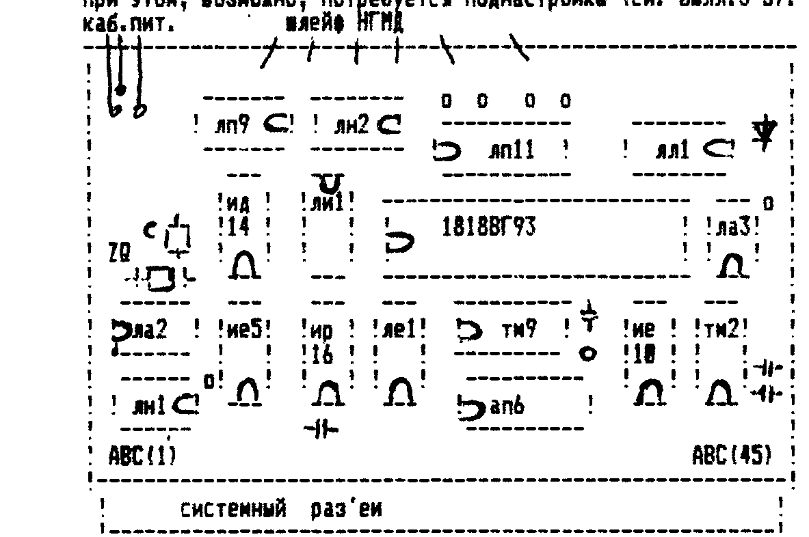
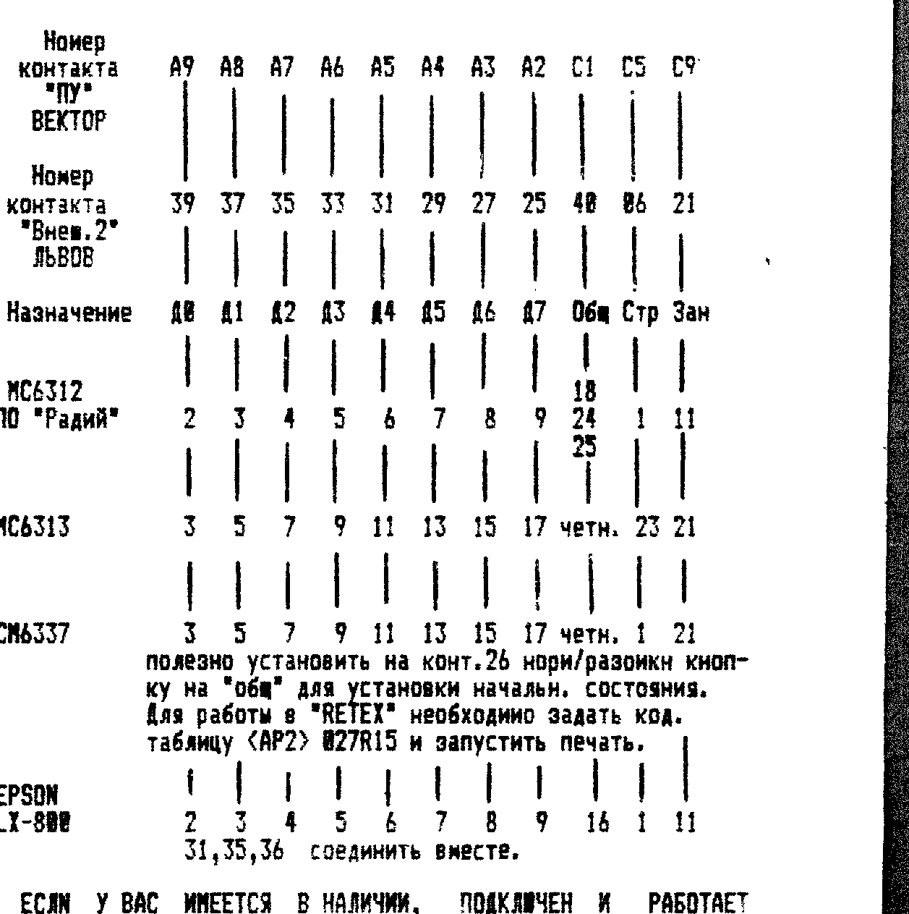

Инфо-бюллетень фирмы COMAN, 111402 Москва а/я 20, т. 195-38-33.

## Срочно исправьте ошибки!

1. В тексте магнитофонного загрузчика CP/M-53 для ПК «Вектор»: по адресу 1F0 есть 8D, надо D8.
2. В тексте магнитофонного загрузчика CP/M-36 для ПК «Львов»: по адресу 3075 есть DE, надо 0E; по адресу 30A6 есть D0, надо 00.

С этими исправлениями оба загрузчика становятся полностью работоспособными.
Приносим извинения, если эти ошибки доставили вам хлопоты.

## Всегда в продаже

**КОНТРОЛЛЕРЫ ДИСКОВОДОВ** для ПК «Вектор» и «Львов».
Полностью отлаженные, укомплектованные кабелями, раз'емами и системной дискетой.
И всего за 3500 рублей.
ВОЗМОЖЕН ОБМЕН НА ВАУЧЕР (1 ВАУЧЕР — КОНТРОЛЛЕР плюс другой товар).
Для сравнения — цена КД к Спектруму (без кабелей) — 6000 руб.

**НАБОР «СДЕЛАЙ САМ» КОНТРОЛЛЕРА ДИСКОВОДА** — есть все, включая припой и подробную инструкцию.
Цена — 3000 руб. с пересылкой.

**ДИСКЕТЫ 5'25" DS/QD** (две стороны, четверная плотность).
Дискеты сертифицированы (проверены на качество), срок хранения информации — 10 лет.
При входном контроле было проверено 300 дискет.
Процент брака — 0 % (даром, что «ИЗОТ»).
Дискеты продаются упаковками по 10 штук или больше.
Цена: в бумажной коробке — 550 руб.; в пластмассовой — 700.
При покупке 100 и более — скидка в цене 10 %.
Цены указаны с пересылкой.
Согласитесь, 6,4 Мегабайт (для «Вектора») или 3,6 Мегабайт (для «Львова») памяти и всего за пол-тысячи — это «ЗА ТАК».

**ДИСКОВОДЫ EC5323.01 или МС5313** (80 дорож., 2-х сторонние), абсолютно новые.
Заметим, что цена на дисководы постоянно меняется (обычно растет), поэтому при покупке следует позвонить нам и уточнить цену.
Оплату за дисковод производить только телеграфом (цены меняются очень быстро).
Для ориентировки приводим график изменения цен на дисководы с нашим прогнозом.



Возможен обмен дисковода на ВАУЧЕРЫ (1 дисков. = 3 ваучера).

**БЛОК ПИТАНИЯ** (+5В x 1,5А; +12В x 1,5А) (без корпуса).
Способен «кормить» 2 дисковода и контроллер.
Цена (с пересылкой) — 2500 руб.

**ВИДЕОМОНИТОР** черно/белый с бл. питания МС6105 (32 см.), повышенная разрешающая способность.
Тем, кто проводит за ПК много времени, этот монитор просто необходим, т.к. вреда от него намного меньше, чем от цветного.
А здоровье уже сейчас очень не дешево.
Цена — 14000 руб.
Ввиду хрупкости прибора и его габаритов, монитор по почте не высылается.
Приобрести его можно в нашем офисе.

**ПРИНТЕР МС6337** (интерфейс ИРПР-М).
Отличный профессиональный принтер формата А-3 (широкий) с игольчатой головкой.
Подключается к ПК без проблем.
Печатает на любой бумаге с высоким качеством.
Не требует капризных и требующих бережного обращения струйных головок.
Цена — 20000 руб.
Ввиду хрупкости прибора и его габаритов, принтер по почте не высылается.
Приобрести его можно в нашем офисе.

**ПОЛНЫЙ КОМПЛЕКТ**: Дисковод + Контроллер + Блок питания + Корпус + Сист. диск + ПЗУ.
Все это собрано и налажено.
Для «Вектора» или «Львова».
Вам остается только воткнуть раз'ем в компьютер и вилку в сетевую розетку (ну можете еще ПЗУ заменить для удобства).
Цена с пересылкой — 20000 руб.

Имеются в продаже принтеры термоструйные МС6312 и головки к ним.
Конечно, качество печати не такое как у профессиональных игольчатых или матричных, но и цена существенно ниже.
А для дома, для семьи обычно больше и не требуется.
Бесшумность работы, очень малые габариты — вот его главные достоинства.
Цена принтера — 15000 руб.
Головка — 600 руб.

Оказываем содействие в приобретении профессиональной вычтехники: компьютеров, факсов, ксероксов, и пр. и пр. и пр.

## Краткая инструкция к «Монитор+» (ПК «Львов»)

Редактирование ниже 2000 и выше 3000 заблокировано.
ВНИМАНИЕ! В области B000-B3FF расположен ЗНАКОГЕНЕРАТОР!

### Основной режим

После загрузки М переходит в основной режим — ДАМПОВОЕ РЕДАКТИРОВАНИЕ.
Одновременно на экран выводится 128 байт.
Начальный и конечный адрес выводимого дампа — слева вверху.
В верхней строке — подсказка, нижняя строка — служебная.
Активный формат выделен КРАСНЫМ цветом.
Смена формата — `<ВР>`+(`<-/->`).
Ввод нового значения заканчивается нажатием `<ВК>`.
`<ЗБ>` работает, `<F5>` — отмена.

### Функциональные клавиши

`<F0>` — ПОМОЩЬ.
Производится автотест МОНИТОРА, на экран выводятся правила управления курсором.

`<F1>` — ЧТЕНИЕ С МЛ.
Чтение может быть СО СМЕЩЕНИЕМ или ПО АДРЕСУ.
Введите новые значения, имя файла, или нажмите `<ЗБ>`, после чего включите магнитофон и нажмите `<ВК>`.
Ввод можно прервать нажатием клавиши «вниз» (принятая часть программы при этом сохраняется).
После считывания сообщается начальный и конечный адрес памяти, где РАЗМЕЩЕНА программа и контрольная сумма.
При нажатии `<ВК>` сообщается ИСТИННЫЕ начальный и конечный адрес и точка старта программы.
Принятая программа отмечается в памяти как БЛОК.

`<F2>` — ЗАПИСЬ НА МЛ.
Для записи будут затребованы все необходимые параметры, ввод которых заканчивается `<ВК>`.
При необходимости вывод можно повторить, еще раз нажав `<ВК>`.

`<F3>` — ОПЕРАЦИИ С БЛОКАМИ.
Для отметки блока, надо установить курсор на начало отмечаемой области и нажать `<ВК>`, затем в конец.
Блок выделяется красным цветом.
При заполнении блока курсор будет установлен в его начало и надо ввести байты заполнения.
Введите 1, 2, 3 ... N байт (через `<ВК>`), а затем еще раз нажмите `<ВК>`.

`<F4>` — МЕНЮ.
Представлены дополнительные функции для обработки информации: ГРАФИЧЕСКИЙ РЕДАКТОР, СКОРОСТЬ ЗАПИСИ НА МЛ, ВВОД С КЛАВИАТУРЫ в удобном формате, ПРОСМОТР ПАМЯТИ и СТАРТ ПРОГРАММЫ.

`<F5>` — ВЫХОД.
Отмена выполняемой функции или операции.

### Графический редактор

В граф. редакторе вверху — назначение функциональных клавиш, в центре — спрайт, внизу служебное окно и «линза».
Назначение клавиш относится к клавишам `<F1>`-`<F5>`.
Редактирование спрайта нажатием клавиш `<СТР>`, `<R>`, `<G>`, `<B>`.
Возврат измененного спрайта по нажатии `<ВК>`.
Ускоренное перемещение при помощи `<СУ>`+`<стрелки>` и `<НР>`+`<стрелки>`, а также режима «просмотр».

### Ввод информации

Позволяет оперативно переходить из одного формата в другой при вводе программы, текстовой информации и т.д.
Переключение производится нажатием клавиш `<F1>` — текст, `<F2>` — байты, `<F3>` — программа.

### Старт программы

Перед стартом программы будет запрошен адрес старта.
Кроме того, можно задать стандартные устройства ввода/вывода: KEY — ввод с клавиатуры F803, KY+ — ввод без отработки служебных клавиш (F806), STK — статус клавиатуры (F812), TTY — вывод символа на экран (F809), PRN — вывод символа на принтер (F80C), LST — символ на экран и на принтер (F80F).
По умолчанию будут заданы устройства, назначаемые по холодному старту.
Назначение своих устройств действует только для выполняемой программы, после завершения ее работы назначение отменяется.

Что бы система функционировала нормально, отлаживаемую программу следует заканчивать кодом C9H (RET).
При этом не следует переназначать стек.
Если выполнение программы завершено успешно, то прозвучит звуковой сигнал, после которого можно вернуться в основной режим нажатием `<ВК>`.

## Новая плата контроллера дисковода

Внимание!
Мы перетрассировали плату контроллера дисковода.
Желающие приобрести новый вариант могут выслать 370 руб. в наш адрес с пометкой «плата КД».

Приводится схема расположения деталей на новом варианте платы КД.
При установке КД в один корпус с БП и НГМД, вместо системного раз'ема распаивается кабель (до 50 см.).
При этом, возможно, потребуется поднастройка (см. билл. 3-5).



Обратите внимание на ключи м/с.
При сборке КД для Львова, все дорожки, ведущие к сист. раз'ему перерезаются, монтаж ведется тонким проводом в соответствии с таблицей соединений и принципиальной схемой (см. бюл. 2 и 5).

ВНИМАНИЕ, на плате есть ошибки:

1. Неверно растрассированы 8 и 10 ножки м/с ЛЕ1. Перед монтажом следует перерезать дорожки и поменять связи местами. Сделайте это обязательно, т.к. они проходят под м/с и после монтажа сделать это очень трудно.
2. Перед монтажом надо откусить у м/с ИЕ10 15-ю ножку (пусть знает!).
3. НЕ проложены связи ЧТВВ и ЗПВВ. После монтажа следует соединить проводами контакты AC35 раз'ема и 2-ю ножку ЛА3, а также AC37 с 1-й ножкой ЛА3.
4. (ЖЕЛАТЕЛЬНО, но необязательно) соединить «земляные» контакты раз'ема (AC1, AC11, AC20, AC45) с ближайшими «землями» контроллера (для Вектора).
5. Емкость, подключенную к 10-й ножке ЛЛ1 следует увеличить до 1000 пф, а емкость, подключенную к 11-й ножке ЛЛ1 удалить вообще.

Как показала практика настройки и работы, новый вариант платы гораздо быстрее настраивается и работает более устойчиво, ввиду отсутствия системного кабеля.
При монтаже на кабель (следует применять плоский, с чередованием через «землю») возможно потребуется более тонкая настройка.

Для подключения второго дисковода достаточно:

1. Проткнуть кабель, идущий к НГМД вторым раз'емом дисковода.
2. Установить на 2-м НГМД выборку «2-й».
3. Удалить в 1-м НГМД резистивную сборку, установленную рядом с системным раз'емом НГМД (на дисководе).

Второй дисковод охотно отзывается на имя B:, например: `A>B:` или `A>DIR B:`.

## Давайте разберемся!

Многие спрашивают, а почему наш КД не комплектуется квазидиском, ведь это так удобно.
А как удобно?

| Аргументы | Контраргументы |
| --- | --- |
| 1) При копировании на одном дисководе менять дискеты реже, чем без квазидиска. | Те, кто занимаются серьезным копированием, обычно имеют возможность купить 2-й НГМД и вообще не дергать диски. |
| 2) Меньше изнашивается НГМД. | Срок службы НГМД — 10000 часов. Вы смените 2-3 ПК, прежде, чем смените НГМД. У программистов процент работы НГМД сост. 3-5% общего времени от работы ПК, у «игрунов» — еще меньше. |

И главный контраргумент — ЦЕНА.
Пора привыкать тратить деньги с умом.
Наш КД имеет цену (пока) 3500 руб., работает очень устойчиво, и реализует приличные возможности без квазидиска (ОЗУ пользователя 53 Кб).
КД «Микродос» без квазидиска реализует 39 Кб пользователя, стоит 8000 руб.
Квазидиск — еще 8000 руб.
Кроме того, его неудачная схема постоянно сбоит.
Появившаяся недавно новая схема на РУ7 продолжает «лучшие традиции» — сбои и филигранность настройки.
Кроме того требуется «перепахать» сам ПК.
О новой версии КД можно сказать следующее — не прошло и 3-х лет, как ребята догадались сделать предкомпенсацию.
Еще года через 3 может быть сбои устранят.

## Утилиты для CP/M

Как мы и обещали, приводим список утилит, предлагаемых нами к продаже.
Он достаточно велик, мы начнем с самых необходимых и постараемся не сильно отставать в публикации инструкций к ним.
В круглых скобках указана цена в руб., в наклонных — к какому ПК есть версии: В — Вектор, Л — Львов.

| Утилита | Цена / ПК | Описание |
| --- | --- | --- |
| DIP | (бесплатно) /В,Л/ | Копировщик на 1-м НГМД. |
| NSWP | (30) /В,Л/ | Командная утилита, позволяющая работать со списком файлов, метить их. Удобна при выборочном копировании, просмотре и т.д. Инструкция при нажатии клавиши `<?>`. |
| POWER | (50) /В,Л/ | Самая мощная системная программа, которая позволяет залезть в любую точку диска или программы. Список возможных команд вызывается `<?>`. |
| STAT | (30) /В,Л/ | Выдает всю информацию о диске или конкретном файле. |
| MBASIC | (30) /В,Л/ | Бейсик, предназначенный для вычислений, расчетов и пр. Не имеет музыки и графики, зато работает с диском напрямую. |
| MB47 | (30) /В/ | Еще одна версия аналогичного Бейсика. |
| PIP | (30) /В/ | Программа копирования для двух дисководов и распечатки файлов на принтере. |
| D или DIRN | (20) /В/ | Выводит директорий в более удобном виде, с выдачей информации о расширениях и об'еме файлов и памяти на диске. |
| «МАКРОАССЕМБЛЕР» | (50) /В,Л/ | Пакет из 3-х файлов: M80, L80 и LIB. Предназначен для написания программ на Ассемблере из нескольких блоков и компоновки из них единого файла с расширением .COM. Незаменимая вещь для профессионалов и любителей. Правда, применение его на «Львове» требует навыка, в связи с оригинальной архитектурой ПК. |
| WM | (30) /В/ | Текстовый редактор, ориентированный на написание программ или текстов. Совместим с «МАКРО». |
| EDIC | (50) /Л/ | Текстовый редактор, предназначенный для написания программ или текстов. Реализует ширину строки 30 символов. Совместим с «МАКРО». |
| XSID | (50) /В,Л/ | Дисковый монитор-отладчик. Реализует все функции монитора. Позволяет оперативно писать программы в кодах и отлаживать уже написанные, работает непосредственно с диском. Все директивы совпадают с директивами М-О для Вектора. Для владельцев «Львова» в следующем номере — краткая инструкция. |

Многие жалуются, что в довольно удачном редакторе текста «САМАРА», якобы не работают директивы S и L.
Не станем говорить за версии купленные не у нас, но в версии, предлагаемой нами все прекрасно работает.

Директива S — вывод на МЛ.
Формат: `>S= имя прогр.`

Директива L — чтение с МЛ.
Формат: `>L= имя прогр.`

Попробуйте так, глядишь, оно и заработает.

Многие просят раз'яснить, как работает программа ROMOUT на Векторе.
Для вывода программы с диска на МЛ в формате ROM необходимо дать следующую команду:

```
A>ROMOUT53 NAME.COM XXYY
```

где XX — номер блока, с которого начинать вывод, т.е. 00 — с нулевого, 01 — с первого и т.д.
YY — формат вывода.
Например: 00 — один проход без защиты, 01 — один проход с защитой, 02 — два прохода без защиты, 03 — два прохода с защитой, 04 — три прохода без защиты и т.д.

Пример: `A>ROMOUT53 FORMAT.COM 0102 <ВК>`

## «Микродос» или CP/M-53?

Итак, подведем некоторые итоги наших рассуждений.
Допустим, вы располагаете суммой денег, и перед вами стоит выбор, какой версии отдать предпочтение — «Микродос» или CP/M-53.
Стоимость дисковода не учитываем, т.к. она в обоих случаях одинакова.
Блок питания для CP/M-53 можно собрать на интегральных стабилизаторах (1,5 - 2 А обеспечат 1-2 дисковода и КД).
Для «МД» с его квазидиском требуется 3-4 А, что значительно удорожает БП (на 1000 руб.).
Поэтому, располагая суммой, например в 20000 руб., можно сделать прикидку:

| | вариант «Микродос» | вариант «CP/M-53» |
| --- | --- | --- |
| Бл. питания | 3500 руб. | 2500 руб. |
| Контр. дисков. | 8000 руб. | 3500 руб. |
| Квазидиск | 8000 руб. | — |
| На дискеты | 500 руб. | 12000 руб. |
| | 10 шт. | со скидками ок. 270 шт. |

«МД» обеспечивает на дискете емкость 820 Кб., а CP/M-53 — 640 Кб.
10x820 = 8,2 Мб или 270x640 = 172,8 Мб.
Даже глухому видно, что покупая контроллер CP/M-53 вы приобретаете еще 170 Мегабайт памяти за те же деньги.
Посмотрите на первую страницу, и вы увидите, что за 20000 руб. вы можете приобрести полный комплекс, в то время как при выборе «МД» вы за эти деньги едва купите КД, квазидиск и блок питания.
А дисковод — это еще 12.000 - 15000 руб.

Просим понять нас правильно, это не реклама, это цифры.

## CP/M: Бейсик на диске

В предыдущем номере мы обещали опубликовать схему программатора ППЗУ УФ.
Однако учитывая, что он будет интересен весьма небольшому кругу читателей, мы решили не занимать им место.
В то же время, те читатели, которые хотят иметь эту информацию, могут прислать нам пустой конверт со своим адресом и мы вышлем им описание программатора.

В прошлый раз мы рассказали о том, как работать с утилитами, поставляемыми на системной дискете.
Вы уже наверняка почувствовали специфику работы с дисководом.
Поскольку подавляющее большинство владельцев ПК более или менее знакомы с Бейсиком, то с него и начнем.

Интерпретаторы этого языка, вернее их дисковые версии, как правило, не имеют графики и «звуковых» операторов.
Это инженерные Бейсики.
Они имеют очень мощный математический аппарат и предназначены, в основном, для расчетов.

Для запуска Бейсика необходимо набрать `A>MBASIC <ВК>`.
На экран будет выдано сообщение о версии и о свободной памяти пользователя.
После чего можно набирать программу или запускать ее с диска.
Мы не будем подробно расписывать все операторы этих интерпретаторов.
Они не отличаются от тех, что описаны в Бейсике 2.5 (Вектор) и Бейсик-Львов.
Расскажем об особенностях.

**ЗАПИСЬ НА ДИСК.**
Для записи программы на диск надо набрать следующее: `SAVE"A:NAME.BAS" <ВК>`, после чего на диске появится новый файл с заданным именем и расширением .BAS.

**ЧТЕНИЕ С ДИСКА.**
Для этого надо набрать `LOAD"A:NAME.BAS"` и после нажатия `<ВК>` программа считается с диска.
Если вы вместо LOAD наберете RUN, то программа сразу начнет работу.

**РЕДАКТИРОВАНИЕ.**
Если строка короткая, то вам лучше просто набрать ее заново.
Если же она достаточно длинна, то редактирование происходит следующим образом.
Допустим, вам надо отредактировать строку 150.
Набираем: `EDIT 150 <ВК>`.
На экране появится 150 и пустая строка.
Для того, что бы вам было удобно ориентироваться, можете нажать `<L>` и на экране появится редактируемая строка.
Нажимая пробел, вы передвигаетесь вдоль этой строки вплоть до того символа, который вы хотите изменить.
После этого надо нажать `<D>` (переход в режим удаления) и нажимать ее столько раз, сколько символов подряд вы хотите удалить.
Удаляемые символы будут появляться в обрамлении наклонных черточек.
Затем нажать `<I>` (режим вставки) и набрать те символы, которые вы хотите вставить.
После редактирования надо нажать `<ВК>` и отредактированная строка займет свое место.

**РАБОТА С ПРИНТЕРОМ.**
Если вы хотите сделать распечатку текста программы на принтере, то надо дать команду LLIST, если же требуется печать во время работы программы, то вводят оператор LPRINT, затем в кавычках текст.
Например: `40 LPRINT" AMAX=",A`

В целом же Бейсики являются самыми стандартными, и любой оператор из Бейсика вы можете сами «пощупать» на своем ПК.

Так как число проданных дискет с утилитами пока не велико, то описание их мы начнем со следующего номера.

## Подключение джойстика к ПК «Вектор» с емкостной клавиатурой

При подключении джойстика к ПК, обнаружилось следующее: при нажатии «пробел» или «огонь» на джойстике, на экране появляется буква «Э».
При отключении джойстика нормальная работа восстанавливается.
Недостаток удалось устранить следующим образом.

На плате клавиатуры перерезать проводники, идущие от C68 и C69 к 6-й ножке м/с КР1006ВИ1 и в разрыв впаять резистор 390 - 470 ом.
В джойстике сигнал «огонь» подавать через такой же резистор.
При отключенном джойстике резисторы не оказывают влияния на работу.

Со временем, при интенсивной работе, с фольги под клавишами стирается полуда, из-за чего контакт становится неустойчивым.
Аккуратно выпаяв клавишу, следует зачистить ластиком фольгу, обезжирить спиртом и равномерно и без бугров облудить.
Затем еще раз обезжирить и установить клавишу.

Е. Шатиков, п. Тикси

К сожалению, у многих ПК «Вектор» установлена емкостная клавиатура.
У ПК «Львов» клавиатура состоит из блоков клавиш (по 4 шт.) с контактными клавишами, тоже не совсем надежными.
Особенно часто выходят из строя клавиши управления курсором.
В самое ближайшее время (с февраля) мы планируем начать выпуск специальных пультов из нескольких клавиш для игры (5 клавиш), что удобнее джойстика.
А также типа «калькулятор» из 20 клавиш.
На пультах будут установлены герконовые клавиши.
Также постараемся закупить большую партию «чистых» герконовых клавиш для частичной или полной замены штатных клавиш.
Для оценки потребности в таких клавишах и пультах, просим присылать заявки с конвертом для ответа.

## Принтер и ПК

Принтер, как и дисковод, так же является необязательным, но о-о-очень желательным элементом системы.
Несмотря на высокую цену (15-20 тыс. руб.) стать обладателями принтера хотят многие.
Для того, что бы у вас не возникло проблем с его подключением, мы публикуем распайки кабелей к принтерам различных типов.



Полезно установить на конт. 26 норм/разомкн кнопку на «общ» для установки начальн. состояния.
Для работы в «RETEX» необходимо задать код. таблицу `<АР2> 027R15` и запустить печать.
Для EPSON LX-800: 31, 35, 36 соединить вместе.

ЕСЛИ У ВАС ИМЕЕТСЯ В НАЛИЧИИ, ПОДКЛЮЧЕН И РАБОТАЕТ ПРИНТЕР ДРУГОГО ТИПА, ПРОСИМ ПОДЕЛИТЬСЯ С НАМИ И ЧИТАТЕЛЯМИ ИНФОРМАЦИЕЙ.

## Литература по ZX-Spectrum

Внимание владельцев ПК ZX-Spectrum и совместимых с ними ПК.
Очень много информации по вашему ПК уже издано и большими тиражами.
Перепечатывать ее в бюллетене просто бессмысленно.
Но мы можем помочь вам в ее приобретении.
Ниже мы публикуем перечень литературы по Спектруму и просто по различным приборам, полезным в быту.
Для получения данной литературы, необходимо выслать в наш адрес указанную сумму и мы вышлем ее заказным письмом.

| № | Издание | Цена |
| --- | --- | --- |
| 1 | Описание BASIC ZX-Spectrum (в ПЗУ) | 250 руб. |
| 2 | BETA BASIC | 70 руб. |
| 3 | LAZER BASIC | 70 руб. |
| 4 | ZX для начинающих | 100 руб. |
| 5 | PENTAGON-48 описание | 150 руб. |
| 6 | PENTAGON-128 описание | 200 руб. |
| 7 | TR-DOS описание | 150 руб. |
| 8 | TR-SYSTEM PROGR. | 100 руб. |
| 9 | Подключение принтера | 100 руб. |
| 10 | Программатор | 100 руб. |
| 11 | Монитор 16Кб ППЗУ | 100 руб. |
| 12 | Процессор Z80, система команд | 100 руб. |
| 13 | ПАСКАЛЬ, описание | 100 руб. |
| 14 | АССЕМБЛЕР, описание | 100 руб. |
| 15 | DATA BASE, описание | 70 руб. |
| 16 | SPRITE GEN. | 70 руб. |
| 17 | PAINT BOX | 70 руб. |
| 18 | ARTST. | 100 руб. |
| 19 | Доработка 48 Кб до 128 (PENTAGON) | 50 руб. |
| 20 | КОПИРОВЩИКИ | 100 руб. |
| 21 | СВЕТОВОЕ ПЕРО | 70 руб. |
| 22 | СХЕМЫ АОН | 50 руб. |
| 23 | Описание 500 игр для Спектрума (3 книги) | 700 руб. |

и другая литература.

Переводы с указанием номеров и ЧЕТКО написанным обратным адресом высылать по адресу:

> 111402 Москва Е-402 а/я 20 Тимошенко Константину Андр.
> телефон: (095) 195-3833 с 8 до 20, вт, птн и суб. с 15-00

До нас доходят сведения, что ксерокопии нашего бюллетеня на рынках разных городов стоят до 25-30 руб.
Ребята, а не дешевле покупать у нас?

## Программы на дискетах

Мы закончили адаптацию подавляющего большинства программ на дискеты, поэтому практически все программы для ПК «Вектор» (и в кодах, и на Бейсике), а также все программы в кодах для «Львова», вы можете заказывать как на кассетах, так и на дискетах.
Отныне, все публикуемые программы имеют две интерпретации — для кассеты и для дискеты.
При заказе просим указывать, на что производить запись.
По умолчанию запись производится на кассеты.

Если вы надумаете прислать свою дискету, постарайтесь подготовить ее (отформатировать и записать ОС).
А так же обеспечить ее возвратной тарой — жестким картоном или тонкой фанерой.

## Программы для «Вектора»

Для тех, кто любит возиться с Бейсиком, подготовлен пакет утилит, предназначенный для работы с дисководом и BASIC V2.5.
Пакет состоит из 3-х программ: `LOADBAS.COM`, `BASVEC.BIN`, `BASIN53.COM`.

Программа BASIN53.COM предназначена для ввода с МЛ на диск программ на Бейсике.
Формат ее применения следующий: `A>BASIN53 "NAME".BAS <ВК>`, после чего включить магнитофон.
При успешной загрузке на диске будет создан файл с расширением .BAS.

Для запуска программы необходимо дать команду: `A>LOADBAS "NAME".BAS <ВК>`.
При этом на диске должен присутствовать файл BASVEC.BIN — сам Бейсик.

К сожалению, мы не располагаем исходным текстом этой версии Бейсика, поэтому не удалось реализовать работу его с диском.
Поэтому, если вы пишете что то свое, или вносите коррективы в программы, вам придется «прокачать» вновь созданные программы через магнитофон, что бы они оказались на диске.

Цена пакета — 100 руб.

### Игровые программы

| Индекс | Название | Описание |
| --- | --- | --- |
| 1-97 | SPACE (50руб) | Игра, открывающая серию игр «Звездные войны». В далеком космосе идет война 2-х цивилизаций. Вражеская база регулярно выпускает корабли-убийцы. Их задача — стереть вас в порошок. Но поскольку ваш корабль им не уничтожить, они атакуют вашу базу и перехватывают транспорты с помощью, обрекая вас на энергетический голод. Вы можете выбрать любую тактику — охранять свою базу, быстро атаковать вражескую, или продвигаясь к вражеской, перехватывать тарелки — главное победить. Но управление мощным космическим крейсером, сами понимаете, дело сложное. Полная имитация 3-хмерного пространства. Инструкция: маршевый двигатель — F2/F5, ориентационные двигатели — курсор, защита — `<Я>`, ракеты — `<Ч>`, лазер — `<С>`. |
| 1-98 | RANGER (50руб) | Вам, известному диверсанту, поручается уничтожить вражеские огневые точки. Для этого вы готовите закладки (3 шт.) из тех предметов, которые сочтете нужными в тылу врага. На самолете вас доставят на место. При полете не зевайте, и сбрасывайте припасы в удобных местах, а затем прыгайте сами. После приземления действуйте быстро, т.к. через несколько минут за вами прибудет вертолет и вы должны быть к тому времени в условленном месте (коричневый квадрат). Вражеская земля напичкана минами и прочесывается патрулями. Инструкция — на заставке. |
| 1-99 | АРХИВАТОР (20) | (автор Луппов) Предназначен для сжатия программ по об'ему, а также для переноса их в адреса 100H (для адаптации на диск). Распаковка — 5-20 сек. |
| 1-100 | DILARCH (50) | Усовершенствованный архиватор-копировщик. Время распаковки составляет не более 2-3 сек. Сжатие — до 30-50%! |
| 1-101 | CHERRY-COPY (70) | Копировщик, указывает имя программы, ее об'ем, и может запускать загруженную программу (удерживая `<УС>` нажать `<БЛК>`+`<СБР>`). |
| 1-102 | S-MEGATRONIC (20) | На космическом корабле надо уничтожать вражеские об'екты. |
| 1-103 | ROBBO (20) | Робот в лабиринте ищет приключения. |
| 1-104 | SIDE ARM (20) | Полет космонавта в летающем кресле. |
| 1-105 | JET-SET (20) | Приключения Вилли в своем доме. |
| 1-106 | FATAX (20) | Путешествие планетохода по планете. |

> Дискета ИЗОТ DS/QD — 50 руб., 3M, SONY, анал. — 300 руб.
> Кассета C-90 BASF — 300 р., «MAXWELL» — 200 р., МК60 — 120 р.

## Программы для «Львова»

| Индекс | Название | Описание |
| --- | --- | --- |
| C76 | RACMAN (20р) | Забавный колобок должен собрать все ягодки в лабиринте, убегая от врагов. |
| C77 | CRITERS (30р) | Отбив атаку зубастиков в космосе, надо посадить свой корабль на землю и продолжить битву на земле. |
| C78 | AEROKOBRA (20р) | На вертолете надо прорваться к назначенному месту, несмотря на сильное ПВО противника. |
| C79 | ВАГОН (30р) | Необходимо загрузить вагоны, каждый из своего бункера и сформировать составы. А затем наоборот, переключая стрелки — рассортировать вагоны. |
| C80 | АЛМАЗ (20р) | В сложном лабиринте надо собрать алмазы прежде, чем вас прикончит охранник. |
| C90 | MOON44 (20р) | Несложная и красочная игра-стрелялка. |
| C91 | FILER (30р) | Красочная игра, в которой надо так выбрать цвета, что бы захватить побольше территории. |
| C92 | CDEVILS (30) | Похожа на CAVE, но лабиринты еще «круче», и их больше. |
| C93 | SQUASH (30) | Игра типа АРКАНОИД, чуть менее красочная, зато более динамичная. |
| C94 | TETGUR (20) | Тетрис (автор Гурский) — один из самых лучших тетрисов для Львова. |
| C95 | KING VALLEY (30) | Игра напоминает БАШНИ, но более красочна, динамична и более развита. |
| C96 | ФРУКТ (20) | Мальчик, подпрыгивая с тележки, старается достать фрукты, которые появляются то здесь, то там. |
| C97 | CHESS (30) | Шахматы для тех, кто уже умеет играть. |
| C98 | HENRY (20) | Игра типа ДИГГЕР, но призы здесь надо брать по порядку. |
| C99 | ТЕТРИС-3 (20) | Еще одна версия, с подсказками. |
| C100 | CIRCUS (100р) | Фантастически красивая игра, имитирующая чемпионат Формулы-1. Вы видели Арканоид? Так вот CIRCUS — в 10 раз лучше. |
| C101 | УЗНИК (30) | Узник должен собрать все золото в лабиринте, иначе демон его жестоко накажет. |
| C102 | СТРАННИК (50) | Узник, вырвавшись на свободу, должен найти дорогу домой, но на пути его ждет множество опасностей (и сокровищ тоже). |
| C103 | ЛЕГЕНДА (30) | По мотивам фильма «КОНАН-ЗАВОЕВАТЕЛЬ». Герой должен найти и освободить принцессу. Много врагов желают его гибели. |
| C104 | FORMULA ONE (30) | Еще одна игра-автогонки. Менее красочная чем CIRCUS, но зато более динамичная. |
| C105 | RIDDLE (30) | В сложных лабиринтах надо подбирать пары каждому предмету. |
| C106 | EKRRED (20) | Простой монитор, реализующий экранное редактирование памяти. |
| C107 | OTHELLO (20) | Игра в РЕВЕРСИ. |

## Хит-парад

| № | «Вектор» | «Львов» |
| --- | --- | --- |
| 1 | БОЛДЕР (27) | АРКАНОИД (46) |
| 2 | ПЛАНЕТА ПТИЦ (19) | СУПЕРЛАБИРИНТ (39) |
| 3 | DOWN TO EARTH (12) | БУРЯ В ПУСТЫНЕ (30) |
| 4 | BOULD. DASH (11) | BOULD. DASH (22) |
| 5 | АДСКОК (10) | ТЕТРИС (19) |

## Об обмене программами

Вы помните большую статью в C-I-5 по поводу пиратства.
Но нас не поняли.
Ну что ж, с волками жить — по волчьи выть.
Честность — это слишком большая роскошь для этих государств.

Мы начинаем тиражировать любые программы, независимо от источника поступления.
Посему, если у вас имеются программы отсутствующие в нашем каталоге, мы готовы их обменять на отсутствующие в вашем с коэффициентом 1:1.
Программы на Бейсике не предлагать.
Программы авт. Казакова, Желнова, из гор. Константиновки и другая чушь в зачет не идут.

Обмен лучше всего произвести лично, но можно и по почте, выслав кассету или дискету.
Однако в этом случае возможен отказ, т.к. кто-то может прислать аналогичную программу раньше, чем вы.
Лучше всего непосредственно перед отправкой кассеты позвонить нам и «застолбить местечко».

## Внимание!

В связи с введением почтовых таможенных границ, пересылка в страны СНГ очень затруднена и очень дорога.
Так например, пересылка кассеты на Украину — примерно 250 р.

Мы поступим по другому.
Наши «гонцы» будут высылать заказы непосредственно с территории вашего государства.
Хоть это тоже недешево, но дешевле, чем платить таможне.

Поэтому, заказчикам, проживающим вне России, придется платить за доставку заказа примерно 250 руб.
При оформлении и оплате заказа, просим прибавлять эту сумму к стоимости заказа и кассет/дискет.

СРОЧНО ПРИМЕМ НА РАБОТУ ЧЕСТНЫХ ЛЮДЕЙ, ЖИВУЩИХ В БЕЛАРУСИИ, КАЗАХСТАНЕ и др.
УСЛОВИЯ ПО ТЕЛЕФОНУ 195-38-33.
Работа — 2 дня в месяц + дорога к нам и обратно.
Зарплата — по договоренности.
