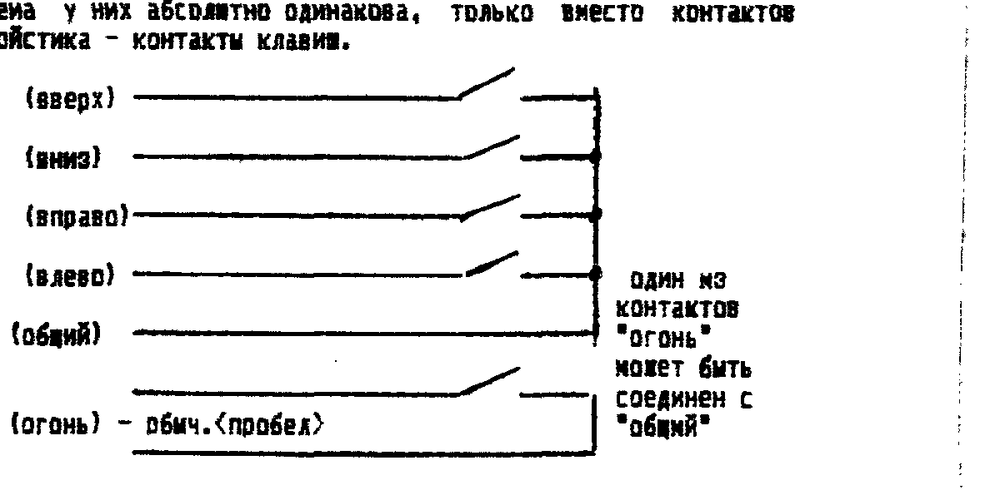
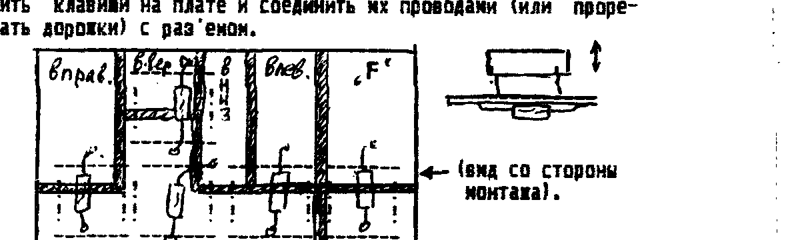
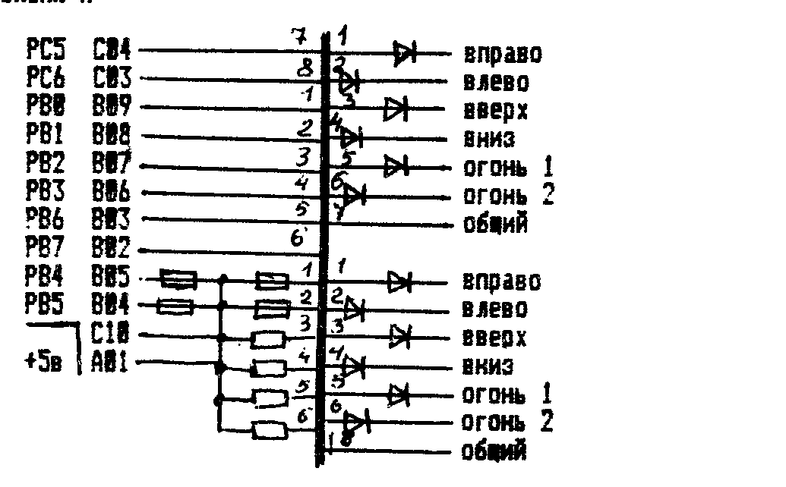
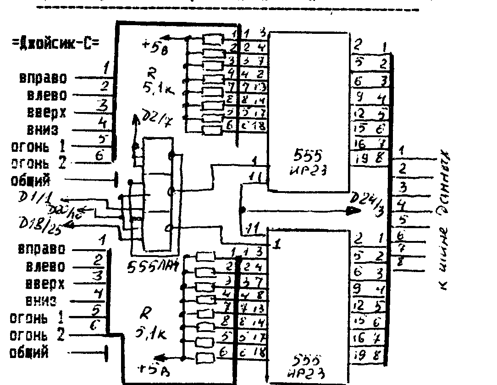
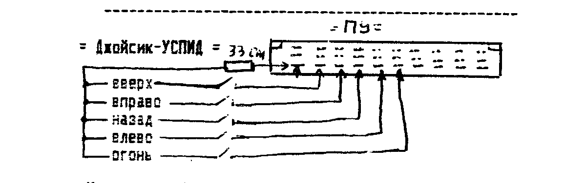
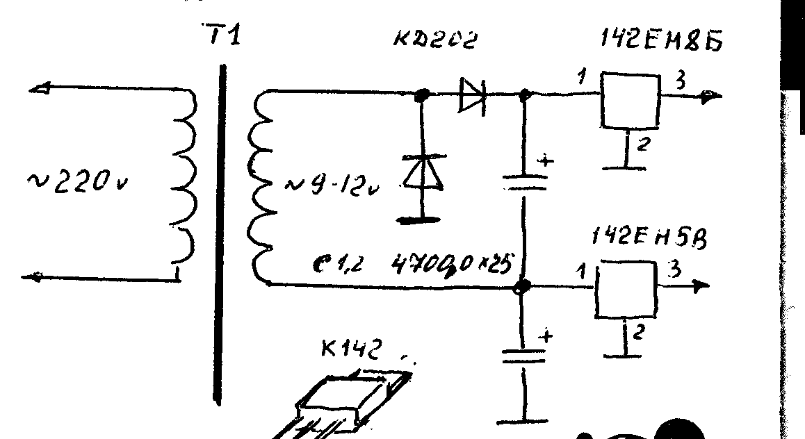
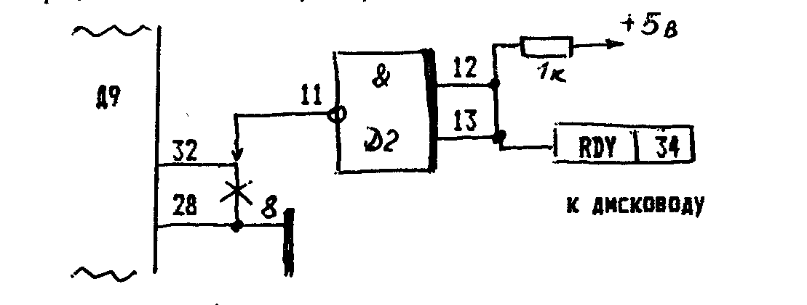
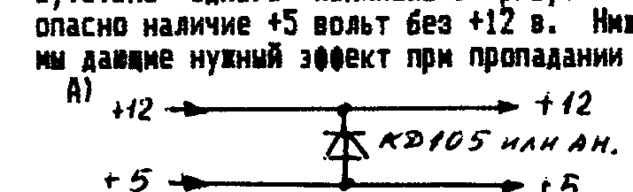
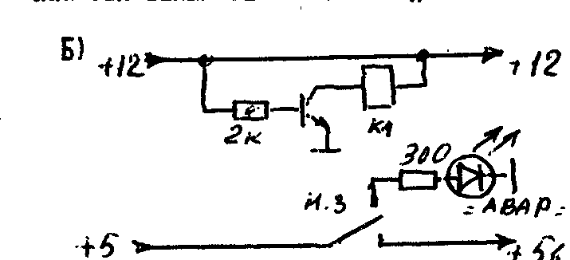

Инфо-бюллетень фирмы «COMAN», 111402 Москва а/я 20.
Метро «Полежаевская», Хорошевское ш. д 43-б кв 61, т. 195-38-33.

## О том, как правильно сделать заказ, быстро получить его, сберечь свои деньги и нервы

Написать эту статью нас побудило одно письмо, автора не называю.
Приведу небольшую выдержку: «...Перебирая старые бумаги, наткнулся на ваш бюллетень, первый номер.
Раньше я не интересовался дисководами, а тут с удивлением увидел, что дисковод стоит всего 2700 руб.
Высылая вам 6000 руб. (квитанция прилагается) я прошу выслать два дисковода...»

Что ответить этому человеку, взявшему цены июля 92 г. и приславшему перевод в марте 93-го, при уровне инфляции 20% в месяц.
Остается только вернуть ему деньги, причем за его же счет.

Хочу сразу сказать, что брать на себя ответственность за инфляцию и обесценивание ваших денег, мы не собираемся и не можем физически, т.к. из бюджета не имеем, а наоборот.
За это отвечают другие люди, сами знаете кто.
Все обращения в суд (были такие случаи) имеют один результат — возврат денег в том размере, в котором они были нами получены, без учета инфляции, что мы и так делаем, без ваших дополнительных затрат при обращении в суд.
Бывают и «покруче» звонки, особенно от подростков: «...да мы на разборку приедем... ждите "гостей"...мы вас на счетчик поставим...».

Ребята, не делайте нам смешно.

Часто билет к нам и обратно стоит больше, чем те деньги, которые «висят» на нас.
Если меньше, то обычно все проблемы мы решаем к обоюдному удовольствию, в присутствии заказчика.
Ну а если кто то действительно захочет «разобраться», то смеем заверить, после этого обратный билет будет не домой, а во всякие разные другие места.

Что бы избежать подобной ситуации, разберемся, почему так происходит.

Пока мы готовим бюллетень с ценами, печатаем его, рассылаем, пока он к вам идет, проходит 2-4 недели, т.е. цены вырастают на 20-50%.
Контролировать цены мы можем только на программы — и мы их не меняем уже больше года.
Все остальное — покупные изделия, покупаются партиями, каждый раз по цене, отличной от предыдущей.
А продавать дешевле, чем покупаем сами — сами понимаете...
Поэтому аргументы типа «...а вот вы писали!» нами не воспринимаются.
Интересует только соответствие получаемых денег и цены в момент получения денег.
Даже телеграфные переводы не всегда успевают за ценой.

Как избежать подобных ситуаций.
Дадим несколько советов.

Если вы заказываете программы, можете не волноваться, и отправлять деньги на заказ в соответствии с ценой программы в каталоге и ценой кассеты из последнего бюллетеня.
В случае изменений цен, разница «отработается» наложенным платежом (но не более 500 руб.).

Если же вы хотите приобрести нечто, то не спешите на почту отсылать деньги — цены наверняка уже другие, чем в бюллетене.
Как поступить в этом случае.
Лучше всего созвониться с нами и выяснить, каковы цены сейчас, не ожидается ли изменение их на данный товар в ближайшую неделю и на сколько.
Если ответы вас удовлетворяют, и вы готовы что то приобрести, продиктуйте свой адрес по телефону и в этот же день отправьте деньги ТЕЛЕГРАФОМ.
Это на 20-30 руб. дороже, чем почтовым, но сбережет вам много тысяч рублей и нервных клеток, поверьте.

Если же вы не имеете возможности отправить телеграфом, или не смогли дозвониться, высылайте почтовым переводом, и можете ориентироваться по ценам бюллетеня, но высылать на 30-50% больше.
Если цены изменились — высок шанс, что цена укладывается в присланную сумму, если нет, остатки вернем.
В любом случае, сдача высылается.
Чужого нам не надо, своего не отдаем.

Если же заказываемый товар делимый (дискеты, кассеты, и т.п.), то высылается товар пропорционально присланной сумме.

Надеемся, что эти советы помогут нам с вами избежать недоразумений.

О подписке на бюллетень.
С 1-го апреля — стоимость подписки — 20 руб/номер по России, 30 руб./номер — СНГ.

Убедительно просим тех, кто уже подписался, «дополнительных» денег НЕ ВЫСЫЛАТЬ до тех пор, пока не придет уведомление об окончании вашей подписки, и приписок на заказах типа «остальное — на бюллетень» не делать.
Эти деньги для вас просто пропадут.
Подписку на бюллетень делать только ОТДЕЛЬНЫМ ПОЧТОВЫМ ПЕРЕВОДОМ, с полным обратным адресом и указанием НОМЕРА, с которого высылать бюллетень.

## JOYSTIK — он же джойстик. О нем и о клавишах

Мы не совсем, если скажем, что процентов 90-95 времени домашний ПК «припахан» на игрушки.
А как вы знаете, в тех же 95% игр задействованы клавиши курсора.
Причем «аналоговая» психика человека заставляет его давить на клавиши с силой пропорционально желанию переместить об'ект управления на экране.
В этом его уж никак не переделать.
Если взрослый еще как то может себя контролировать и не очень отдаваться игре, помятуя о том, сколько денег он угрохал в эту игрушку, то ребенок дает своим эмоциям полную свободу.
Короче, в ПК в первую очередь из строя выходят клавиши курсора.
Что делать.

Первое — подключить джойстик.
Джойстик — это такая штука... ну вобщем она берет удар на себя, спасая клавиатуру.

Сразу совет — не покупайте какие попало джойстики.
Среди них тоже есть хорошие и плохие.
Если у вас есть выбор, посоветуйтесь с теми, у кого он есть.
Если выбор отсутствует, лучше купите дорогой, но хороший.
Если вообще безвыходная ситуация, можете купить у нас.
Это дорого — 2000 руб., но это хороший джойстик (дерьма, простите, не держим-с).
Если это дорого для вас, но у вас есть руки, мы можем выслать эскиз самодельного джойстика, только пришлите конверт со своим адресом.

Второе — подключить выносную клавиатуру.
Это то же самое что и джойстик, просто клавишный вариант.
Электрическая схема у них абсолютно одинакова, только вместо контактов джойстика — контакты клавиш.

Кстати, замечено, что если игрок достиг определенного уровня в какой либо игре на клавишах, то при подключении джойстика квалификация его значительно ухудшается.
И это неудивительно.
Ведь заниматься армреслингом с джойстиком это совсем не то, что пальчиками по клавишам стучать.
В этом плане Выносная Клавиатура выгоднее тем, что позволяет добиться более высоких результатов, чем джойстик.
К тому же она выше по надежности (при применении герконовых клавиш), малогабаритнее (хоть на коленке играй) и в 4-6 раз ДЕШЕВЛЕ!

Конструкция ее проста, как 3 рубля — достаточно разместить клавиши на плате и соединить их проводами (или прорезать дорожки) с раз'емом.

Приобрести всю комплектацию вы можете у нас.
Цены заморожены до 01 июня 1993 г.

- Полностью собранная ВЫ.КЛ. с кабелем, раз'емом, отв. частью раз'ема с пересылкой по России — 600 руб.
- Герконовая клавиша (с внеш. герконом) — 50 р/шт. (при заказе + 30 руб пересылка).

Для тех, кто купит отдельные клавиши — рекомендации по установке.
После закрепления клавиши на плате, припаять геркон одним выводом, и с помощью тестера подобрать его расположение соответствующее надежному срабатыванию.
После чего припаять второй вывод геркона.
При пайке и изгибе выводов будьте внимательны — герконы очень хрупкая штука.

ЕСТЬ В ПРОДАЖЕ:

- Кабель плоский, мягкий, шаг 1 мм, 40 жил (для раз'емов дисководов и т.д.) — 400 руб/метр.
- Контроллер дисковода «Вектор», «Львов» — 4500 руб. (с раз'м.), с кабелями — 5000 руб.

## Подключение джойстиков и дополнительной клавиатуры

Подключение джойстика и доп. клавиатуры может быть произведено несколькими способами: на системную шину, через параллельный порт, параллельно клавишам.
В первых двух случаях, для нормальной работы необходимо, что бы программа обслуживала этот порт, а это делают далеко не все программы.

На ПК «Львов» вообще не существует никаких стандартов, поэтому с него и начнем.
На наш взгляд, оптимальным является подключение параллельно клавишам курсора и пробелу.
Раз'ем джойстика можно установить рядом с раз'емами TV и «МАГН.», сделав паз в корпусе.
Провода от раз'ема следует вести не к клавишам, а к м/с К580ВВ55, установленной на плате клавиатуры.
Припаивать их следует не к выводам м/с, а к дорожкам, ведущим к этим выводам, согласно таблице.

Номер контакта на раз'еме джойстика вы можете узнать, прозвонив его при помощи тестера.

Сложнее дело обстоит с «Вектором».
Тут на рынке несколько сильных «фирм», и каждая «лепит» под себя.
Поэтому и доморощенных «стандартов» несколько.
Начнем по алфавиту.

### Джойсик-П

Все резисторы — 10 кОм, все диоды — КД522 или аналог.

### Джойсик-С

### Джойсик-УСПИД

Как видим, большинство подключений требует доп. деталей, в обмен на мнимое преимущество игры в 2 джойстика, а бывает надо лишь в 5 - 10 программах из сотен.
Кроме того, «выпадает» принтерный раз'ем.
Поэтому полезно так же «врезаться» параллельно клавишам.
По крайней мере, в этом случае вам гарантирована работоспособность вашего джойстика на всех программах.

## Еще раз о подключении контроллера дисковода

Собрав или купив КД, владельцу ПК не терпится, конечно, испытать его в работе.
Хотелось бы дать несколько советов, т.к. к нам часто звонят по этому поводу.

**1) НЕ СПЕШИТЕ!**
КД достаточно нежная вещь и требует аккуратности как при подключении, так и при эксплуатации.
Несколько грубых ошибок могут устроить вам такую «заморочку», что надолго отобьет охоту заниматься дисководом.

**2)** КД и операционные системы рассчитаны на работу с ДВУХСТОРОННИМИ 80-ТИДОРОЖЕЧНЫМИ дисководами.
Иногда, клюнув на дешевизну, человек покупает 40-ка дорожечный или односторонний дисковод и потом «мотает нервы» себе и нам, пытаясь его заставить работать с КД.
ПРЕДУПРЕЖДАЕМ — НЕ ПОКУПАЙТЕ ТАКИЕ ДИСКОВОДЫ, как бы дешево их вам не предлагали.
Это атавизм, шаг назад на 10 лет.
Никто уже не использует такие дисководы и вы ни с кем не будете «совместимы».
Вы будете обречены постоянно возиться и с магнитофоном и с дисководом, перекачивая информацию туда-сюда.
Хотя издалека будет казаться, что у вас есть дисковод.

**3) Начните подключение с ИСТОЧНИКА ПИТАНИЯ.**
У неискушенного в цифровой технике человека отношение к ней такое же, как и к аналоговой.
«Ну подумаешь, напряжение на пол-вольта ниже положенного, ведь приемники и на "севших" батарейках как-никак работают».
В цифровой технике так рассуждать ни в коем случае нельзя!
Настраивая КД, мы рассчитываем, что питание будет НОРМАЛЬНЫМ для м/с.
Кроме того, еще и дисковод надо «кормить».
Итак варианты питания.

**От «родного» источника ПК.**
Возможно, но не рекомендуется, т.к. +5В падает до 4,3-4,5, что уже ненормально.
Владельцы «Вектора» иногда увеличивают частоту генератора в импульсном блоке питания, но при этом одновременно напряжение +12 увеличивается до +15, что часто выводит м/с 1818ВГ93 из строя.
Приходится ставить ограничительные диоды (2-4 шт.) в цепь +12 вольт.

Если же БП без запаса по мощности, то лучше изготовить отдельный блок.
А если есть возможность, то следует делать блок, от которого можно будет питать и дисковод(ы) с контроллером, и сам ПК (а может и монитор).

**От специального источника питания.**
В первом номере бюллетеня была опубликована схема БП.
Диоды, конденсаторы и интегральные стабилизаторы не являются дефицитом (по крайней мере у нас они всегда в продаже и по невысоким ценам).
Больше проблем с трансформатором.
Добыть или изготовить транс. с заданными параметрами тяжело.
Ниже мы приводим схему БП, для которого подойдет практически любой транс имеющий хотя бы одну обмотку с напряжением 8-12 вольт и током 1 - 1,5 А.
Хотим лишь заметить, что выпрямители в данном случае однополупериодные и уменьшать указанную емкость конденсаторов фильтра не рекомендуется.
При проверке БП желательно убедиться при помощи осциллографа в отсутствии пульсаций (под нагрузкой).

## Пока только у нас

Постоянно борясь за улучшение качества программ, а так же за их самоокупаемость, «COMAN», аналогично кировской и волгоградской командам, переходит на распространение АБСОЛЮТНО НОВЫХ программ в виде сборников.
Сборник записан на МК60 или дискете (по желанию).
Формат записи — ROM, с 2-м проходом, без защиты.

Сборник начинает распространяться ТОЛЬКО ПОСЛЕ ПОЛУЧЕНИЯ 300 (трехсот) оплаченных заказов.
Пока не будет выполнено данное условие, НИ ОДНА копия программ сборника «налево» не уйдет.
«Сливки» должен снимать автор программы, а не пираты и «хэкеры».
Поэтому, либо вы приобретаете наши новые программы у нас, либо в других фирмах, но с большим опозданием, либо вообще не приобретаете.

Если вы хотите иметь эти программы скоро — не ждите, когда они появятся «у соседа» — лучше заказывайте у нас.

После выполнения условий распространения сборника, программы из него поступят в обычную розничную продажу.

Все вышесказанное относится как к ПК «Вектор», так и ПК «Львов».
Поэтому просим не звонить и не писать по поводу «чего нибудь новенького».
Вся информация публикуется в бюллетене.

### Сборник № 1 для ПК «Вектор»

**SPACE** — см. описание игры в COMAN-info-6.

**RANGER** — см. там же.
Добавим лишь, что управление оружием на клавишах: `<Я>` — автомат; `<Ч>` — гранатомет; `<С>` — граната; `<М>` — фугас; `<АР2>` — карта; `<пробел>` — «ложись!», «выбор» и «прыжок» (от режима).

**SNAKE** — змея проделывает ходы, а мангусты ловят ее по этим ходам.
С'есть можно только «нерадивого» мангуста (красн. цвета).

**SPACE SAFARY** — путешествие в космосе.
На зеленых планетах водятся гнусные насекомые.
Надо найти эти планеты, уничтожить охрану, приземлиться, на поверхности планеты найти вход в пещеру, избегая контактов с метеоритами, смерчами и минами, и лишь затем ловко набросить сеть на паразита.
Он тоже не безобиден — точно брызжет ядовитой слюной.
Семь попаданий — и оболочка корабля рассыпается в пыль.

**PUSH** — призраки бродят по игровому полю.
Единственный способ избавиться от них (и перейти на следующий уровень) — придавить их камнями.
Будьте внимательны, камней не намного больше, чем привидений.

**TOWER** — если вы любитель лабиринтов, это то что надо.
Вы попали в заповедник старых замков, в которых полно сокровищ.
Но строители этих замков были очень хитры, и постарались максимально затруднить путь тем, кто захочет поживиться сокровищами.
Одичавшие обитатели, хищные птицы, ловушки, лифты...
Силы ваши небесконечны, но восстановить их помогут волшебные яблоки.
Не злоупотребляйте ими, берите только в случае надобности, иначе не хватит сил на обратную дорогу.
После сбора кладов и спуска, идите к следующей башне — там еще больше сокровищ!

Стоимость сборника с учетом пересылки по России: на МК-60 — 700 руб., на дискете — 600 руб.
С пересылкой за пределы России — 1000 и 900 руб. соответственно.

Оплату высылать почтовым переводом по адресу:

> 111402 Москва а/я 20 Тимошенко Константину Андреевичу
> С пометкой «Сборник 1 "Вектор"»

## Хит-парад

| № | ВЕКТОР | ЛЬВОВ |
| --- | --- | --- |
| 1 | БОЛДЕР (21) | АРКАНОИД (59 — вот это отрыв!) |
| 2 | DOWN TO EARTH (19) | СУПЕРЛАБИРИНТ (28) |
| 3 | ABRAMS (18) | CHEESE (26) |
| 4 | ПЛАНЕТА ПТИЦ (17) | АЭРОКОБРА (24) |
| 5 | АМБАЛ; АДСКОК (16) | ТЕТРИС (22) |

Ждем ваших списков «хитов»!

ВНИМАНИЕ!
В связи с очередным подорожанием бумаги и почтовых конвертов, при подписке просим оплачивать бюллетени из расчета 20 рублей за номер (по России) и 30 руб. за номер вне России.
Кроме того, подписчикам, живущим вне России, будет произведен перерасчет с коэфф. «3», т.к. конверт к вам теперь стоит ок. 20 руб.
За срок нахождения письма в пути мы так же ответственности не несем.

## Программы для ПК «Вектор»

| Индекс | Название | Описание |
| --- | --- | --- |
| 1-107 | ХИМИЯ (30) | Рыская в подземелье, гномик должен собирать атомы и составлять из них химические вещества. |
| 1-108 | МИРАЖ (30) | Игра, напоминающая ARKANOID, но с более развитым сюжетом. |
| 1-109 | МУМИЯ (30) | Вы путешествуете внутри египетских пирамид. |
| 1-110 | BYLLIARD (30) | Версия биллиарда. Медленная, но без ошибок. |
| 1-111 | GHOST BUSTERS (30) | Игра создана по мотивам одноименного фильма. Вы — охотник за приведениями. |
| 1-112 | CHASER-бессмертный (30) | |
| 1-113 | INTERNATIONAL KARATE (50) | Вы становитесь участником международных соревнований по карате. Отличная графика. |
| 1-114 | СУПЕР КАЛАХ (30) | Весьма мощная реализация известной игры. |
| 1-115 | ПЕКМАНЕНОК (30) | Логическая версия PACMAN. |
| 1-116 | PREDATOR (30) | Кибернетический механизм должен уничтожать врагов, появляющихся на вашем пути. |
| 1-117 | PUTUP 3 | |
| 1-118 | PUTUP 4 | Продолжение приключений героя игры. |
| 1-119 | PUTUP 5 | Лабиринты значительно усложнены. |
| 1-120 | PUTUP 6 | Вас ждут новые опасности и... призы. |
| 1-121 | PUTUP 8 | Стоимость каждой — 30 руб. |
| 1-122 | PUTUP 9 | |
| 1-123 | STARS (30) | Водолаз должен собирать морские звезды и другие сокровища подводного мира. |
| 1-124 | ZODIAK STRIP (50) | Игра типа «угадай число» на... раздевание. Детям до 16 лет — строго воспрещается! |
| 1-125 | MONG HOUS (30) | Игра типа РАННЕР. |
| 1-126 | XONIX-2 (30) | Более динамичная версия игры. |
| 1-127 | DINO (50) | Попробуйте найти клад в темном лабиринте... |
| 1-128 | DAMPEDITOR.MON (30) | Эта программа пригодится тому, кому частенько приходится набивать программы в кодах. |
| 1-129 | FANTOM (30) | Управляя «жилкой», необходимо оградить себя от бомб и неприятельских самолетов. |
| 1-130 | КАРАТЭ (30) | Версия игры автора Казакова. |
| 1-131 | MOWER (30) | Трактор должен скосить поле, не наезжая на камни и периодически заливая в баки топливо. |
| 1-132 | РЕМБО (30) | Вы должны уничтожить вражеские танки и технику. |
| 1-133 | SEXSHOOL (30) | Школа секса, содержит 20 полноэкранных картинок с комментариями. Детям смотреть не рекомендуется. |
| 1-134 | SEXOR-1 (30) | А это — 8 небольших мультфильмов на тему... |
| 1-135 | VOICE MAKER (30) | Позволит вам записать в память компьютера, вывести на МЛ или пристыковать к любой своей программе речевую или музыкальную фразу. |
| 1-136 | ВОДОЛАЗ (30) | Вам необходимо собрать сокровища со дна моря, но будьте осторожны и внимательны — вас подстерегают опасности... |
| 1-137 | ЗАМОК (30) | Приключения в замке, кишащем приведениями. |
| 1-138 | COL/IBM (30) | Версия COLUMNS адаптированная с IBM/AT. Вам, безусловно, понравятся полноэкранные картинки-заставки. |
| 1-139 | DRIVERS (50) | Пакет подпрограмм, содержащих все необходимые драйвера для создания несложных игр и программ. Предназначен для начинающих программистов. Инструкция в следующем бюллетене. |
| 1-140 | DINO-1 (30) | Продолжение сериала «DINO». Приключения в темном лабиринте, который охраняет страшное существо. |
| 1-141 | INTERNATIONAL KARATE TURBO (50) | Игра для асов-профессионалов, можете выбрать для себя любую скорость игры. |
| 1-142 | AMBAL-M (30) | Бегайте, стреляйте, собирайте клады, оружие. |
| 1-143 | FOOTBAL (30) | Игра для двух игроков. Один играет на клавиатуре, другой — на джойстике. |
| 1-144 | LIFE | Весьма мощная реализация известной математической игры «ЖИЗНЬ» Дж. Конвея. |
| 1-145 | GROTOHOD (30) | Путешествие в подземелье в поисках клада. Одна из лучших игр подобного типа. |
| 1-146 | ПОДДАВКИ (30) | Известные логические игры. |
| 1-147 | ШАШКИ (30) | Имеют 9 уровней сложности. |
| 1-148 | УГОЛКИ (30) | |
| 1-149 | ПИТОН (30) | Питон должен с'есть как можно больше кроликов, не вылезая за ограду, и не задавив самого себя. |
| 1-150 | НУ, ПОГОДИ (30) | Вы видели карманную игру «НУ, ПОГОДИ»? Так вот это — то же самое. |
| 1-151 | ПЕЩЕРА ПРИЗРАКОВ (30) | Игра типа «РАННЕР», продолжение приключений героев игры ЙЕТИ. |
| 1-152 | PUSHER-M (30) | Игра типа «СОКОБАН». Имеет огромное преимущество перед аналогами в виде системы паролей. |
| 1-153 | ВОРИШКА (30) | Вы стали опытным вором и должны умело украсть белье, не попавшись под руку хозяйке. |
| 1-154 | ЦМУ-1 (30) | Превращает ПК в установку цветомузыки. |
| 1-155 | ЦМУ-2 (30) | Еще одна версия цветомузыкальной установки. |
| 1-156 | DONKEY KONG-2 (30) | Версия игры с нормальной графикой. |
| 1-157 | DOUBLE AIRMAN (30) | Управляя двумя космическими кораблями одновременно, вы должны долететь до заветной цели. |
| 1-158 | ARCANOID-2 (30) | Вас ждут новые сложные этажи... |
| 1-159 | ШАХМАТЫ-2 (30) | Новая усиленная версия шахмат. |
| 1-160 | COLUMNS-2 (30) | Еще одна версия, адаптированная с IBM. |
| 1-161 | DIAMOND-2 (30) | Хотите поиграть одновременно в игры CHASER и ROCKMAN? Покупайте эту игру! |
| 1-162 | EAGLE SNEST (30) | Управляя своим танком вы должны уничтожить технику противника и пробраться в тыл врага. |
| 1-163 | FATAX-2 (30) | Продолжение игры FATAX, попробуйте свое мастерство на более сложном рельефе. |
| 1-164 | FLAER (30) | Управляя боевым вертолетом, уничтожайте летающие тарелки и наземные цели. |
| 1-165 | HORUS (30) | Можете поэкспериментировать со звуком. |
| 1-166 | MAGIC PAPER (30) | Путешествуя по лабиринту, собирайте волшебные свитки и уворачивайтесь от врагов. |
| 1-167 | НИНДЗЯ-МАСТЕР (30) | Мастера ниндзя ждут захватывающие приключения на вражеской местности. |
| 1-168 | СУПЕР ДЕНЬГОЛОВ (30) | Набирайте в каждый мешок по 17 долларов и вам успех гарантирован. |
| 1-169 | SNAK-3 (30) | Одна из версий игры «УДАВ». |
| 1-170 | SNARE LAND (30) | Вас ждут интереснейшие приключения в запутанном и полном опасностей лабиринте. |
| 1-171 | ТУТАНХАМОН (30) | Приключения желтого человечка в лабиринте с кладами и... врагами. |
| 1-172 | УЖАС-2 (30) | Полная версия игры «УЖАС». |

Запись осуществляется как на кассеты, так и на дискеты 5'25" в формате CP/M-53 (256 б/сектор).
Кассета C90: SONY и ан. — 1000 р.; «левые» — 400 руб.
МК60 — 250 руб.
Дискеты: «фирма» — 300 руб., «ИЗОТ» — 70 руб.

## ACHTUNG!

С 15-го апреля 1993 г. мы прекращаем тиражирование программ на Бейсике НА КАССЕТАХ для ПК «ВЕКТОР» и ПК «ЛЬВОВ».
Заказы, поступившие до 15 апреля будут выполнены.
Продажа программ на Бейсике для ПК «ВЕКТОР» будет осуществляться только на дискетах.
На каждой дискете — 80 программ.
Стоимость 1-й дискеты с программами — 500 руб.
Программы на Бейсике для ПК «ЛЬВОВ» вообще изымаются из каталога.

С 15-го апреля прекращается тиражирование программ на кассеты в формате МОНИТОР-1200 а также в формате БЕЙСИК-1200.
Просим в свои заказы эти программы не включать.

С 15-го апреля 1993 г. устанавливается минимальная цена на стоимость одной копии программы — 30 руб.
Стоимость программ, превышающая 30 руб. остается без изменений.
Просим внести исправления в имеющиеся у вас каталоги нашей фирмы во избежании недоразумений.

В связи с вводом драконовских почтовых тарифов и введением таможен, нам все тяжелее и тяжелее производить пересылку заказов «за границу».
Если Украина и Беларусь еще как то рядом, то с Казахстаном и др. странами — полный атас.
Единственный выход — постарайтесь обзавестись адресом на территории России.
Если это невозможно, то при заказе не забудьте прибавить 300 - 400 руб. за пересылку, а при получении с вас возможно потребуют пошлину.
Это относится и к Беларуси и к Украине, откуда упорно продолжают идти заказы с припиской «...и 15 руб. за пересылку...».

Текущие цены (для справки):
Дисковод МС5313 — 20000 руб.
Принтер МС6337 (А3, игольчатый) — 30000 руб.; МС6313 (термоструйный, с 1-й головкой) — 18000 руб.
Контроллер дисковода к ПК «Вектор» или «Львов» (с 2-мя шлейфами, сист. дискетой и ПЗУ загрузчика ОС) — 5000 руб.
А/кассеты МК60 — 250 руб.
C90 (левые, Китай и т.п.) — 450-500 руб.
SONY, BASF — 1000 руб.
Дискеты — ИЗОТ — 55 руб/шт., изг. в Соединен. Королевстве — 150 руб.; «фирма» — 350 - 400 руб.

ВНИМАНИЕ!
Перед пересылкой денег постарайтесь позвонить и уточнить цены.
Если позвонить нет возможности, запрос можно сделать телеграммой «с оплаченным ответом».

## Всякая всячина

### Доработка КД дисковода

Как справедливо заметил один из самых активных читателей А. Синицын, КД не производит проверку подтверждения готовности и при применении «заторможенных» дисководов возможна потеря части информации.
Устранить данный дефект можно при помощи нижеописанной доработки.
Нумерация м/с соответствует принципиальной схеме (бюл. 2).

### Работа с ROMOUT53

По умолчанию, при работе с этой программой в ячейку памяти 0FF4 записывается значение 32H, что соответствует стандартной константе вывода на МЛ.
Если вы желаете увеличить скорость записи на МЛ, при копировании, то при помощи XSID, POWER или др. утилит или системных программ можно изменить содержимое, изменив тем самым скорость записи.
Так например, запись в эту ячейку значения 2AH устанавливает скорость примерно 1300 (по шкале копировщика), а 20H — 2000 и т.д.

### Скорость вывода на МЛ в ПК «Львов»

Задается не одной, а 5-ю константами.
Ниже приводится таблица, в которой указаны константы для каждой скорости.
Данная таблица была составлена при разработке популярного копировщика «TURBO», так что проверена годами.

| Адрес ЯП / константы | 800 | 1200 | 1400 | 1600 | 1800 |
| --- | --- | --- | --- | --- | --- |
| BE00 | 53 | 32 | 2C | 25 | 22 |
| BE01 | 5C | 3C | 36 | 2E | 2A |
| BE02 | 26 | 16 | 14 | 12 | 11 |
| BE03 | 2C | 1A | 15 | 12 | 10 |
| BE04 | 0A | 10 | 11 | 14 | 16 |

### Защита по питанию

Мы неоднократно писали, что различные микросхемы с двойным и тройным питанием очень болезненно реагируют на отсутствие одного номинала в присутствии другого.
Особенно опасно наличие +5 вольт без +12 в.
Ниже приводятся две схемы, дающие нужный эффект при пропадании +12 в.

Когда все нормально, диод заперт, и два питания развязаны между собой.
При пропадании +12в, диод открывается, и обеспечивает равный потенциал на м/с, избавляя тем самым вас от необходимости ее замены.

В этом случае речь идет не только о спасении м/с, но и подаче сигнала об аварии.
Можно применить слаботочное реле, с потреблением до 20-50 ма, но с учетом того, что через контакты будет проходить весь ток, потребляемый по шине +5 вольт.

Мы просим вас присылать свои небольшие заметки с опытом, предложениями, идеями.
Ваши рассказы о том, как вы вышли из трудной ситуации, нестандартное применение ПК или остроумное решение той или иной проблемы, могут быть очень полезны другим читателям бюллетеня.

> ЧАСТНОЕ ОБ'ЯВЛЕНИЕ: Продам программы для «Орион-128».
> Куплю новые авторские программы для «Орион-128».
> Адрес: 310184 Украина, г. Харьков, ул. Дружбы Народов 233-113, Данюк В.А.
