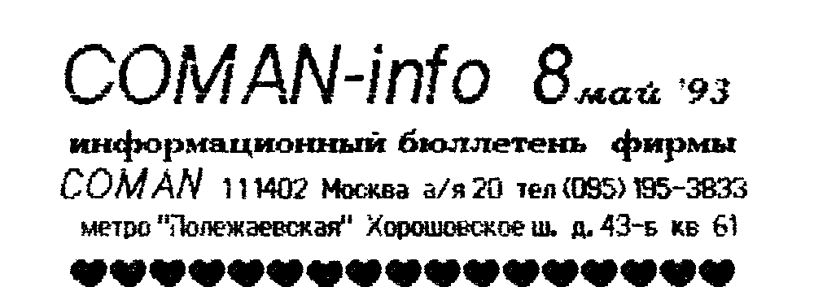
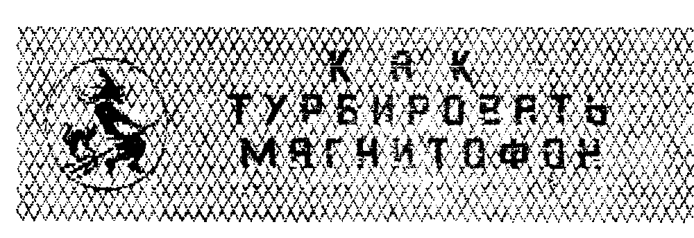
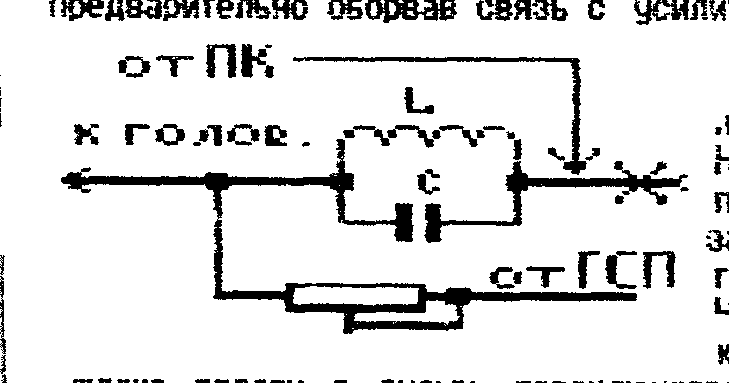
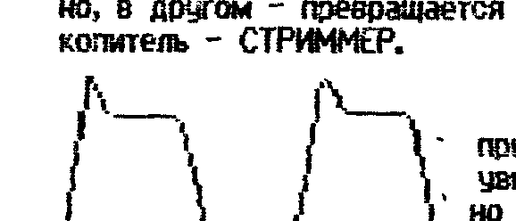
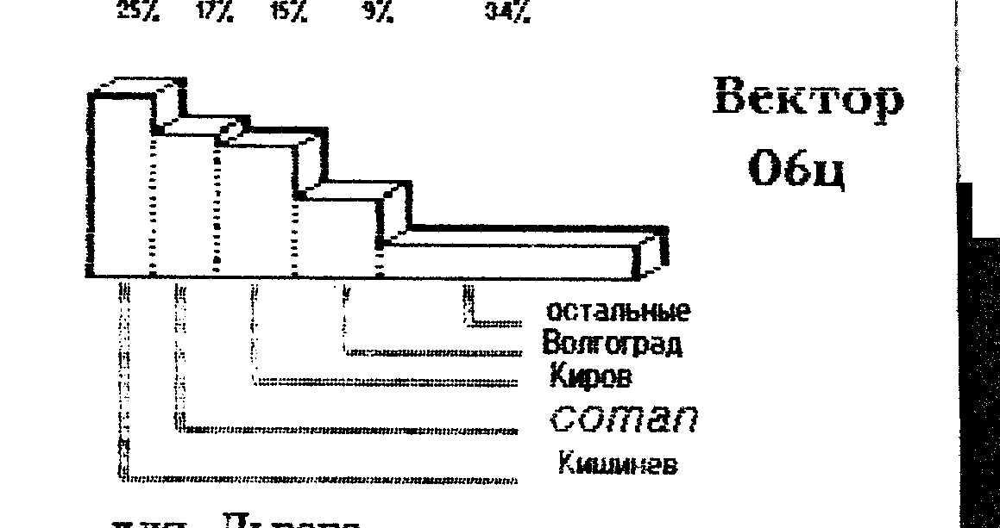
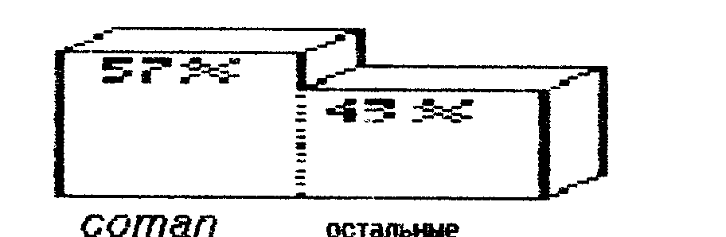

Информационный бюллетень фирмы COMAN.
111402 Москва а/я 20, тел. (095) 195-3833.
Метро «Полежаевская», Хорошовское ш. д. 43-б кв 61.

## Как турбировать магнитофон



Как мы уже неоднократно говорили, на втором месте после игрушек, по частоте использования в домашних ПК, идут различные БАЗЫ ДАННЫХ.
Однако они обычно имеют большой об'ем — десятки килобайт.
Это делает работу с ними неудобной, если в качестве внешней памяти используется магнитофон.
Еще бы!
Ждать 5 - 10 минут для того, что бы посмотреть пару строк.
Да и есть ли они там?
Да и игры большие так же загружаются по 8-12 минут.

Оптимальным решением этих проблем является, конечно, подключение дисковода — и тебе загрузка 5 секунд, и об'ем баз данных хоть до 500 килобайт.
Однако далеко не у каждого есть на него средства.

Другим вариантом решения может быть увеличение скорости записи/чтения при работе с магнитофоном в 2 - 3 раза.
Однако простое изменение констант может резко ухудшить качество записи.
Что бы этого не произошло, мы рекомендуем немного доработать свой маг — турбировать его.

Не углубляясь в физику происходящих процессов, расскажем, что предлагаем сделать.

В каждом (абсолютно) магнитофоне есть генератор стирания и подмагничивания — ГСП, и есть т.н. фильтр-пробка, через который сигнал с усилителя записи поступает на головку, смешиваясь при этом с сигналом от ГСП.
Мы предлагаем подавать сигнал от ПК непосредственно на фильтр-пробку, предварительно оборвав связь с усилителем записи.



Надо отметить, что теперь маг не сможет записывать обычный сигнал — музыку и т.п.
Что бы не терять это качество магнитофона, лучше ввести в схему переключатель для коммутации.
В одном положении переключателя маг работает как обычно, в другом — превращается в магнитофонный цифровой накопитель — СТРИММЕР.

В случае удачной доработки при считывании, вы должны увидеть на осциллографе примерно такую картинку:



Данная доработка была проведена на нескольких десятках магнитофонов и всегда были зафиксированы положительные результаты.

Хотим вас предупредить — предлагаемая доработка не есть панацея, она лишь улучшает ЗАПИСЬ, но не чтение.
То есть на записи произведенные до доработки, она никакого действия не оказывает.
Кроме того, эффект от доработки проявляется тем сильнее, чем ниже класс магнитофона.

Нами разработана простая и надежная схема стриммера для бытового ПК.
Хотелось бы знать, стоит ли ее публиковать, будет ли спрос на готовую плату?
Пишите и звоните!!!

## Программы для Вектора

| Индекс | Название | Описание |
| --- | --- | --- |
| 1-173 | Bolder-M (50) | Продолжение приключений героя популярной игры. |
| 1-174 | Bolder-2 (50) | Вариации автора на ту же тему, но с интересными новшествами. |
| 1-175 | Pillars (30) | Продвигаясь вперед, постарайтесь не заблудиться и настрелять ... вертолетов. |
| 1-176 | Spase devils (30) | Космические битвы ждут своих героев. |
| 1-177 | Саботаж (30) | Игра для любителей лабиринтов, драк, сокровищ... |
| 1-178 | Cyber mutant (50) | Кибер прорывается сквозь полчища врагов. Довооружиться можно в оружейном магазине. |
| 1-179 | Eraser (50) | Игра, напоминающая Down to Earth как по сюжету, так и по качеству. |
| 1-180 | Cronex (50) | Он же Fatax-3. |

## Программы для Львова

Владельцы Львова с огорчением узнают, что и в этом номере никаких новинок.
Не огорчайтесь — СЛЕДУЮЩИЙ НОМЕР ВАШ!!

## Прайс

Для справки: прайс-лист с перечнем товара и ценами.

| Товар | Цена |
| --- | --- |
| Блок с дисководом, КД, БП, сист. дискетой, ПЗУ загрузчика (Вектор, Львов) | 35000 руб. |
| То же для ZX-Spectrum | 38000 руб. |
| Дисковод МС5313 — 80 дорожек, 2-х стор., неформатная емкость 1 Мегабайт | 22000 руб. |
| Контроллер дисковода для ПК Вектор или Львов в комплекте с системной дискетой, шлейфами и раз'емами | 6000 руб. |
| То же для ZX-Spectrum | 9000 р. |
| Кабель плоский 40 жил, шаг 1 мм, мягкий, для дисководов, принтеров и т.д. | 400 руб/м |
| Дискеты 5'25 2S/2D (M. in UK), неформатная емкость до 1 Мб; стоимость одной дискеты | 150 руб. |
| Пластиковый бокс с 12-ю дискетами | 2000 руб. |
| Принтер МС6312 — термоструйный, формат А4, в комплекте с 1-й головкой | 20000 руб. |
| Головка к принтеру | 1000 руб. |

Внимание!
Перед заказом уточните цены по телефону!
Позвонить нам не просто, а очень сложно, но вы постарайтесь.
(095) 195-3833.

Сообщаем, что с этого номера включительно, при получении оплаты подсчет количества номеров производится по системе «бюллетень + конверт».
Т.е. цена бюллетеня фиксируется на момент подписки, а цена пересылки (конверта) остается переменной.
Пока бюллетень — 20 руб.

## CP/M: утилиты и дисковые программы

Как сказано в одной песне, какая операционка без утилит?
Поэтому познакомим вас с большинством самых необходимых.
Все они для «Вектора», т.к. из-за оригинальной архитектуры «Львова» на нем не удается запустить их в первозданном виде.
Но те, которые удалось, помечены значком «√».
Кроме того, наиболее популярные и необходимые (текстовые редакторы, базы данных и т.п.) уже созданы (см ниже).
В скобках указана цена (в рублях).

**@ (100)** — командная строка.
Если вам приходится часто набирать одну и ту же команду ОС, то лучше это сделать в текст. редакторе, и присвоив какое либо имя с расширением .sub, вызывать этой утилитой.
Например, вы матерый пират и выводите на ленту сборник программ.
В WM создаете файл `sbor.sub` следующего содержания:

```
ROMOUT53 NAME1.COM 0102
ROMOUT53 NAME2.COM 0102
и т.д.
```

а затем запускаете `@ sbor <ВК>` и все команды будут последовательно выполнены.

**BAS + BASLIB + L80 (200)** — компилятор с Бейсика в маш. коды.
Программы д.б. на MBASIC-е.

**RUS (50)** — подменный знакогенератор, заменяет англ. маленькие буквы на русские (для WM).

**√ CRC (50)** — подсчитывает контрольные суммы файлов.

**√ DISASM (100)** — дисковый дизассемблер.

**DOC (100)** — программа-доктор, позволяет производить работы с диском на уровне секторов.

**DT1 (50)** — программа для тестирования дискет и КД.

**IN1 (50)** — программа для записи на диск файлов с МЛ в формате Монитора-отладчика.

**FROM (200)** — программа для чтения дискет, записанных на ПК ZX-Spectrum и Robotron с опер. системой CP/M (но не TR-DOS).
Полезна для переноса утилит и программ.

**FROM8 (200)** — программа для чтения дискет, записанных в формате МИКРОДОС (Вектор).
Если к вам попала дискета с таким форматом записи, с помощью FROM8 за 5 минут вы «перекачаете» ее содержимое на дискету, но в формате CP/M-53.

**KOD (30)** — программа выдает код нажатой клавиши.
Полезна при адаптации программ с других ПК.

**LZ (50)** — дисковый архиватор, предназначен для сжатия программ по об'ему.

**ARC2 (100)** — то же архиватор, но упакованные файлы хранит в одном.
Сохраняет список содержащихся в нем файлов.

**CHECK (50)** — оперативный подсчет контр. суммы файла.

**SPMUTL (50)** — текстовый файл с описанием утилит и правилами работы с ними.

**COMPARE (50)** — сравнивает два файла и выдает ячейки памяти, где обнаружено несовпадение.

**DIC (200)** — дисковый словарь (или записная книжка) с об'емом записи до 600 Кб.
Время поиска — 2-3 сек.!
Самообучается и постоянно пополняет свои знания.
Работать с ним не просто, а очень просто — вопрос/ответ.
Поставляется со словарем на 3500 слов, который вы можете дополнять и пополнять.

**Textas-disk (200)** — это не просто адаптация магнитофонной версии, это совершенно новый редактор, сохранивший от предка разве что название.
Встроенный HELP, возможность оперативно переключать режим 40/80 символов в строке, запоминание конфигурации файла, настройка принтера и управление им из текста, элементы базы данных и пр. пр.
Поставляется пакетом из семи файлов.

## Система express

Мы начинаем работать по системе EXPRESS.
Для того, что бы сделать заказ по этой системе, необходимо проделать следующее:

1. Составить список программ, которые вы хотите заказать.
2. Подсчитать их стоимость + кассеты + пересылка 100 р. и отправить эту сумму ТЕЛЕГРАФНЫМ ПЕРЕВОДОМ.
3. Позвонив к нам по телефону 195-3833 В ЛЮБОЕ ВРЕМЯ суток, продиктуйте свой список программ и адрес.

ВНИМАНИЕ!
Трубку может снять:

- **дежурный** — в этом случае вопросов не возникнет;
- **автоответчик** — не пугайтесь, а четко и внятно продиктуйте свой заказ, адрес и фамилию. Полезно их так же записать на бумагу. Постарайтесь уложиться за 3 минуты. Достаточно называть только индекс программы. Программы, идущие в каталоге подряд, можно называть «с такой по такую (включительно)». Перед звонком постарайтесь сами прочесть несколько раз список, что бы не мямлить и не путаться.

После получения оплаты, заказ будет немедленно выполнен и выслан.

ВНИМАНИЕ тех, кто живет недалеко и предпочитает не связываться с почтой.
За 2-3 дня до приезда позвоните нам и так же надиктуйте свой заказ.
К вашему приезду он будет готов.

По нашим расчетам, через 15-20 дней (а иногда раньше) ваш заказ должен быть у вас.
Стоит попробовать?

## ПЗУ и Вектор

Предлагается к продаже следующие ПЗУ:

**К155РЕ3** — с новой прошивкой программы регенерации, предназначена для работы с квазидиском.
Устраняет сбои квазидиска.
Цена — 200 руб.

**К573РФ2** — новый загрузчик.
После включения ПК, пытается загрузиться с диска, при незагрузке считывает ROM-диск.
Если и это не удалось, включается загрузчик формата ROM.
Причем при чтении выдается имя файла.
Инструкция прилагается.
Цена — 400 руб.

## Подключение к ч/б монитору

Обычно проблемы возникают с получением устойчивой синхронизации и яркого контрастного изображения.

1. Найти на схеме монитора (и в нем самом) резистор с сопротивлением 75 - 82,5 Ом (он стоит параллельно входу) и заменить его на 510 Ом.
2. Подключить к сигналу СИНХРО сигналы цветности через подстроечные резисторы 3-5 кОм. Регулировкой резисторов можно получить до 256 оттенков серого цвета.

## Дисковая база данных WB.COM

(для ПК Львов, поставляется с защитой, 500 руб. с диском)

Вообще говоря, это не база данных, а ГЕНЕРАТОР БАЗ, т.е. с его помощью создаются сами базы.
Сам генератор защищен от копирования, но создаваемые им базы данных копируются без ограничений.

Для создания БД необходимо запустить генератор и задать имя создаваемой БД.
На диске будет создано три файла с этим именем, но разным расширением.
Вы можете их скопировать на другой диск, но переименовывать не рекомендуется.

После этого БД считается созданной и вы можете приступать к работе с ней.
И в дальнейшем, как вы догадываетесь, вмешательство генератора не обязательно.

Работать с БД не просто, а очень просто, по принципу «вопрос — ответ».
Сразу после запуска будет запрошено КЛЮЧЕВОЕ СЛОВО — т.е. образец для поиска.
Надо отметить, что в отличии от магнитофонной СУБД, имеющей много полей и поиск по начальным буквам поля, дисковая БД имеет только два поля и осуществляет поиск только по целому слову, без сокращений.
Так, например, если в БД есть кл. слово «ТРАНЗИСТОР», то поиск по образцу «ТРАНЗ» или т.п. ничего не даст.
Это будет воспринято как новое слово.
Связано это с тем, что поиск ведется по всему диску (а не только по ОЗУ, как в маг. СУБД), а это 360 Кб.
Это может отнять много времени и приведет к быстрому износу диска, т.к. для поиска нескольких слов придется каждый раз «процеживать» весь диск.
Поэтому был найден компромисс в виде того, что ключевые слова хранятся в ОЗУ, а их расшифровка — на диске.
Это позволило находить соответствие кл. слову за 2-3 сек. независимо от величины БД.
А она может быть до 350 Кб.

Итак, после ввода ключа, появится либо его расшифровка, либо сообщение о том, что аналог не найден.
Если аналога нет, то будет предложено его создать — сделать новую запись.
При ее создании можно изменить ключ (кл. `<ПС>`) — он выделяется красным цветом.
При первом нажатии ключ отменяется, при втором — все, что слева от курсора становится ключом.
Кроме того, вы можете изменить сам ключ.
Общая длина записи не должна быть больше 256 символов.
Завершение записи по нажатию `<ВК>`.

Если аналог найден, то БД автоматически переходит в режим редактирования записи.
Если редактирования не требуется, можно перейти к поиску следующей записи нажатием клавиши `<\>` — будет сделан запрос нового ключа.
При редактировании можно изменить всю запись, включая сам ключ.

Следует особо отметить, что при редактировании невозможно увеличить длину редактируемой записи, т.е. можно изменить содержание записи, но не ее размер.
Это связано с размещением информации на диске.
Поэтому при создании записей, которые в принципе могут быть подвергнуты редактированию, советуем заведомо «запасаться» пробелами, размещая ключевое слово в первой строчке, а расшифровку — на второй или третьей.
В то же время при создании словарей или справочников записи лучше делать компактно, дабы их побольше уместилось на дискете.
По расчетам, на дискете может разместиться до 12000 строк записей.
А словарь на 12-15 тыс. слов это уже хорошо!

## Дисковый редактор текста SAMARA

(для ПК Львов, без защиты, цена 300 р. без дискеты)

Серьезно доработан и приспособлен для работы с дисководом популярный редактор SAMARA.
Сохранены все предыдущие функции и добавлены новые.

В режиме команд:

- `<B>` — выход в систему по горячему старту;
- `<T>` — настройка принтера.

В режиме редактирования:

- `<СУ>`+`<пробел>` — задание образца для поиска по тексту;
- `<ВК>` — поиск по заданному образцу;
- `<СУ>`+`<*>` — продолжение поиска;
- `<F2>` — появляется знак курсора и следующий за ним символ будет воспринят принтером как управляющий, без вывода на печать.

Запись и чтение файлов с дискеты осуществляется директивами `S:` и `L:`, после которых надо указать имя файла с расширением.

## «Пикассо» — на диске

(для ПК Львов, без защиты, 200 руб. без диска)

Адаптирован графический редактор «Пикассо» для работы с диском.
Все функции абсолютно идентичны магнитофонному варианту, за исключением формата записи на диск.

- `<Z>` — запись знакогенератора;
- `<B>` — запись в бинарном формате;
- `<A>` — запись в формате текст. редактора.

Воспринимается т.р. EDIC и SAMARA с последующей трансляцией МакроАссемблером.

## Спрайт на бумаге

(Для ПК Львов, без защиты, 500 руб.)

Имеющие принтер и желающие запечатлеть шедевры, созданные при помощи «Пикассо», на бумаге, смогут, наконец, это сделать при помощи новых программ: **GPD** и **GPM**.

Они абсолютно одинаковы, за исключением того, что первая берет спрайт с диска, вторая с магнитофона.
В обоих случаях спрайт должен быть записан в формате `<B>` «Пикассо».

Магнитофонная версия сама задает вопросы, на которые вам надо ответить, а у дисковой все задается одной командной строкой, формат которой следующий:

```
A>GPD NAME.SPR/X,Y,C,D,I
```

где X, Y, C, D, I — необязательные параметры:

- **x** — масштаб по горизонтали, по умолчанию = 1;
- **y** — масштаб по вертикали, по умолчанию = 1;
- **c** — «цветная» печать (4 градации яркости), по умолчанию печать черно/белая (без различения цветов);
- **d** — печать с двойной плотностью (масштаб уменьшается), по умолчанию печать с одинарной;
- **i** — инверсия данных (для настройки принтера), по умолчанию — без инверсии.

ПРИМЕРЫ:

```
A>GPD NAME.SPR <ВК>      - печать спрайта, масштаб 1:1,
                           черно/белая, одинарной плотности, без инверсии.
A>GPD NAME.SPR/2,3,D <ВК> - печать с масштабом 2:3, с двойной плотностью.
```

Обратите внимание на следующие особенности:

- а) печать фона не производится, т.е. обычный черный фон экрана ПК на бумаге будет белым;
- б) масштаб должен задаваться по двум координатам сразу, либо не задаваться вообще;
- в) порядок следования параметров должен соблюдаться.

СЧАСТЛИВО ПОРИСОВАТЬ И ПОПЕЧАТАТЬ!

## О ценах и сборниках

> ПРОДАЕМ ПК «ВЕКТОР-06ц» производства г. Киров, загрузчик универсальный (ROM/CP/M-53) — 38000 руб.
> Возможна комплектация блоком дисковода и принтером.

Кстати, о «Векторах» и вообще о нашей политике цен.
За май получено аж ...40 заказов на «Сборник-1» для «Вектора».
Если дело пойдет такими темпами дальше, то раньше ноября этих программ вам не видеть.
Кроме того, цена на него тоже меняется.
В период с 20.05 по 30.06 цены следующие: на МК60 — 1000 р., C90 (Китай) — 1300 р., дискета — 900 р.
(тем, кто уже оплатил, просьба не беспокоиться.)

А у нас уже 2-й сборник готов и 3-й наполовину.
Что с ними делать — ума не приложим?
Может быть отказаться от этих социально-низких цен на копии программ, и пускать их в продажу сразу, но по 1-2 тыс. руб/копия.
Для пиратов это не деньги.
Или вообще завязать с программами — «железо» нормально «кормит».
Мы бросим, Кишинев бросит, Киров бросит, Волгоград бросит...
Останется один Казаков — пусть программирует.
Что посоветуете?

## Дисковод

Похоже, что в своих рассказах об операционной системе, мы «заехали» слишком далеко, потому, что к нам стали приходить письма с просьбой об'яснить, что такое дисковод.

Дисковод, вообще говоря, тот же магнитофон.
Способ его общения с дискетой ничем принципиально не отличается от магнитофонного.
Те же головки и то же покрытие носителя.

В отличие от магнитофона, где головка ползает вдоль всей ленты (вернее наоборот) и имеет доступ только к одной дорожке записи/чтения, головка дисковода может достаточно быстро (1-2 сек!) получить доступ к любой из 164-х дорожек на дискете (по 82 дорожки с каждой стороны).
Это все равно, что у вас маг со 164-мя головками.
Перемещает головки специальный ШАГОВЫЙ ДВИГАТЕЛЬ.
Другой двигатель вращает дискету.

Дорожка представляет собой окружность на поверхности дискеты.
Она, в свою очередь, делится на секторы.
В каждый сектор можно записать 128, 256, 512 или 1024 байт информации, в зависимости от системы записи.
Каждая дорожка и каждый сектор имеют свой номер.
А для того, что бы дисковод знал, откуда ему вести отсчет, в дискете есть индексное отверстие.

Но если по честному, дисковод это достаточно «тупое» устройство.
Это, по сути, два двигателя, усилители записи и чтения (читай — воспроизведения), блок магнитных головок и несколько фотодатчиков.
Все это есть в любом магнитофоне, просто по другому организовано.
Поэтому не надо бояться дисковода.

Для управления дисководом служит КОНТРОЛЛЕР и ОПЕРАЦИОННАЯ СИСТЕМА (ОС).
При работе с магнитофоном, функции того и другого выполняет сам человек.
Когда он хочет запустить на выполнение какую либо программу, он выполняет стандартный перечень операций: взять кассету, посмотреть список (если есть), а есть ли там эта программа, перемотать на нужное место, дать ПК команду «читать», а магнитофон включить на «воспроизведение», зафиксировать, что программа считалась, как всегда, с ошибкой, повторить операцию.

ОС, вместе с контроллером и дисководом, делают ТОЖЕ САМОЕ.
После того, как вы набрали имя программы и нажали `<ВК>`, система лезет в свою записную книжку — таблицу размещений программ — смотрит, есть ли такая и где, на каких дорожках и секторах расположена, и дает контроллеру команду «читай там и там!».
Тот, в свою очередь, дает команду дисководу «крутись! головки подвинь туда! а теперь сюда! замолчи!».
После удачного чтения, система передает управление загруженной программе.

Справедливости ради, следует отметить, что командовать контроллером может не только операционная система, но и любая другая программа, специально для того написанная, разумеется.

Вот и все, ничего страшного.

## Кстати! Мелкие неисправности дисководов и их устранение

**Головки «залипают» возле 0-й дорожки.**
Неверно выставлен фотодатчик 0-й дорожки — близко к центру.
Взять винт М3 с шайбой и ввинтить сквозь имеющийся паз в раме в основание крепления фотодатчика до соприкосновения головки винта с рамой.
Далее, осторожно поворачивая винт на 1/4 оборота, оттягивать датчик от центра до полного устранения дефекта.
Устранение оного контролировать по устойчивой перезагрузке операционной системы.

**Форматирование идет трудно, со 2-5 раз.**
Иногда дело не в тракте записи, особенно если с другим дисководом контроллер работает нормально.
Просто может не успевать срабатывать фотодатчик индексного отверстия.
Это можно определить по работе программы «формат».
Если индикация дорожки и сектора мерцает, то дело в тракте чтения/записи, если нет — контроллер «не видит» индекса.
Слишком узкий импульс выходит от фотодиода.
Устранить этот дефект можно подключив параллельно фотодиоду конденсатор емкостью 500-1500 пФ, немного расширив тем самым индексный импульс.

## Кто пишет программы...

Проанализировав каталоги программ (а они, судя по отзывам, достаточно полны), мы сделали кое-какие выводы и хотим ими поделиться.
Ниже мы приводим своеобразный РЕЙТИНГ ФИРМ, занимающихся не только распространением программ, но и их разработкой.
Хотим предупредить, что данный рейтинг отражает лишь количественную сторону, но не качественную, которую отражает ХИТ.

Кроме того, при составлении рейтинга не учитывались программы на Бейсике.

Итак, кто пишет программы...





Как видите, имея дело с нами, вы имеете дело не с самой плохой фирмой.

> При заказе просим оплачивать пересылку из расчета 100 руб.

## Хит

| № | Вектор | Львов |
| --- | --- | --- |
| 1 | Int. karate (18) | Арканоид (40) |
| 2 | Down to Ear. (17) | Суперлаб. (24) |
| 3 | Cyber mut. (16) | Буря в пус. (11) |
| 4 | Bolder-M (15) | Cheese (10) |
| 5 | Планета пт. (11) | Тетрис (9) |

> Продаются радиостанции.
> Портативные, дальность связи 1-5 км.
> Цены от 15 до 80 тыс. руб. за пару, в зависимости от типа.
> Тел. 195-3833.
