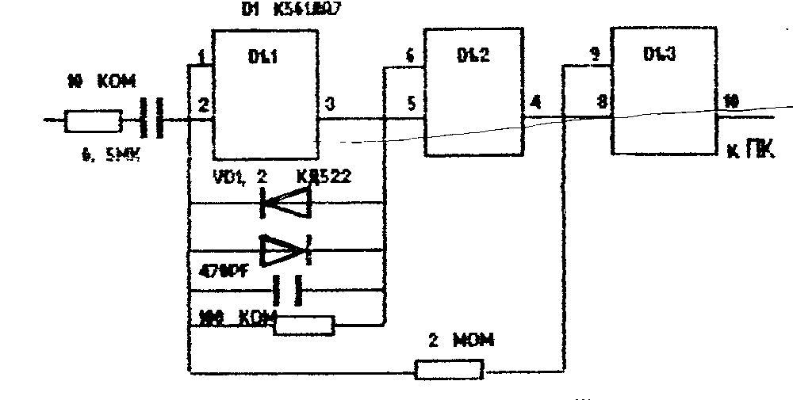
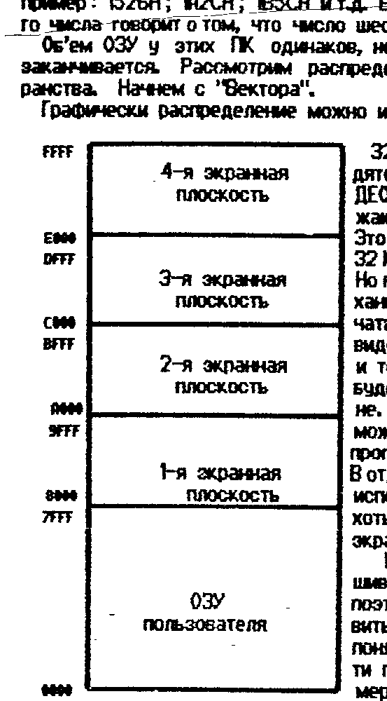
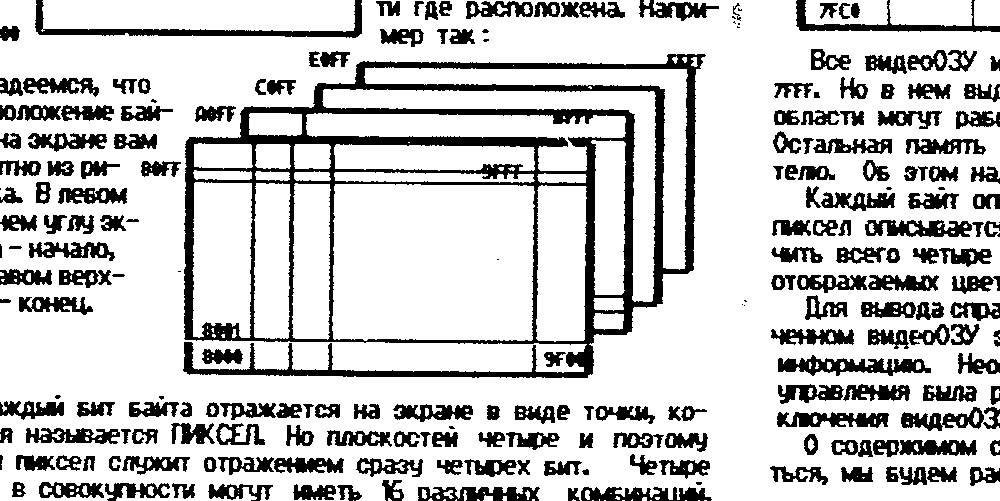
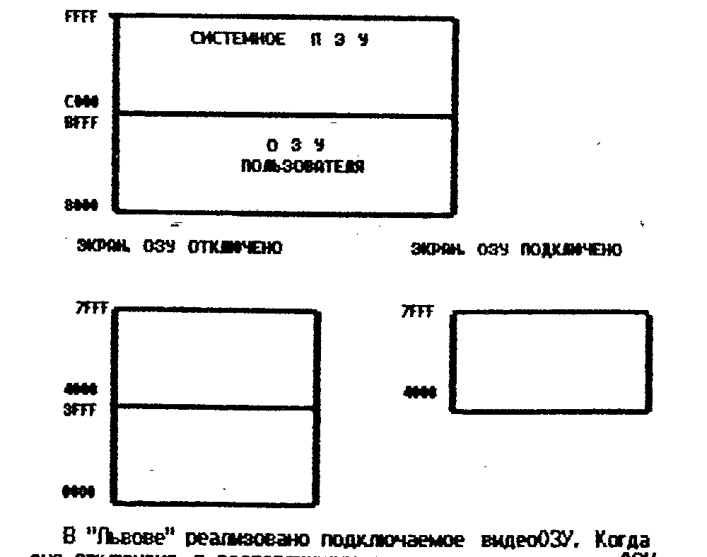

Бюллетень фирмы «COMAN», 111402 Москва а/я 20, т. (095) 195-38-33.

## Компаратор для чтения

В прошлом номере мы рассказали о том, как улучшить качество записи на магнитофон.
Теперь мы расскажем о том, как улучшить считываемость программ.
В первом номере была приведена схема компаратора, который, судя по отзывам, неплохо себя зарекомендовал.
Ниже приводим еще одну схему компаратора.

Данная схема представляет собой тригер Шмитта с усилителем-ограничителем.
Правильно собранная и из исправных деталей, схема не требует настройки.
Питание для микросхемы удобно брать от ПК или вообще от батарейки — ведь микросхемы 561-й серии потребляют микроамперы.

Приобрести готовое устройство вы можете у нас.
Компаратор снабжен кабелями и раз'емами типа СШ-5.

Цена — 600 руб. с пересылкой.

> ## Инструкция к программе DC.COM
>
> Данная программа является дисковой версией популярной программы СИП для ПК «Вектор».
> Для создания нового файла необходимо в текстовом редакторе (любом) создать файл-пустышку с расширением .DC.
> Например: TELEPH.DC.
> Затем следует вызвать этот файл через DC.COM.
> На экран будет выдано сообщение — «создается индексный файл».
> После чего можно приступать к «накачке» вновь созданного файла информацией.
>
> Кстати, очень полезно перед работой с DC.COM запустить программу RUS.COM.

## IBM и Вектор

Предлагаем заинтересованным лицам программу для IBM-совместимых ПК, позволяющую читать, хранить и записывать программы и тексты в формате CP/M-53, МикроДОС (и еще > 250 форматов).

Пишем на Векторе — работаем на IBM (и наоборот).
Программа поставляется на двух дискетах по 360 Кб.
Цена — 2000 руб. на дискетах поставщика, и с пересылкой.
Предупреждение: дисковод на IBM должен быть на 96 дорожек.

## Краткая инструкция к XSID.COM

Данная программа есть мощный инструмент для тех, кто работает с кодами, ассемблером или хочет их освоить.
Владельцам «Вектора» xsid знаком, т.к. Монитор-отладчик — это практически то же самое.
Для «Львовцев» — это новинка.

Примечания: под обозначением ХХХХ подразумевается различные расширения файлов.
АН — адрес начала, АК — адрес конца.
[...] — необязательный параметр.

- ЧТЕНИЕ ФАЙЛА; команда #XSID NAME.XXX — при этом загружается и запускается сам xsid и загружается указанная программа с адреса мон.
  Если xsid уже был загружен, то перед считыванием файла надо задать его имя командой #NAME.XXX.
  Само чтение производится по команде #R.
  Если вы хотите считать файл со смещением, то команда выглядит так: #RXXXX, где ХХХХ величина смещения.
  Файл будет расположен начиная с адреса ХХХХ плюс мон (следите, что бы он не «лег» на сам xsid!).
- ЗАПИСЬ ФАЙЛА; надо указать имя, под которым файл будет записан на диск командой #NAME.XXX, запись производится по команде #WАДР.НАЧ, АДР.КОН.
  Например: #W100, 4FFF (8К).
- ЗАПОЛНЕНИЕ ПАМЯТИ КОНСТАНТОЙ; осуществляется по команде #FАДЛ.НАЧ, АД.КОН, CONST.
  Например: #F200, 1500, C3 (8К).
- ДАМП ПАМЯТИ; производится командой #DАДЛ.НАЧ, [АД.КОН].
- ДИЗАССЕМБЛИРОВАНИЕ ПАМЯТИ; по команде #LАДЛ.НАЧ, [АД.КОН].
- СРАВНЕНИЕ ОБЛАСТЕЙ ПАМЯТИ; производится по команде #ЕАДЛ.НАЧ, АД.КОН, АДР.НАЧ2.
- ПЕРЕМЕЩЕНИЕ ОБЛАСТИ ПАМЯТИ; по команде #МАН, АК1, АН2.
- ВЫЗОВ ПОДПРОГРАММЫ; #CAN — управление передается п/программе, расположенной с адреса АН, п/программа должна заканчиваться командой RET (возврат).
- ЗАПУСК ПРОГРАММЫ; по команде #GAN, [АДР1] управление передается программе, расположенной с адреса АН.
  Если в какой либо момент программный счетчик [PC] будет равен АДР1, то управление возвращается к XSID-у.
- ЗАПУСК ПРОГРАММЫ ПОД КОНТРОЛЕМ; #UAN, [АДР1].
  Действие аналогично команде #G, с той разницей, что остановка программы и возврат в XSID может произведен не только по адресу АДР1, но и по нажатию любой клавиши, что удобно при зацикливании программы.
- ТРАНСЛЯЦИЯ; задав команду #AAN, начиная с адреса АН можно вводить текст программы в мнемокодах процессора.
- СПРАВОЧНАЯ ИНФОРМАЦИЯ; по команде #HЧ1, Ч2 вычисляется сумма и разность чисел Ч1 и Ч2.
- ПОИСК ПАРАМЕТРОВ; задается командой #QAH, АК, поиск будет производиться от АН до АК.
  После появления двоеточия надо задать параметр:
  - =B1 B2 ... BN, где B1, B2 — байты-образцы;
  - :опострофмнемокод команды процессора;
  - "ТЕКСТ" — поиск текста.
- РЕДАКТИРОВАНИЕ ПАМЯТИ; производится по команде #SAH.
  Будет выдан адрес и содержимое ячейки памяти с этим адресом.
  При нажатии CR производится переход к следующей ячейке, для редактирования перед нажатием CR необходимо задать новое содержимое ячейки.
  Выход из режима — (.) точкой CR.
- ИЗМЕНЕНИЕ СОСТОЯНИЯ РЕГИСТРОВ ПРОЦЕССОРА;
  - #X — вывод содержимого регистров и состояния флагов, где C, Z, M, E, I — флаги переноса, нуля, минуса, четности, внутлерен.
    Если в соответствующей позиции стоит «—» — флаг сброшен.
  - #XC, #XZ, #XM, #XE, #XI — команды изменения состояния флагов;
  - #XA, #XB, #XD, #XH — команды изменения состояния регистров;
  - #XS — изменение состояния указателя стека;
  - #XP — изменение состояния регистра адреса команды [PC].
- ПОШАГОВОЕ ВЫПОЛНЕНИЕ ПРОГРАММЫ;
  - #TN — выполняется N шагов программы с адреса [PC] с отображением состояния всех регистров процессора;
  - #TN, АДР — аналогично предыдущему, но при каждом шаге выполняется подпрограмма, расположенная с адреса АДР (она должна завершаться командой RET);
  - #TWN — выполнение N шагов пр. но все встреченные п/прог. выполняются в реальном времени, т.е. без трассировки.

## Внимание! Летний период!

Во время летнего периода возможны некоторые непредсказуемые изменения в порядке работы нашего офиса (часы и дни работы, т.к. в нашей фирме отпуска не практикуются).

Поэтому, во избежание недоразумений и бестолковой траты времени, перед визитом к нам обязательно позвоните и убедитесь, что мы будем работать в интересующее вас время.
Информацию об этом сообщит вам либо дежурный, либо автоответчик.
Будут сообщены также текущие цены на товары и услуги.
Не забудьте предупредить телефонистку о наличии автоответчика — пусть сразу подключит вас к линии.

## «Заморочки»

Мы открываем новую рубрику, в которой будем описывать различные ситуации и дефекты, которые обычно морочат голову владельцу ПК.
Будем очень благодарны (и не только мы) за присланный нам материал с вашим бесценным опытом.

.... В некоторых экземплярах ПК «Вектор» производства гор. Кирова обнаружен следующий дефект.
Нет связи между системным раз'емом и шиной Д2 ПЗУ загрузчика — забыли поставить перемычку.
Из-за этого возникают проблемы с подключением дисковода и т.п.
Для устранения дефекта необходимо установить перемычку между контактом 27 сист. раз'ема и 11-й ножкой м/с загрузчика.

.... Достаточно часто встречается такой дефект — при включении ПК все работает нормально, но через несколько минут начинаются сбои в работе или другие аномальные явления.
Однозначно можно утверждать, что дело в тепловых контактах или неконтактах как на плате, так и внутри микросхем.

Выявить такую м/с или место можно достаточно просто.
Сначала надо изготовить тампон, намотав на спичку побольше ваты, и запастись ацетоном (50 - 100 гр. будет достаточно).
Ацетон не проводит ток и быстро испаряется, отбирая у смазанной им поверхности много тепла.
Затем следует загрузить и запустить какую-либо программу, желательно небольшую, но постоянно выдающую на экран какие-то результаты своей работы, по которым можно отслеживать наличие или отсутствие сбоев в работе.

После появления сбоев, следует начать смачивать подозреваемую м/с ацетоном.
Очень полезно еще и подуть на нее, ускоряя процесс испарения и отгоняя от себя токсичные пары ацетона.
Если дефект не исчез, можно переходить к следующей подозреваемой м/с и т.д.
Начинать полезнее всего с самой горячей м/с.

Смотрите не станьте токсикоманом!

.... Как удалить м/с с платы?
ПК и многие другие устройства имеют, как правило, двухстороннюю п/плату с металлизацией отверстий.
Удалить м/с с такой платы не повредив ее (плату) — не вдруг.

1) Вы абсолютно уверены, что данная микросхема «дохлая» или вам ее просто не жалко.
В этом случае ее можно просто выкусить кусачками с тонкими усиками.
Причем кусать лучше у самой м/с.
Захватив пинцетом торчащий из платы вывод и одновременно прогревая его (но не плату!) паяльником, удалить останки.
Выводы удалять не подряд, а в шахматном порядке, то из одного ряда, то из другого.
Старайтесь не спешить и ни в коем случае не перегревайте плату.
Тонкие дорожки и особенно металлизация очень болезненно переживают перегрев и отлетают от платы, как птицы.
А вернуть их на место «практически невозможно».

После экстракции надо подготовить отверстия под новую м/с.
Сделать это можно при помощи спички, заточеной под диаметр отверстия или чуть меньше.
Аккуратно прогрев отверстие до расплавления припоя, выталкивают его спичкой.

2) Микросхема не дохлая или слишком дорогая, что бы быть уничтоженной только по подозрению.
В этом случае применяется другой метод, более трудоемкий, но сохраняющий и м/с, и плату.

- при помощи медицинской полой иглы.
  Необходимо подобрать иглу с таким диаметром, в которую входят выводы м/с (своей тонкой частью), а сама игла — в металлизированное отверстие.
  Обильно смочив вывод канифолью, начинают прогревать его паяльником одновременно надевая на него иглу.
  Игла, изготовленная из нерж. стали не облуживается и после застывания припоя вывод м/с вынимается, оставляя тонкую часть выводов свободным.
  Этот способ хорош тогда, когда м/с запаяны «высоко», только тонкой частью выводов или плата покрыта лаком.
- при помощи шприца-отсоса.
  Шприц имеет наконечник из фторопласта и свободно выдерживает несколько тысяч паек.
  Технология работы следующая.
  Закрепляют плату вертикально в тисках или струбцине.
  Прижав наконечник отсоса к выводу м/с, начинают его прогревать со стороны микросхемы.
  После того, как расплавится вся масса припоя в отверстии (2 сек.), нажимают кнопку отсоса и припой под действием вакуума устремляется в отсос.

> ШПРИЦ-ОТСОС незаменим при ремонте и демонтаже м/схем.
> Цена - 800 руб. зап. наконечник - 300 руб.
> ПЕРЕСЫЛКА - 100 РУБ. Оплата переводом.

Как быть, если все же произошло отслоение металлизации в отверстии или контактной площадки.
Исправить положение можно при помощи тонкой луженой проволоки.
Продев ее в отверстие, припаивают оба конца на разных сторонах платы.
Вывод м/с вставляют в отверстие и пропаивают.

И в заключение один совет — если вы не чувствуете уверенности в том, что сможете — лучше не делайте.
Иногда приносят на ремонт настолько «перепаханные» ПК, что руки опускаются.
Опять же это дороже.

## Сборник 1 для ПК Львов

*PAIRS* — Мальчик, бегая по карточному полю, может открывать карты.
Если открываются парные карты, то они исчезают.
Все кажется просто, но с ростом уровня появляются разные козявки...

*ROTORS* — Эта игра напоминает предыдущую, но все карты открыты и перемешаны.
Надо расположить их в ряды по горизонтали, вертикали или диагонали.

*FROGGER* — Многоэтажная красочная игра.
В луже вывелось множество лягушат, и все они хотят перебраться в большое болото.
Вы должны помочь им в этом.
Много опасностей подстерегает их на пути — коршуны, ежи, цапли, ужи, быстрые реки и т.д.
Чем больше вы их проведете, тем больше очков заработаете.

*ERIC* — Мальчик по имени Эрик попал в подземелье, где по легенде, полно сокровищ.
Однако там полно не только сокровищ, но и разной нечисти.
Но у Эрика неограниченный запас бомб.

*RANGER* — Матерому диверсанту поручается уничтожить об'екты противника.
Запасшись оружием и расходными материалами — фугасами, патронами, аптечками и т.д., вы десантируетесь в тыл противника.
Найдя и уничтожив об'екты, надо пробиться в условное место и дождаться вертолета.
В случае успеха вас ждут почести, слава и... новое задание.

*BATTLE TANK* — Армия наступает.
Ваш танк первым ворвался в город.
Развивайте наступление, освобождая квартал за кварталом.
Но смотрите не зарывайтесь и не попадите в окружение.

*COOKIE* — Вы повар, и решили приготовить вкусный обед.
Да вот беда — все продукты свихнулись и разбрелись по всей кухне.
Собрать их все вместе — задача непростая, но опытному повару по плечу.

*FARMER* — Вы крутой фермер и растите свой урожай.
Но паразиты так и льнут к нему.
Вы можете защитить урожай при помощи пестицидов.
Главное правильно их применять.

> Стоимость сборника: 2000 руб. на кассете МК60 или на дискете.
> Запись с дублем и самокопированием.
> Цены действительны до 01.09.93 г.
> Сборник начинает рассылаться после получения 200 оплаченных заказов.
> Господа пираты! Если вы занимаетесь тиражированием на коммерческой основе, рекомендуем заказывать не один, а 5-10 сборников.
> Для вас убытка не будет, но тем самым вы простимулируете создание новых программ.
> «Львов» не «Синклер» и даже не «Вектор».
> Если его не поддерживать программно, он через 1-2 года загнется, и ни Мамонтов, и ни Чистяков его не спасут.
> Поймите нас правильно, но ведь могилу ему роете, господа.

## Букварь программиста

По многочисленным просьбам, мы реанимируем рубрику «БП».

Как мы уже говорили ранее, язык Ассемблера — это не язык комп'ютера, а язык процессора, который в нем установлен.
Но практически невозможно написать программу на Ассемблере или в кодах, если вы не знаете распределения памяти, портов, прерываний и т.д.
Обычно та или иная версия Бейсика, адаптированная для конкретного ПК все это сама отслеживает.
На Ассемблере — вы отвечаете за все.
Поэтому начнем с потрохов ПК, какого они цвета.

И на «Львове», и на «Векторе», ОЗУ пользователя, т.е. память, доступная программисту, имеет об'ем 64 Килобайта.
Каждая ячейка имеет свой (и только единственный) адрес, обозначаемый четырехразрядным шестнадцатиричным числом.
Например: 1526Н; 1А2СН; 1В5СН и т.д.
Буква «Н» в конце каждого числа говорит о том, что число шестнадцатиричное.

Об'ем ОЗУ у этих ПК одинаков, но на этом их сходство и заканчивается.
Рассмотрим распределение адресного пространства.
Начнем с «Вектора».

Графически распределение можно интерпретировать так:

32 Кб (от 8000 до FFFF) находятся под воздействием ВИДЕОКОНТРОЛЛЕРА, и отображаются на экране монитора.
Это ЭКРАННОЕ ОЗУ.
Другие 32 Кб — ОЗУ пользователя.
Но на «Векторе» имеется механизм, позволяющий отключать экранные плоскости от видеоконтроллера (далее ВК) и тогда их содержимое не будет отображаться на экране.
Отключенную плоскость можно задействовать под программу (а это 8 Кб).
В отдельных случаях можно использовать под программу хоть все 64 Кб.
Правда, на экран ничего не вывести.

Вообще говоря, ВК опрашивает все плоскости сразу, поэтому удобнее представить это так, что бы было понятно, какая ячейка памяти где расположена.
Например так:

Надеемся, что расположение байтов на экране вам понятно из рисунка.
В левом нижнем углу экрана — начало, в правом верхнем — конец.

Каждый бит байта отражается на экране в виде точки, которая называется ПИКСЕЛ.
Но плоскостей четыре и поэтому один пиксел служит отражением сразу четырех бит.
Четыре бита в совокупности могут иметь 16 различных комбинаций, поэтому число одновременно отображаемых цветов тоже 16.
Применяя специальные программы можно добиться и большего, но об этом позднее.
Такую организацию видеоОЗУ можно назвать «EGA».
Она достаточно широко представлена в ПК 1 В М, поэтому адаптация спрайтов проходит без большого труда.

О том, как вывести спрайт на экран мы расскажем и покажем в следующий раз, хотя вы наверное уже догадались, что для этого достаточно поместить информацию из спрайта в соответствующие ячейки видеоОЗУ.
Это, кстати, можно сделать и из Бейсика при помощи операторов PEEK и POKE.
Необходимо лишь знать структуру спрайта.

На «Львове», как всегда, все по другому.
Дело в том, что у него еще есть 16 Кб ПЗУ с Бейсиком и различными подпрограммами.
С одной стороны это хорошо, с другой — наложило отпечаток на всю архитектуру «Львова».
Распределение памяти у «Львова» следующее:

В «Львове» реализовано подключаемое видеоОЗУ.
Когда оно отключено, в распоряжении пользователя находится ОЗУ от 0000Н до BFFFH и ПЗУ от C000H до FFFFH.
Но в это время ничего нельзя изменить в видеоОЗУ.
Если же оно подключено, то можно изменять его содержимое, но под «невидимую» часть программы остается пространство от 8000Н до BFFFH.
Но и там еще расположен знакогенератор (с 8000 по В3FF).
Для серьезных программ этого иногда не хватает и приходится постоянно «дергать» видеоОЗУ и внимательно следить, в каком оно состоянии.
О том как его подключать/отключать — в следующий раз.

Организация видеоОЗУ в «Львове» такова:

| 4000 | 4001 | ... | 403E | 403F |
| --- | --- | --- | --- | --- |
|  |  | 4287 РАБОЧАЯ ОБЛАСТЬ 4288 |  |  |
|  |  | 7087 7088 |  |  |
| 7FC0 |  |  |  | 7FFF |

Все видеоОЗУ имеет об'ем 16 Кб с адресами от 4000 до 7FFF.
Но в нем выделена область именуемая РАБОЧЕЙ.
В этой области могут работать п/программы, расположенные в ПЗУ.
Остальная память им недоступна, хотя и доступна пользователю.
Об этом надо помнить применяя эти п/программы.

Каждый байт описывает четыре пиксела на экране, поэтому пиксел описывается двумя битами.
Из двух бит можно получить всего четыре комбинации, поэтому и число одновременно отображаемых цветов на «Львове» четыре.

Для вывода спрайта на экран также достаточно при подключенном видеоОЗУ занести в соответствующие ячейки памяти информацию.
Необходимо следить за тем, что бы программа управления была расположена выше 8000Н, иначе после подключения видеоОЗУ вы потеряете управление.

О содержимом системного ПЗУ и о том, как им пользоваться, мы будем рассказывать по ходу дела.

Полученной информации уже достаточно для того, что бы начать писать программу, пусть даже примитивную (пока), чем мы и займемся в следующий раз.
А пока достаньте свои Ассемблеры и редакторы, а так же описания к ним.
Полезно так же обновить знание форматов графических редакторов, которыми вы будете пользоваться.
Мы будем пользоваться: «Вектор» — Монитор-отладчик и «Рембрандт»; «Львов» — «Ассемблер-9Т» и «Пикассо».

Кстати, в связи с тем, что 4-х номеров бюллетеня было отпечатано мало, мы опубликуем инструкции к «Рембрандту», и «Асс-9Т» в ближайших номерах.
