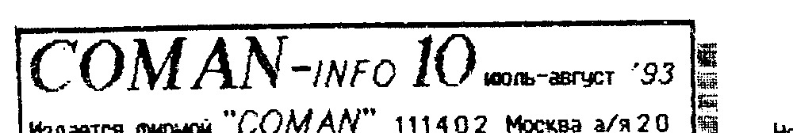
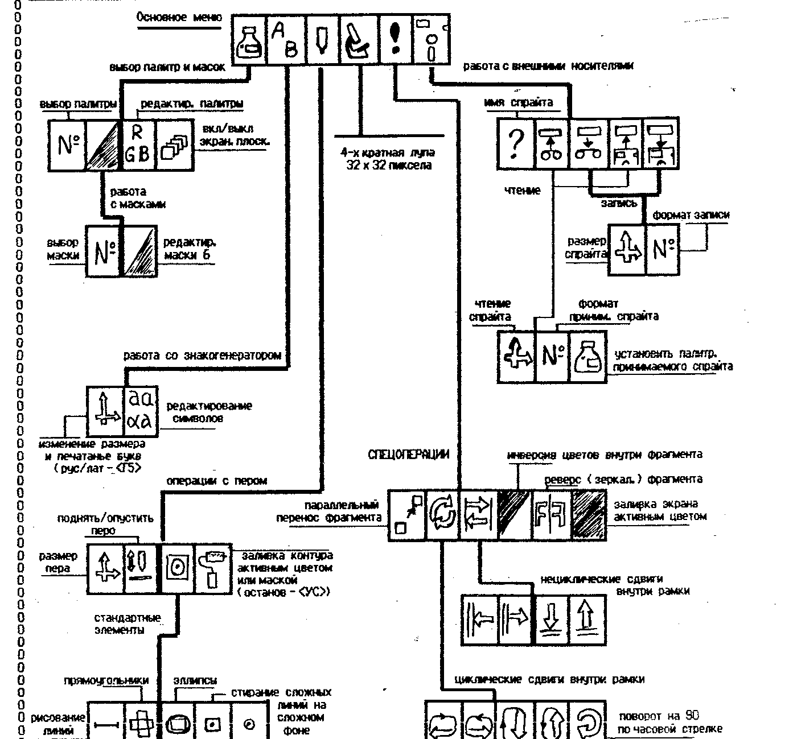
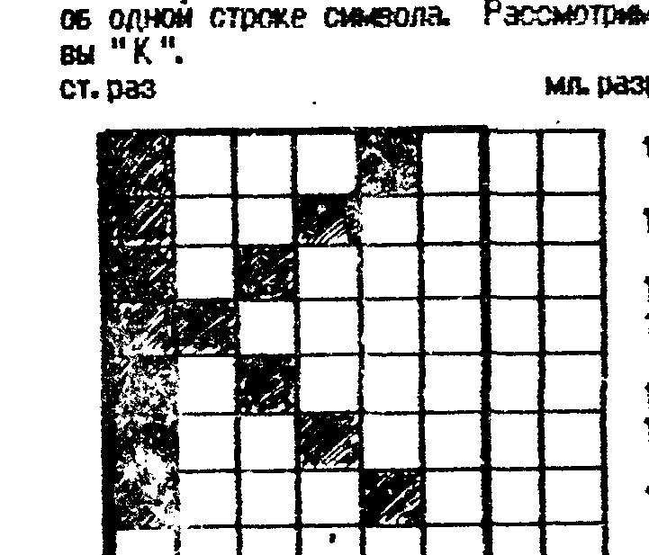

## Информационное сообщение. Мы опять переехали...

В который уже раз нашей фирме приходится покидать насиженное место.
А один переезд, как известно, это два пожара.
В связи с этим мы намерены заявить следующее:

1) У нас новый номер телефона: (095) 302-82-22.

Телефон Неспаренный и дозвониться по нему гораздо проще, нежели по предыдущему, по которому сейчас невозможно дозвониться вообще.

2) Переезд никак не скажется на сроках выполнения заказов, отправленных по почте, т.к. работа уже налажена.

3) Продолжает работать система EXPRESS, (по новому номеру телефона, разумеется, см. бюл. 8).
Десятки заказчиков воспользовались ею, и, надеемся, остались довольны скоростью нашей реакции на их деньги.
Но! Просим учесть два момента:

а) Мы не отвечаем за работу совлочты, поэтому тревогу стоит бить не раньше чем через 3 недели после заказа;

б) Делать заказ по системе и высылать оплату ПОЧТОВЫМ переводом — это глупость!
Система имеет смысл при оплате ТОЛЬКО ТЕЛЕГРАФНЫМ переводом по адресу: 111402 Москва д/востр. Тимошенко Константину Андреевичу.
Никаких «фиом», «Я/Я» и «кооп.» — все это тормозит!

4) К нашему и вашему БОЛЬШОМУ сожалению, мы НЕ сможем вас принимать в новом офисе (одно из условий аренды то, что тут не будет «магазина» или «склада»).
Понимая, насколько это плохо для вас и для нас, мы очень активно (ну прямо о-очень!) работаем в этом направлении, и в ближайшее время постараемся заиметь «открытую» точку.
Следите за рекламой в бюллетенях!

## Мы приступаем к формированию дилерской сети в РФ и СНГ

К нам часто заезжали разные ребята, (причем, одни и те же), которые покупали у нас контроллеры, дисководы, принтеры и др. товар по 5-10-20 шт. одного наименования.
Козе понятно, что для перепродажи.
Сразу скажем — мы только ЗА.
Дилер — это ОФИЦИАЛЬНЫЙ представитель фирмы (не обязательно одной) на конкретной территории, с соответствующими бумагами и т.д.

Что это дает нам: более-менее стабильный сбыт продукции, расширение рынка и рост оборота, рост имиджа фирмы.
Что это дает дилеру: фирма обеспечивает товаром, рекламой, предоставляет серьезные скидки в цене, рост прибыли.
Что это дает клиентам: улучшение качества обслуживания, экономию времени и денег на пересылке, более плотный контакт с фирмой.

Хотим отметить, что стать нашим дилером — не вдруг.
Прежде, чем мы начнем вас рекламировать в вашем регионе, вы должны будете доказать свою лояльность нашей фирме своей работой.
Поэтому людей, думающих, что это «халява» просим не беспокоиться.
Речь идет об очень серьезном сотрудничестве и кроме привилегий от нас, дилер имеет некоторые обязательства перед нами.

Серьезно настроенных людей просим звонить и писать нам.
Желательно уже иметь кое-какие идеи по части ведения вами дел, владение ситуацией в своем регионе, уровнем цен, умение видеть чуть дальше своего носа, и маленький начальный капиталец — 10 - 50 тыс. руб.

## Вектор: смена формата записи

Не пугайтесь! это не очередной «сюрприз».

Неустанно борясь за 100-процентное считывание программ с магнитной ленты, мы провели кое-какие исследования и обнаружили, что:

1) Копировщик 1-91 неверно определяет константу скорости и работает неустойчиво.

2) Две копии — лучше чем одна.

Начиная с рассылки «Сборника 1», мы переходим к следующим правилам выполнения заказов:

В начале каждой кассеты записывается КОПИРОВЩИК 1-91 ИСПРАВЛЕННЫЙ и БЕСПЛАТНО.
С двумя проходами.
Отличить его от дефектного можно по искаженным цифрам 2 и 3.
У правильного — искажены.

Затем идут заказанные вами программы, по две копии и с одним проходом (мы уже писали, что нам технически проще сделать 2-3 копии с 1-м проходом, чем 1 с двойным), в порядке, согласно вашего списка.

Поскольку вы все равно делаете себе копии, то почему бы не сделать их сразу?
Поэтому рекомендация:

Получив от нас кассету(ы), сразу загружайте и запускайте копировщик.
А все последующие программы принимайте прямо в него и тут же делайте копии.
Если первая копия имеет несколько ошибок, то следующая их исправит.

Напоминаем, что переход из режима «чтение» в режим «запись» в этом копировщике производится по нажатию <рус/лат>, выбор скорости — <УС> и <СС>, запись — <рус/лат>.

Мы провели очень серьезные испытания и убедились, что такой метод еще надежнее «двойного прохода».
И доказательство тому — АБСОЛЮТНОЕ отсутствие рекламаций по качеству записи сборника (да и по качеству программ тоже).
Поэтому, даже те, кто имел или имеет на нас зуб по качеству записи — можете его вырвать — у нас теперь 100%!

А скорприз ждет вас на другой странице!

> ## Прайс-лист
>
> Контр. дисковода ПК «Вектор» и «Львов» в комплекте с сист. дискетой — 8000 руб.
>
> Полный комплект дисковода + ПЗУ заг.
>
> - в кустарн. плексиглас. корпусе — 40000
> - в металл. корпусе пром. произв. — 45000
>
> Дискеты (made in United Kingdom) 5,25", неформат. емкость 1 Мб, в пластиков. боксе 12 шт. — за один бокс - 2500 р.
> (оптом - скидка 10%)
>
> Платишь за 10 — получаешь 11!
>
> Остальные цены без изменения.
> Внимание! Перед отправкой перевода лучше уточнить цены по телефону (095) 302-8222 с 9-00 до 19-00 мск.
> В остальное время бюлп работает автоответчик.

## По многочисленным просьбам

владельцев ПК, мы вводим рубрику «ДРУГ ПО ПЕРЕПИСКЕ».

Независимо от типа ПК, мы опубликуем ваш адрес и тип вашего комп'ютера.
Никакие рекламные об'явления не публикуются.

Публикация одного адреса стоит 1000 руб.
Почтовый перевод с пометкой «за публикацию адреса» отправлять на 111402 Москва д/востр. Тимошенко К.А.

В то же время, мы оставляем за собой право на отказ от выполнения некоторых заказов, поступающих, как правило от злостных пиратов, (с немедленным возвратом денег, разумеется).
Т.к. от таких заказов нам больше вреда, чем прибыли.
Такие люди нами рано или поздно вычисляются, и им особенно должно быть интересно стать нашими дилерами.
Тем более что это не уменьшит, а увеличит их прибыли.

## Супер-ПЗУ для Вектора

А вот и сюрприз!

Нашей фирмой разработан вариант ПЗУ для ПК Вектор.
Оно дает вам возможность работать со своим ПК на совершенно ином уровне.
Ниже приводится инструкция к нему.
По ней вы можете судить о возможностях ПЗУ.

- ЗАГРУЗКА CP/M-53 осуществляется по нажатию кл. <БЛК>+<СБР>.
  При этом очищается экран и мигает светодиод «РУС/ЛАТ».
  При нажатии <БЛК> + <ВВОД> управление передается CP/M.
  Эта функция работает, естественно, только при включенном питании дисковода.
- ЗАГРУЗКА С КАССЕТЫ. Если у вас пока нет дисковода, или его питание выключено, нажатие тех же клавиш активизирует обычный ROM-загрузчик.
  Как им пользоваться, мы надеемся, вы уже знаете.
  Если питание дисковода включено, то вызвать к жизни этот загрузчик можно теми же клавишами, но удерживая кл. <РУС/ЛАТ>.
  При успешной загрузке мигает светодиод и т.д.
- СЕРВИСНАЯ ЗАГРУЗКА с кассеты необходима тогда, когда не удается обычная или необходимо провести спец. операции, взлом защиты, например.
  Переход к сервисной загрузке производится при одновременном нажатии клавиш <УС>+<СС>+<РУС>+<БЛК>+<ВВОД>.
  После этого следует нажать одну из клавиш, соответствующую желаемому режиму:
  - <0> — подготовка старта программы с адреса 0E000H.
    Этот режим удобен для взлома защит и т.д.
    При этом режиме, после приема программы и ее запуска, управление передается не программе, а в ячейку с адресом 0E000H.
    При этом, правда, «портится» содержимое в ячейке 0000Н.
    Но это только тогда, когда программа начинается с нулевого адреса.
    Да и один байт восстановить недолго.
  - <1> — ввод с МЛ без очистки ОЗУ.
    При этом, если считывание произошло с ошибкой, сброса не производится.
    После конца программы можно откатить ленту назад, на НАЧАЛО ПРОГРАММЫ и повторить ввод.
    Этот режим удобен при наличии нескольких копий программы подряд с одним проходом.
  - <2> — ввод с МЛ до первой ошибки без сброса.
    Если произошла ошибка, то дальнейший ввод прекращается и надо немного откатить ленту назад, но в пределах блока, где она произошла.
    Этот режим удобен тогда, когда имеется всего одна копия программы.
- ЗАГРУЗКА С ROM-ДИСКА. Дисковод, что и говорить, довольно дорогая вещь, поэтому в ближайшие месяцы мы начинаем серийное производство ROM-дисков.
  Цена такого диска об'емом 64 Кб будет не более 10 - 12 тыс. руб.
  В преддверии этого мы ввели функцию чтения внешнего ПЗУ.
  Весь ROM-диск условно делится на 256 блоков с номерами от 000 до 255.
  Это позволяет иметь на диске до 256 программ.
  Об'ем программы не должен превышать 160 блоков — т.е. 40 Кб.
  Размещение программы при загрузке производится с адреса 0000Н, и после запуска управление передается по этому адресу.
  Это надо учитывать при самостоятельном программировании ПЗУ.

  Загрузка с ROM-диска осуществляется при нажатии клав. <СС>+<БЛК>+<ВВОД>.
  После появления звукового сигнала, следует ввести 3 цифры (на экран цифры не выводятся, но нажатие сопровождается звуком) — номер блока, начиная с которого расположена в ПЗУ программа.
  После ввода последней, 40 Кб. содержимого ПЗУ, начиная с указанного блока перегрузятся в ОЗУ и управление автоматически перейдет к загруженной программе.
  Конечно, если длина программы меньше, чем 40 Кб., все остальное будет «мусором».

  СЛЕДИТЕ ЗА ИНФОРМАЦИЕЙ В НАШИХ БЮЛЛЕТЕНЯХ!
- ПЕЧАТЬ ЭКРАНА. Это, пожалуй, самая эффектная и эффективная функция супер-ПЗУ (при наличии принтера, конечно).
  Представляете, вы теперь сможете получить «твердую» копию экрана на бумаге в ЛЮБОЙ момент времени и из ЛЮБОЙ программы.
  Причем качеством и размером этой копии вы можете управлять.

  Выбрав момент, когда вам надо сделать копию экрана, (это может быть какая-нибудь инструкция, красивая картинка, эффектный момент какой-либо игры и т.д.), следует нажать определенную комбинацию клавиш.
  Порядок нажатия следующий: <...КЛ>+<БЛК>+<ВВОД>, где вместо <...КЛ> может быть

  - <УС> — печатаются плоскости экрана 3, 2, 1, 0
  - <СС>+<РУС> — печать плоскостей 3, 2, 1
  - <УС>+<СС> — печать плоскостей 3, 2
  - <УС>+<РУС> — печать плоскости 3 (пл. «3» — с E000H)

  Это сделано для того, что бы можно было получить картинку без «мусора» в тех программах, которые лежат в экранной плоскости.

  После этого можно нажать кл. <9> (необязательно) — изображение будет инверсным.

  Затем вы можете нажать кл. <8> и вслед за ней клавиши

  - <0> — отключение плоскости 0 (8000Н - 9FFFH)
  - <1> — отключение плоскости 1 (A000H - BFFFH)
  - <2> — отключение плоскости 2 (C000H - DFFFH)
  - <3> — отключение плоскости 3 (E000H - FFFFH)
  - <8> — перенос нижней строки экрана вверх или возврат вниз, это необходимо в некоторых программах.
    Внимание! эта функция работает как тригер!

  После выбора всех этих функций, следует нажать один из клавиш от <0> до <7>, выбрав тем самым один из графических режимов вашего принтера (о них вы можете прочитать в инструкции принтера или «пощупать в натуре»).
  После этого принтер начинает печатать.
  Если вы хотите получить еще одну копию, надо нажать <УС>+<ВВОД> и далее по инструкции.

  Следует отметить, что при печати принтер печатает с тремя градациями яркости — белый, черный и серый.
  Но отключая те или иные плоскости, можно получить очень качественные и выразительные картинки.
  После печати, программа в ОЗУ портится.

> СУПЕР-ПЗУ — стоимость 1500 руб. с пенелью для установки и пересылкой.
>
> Если вы хотите приобрести несколько ПЗУ, то все последующие (вторая и т.д.) обойдутся вам всего по 500 руб.
> Например, 4 ПЗУ = 1500 + 3 x 500 = 3000 руб.

> Хотим предупредить, в ПЗУ применена защита «плавающими битами», поэтому мы НЕ ГАРАНТИРУЕМ работоспособность «левых» копий и просим нас не беспокоить сообщениями об «ошибках».

## Спрайт на бумаге

Статья с таким названием уже была, но относилась она к «Львову».
И после нее мы получили много писем от «Вектористов» — ... а как же мы?
Теперь и вы можете печатать спрайты на бумаге.

SPRINT.COM — программа вывода спрайта на принтер.
Спрайт должен быть в формате (1) или (2) РЕМБРАНДТА.
Программа принимает спрайт с диска или магнитофона — т.е. она универсальная.
Инструкций к данной программе не требуется, т.к. она построена в режиме диалога и надо только отвечать на вопросы.

Программа осуществляет печать с пятью градациями серого цвета, поэтому с расстояния 50 - 100 см. картинки воспринимаются не как распечатки, а как не очень качественные фотографии!

Программа позволяет изменять графический режим принтера и производить масштабирование спрайта.
Это позволяет печатать разве что не плакаты.

Стоимость копии — 500 руб.

> ПРИНТЕР MC6312 — малогабаритный, бесшумный, с расширенным знакогенератором, семь графических режимов, высокое качество печати, формат А-4.
> Стоимость — 30000 с пересылкой.

## ППЗУ 573РФ2 в ПК «Вектор-06ц»

Установку новой ПЗУ лучше производить на панельку.
Тогда при появлении новых версий установка их - 3 минуты.

Итак, для установки ПЗУ типа РФ2 необходимо:

1) Перерезать дорожку между 18 и 19 выв. м/с Д9 (РТ5)
2) Удалить с платы резистор R5 и м/с Д9
3) Перерезать дорожку, идущую к выв. 21 м/с Д9
4) Дорожку, которая шла к выв. 21 соедин. с выв. 18 Д9
5) Соединить выв. 21 Д9 с выв. 24 Д9
6) Соединить выв. 19 Д9 с выв. 17 Д1 (м/с ...BA87, рядом)
7) Соединить выв 22 Д9 с выв. 18 Д1

## Графический редактор «Рембрандт». Цена копии - 200 руб.

На сегодняшний день этот редактор является наиболее мощным средством для создания спрайтов для Вектора.
Обилие функций и его мультиформатность позволяют использовать его для самых разных целей.

ОБЩИЕ ПОЛОЖЕНИЯ: 1) Выбор функции и активные действия в ней - кл. <пробел>; 2) Возврат в предыдущ. состояние, функцию - кл. <АР2>; 3) Перемещение - <курсор>; 4) Фиксирование и расфиксирование левого нижнего угла при изменении размера пера, рамки, окна и т.д. - кл. <ГD>; 5) Выбор функции можно осуществлять не только через основное меню, но и напрямую - через команду функции.

Структура основного меню и связанных с ним подменю:

ФОРМАТЫ ЗАПИСИ СПРАЙТА: Графредактор имеет 5 форматов.

1) Формат Мон.-Отладчика. В байте плоскостей, в младш. тетраде на месте задействованных - «1». Напр. 00000110 - 2 и 3
2) То же, но в байте плоскостей просто указано число задействованных плоскостей, начиная с 0-й. Напр. 00000011 - 3 пл.
3) Формат совместимый с форматом ГР «КОМАН» (в каталоге 1-4)
4) Вывод / ввод знакогенератора графредактора
5) Только на вывод! вывод в формате текстового редактора для последующего транслирования

| 15-й цвет | 0-й цвет | 1 байт разм X | 1 байт разм Y | 1 байт плоск. | 1-я строка 1-й плоскости | 1-я строка 2-й плоскости | 1-я строка 3-й плоскости | 1-я строка 4-й плоскости | 2-я строка 1-й плоскости | ... | посл. строка 4-й плоскости |
| --- | --- | --- | --- | --- | --- | --- | --- | --- | --- | --- | --- |
| 16 байт палитры |  |  |  |  |  |  |  |  |  |  |  |

## Знакогенератор ПК «Львов»

Внешний вид символов, выводимых на экран комп'ютером, имеет большое значение для эстетического восприятия программ.
Поэтому иногда хочется создать свой, «фирменный» шрифт.
Как это сделать?
Очевидно, надо что то изменить в знакогенераторе ПК.
Но для этого надо знать, как он работает.

Знакогенератор ПК «Львов» располагается в ячейках памяти с адресами от B000H до B3FFH.
Содержимое его загружается в эти ячейки из ПЗУ в момент перезапуска ПК.
А это значит, что его можно заменить.

Видеоконтроллер формирует изображение символа на экране из 8-ми байт, включая один «защитный» (что бы буквы не сидели друг на друге).
Каждый байт несет информацию об одной строке символа.
Рассмотрим это на примере буквы «К».

Как видим, два младших разряда байта игнорируются видеоконтроллером, и любая информация в этих битах не вызовет на экране никаких изменений.
Биты байт, обведенные жирной чертой, наоборот, воспринимаются как изображение знака, и любое их изменение тут же приведет к изменению конфигурации знака.
Таким образом можно «сконструировать» любой знак.
Например наклонный, утолщенный или даже иероглиф.
Строчка внизу и правый столбец, как вы заметили, «нулевые» - это интервалы, которые не позволяют буквам сливаться на экране.
Но они могут быть отредактированы таким образом, что на экране не будет интервала между буквами.
Такой прием позволяет решить ряд проблем с выводом изображения на экран, особенно на Бейсике.

Часто в программах на Бейсике картинки рисуют при помощи операторов линий, окружностей и т.д.
Если картинка статическая, неподвижная, то это еще ничего.
Но вот когда «герои» программы должны двигаться - тут пошла потеха.
Тут каждый сам себе барин.
Кто обозначает об'екты разными буквами - и буква бегает за цифрой и наоборот.
Кто пытается накропать подпрограмму в кодах для вывода спрайта на экран.
А кто вообще обходится разными словесными выражениями.

Между тем, знание устройства знакогенератора, позволяет (в известной мере, конечно) облегчить жизнь, особенно начинающим.
Если ваш об'ект маленький - «зашейте» его вместо какого нибудь символа, который не используется в вашей программе.
А если большой? - используйте несколько символов, разбив его на соответствующие блоки 6 х 8 пиксел.

Поместить изображение в знакогенератор можно при помощи операторов POKE (см. описание Бейсика).

Вывод на экран осуществляется оператором LOCATE и PRINT.
После чего в нужное вам место экрана будет выведена ваша козявка.
При перемещении не забывайте подчищать за ней экран.

Остается только добавить, что перечень знаков в знакогенераторе соответствует стандартной таблице КОИ-7 или КОИ-8, и мы ее не приводим - их вы можете найти и в описании Бейсика, в руководствах к принтерам и т.д.
Но даже если вы не нашли их, то найти, где «лежат» конкретные буквы в знакогенераторе, не так сложно.
Удобно проводить коррекцию с помощью «Монитора+» или «Пикассо» (правда в нем нельзя удалить защитные интервалы, но зато можно вывести готовый знакогенератор).

## Ремонт клавиш

Клавиши являются одним из больных мест практически любого ПК.
Особенно сильно страдает от этого ПК «Львов», т.к. имеет клавиши нестандартного размера.
Клавиши к тому же имеют механический контакт, работающий на изгиб, посему иногда ломающийся.
А заменить ее нечем, потому как нестандартная, и контакт механический притом.

А может заменить сам контакт?
Уж он то стандартный.
Обычно ломаются верхние усики.
Технология замены такова: осторожно снять крышку клавиши стараясь не сломать направляющую; скальпелем осторожно удалить пластмассовые нашлепки, образовавшиеся при установке верхних контактов, ВНИМАНИЕ — если остался один усик, то его лучше обломать, но не удаляйте основание усиков.
Затем следует снять крышку с кнопки-донора (маловероятно, что бы вам удалось найти просто контакты) и тем же скальпелем срезать пластмассовые заклепки.
Снимите верхние усики (проще говоря разберите клавишу по частям) и удалите у них выводы, предназначенные для установки на плату.
Паяльником обильно облудите ту сторону площадки, которая окажется внизу при установке усиков взамен сломаных.
Следует так же осторожно облудить и остаток основания прежних усиков.
Затем наложив новые усики на основание старых и придерживая их пинцетом, прогрейте паяльником до расплавления припоя и остудите.
Припаивать следует быстро, но аккуратно, что бы не навешать «соплей».

Таким образом можно продлить жизнь клавишам на пару лет (хотя как нажимать).

Теперь осталось добыть эти самые клавиши-доноры и дело сделано.
Прекрасно подходят для этой роли клавиши типа ПК-8.
У нас есть их небольшой запасец, поэтому желающие могут их приобрести обычным порядком.
Цена 1-ой штуки - 50 руб., не забудьте про оплату пересылки.

## Программы для Вектора

| Индекс | Название | Описание |
| --- | --- | --- |
| 196 | Starwars (100) | Суровый бой с космическими пиратами, напавшими на ваш корабль. |
| 197 | Saboteur (100) | Приключения в 3-х мерном лабиринте, очень сложном. |
| 198 | Down to E.-2 (100) | Очередная версия. |
| 199 | Forpost (200) | Оборона внеземной станции, отличная графика и веселый сюжет. |
| 200 | Sprint (500) | Программа, позволяющая получить из спрайта почти что фотографию на принтере. |
| 201 | Tetris-P (100) | Еще одна версия, очень удачная, кстати. |
| 202 | Chronos (100) | Полет космического корабля в сложном лабиринте. |
| 203 | Mikey (100) | Имитация известной карманной игры. |
| 204 | Атака ниндзя (100) | Оборона крепости от ниндзя. |
| 205 | Death fight (100) | Полет над планетой, захваченной инопланетянами и поиск их логова. |
| 206 | Flight (100) | Очень динамичная «стрелялка». |
| 207 | Maze (200) | Еще один 3-х мерный лабиринт, кстати о-о-очень неплохой. |
| 208 | Ужас-3 (100) | Слава Богу, этот ужас никак не напоминает первые два. Хорошая графика и сюжет. |

> В связи с очередным подорожанием конвертов с 9 до 18 рублей, подписная цена на бюллетень составляет 40 руб. за номер.
> Оплату направлять по адресу: 111402 Москва а/я 20 Тимошенко К.А. «за бюллетень».
> Просим так же учитывать, что при подписке «фиксируется» цена БЮЛЛЕТЕНЯ, но не конвертов.
> Кроме того, если вы хотите получить от нас членораздельный ответ по почте, просим прикладывать конверт с соответствующими марками.
