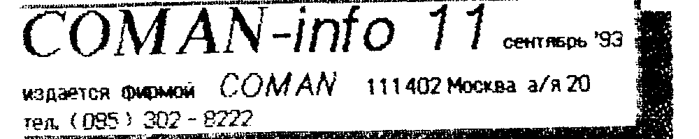

Издается фирмой COMAN, 111402 Москва а/я 20, тел. (095) 302-8222.

## Начинается подписка на иллюстрированный каталог программ для ПК «Вектор-06ц»

Вернее, это не каталог, а Антология программ для ПК «ВЕКТОР», которые существуют на свете.
Издается в виде брошюр, в каждой из которых приводится подробное описание 50 - 100 программ.
К каждой программе приводится инструкция по пользованию, управление, описание выигрышной стратегии.
Приведены распечатки спрайтов, по которым можно судить о качестве графики той или иной программы.
По мере возможности, приведены приемы создания «бессмертия» или редактирования уровней, и многое многое другое.

Заказывая каталоги в различных фирмах, вы, как правило, получаете 2-3 курьезных листочка, где скороговоркой в одну строку сделана попытка об'яснить, а что это за программа.
Причем (то же как правило), чем хуже программа — тем «круче» реклама.
Получая регулярно нашу Антологию, вы убережете себя от покупки откровенной «туфты».
Тем более, что программы недешевы.

Мы планируем выпустить описания ВСЕХ программ, имеющихся в нашем распоряжении (примерно 4-5 брошюр) еще до конца этого года.
Дальнейшие выпуски — по мере появления новых программ (примерно раз в 2-3 месяца).

Стоимость подписки — 3000 рублей.

Скажете дорого?
Вы НЕ купите 10-20 плохих программ и уже вернете свои деньги.

Подписка на Антологию — вечная.

Подписавшись всего лишь один раз, вы обеспечите себя достоверной информацией на годы.

Если вы хотите подписаться не на один, а на несколько экземпляров, вам это будет значительно дешевле.

| Кол-во экземпляров | Стоимость подписки |
| --- | --- |
| N = 1 | 3000 руб. |
| N <= 10 | первый - 3000 р., ост. - 2000 р. |
| 10 <= N <= 50 | первый - 3000 р., ост. - 1500 р. |
| N > 50 | первый - 3000 р., ост. - 1000 р. |

Для подписки надо выслать ПОЧТОВЫЙ перевод (не телеграфный) по адресу 111402 Москва а/я 20 Тимошенко К.А. с пометкой «подписка на Антологию».

## Вниманию авторов программ

В целях стимулирования создания программного обеспечения для ПК «Вектор» и «Львов» мы намерены заявить:

Настоящим заявлением фирма COMAN обязуется выплачивать денежное вознаграждение автору программы, тиражируемой фирмой, при предоставлении автором исходных текстов программы в формате текстового редактора (для последующей трансляции).
Текст должен быть записан на кассету или дискету.

Размер ден. вознаграждения составляет 50% от стоимости программы по каталогу за каждую проданную копию программы.

Директор фирмы Тимошенко К.А.

## Установка ПЗУ 573РФ2 в ПК Вектор с ПЗУ 556РТ7А

В ПК «Вектор-06.02» установлена ПЗУ 556РТ7.
При установке новой м/с типа РФ следует быть внимательным, т.к. не все ножки совпадают.

Перед установкой РФ2 следует отогнуть ножки 21, 18, 19 в сторону.
Затем:

- соединить дорожку, которая шла к выводу 21 с выводом 19 РФ2;
- соединить выводы 21 и 24 РФ2;
- установить в любом удобном месте м/с типа ЛН1, ЛА3, или другую, инвертирующую сигнал, и соединить вход инвертора с дорожкой, которая шла к 18 выводу.
  Выход инвертора соединить с выводом 18 РФ2.

> ## Прайс
>
> - Блок дисковод, контролл., ПЗУ, дискета и УМОЩНЕН. Б.П. (блок может питать и ПК) — 50000 руб. с пересылкой.
> - Принтер МС 6312 (струйный) — 30000 руб. с одной головкой и пересылкой.
> - Головка к струйному принтеру — 1500 руб.
> - Дисковод 80 дор. 2-х сторон (типы различн.) — 25000 руб.
> - Контроллер дисковода (Вектор, Львов) — 8000 руб.
> - Дискеты (неформат. емк. - 1Мб.) — 12 шт. в пласт. боксе 2500 р. за бокс (оптов. скидка (за 10 бокс. и бол. - 10%)
> - Компаратор для чтения с магнитофона (бюлл. 9) — 700 р.
> - Выносная клавиатура (бюлл. 7) — 700 руб.
> - Герконовая клавиша с внеш. герконом — 50 руб. шт.
> - ВЧ-модулятор (ч/б) (бюлл. 3) — 1200 руб.
>
> За пересылку — 150 руб.

Мы приступили к выпуску блоков дисковода на основе корпусов и блоков питания, выпускаемых промышленным способом.
Блок приспособлен для установки 1-2 дисководов.
В блоке установлен мощный блок питания со следующими параметрами:

U1 = +5 Вольт при I1 = 7 Ампер
U2 = +12 Вольт при I2 = 1,5 Ампер
U3 = -5 Вольт при I3 = 1 Ампер
или U3 = +12 Вольт при I3 = 1 Ампер

Как видите, мощность блока вполне достаточна, что бы питать дисковод, контроллер и сам комп'ютер!
Поэтому желающие приобрести подобный блок могут это сделать.

Стоимость Блока в корпусе — 15000 руб.
Блок питания без корпуса — 10000 руб.
Цены указаны с пересылкой.

## Комп'ютеры «ВЕКТОР-06ц» с герконовой клавиатурой есть в продаже!!!

| Комплектация | Цена |
| --- | --- |
| Вектор-06ц с СУПЕР-ПЗУ | 55.000 |
| Он же + блок дисковода | 95.000 |
| Те же + все-все-все программы | 100.000 |
| Он же + принтер с кабелем | 80.000 |
| Он же + бл. дисков. + принтер | 120.000 |
| Те же + все-все-все программы | 125.000 |

НЕ КУПИШЬ СЕЙЧАС — НЕ КУПИШЬ НИКОГДА!

А еще у нас есть в продаже блоки питания МС 92301.
Параметры: 1-й канал - +5 В. х 22 А; 2-й канал - +12 В. х 8 А; 3-й канал - -12 в. х 1А.
Каждый канал имеет защиту от перенапряжения и перегрузки.
Этот блок может питать ВСЕ — комп'ютер, дисководов штук 6, пару мониторов и еще кого-нибудь.
А всего-то - 15000 руб. с перес.

И немного о «гарантии».

Гарантии даются только на законченные устройства!

## Инструкция «Ассемблер-91»

Эта системная программа по прежнему остается одной из основных, позволяющей достаточно оперативно создавать исходные тексты и эффективно их транслировать в маш. коды.
Быстрому набору текста способствует блок стенографии, встроенный редактор и система поиска ошибок.
Эффективность компилятора достигает 8-6 (отношение об'ема исходного текста к длине полученной программы), что считается очень высоким показателем.
Время транслирования максимального по об'ему текста (ок 38 Кб.) — не более 2-х мин.

Ниже мы не будем рассматривать директивы и команды самого языка ассемблера, будут приводиться лишь некоторые примеры для пояснения работы.

После загрузки и запуска, Ассемлер располагается в ячейках ОЗУ ПК с адресами 0000Н - 2776Н.
Выше, до 8000, свободная область, предназначенная для текста, программы и т.д.
Сразу после запуска Асс. переходит в основной режим работы — редактирование и на экране появляется заготовка исходного текста:

```
START : NOP
END
```

Не следует уничтожать эту метку, но строку можно редактировать.

Вверху экрана расположена служебная строка с перечнем функций

F0 — помощь; F1 — чтение исходн. текста с МЛ; F2 — запись исходного текста или программы на МЛ; F3 — работа с блоками; F4 — меню; F5 — отмена выполняемой функции.

ВВОД ТЕКСТА осуществляется в режиме «вставка строк».
Для этого нажмите <СУ>+<пробел>.
При этом в нижней части экрана появится синий курсор.
При помощи алфавитно-цифровых клавиш наберите нужный текст и нажмите <ВК>.
Набранная строка будет вставлена в текст после строки на которой установлен маркер «>» красного цвета.
После этого можно вводить следующую строку.
Для прекращения ввода повторно нажмите <ВК>.

Строка делится на 4-е зоны: зона метки; зона мнемоники команды; зона атрибутов; зона комментариев.
Метка состоит из 6-ти символов (первый обязательно буква) и двоеточие на 7-й позиции.
С 8-й позиции начинается зона мнемоники.
Как упоминалось выше, в Асс. используется стенографический набор команд, т.е. команда набирается нажатием одной-двух клавиш.
Полная таблица приведена ниже.
Подобную таблицу можно получить нажав кл. <F0> в режиме редактирования.
Зона атрибутов присутствует у двух- и трех- байтных команд.
У однобайтных команд она отсутствует.
Зона комментариев должна начинаться с символа «;» и при трансляции все символы за этим знаком на этой строке игнорируются.
Комментарии могут отсутствовать.

В качестве атрибутов можно использовать имена меток, переменных или непосредственно числовые значения.
Число должно начинаться с цифры.
Если число шестнадцатиричное, то в конце д.б. символ «Н», а если цифра начинается с буквы, то вначале ставят «0».
Например:

```
CPI 123    LDA 0A34H    STA 34H
```

В трехбайтных командах можно использовать имена системных подпрограмм, расположенных в ПЗУ.
Эти имена начинаются с символа «@», а имена системных переменных — символа «Д».
Полный перечень системных программ и переменных приведен ниже.

РЕДАКТИРОВАНИЕ СТРОКИ.
Для редактирования строки надо установить напротив нее маркер и нажать пробел.
Редактируемая строка появится внизу.

ПЕРЕМЕЩЕНИЕ КУРСОРА по тексту и строке производится при помощи клавиш курсора.
Клавиша <^> переводит курсор в начало строки.
Клавиша <ТБ> обеспечивает горизонтальную табуляцию — перемещение по зонам.
Если в зоне метки есть имя, то двоеточие ставится автоматически.
Следует проявлять осторожность при редактировании строк, содержащих данные, т.к. в зоне комментариев автоматически ставится «;».
При вводе новых символов происходит сдвижка информации вправо в пределах зоны.
Символы, вышедшие за границу зоны, теряются.
По нажатию <ЗБ> символ слева уничтожается, а информация сдвигается влево.

Окончание редактирования производится по нажатию кл. <ВК>.
При этом строка возвращается на место.
Если вы запутались, и наделали много ошибок, нажмите <F5> и вы сохраните исходный вид строки.

Для удаления строки надо установить маркер на эту строку и нажать <ЗБ>.

ПЕРЕМЕЩЕНИЕ МАРКЕРА осуществляется при помощи кл. курсора.
Можно перемещать маркер в начало текста — <К>; в конец текста — <СУ>+<К>; на страницу вверх — <СУ>+<^>; на страницу вниз — <СУ>+<v>; поиск строки по метке — <М>; поиск строки по номеру — <N>.

РАБОТА С БЛОКАМИ.
Для отметки блока необходимо нажать кл. <Т3>.
В появившемся окне надо указать начало и конец блока, установив на соответствующие строки маркер и нажав <ВК>.
Блок выделяется в тексте красным цветом.
После отметки блока, с ним можно проводить следующие операции: удаление, копирование, перемещение, печать.
При необходимости отметить новый блок, надо отменить уже существующий.

МЕНЮ обеспечивает свободу выбора той или иной функции и вызывается кл. <F4>.
Выбор функции производится при помощи кл. курсора и <ВК>.

ТРАНСЛИРОВАНИЕ производится для компиляции текста программы в коды с возможностью последующего запуска.
Транс. можно проводить с отображением результатов на экране или принтере или без такового (прекращение отображения — кл. <вниз>).
После трансляции программа (об'ектный модуль) сохраняется и может быть выведен на МЛ.

При трансляции, компилятор обнаруживает ошибки.
В этом случае происходит возврат в основной режим, а маркер устанавливается на ошибочную строку с выдачей в нижней строке экрана сообщения о типе ошибке.
Необходимо исправить ошибку и повторить транслирование.

Если трансляция прошла успешно, то сообщается информация о свободной памяти.
Если же программа оказалась слишком велика, то вам придется пожертвовать коментариями или вообще разбить программу на 2 части.

Возможными причинами синтаксических ошибок могут быть: неправильная запись константы; не закрыта апострофом строковая константа; неправильное применение директив, требующих определенных параметров и т.д.

ТАБЛИЦА МЕТОК.
Эта функция очень полезна при определении размеров загрузочного модуля или при создании программ из нескольких модулей.
Таблицу меток можно вывести как на принтер, так и на экран.
Если таблица велика, то на экране ее можно просмотреть при помощи кл. <СУ>+<←>/<→>.

СТАРТ ПРОГРАММЫ.
При написании программы, точку старта программы необходимо отметить меткой «START».
Если вы хотите, что бы ваша программа после запуска и отработки возвращалась в систему, завершать ее следует переходом ЈМР @HSS — точку горячего старта системы.
Если программа завершилась успешно, прозвучит звуковой сигнал и по нажатию <ВК> вы снова выйдете в Ассемблер.
Если программа «зависла», то выйти в Ассемблер можно нажав кл. <Ц>+<СБР>.
Иногда при работе программы может появиться сообщение «СБОЙ».
Это означает, что программа «залезла» на Ассемблер.
Поэтому старайтесь делать копии текста программы как можно чаще, что бы не было мучительно больно за бесцельно прожитое время.

Если в программе применялась директива «ORG», то может появиться сообщение «ЗАПРЕТ СТАРТА».
Это означает, что программа запросила область памяти вне свободной области.
Для запуска такой программы надо вывести ее на МЛ и запустить ее уже с ленты.
Не забудьте вывести на ленту и исходный текст программы для исправления возможных ошибок.

ЗАПИСЬ НА МЛ осуществляется обычным порядком при выборе соответствующей функции.

ЧТЕНИЕ С МЛ может быть осуществлено как с обнулением буфера, так и в режиме добавления к уже имеющемуся тексту.
Это позволяет сохранять на МЛ наиболее удачные фрагменты программы и затем просто добавлять их во вновь создаваемую программу.

Ассемблер может принимать файлы, подготовленные текстовым редактором или графическими редакторами «Мультипликатором» или «Пикассо» (если они выведены в соответствующем формате).

ДИРЕКТИВЫ АССЕМБЛЕРА.
Применяются для управления процессом транслирования и размещения результатов в желаемой области памяти.

ORG — установка адреса программы.
Вся программа будет расположена выше указанного адреса.

Например: имямет: ORG XXYY; комментарии

DS — резервирует указанное кол-во байт, т.е. создает свободное пространство внутри тела программы.

DB — заполняет область памяти данными.

EQU — используется для определения метки или имени переменной, «привязанной» к конкретным адресам, которые могут быть и вне тела программы.

## Стенографический набор текста с клавиатуры

Как говорилось выше, в Асс. реализован стенографический набор мнемоники.
Для начинающего это может быть покажется ненужным усложнением, но на самом деле такая «механика» очень сильно ускоряет набор текста программы.
Надо только «в'ехать» в систему стенографического набора.

### Назначение клавиш

| Клавиша | <СУ>+... | <НР>+... | <ВР>+... |
| --- | --- | --- | --- |
| C | JC | CC | RC |
| M | JM | CM | RM |
| K | JNC | CNC | RNC |
| N | JNZ | CNZ | RNZ |
| P | JP | CP | RP |
| E | JPE | CPE | RPE |
| O | JPO | CPO | RPO |
| Z | JZ | CZ | RZ |

Отдельные однокнопочные мнемоники (без префикса <СУ>/<НР>/<ВР>):

| Клавиша | Команда | Клавиша | Команда | Клавиша | Команда | Клавиша | Команда |
| --- | --- | --- | --- | --- | --- | --- | --- |
| ? | ACI | C | CALL | Q | EQU | 2 | SBB |
| I | ADC | - | CMP | V | IN | 4 | SHLD |
| . | ADI | ПС | CMC | 8 | INR | ( | SPHL |
| 9 | ANA | , | CPI | X | INX | S | STA |
| \ | ANI | 4 | DAA | J | JMP | T | STAX |
| B | DB | U | PUSH | | | | |
| ) | DCR | W | LHLD | R | RAR | / | SUI |
| D | DCX | K | LXI | R | RET | G | XCHG |
| П4 | DI | M | MOV | Ф | RLC | X | XRA |
| G | DS | V | MVI | CD | RRC | ^ | XOR |
| Л/Д | EI | K | NOP | Z | RST | F | XTHL |
| H | HLT | CTP | ORG | | | | |
| 0 | ORA | 3 | SBI | | | | |
| O | ORI | A | ADD | | | | |
| P | POP | 9 | AMA | | | | |
| S | DAD | | | | | | |

*Таблица дана по сканированному оригиналу; отдельные обозначения клавиш в исходнике неоднозначны (кириллица/латиница перепутаны при вёрстке 90-х годов).*

## Зарезервированные имена меток системных переменных и подпрограмм, расположенных в ПЗУ

- @HSS (F800) — горячий старт системы
- @KEY (F803) — ввод символа с клавиатуры
- @KYX (F806)
  - ДRV (BE10) — режим клавиатуры
  - ДBP (BE1E) — звуковой сигнал
- @TTY (F809) — вывод символа на экран
  - ДTX (BE32) — координата X курсора
  - ДTY (BE33) — координата Y курсора
  - ДTC (BE36) — цвет текстовой информации
  - ДPG (BE39) — постраничный вывод
- @PRN (F80C) — вывод символа на принтер
  - ДP (BE41) — режим печати
- @LST (F80F) — системное устройство вывода
  - ДSS (BE1B) — включение вывода на экран
  - ДSP (BEF3) — включение вывода на принтер
- @WK (F812) — статус клавиатуры
- @CSS (F815) — контрольная сумма
- @ADR (F818) — адрес экранного ОЗУ
- @BEP (F81B) — звуковой сигнал
- @SND (F81E) — музыкальный сигнал
- @CPN (F821) — вывод точки на экран
  - ДX1 (BE50) — координата X
  - ДY1 (BE51) — координата Y
  - ДGS (BE52) — цвет графики
- @SLN (F824) — линия
- @SLB (F827) — прямоугольник
- @SBF (F82A) — закрашенный прямоугольник
  - ДX2 (BE57) — координата X диагональной точки
  - ДY2 (BE58) — координата Y диагональной точки
- @CUR (F82D) — прямая адресация курсора
  - ДVC (BE3D) — видимость курсора
  - ДCX (BE3E) — координата X курсора
  - ДCY (BE3F) — координата Y курсора
- @PNT (F830) — закраска области цветом
  - ДPC (BEA3) — цвет границы области
- @COL (F833) — цветовая палитра
  - ДNP (BEC0) — номер палитры
  - ДNF (BEC1) — номер фона
- @CLS (F836) — очистка экрана

О том, как наиболее эффективно использовать встроенные подпрограммы ПК «Львов», мы будем рассказывать в «Букваре программиста».

## Программы для Вектора

| Индекс | Название | Описание |
| --- | --- | --- |
| 209 | Flaer (100) | Динамичная игра-стрелялка для любителей боевых вертолетов. |
| 210 | Back by LSI (100) | Полет летательного аппарата в лабиринте, кишащем врагами. |
| 211 | Cybernoid (200) | Захватывающие приключения робота в лабиринтах. Отличная графика. |
| 212 | Up the River (100) | Полет штурмовика над рекой. А на реке полным полно врагов. |
| 213 | Best of the best (300) | Версия карате еще более крутая, чем «Inter. karate». |
| 214 | Сокровища фараона (200) | Приключения в огромном лабиринте в поисках сокровищ. |
| 215 | Tron (200) | Управляя своей «козявкой» каждый из игроков должен оттяпать кусок неба побольше. |
| 216 | Screen (100) | Демонстрационно-обучающая программа, рассказывающая об организации экрана. |
| 217 | Labir5 (100) | Пара программ для любителей поломать голову над лабиринтами. |
| 218 | Labir6 (100) | Смотри выше на одну строку. |
| 220 | Outrun (100) | Еще одна версия автомобильных гонок. Не «формула», но ничего... |
| 221 | Troll (100) | Самая крутая игрушка из семейства putup-ов. |
| 222 | Demo (100) | Демонстрационная программа, рисующая фантастически красивые фигуры. |

Внимание!
Просим во всех каталогах нашей фирмы произвести исправления: минимальная цена любой программы — 100 руб.
Все, что стоило дешевле, сейчас стоит 100 руб., все, что дороже — без изменений.

## Букварь программиста

Сегодня мы расскажем о том, как устанавливать цветовые палитры в ПК «Вектор» и «Львов».
Эти ПК обладают довольно серьезными графическими и цветовыми возможностями (в отличие от пресловутого «Спектрума») и вопрос этот отнюдь не праздный.
Заодно узнаете, как начинают писать программы на Ассемблере.

Текст программы обычно начинают директивой ORG, обозначая тем самым адрес, откуда начинается программа.
Не лишне напомнить, что принято считать, что чем «старше» адрес, тем он «выше».
Например: ячейка памяти с адресом 2А05Н лежит ниже чем 2А06Н (буква Н означает 16-тиричную систему исчисления).
Задавая директивой ORG какой либо адрес, мы обуславливаем, что все тело программы будет лежать начиная с этого адреса и выше.
Но программа может использовать любые ЯП.
Сразу после ORG вы можете писать все что хотите.

Хотим сразу предупредить, что все наши примеры очень прозрачны, используют наиболее простые и понятные операторы Ассемблера, т.к. наша задача не продемонстрировать свое мастерство, а показать вам, что Ассемблер — это совсем не страшно.

На ПК Львов установить палитру проще простого — достаточно вызвать соответствующую подпрограмму, размещенную в ПЗУ и дело сделано.
Необходимые номера фона и палитры можно взять либо из таблицы, либо из спрайта, подготовленного ГР «Пикассо» (см. бюлл. 3).

Итак, установка палитры в ПК Львов

```
START: ORG 9600H  ; УСТАН. НАЧАЛА ПРОГРАММЫ
       MVI A, 3   ; ЗАГРУЗКА В АККУМ. НОМЕРА ПАЛИТРЫ
       STA BE0H   ; ЗАГР. НОМЕРА ПАЛИТРЫ ИЗ АКК В СИСТЕМ. ЯЧЕЙКУ ПАМЯТИ (СМ. АСС-91)
       MVI A, 2   ; ЗАГРУЗКА НОМЕРА ФОНА
       STA BEC1H  ; ЗАГРУЗ. НОМ. ФОНА В СИСТ. ЯЧ.
       CALL F333H ; ВЫЗОВ П/ПРОГ. УСТАНОВКИ ПАЛИТРЫ
       JMP F800H  ; ВОЗВРАТ В АСС-91 (ГОРЯЧ. СТАРТ)
```

Постарайтесь разобраться, как работает каждый оператор программы, попробуйте написать программу аналогичного назначения, но используя другие операторы.
Испробуйте различные варианты номеров фона и палитры.

Намного сложнее устанавливать палитру на Векторе.
Его отличная графика (среди дом. ПК ему нет равных) потребовала серьезного аппаратного и программного обеспечения.
Мы уже говорили о том, что у Вектора 256 всевозможных цветов при одновременно воспроизводимых 16-ти.
Как все это обеспечивается?
В схеме Вектора присутствует ОЗУ цветогенератора, которое имеет 16 байт памяти.
Каждая ячейка имеет свой номер, который называется МАТЕМАТИЧЕСКИЙ номер цвета.
Почему 16?
Потому, что 4 бита могут иметь 16 комбинаций и только (см. бюлл. 9).
А в каждой из ячеек лежит ФИЗИЧЕСКИЙ номер цвета.
Он может быть любым, от 0-го до 255-го.
Видеоконтроллер выбирает из ЯП его значение и формирует соответствующее соотношение красного, зеленого и синего цветов для каждого пиксела на экране.

Каким образом формируются цвета, наглядно можно увидеть в ГР «Рембрандт».
Нулевой цвет в его палитре — крайний слева.
Палитру для загрузки в ОЗУ цветогенератора можно также взять из спрайта (см. бюлл. 10) или специально ввести 1 байт изображения и посмотреть ее содержимое Монитором или Textas-ом.

Приводим текст программы, которая позволит вам установить требуемую палитру.

```
        PUSH PSW  ; СОХРАНЕНИЕ РЕГИСТРОВ
        PUSH D    ; В СТЕКЕ
        PUSH H
        LXI H, TAB  ; ЗАГРУЗ. АДРЕСА В-ГО ЦВЕТА В РЕГ. HL
        MVI E, N    ; УСТАНОВ. СЧЕТЧ. В РЕГ. E В N
LOP:    MOV A, M    ; ЗАГРУЗ. АККУМ. В-М ЦВЕТОМ
        MVI D, 3    ; УСТАНОВ. СЧЕТЧ. В РЕГ. D В 3
REP:    OUT 0CH     ; ЗАПИСЬ ЦВЕТА В ОЗУ ЦВЕТОГЕНЕРАТОРА
        DCR D       ; ДЕКРЕМ. РЕГ. D
        JNZ REP     ; ЕСЛИ D НЕ РАВЕН 0, ТО ПОВТОР
        INX H       ; ПЕРЕХОД К СЛЕД. ЦВЕТУ
        DCR E       ; УМЕНЬШ. СЧЕТЧИКА ОСТАВШ. ЦВЕТОВ
        JNZ LOP     ; ЕСЛИ НЕ ВСЕ ЗАПИСАНЫ - НА НАЧАЛО
        LDA BOR     ; ЗАГРУЗ. В АККУМ. ЦВЕТ БОРДЮРА И РЕЖИМ 256 Х 256 ИЛИ 512 Х 256
        OUT 02      ; И ВЫВОД В ПОРТ
        POP H       ; ВОССТАНОВЛЕНИЕ РЕГИСТРОВ
        POP D
        POP PSW
        RET         ; ВЫХОД ИЗ П/ПРОГ. (ЕСЛИ ЭТО П/П)
```

Некоторые особенности данной программы.
Таблица цветов (физических) должна быть задана под именем «TAB».
Обычно это делают при помощи директивы DB.
Под меткой «BOR» должен существовать байт, который определяет цвет бордюра и разрешающую способность экрана.
Структура его такова: 000ABCDE, где A = 0 разреш 256х256, A = 1 разреш 512х256.
Биты BCDE определяют математич. цвет бордюра.
Цикл «REP» необходим для того, чтобы гарантированно «прописать» ОЗУ цветогенератора — не все м/с 155РУ2 понимают, что от них хотят, с первого раза.

Не описанными остались команды, связанные с прерываниями, но о них мы поговорим в следующий раз.

> До сих пор в продаже брошюра «От Бейсика к Ассемблеру».
> Стоимость — 200 руб. с пересылкой.
> Перевод высылать по адресу: 111402 Москва а/я 20 Тимошенко К.А. «за книгу ... название...»

## Хит

| № | ПК Вектор | ПК Львов |
| --- | --- | --- |
| 1 | Int. karate | Arkanoid |
| 2 | Sp. safari | Aerocobra |
| 3 | Bolder-M | Circus |
| 4 | Fomula one | Странник |
| 5 | Ranger | Тетрис |

Ждем ваших списков хитов!

## Счастливые владельцы CP/M-53!

Только у нас, специально для Вас, (нет, не автомобили ВАЗ), а новый комп'ютерный, отлично иллюстрированный, журнал НА ДИСКЕТЕ!

Группа «УМ» (кстати, авторы супер-ПЗУ) приступает к выпуску журнала на дискете в формате CP/M-53.
Журнал представляет собой 2 файла на дискете, один из которых командный (его и следует запускать), другой — собственно содержание журнала.
Журнал никак не защищен и свободно копируется.

А если вы уже приобрели СУПЕР-ПЗУ, то вы в ЛЮБОЙ момент можете сделать себе «твердую» копию этого журнала (и спрайтов, схем, и др. картинок тоже), на бумаге.
Причем необходимое вам количество.

Первый номер журнала продается по специально-низкой вводной цене — 500 руб. с дискетой и пересылкой.

Представляете — 600 Кб. полезной информации — и по цене копии одной программы!
Только у нас!

Почт. переводы направлять по адресу: 111402 Москва А/Я 20 Тимошенко К.А. «за журнал «УМ-ник».

> Для подписки на бюллетень необходимо выслать любую сумму из расчета 50 руб/номер по адресу: 111402 Москва а/я 20 Тимошенко К.А. «за бюллет. с .... номера».
