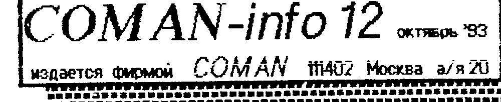
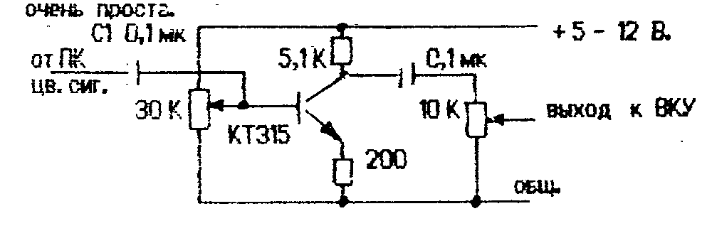
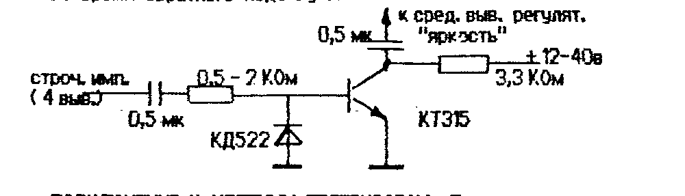
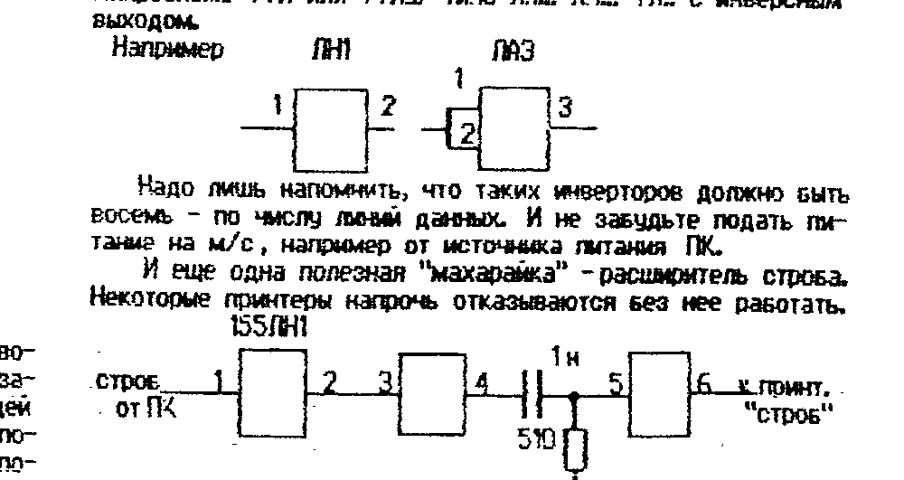

Издается фирмой COMAN, 111402 Москва а/я 20.

## О подключении к телевизорам и мониторам

Владельцы ПК любого типа иногда испытывают нешуточные трудности при подключении своих любимцев к видеоконтрольным устройствам.
А иногда трудности подключения к уже имеющемуся ВКУ при невозможности приобретения специального ставят серьезный заслон для нормальной эксплуатации.
Цель данной статьи — рассмотреть основные проблемы, возникающие при подключении комп'ютеров к ВКУ.

ПОДКЛЮЧЕНИЕ К Ч/Б МОНИТОРУ.
Основных проблем здесь три: неустойчивая синхронизация; слабое различие уровней серого цвета; видимость обратного хода луча.

Неустойчивость синхронизации возникает, как правило, из-за того, что ч/б мониторы имеют 75-тиомный вход — по стандарту.
Иногда советуют для получения устойчивой синхронизации увеличить емкость переходного конденсатора на входе монитора (или выходе ПК) до 1000 - 2000 мкф.
Иногда действительно удается получить некое подобие устойчивости, зависящей, правда, от того, что выводится на экран.
Происходит это от того, что низкое входное сопротивление монитора «подсаживает» сигнал синхронизации и блок синхронизации неустойчиво его захватывает.
Поэтому более правильным будет подключение с согласованием выходного сопротивления ПК с входным монитора.
Изготовители мониторов добиваются низкого вх. сопротивления посредством установки на входе монитора резистора на 75 или 82,5 Ома.
Достаточно выявить его в мониторе (оно обязательно установлено параллельно входу) и удалить (а лучше заменить на 470 - 680 Ом или диод в режиме ограничения сигнала), и статус-кво будет восстановлен.
Синхронизация в этом случае настолько «дубовая», что ее трудно завалить.

Другой причиной неустойчивой синхронизации может быть природная глупость владельца ПК, купившего монитор, рассчитанный на частоту 60 Гц.
Такие мониторы применяются в ПК типа «Искра 1030» и аналогичных.
В этом случае придется серьезно покрутить частоту кадровой синхронизации или даже заменить некоторые детали в блоке кадровой синхронизации монитора, отвечающие за частоту.
Но лучше не связываться с такими мониторами вообще.

Слабое различие уровней серого цвета так же относится к дефектам, т.к. иногда делает невозможным использование некоторых программ (особенно игровых).
Когда выводятся крупные об'екты, с «чистыми» цветами и на черном фоне, еще можно их различить.
Но когда выводятся различные оттенки цветов, они практически неразличимы или различимы при максимальном контрасте и при новой ЭЛТ монитора.

Между тем, можно сделать их очень хорошо различимыми и довольно простыми методами.
ПК «Вектор» и «Львов» выдают на видеовыход ПРЯМОЙ СИНХРОСИГНАЛ-ВИДЕОСМЕСЬ и ИНВЕРСНЫЕ ЦВЕТОВЫЕ сигналы.
При подключении к ч/б ВКУ обычно используют только синхосигнал, получая вышеперечисленные результаты.
Качество изображения значительно улучшится, если смешать синхро и цветовые сигналы.
Сделать это можно подсоединив цветовые сигналы к синхро через переменные резисторы 1 - 5 КОм.
Изменяя положение движков резисторов можно добиться довольно качественного отображения различных отенков серого цвета.
Однако следует учитывать, что цветовые сигналы — инверсные и при малом сопротивлении резистора может произойти срыв синхронизации.

Более качественное смешение сигналов можно произвести если сначала проинвертировать цветовые сигналы, и лишь затем подмешать в синхро.
Тем более, что схема инвертора очень проста.



Разумеется, таких инвертора должно быть три — на каждый цветовой сигнал.
Резистор на входе устанавливает оптимальную рабочую точку транзистора, а резистором на выходе устанавливают соотношение цветов с тем расчетом, что бы получить максимум различимых уровней серого цвета.
Для настройки полезно написать простейшую программу рисования цветных полос.

Обратный ход луча является «встроенным» дефектом ПК «Вектор».
На «Львове» он практически отсутствует.
Откуда он взялся?
Дело в том, что в стародавние времена каждый телевизор имел в своем составе специальную схему гашения обратного хода луча.
(Очевидно, такой же ТВ имел и разработчик «Вектора» — г-н Темиразов).
Затем импульсы гашения стали передаваться централизовано, вместе с сигналом ТВ.
И изготовители телевизоров и мониторов стали экономить 1 транзистор и еще 5-6 деталей.
При запуске ПК в серию это «прохлопали» и десятки тысяч владельцев «Векторов» испытывают трудности.

Между тем, собрав простую схему гашения, можно навсегда отучить свой монитор или телевизор воспроизводить что то во время обратного хода луча.



ПОДКЛЮЧЕНИЕ К ЦВЕТНЫМ ТЕЛЕВИЗОРАМ.
Подключение к цветным ТВ марок 2 и ЗУСЦТ не вызывает никаких трудностей.
Единственное, что необходимо учесть, что если в блоке цветности применена м/с 174АФ5, то надо установить резисторы между м/с 174УК1 и АФ5 по 470 ом.
На схеме телевизора они обозначены, но на плате часто вместо них стоят перемычки.
Никакого ухудшения работы телевизора от них не будет и коммутировать придется лишь сигнал синхронизации.

Если же применена м/с 174ХА17, то необходимо собрать инверторы цветовых сигналов (3 шт.).
А саму м/с переключать в режим «окно» подачей потенциала +12В через резистор 5,1 - 10 КОм.
Попросту говоря, соединить 11-ю и 6-ю ножку этим резистором.
Не забудьте удалить резистор 75 Ом, который подключен к 11-й ножке и идет на землю.

Сложнее подключить ПК к ламповым телевизорам, т.к. видеоусилителям на лампах требуется больший ток и напряжение цветовых сигналов.
Синхронизация обычно достигается безболезненно, а цветовые сигналы так же потребуется усилить и проинвертировать.
Но вообще говоря, процесс подключения к ламповым ТВ достаточно творческий и требует индивидуального подхода к ТВ, т.к. лампы имеют обыкновение изнашиваться с изменением своих свойств, разумеется.

ПОДКЛЮЧЕНИЕ ПО ВЧ можно осуществить при помощи модулятора.
Описание ч/б ВЧ-модулятора было приведено нами еще в 3-м бюллетене.
Куда больший интерес представляет цветной ВЧ-модулятор.
Но по правде говоря, мы еще не встречали ЦВЧМ который хотя бы немного приблизился по качеству к обычному подключению.
Мелкие цветные об'екты выглядят размазанно, на краях цвет «рвется» и т.п.
Короче, практически невозможно пока сделать качественный ЦВЧМ со стоимостью до 10 тыс. руб.
Качественный ЦВЧМ будет стоить 20 - 30 тыс. руб., а за такие деньги можно подключить ПК даже к холодильнику, а не то что к какому-нибудь «трудному» ТВ.

КСТАТИ!
Если вам трудно или лениво собирать приведенные схемы, но вы испытываете в них нужду, можете прикупить их у нас:

> МОДУЛЬ ГАШЕНИЯ ОБР. ХОДА ЛУЧА — 500 руб.
> ПЛАТА С 3-мя ИНВЕРТОРАМИ — 1200 руб.
> ВЧ-МОДУЛЯТОР Ч/Б — 1500 руб.
> ПЕРЕСЫЛКА — 200 руб.

> ## Друг по переписке
>
> 195274 г. С-Петербург пр. Культуры д. 11 к. 1 кв. 184 Румянцев П.Ю. «Львов», «БК0010», «ZX»
>
> 610050 г. Киров а/я 1627 Мокрушин В.А. «АТМ-турбо»

## Еще о супер-ПЗУ. Совсем немного...

В связи с дефицитом места, нам не удалось рассказать о некоторых особенностях СУПЕР-ПЗУ в бюллетене 10.
Но некоторые ее свойства настолько хороши, что на них стоит заострить внимание.

Рабочий фон С-ПЗУ — темно-зеленый, поэтому просим не пугаться при первом включении.

При вводе программ с магнитной ленты, на экран выводятся первые 8 символов имени вводимой программы, что чрезвычайно удобно при поиске конкретной программы на ленте.

При сервисной загрузке (УС+СС+РУС) память в адресах 0000Н - BFFFH и E000H - FFFFH остается неизменной, т.е. НЕ обнуляется.
Поэтому такое понятие как «ЗАЩИТА» практически перестает существовать — любую «крутую» защиту уже могут ждать в ОЗУ не менее «крутые» «ломы».

При загрузке CP/M с дискеты, область памяти с 100Н до 9FFFH остается неизменной.
Это можно использовать для перекачки программ с маг. ленты на диск непосредственно, используя команду SAVE ОС CP/M.
Поясним на примере.

Запустив ROM-загрузчик, вы производите загрузку программы в ОЗУ обычным порядком, наблюдая за ее загрузкой (отсутствием визуального контроля загрузки страдает ROM).
По окончанию загрузки надо подсчитать количество принятых блоков (в десятичной системе) и нажав БЛК+ВВОД и БЛК+СБР, просто загрузить систему.
Затем следует дать команду

```
A>SAVE nn NAME.XXX <ВК>
```

где nn — количество блоков в программе, NAME.XXX — имя с расширением (обыч. .COM).

По этой команде ОС записывает на диск указанное кол-во блоков (по 256 байт каждый), начиная с 1-го, под указанным именем.

Аналогично можно получать содержимое «зашифрованных» или упакованных программ в «расшифрованном» или распакованном виде.
Надо просто запустить такую программу, подождать, пока она распакуется и перезапустив систему, записать ее на диск аналогичной командой.
На всякий случай записывать следует 30 - 40 Кб. — потом монитором разберетесь.

НАПОМИНАЕМ: СТОИМОСТЬ СУПЕР-ПЗУ — 1500 руб. с панелькой и пересылкой.
Каждая последующая м/с — 500 руб.

## Утилиты для CP/M-53

Не все знают, что в ячейках DFF6 лежит номер цвета фона, а в DFF7 — номер цвета символов, выводимых на экран.
Вы можете написать простейшую программу, которая позволит вам устанавливать наиболее приятное для вас цветосочетание.

- FMAP.com (100) — Утил. выдающая таблицу размещения файлов на диске.
- MARGO.com+hlp (300) — текстовый редактор, помощнее WORLDMASTER.COM и инструкция к нему. Запуск: MARGO NAME.XXX
- ASM.com (200) — стандартный транслятор ассемблера. +LOAD.COM запуск: ASM NAME.ASM; файл NAME.ASM создается текст. редактором.
- MB.hlp (100) — инструкция к MBASIC.COM
- OUT53.com (100) — У. выводящая на МЛ файл в формате Монитора-Отладчика. Запуск: OUT53 NAME.XXX
- PAKER.com (500) — Упаковщик, создающий на диске запускаемый файл, позволит с'экономить сотню-другую килобайт на диске. Запуск: PAKER NAME.COM. После работы вы увидите, что файл стал короче, а работает так же.
- POWERM.com (50) — известная программа с более удобным выводом на экран.
- M.com (100) — Утилита переключающая экран в режим 80 символов в строке.
- ED.com (100) — вывод директория в 1 колонку по алфавиту
- DD.com (100) — то же, в 3 колонки (когда много файлов).
- DDD.com (100) — то же, в 1 колонку, с указанием USER-а.

## Постоянным клиентам постоянные скидки!!!

Начиная с 1-го ноября 1993г. мы запускаем в работу механизм предоставления скидок для постоянных покупателей.

Это значит, что при покупке вам будет вручен или выслан вместе с заказом специальный фирменный талон на сумму в размере 10% от суммы заказа.
И при следующем заказе вам будет предоставлена скидка на сумму этого талона, но не более 50% от суммы заказа.
А также будет выдан новый талон.

Срок действия талона начинается на следующий день и продолжается 3 месяца.
(За это время у нас всегда появляется что-то такое, что стоило бы купить).

Поясним на примерах.

1) Вы покупаете принтер за 35000 руб.
Получаете талон на 3500 руб.
В следующем заказе вы хотите купить 4 бокса с дискетами (10000 руб.)
Но вам достаточно будет заплатить 10000 - 3500 = 6500 руб.
И вы еще получите талон на 1000 руб. для последующего заказа.

2) Вы купили 4 бокса дискет на 10000 руб. и получаете талон на 1000 руб.
Затем вы заказываете программы на 1300 руб.
При этом вступает в действие ограничение по 50%, т.к. скидка превышает 50% от общей суммы заказа.
Вам надо будет заплатить 1300/2 = 650 руб. и вы получите талон на 130 руб.

Предупреждаем, что стоимость пересылки не входит в сумму заказа.

> Работает система EXPRESS.
> Свой заказ вы можете сделать по телефону! (095) 302-8222

## Программы для ПК «Вектор»

В предыдущем номере ошибочно был указан номер 209 и пропущен номер 219.
Приносим извинения и исправляемся.

| Индекс | Название | Описание |
| --- | --- | --- |
| 209 | Comdec (100) | Маг. копировщик и упаковщик программ без сброса при ошибке. |
| 219 | Delta (100) | Очень даже неплохая цветомузыкальная программа. |
| 223 | Dungeon (100) | Рыцарь собирает яблоки в обширном подземелье. |
| 224 | Harrier (100) | Вас атакуют пехота и танки противника. Но отступать некуда. |
| 225 | Jump Jack (100) | Мальчик в прыжках должен ловко выхватывать призы из лап соперников. |
| 226 | Stonkers (100) | Приключения танка в лабиринте. Немного напоминает пр. 61 - Бэтл танк. |
| 227 | Трутни (100) | Оборона улья от трутней. |
| 228 | Спейскоммандер (100) | Убейте их всех!!! |
| 229 | Турбоудав (100) | Отличная версия «Удава». |
| 230 | Сокобан (100) | Расставьте ящики по местам. |
| 231 | Теннис (100) | Название говорит само за себя. |
| 232 | Парашютисты (100) | Отражение десанта. |
| 233 | Волейбол (100) | Отличная игрушка для двоих. |
| 234 | Полкорн (100) | Надо разрушить шариками стену. |
| 235 | Арктика (100) | Приключения в дрейфующих льдах. |
| 236 | Кот-рыболов (100) | Кот добрался до аквариума. |
| 237 | Кот-прыгун (100) | ...а теперь полез на крышу. |
| 238 | Раннер-О (100) | Еще одна версия... |
| 239 | Старфайтер (100) | Полет «Шаттла» в космосе. |
| 240 | Xonix-О (100) | Одна из версий известной игры. |

## Звуковые эффекты на «Львове»

В ПК «Львов» нет никаких специальных м/с, предназначенных для извлечения звуков.
Поэтому озвучивать программы приходится с помощью порта, к выходу которого подключен излучатель.
Конечно, это накладывает серьезные ограничения на использование звука, т.к. во время вывода звука выполнение остальной программы прерывается.
Но, как говорится, мы имеем то, что имеем.

Наш читатель В. Богученко из Запорожья утверждает, что приведенная в «Описании Бейсика» таблица констант не совсем верна, соответственно фальшивит.
Ниже приведена истинная таблица.

| Нота | — | Малая | 1-я | 2-я | 3-я | 4-я |
| --- | --- | --- | --- | --- | --- | --- |
| ДО | — | 168 | 84 | 41 | 20 | 10 |
| ДО# | — | 158 | 80 | 39 | 19 | 9 |
| РЕ | — | 149 | 74 | 37 | 18 | — |
| РЕ# | — | 139 | 69 | 34 | 17 | 8 |
| МИ | — | 131 | 67 | 33 | 16 | — |
| ФА | 250 | 124 | 63 | 31 | 15 | 7 |
| ФА# | 235 | 117 | 59 | 29 | 14 | — |
| СОЛЬ | 222 | 111 | 56 | 27 | — | — |
| СОЛЬ# | 209 | 104 | 53 | 26 | — | 6 |
| ЛЯ | 199 | 98 | 49 | 24 | 12 | — |
| ЛЯ# | 190 | 92 | 46 | 23 | 11 | — |
| СИ | 178 | 89 | 44 | 22 | — | 5 |

Быть может теперь мелодии, издаваемые п'езожестяным излучателем, зазвучат?

П/программа вывода мелодии была нами описана еще в бюллетене 2.

Другой наш читатель, К. Цуренко, сетует на то, что мы не публикуем мелодии.
Однако нам не хотелось бы, что бы появились десятки программ с одинаковыми мелодиями.
Люди, знающие ноты, сейчас не редкость, и имея ноты какой либо мелодии (что тоже не дефицит), они за несколько минут напишут вам таблицу, которую вы быстро переведете в константы.
Кроме того, К. Цуренко прислал несколько подпрограмм, которые дают интересные звуковые эффекты — шумы, взрывы, выстрелы и т.п.
Приводим эти подпрограммы.

```
1)
        LXI H, 0003H
        MVI C, 0FFH
M1:     MOV B, M
        INX H
        IN 0C2H
        XRI 01
        OUT 194
M2:     DCR B
        JNZ M2
        DCR C
        JNZ M1
        RET

2)
        MVI B, 46H
        MVI C, 32H
M1:     IN 0C2H
        XRI 01
        OUT 0C2H
        INR B
        INR B
        PUSH B
M2:     DCR B
        JNZ M2
        POP B
        DCR C
        JNZ M1
        RET

3)
        MVI D, 60H
        MVI B, 0C8H
M1:     MOV A, B
        ANA D
        MOV C, A
        IN 0C2H
        XRI 01
        OUT 194
M2:     DCR C
        JNZ M2
        INR D
        DCR B
        JNZ M1
        RET

4)
        MVI B, 0C8H
M1:     MOV A, B
        ANI 3FH
        ADI 0C8H
        MOV C, A
        IN 0C2H
        XRI 01
        OUT 0C2H
M2:     DCR C
        JNZ M2
        DCR B
        JNZ M1
        RET
```

Надеемся, что Вы при возможности тоже поделитесь своими более-менее удачными программами, и не только связанными со звуковыми эффектами.
Ведь чем больше людей умеют работать на компьютере данного типа, тем больше появляется для него программ и тем выше интеллектуальный потенциал нации.

## Принтер MC6312. Достоинства и недостатки

Струйный принтер этого типа является, пожалуй, самым распостраненным среди владельцев ПК.
И не удивительно, ведь цена его на фоне всеобщего роста цен стабильно-низкая.
Посудите сами: на момент его появления он стоил 1500 руб., средняя зарплата тогда была 200 - 300 руб.
Сейчас средняя зарплата составляет 30 - 60 тыс. руб., а принтер стоит (розничн. цена) - 35 тыс.
Даже не очень радивый работник может купить его с одной зарплаты.
И все это при очень даже неплохом качестве печати.

Несмотря на это, ходит много всяких легенд, связанных с этим принтером, особенно среди людей, в глаза его не видевших.
Постараемся прояснить ситуацию с ним.

Многих сбивает с толку название «ТЕРМОСТРУЙНЫЙ» и они считают, то печать возможна только на ТЕРМОБУМАГЕ.
Сообщаем, что слово «термоструйная» присутствует в названии печатающей головки, но ПЕЧАТЬ ВОЗМОЖНА НА ЛЮБОЙ БУМАГЕ, даже туалетной.
Другое дело, что качество печати зависит от типа бумаги.
Дело в том, что печать производится «выстрелом» микроскопическими каплями специальных чернил, и от степени и впитываемости в бумагу зависит качество печати.
Чем лучше они впитываются, тем ярче изображение, но точка более расплывчатая.
Как показывает практика, наилучшие результаты получаются при применении бумаг сорта «писчая 1» и «писчая 2».

Многие сравнивают качество печати с матричным принтером.
Действительно, качество матричного выше, но не на много.
А цена матричного принтера сейчас в 2-3 раза больше.
Впрочем, желающим мы можем выслать образцы печати этого принтера, при условии если вы пришлете конверт для ответа, и вы сами убедитесь, что это так.

Но основными козырями этого принтера, наряду с низкой ценой, являются его очень малые габариты — как толстая книга и нешумность в работе.
Часто на рабочем столе нет места под крутой принтер, да и работать приходится по вечеро-ночам (у программистов - самое продуктивное время).
Тут у МС6312 просто нет конкурентов.

Стыкуется принтер к «Вектору» и «Львову» без всяких проблем — см. бюллетень 6.
Однако надо учитывать, что у «Львова» данные инверсные, и потребуется либо собрать инвертор, описанный ниже, либо использовать ТР, позволяющий инвертировать данные, дисковый вариант «Самара», например.
Кроме того, наша фирма готова поставить вам кабель, распаянный под ваш ПК, чтобы вам осталось только воткнуть пару штеккеров - в ПК и принтер - и печатай.

Осталось только сообщить текущие цены на все это.

> Принтер MC6312 — 35000 руб.
> Кабель для Вектора — 1000 руб.
> Кабель для Львова (с инверт.) — 2000 руб.
> Инвертор данных — 1000 руб.
>
> Примечание: кабели без принтера не продаются.

Инвертор данных можно собрать практически на любой микросхеме ТТЛ или ТТЛШ типа ЛН... ЛН... ТЛ... с инверсным выходом.
Например ЛН1, ЛА3.

Надо лишь напомнить, что таких инверторов должно быть восемь — по числу линий данных.
И не забудьте подать питание на м/с, например от источника питания ПК.

И еще одна полезная «махарайка» — расширитель строба.
Некоторые принтеры напрочь отказываются без нее работать.



## Букварь программиста

В этот раз мы расскажем о том, как вывести на экран спрайт.
Поэтому советуем вам нарисовать в ГР какой либо спрайт, желательно маленьких размеров (после освоения процедуры вывода, вы будете уметь выводить любые спрайты).
Процедура эта не такая простая, как кажется на первый взгляд, и упаси вас Бог, пытаться написать «универсальную» программу вывода спрайта.
К каждой игре требуется свой подход (если вы хотите написать что то достойное).

В прошлый раз нам не хватило места рассказать о том, как «отключать» плоскости в ПК «Вектор».
На самом деле, никакого электрического отключения не происходит.
Просто в палитре определенные математические цвета устанавливаются в нулевой физический цвет и становятся невидимыми, как бы прозрачными.
Но видеоконтроллер продолжает исправно выводить содержимое всех четырех плоскостей на экран.

Так, например для «отключения» 4-й, самой нижней плоскости, надо обнулить с 8-го по 15-й цвет.
Для отключения 3-й и 4-й — обнулить цвета с 4-го по 15-й.
А если вы хотите оставить только одну страницу — оставьте только 1-й цвет.

Итак, вывод спрайта.
Как мы уже говорили, для того, чтобы спрайт появился на экране, необходимо вывести его содержимое в определенные ячейки видеоОЗУ.
В зависимости от их адресов, спрайт будет выведен в то или иное место.
Изменяя эти адреса в процессе работы программы, мы получим перемещение спрайта по экрану.

Начнем с ПК «Львов».
Только не забудьте в программе позаботиться о подключении экранного ОЗУ.
Это делается записью в порт С2 «0» в 1-й бит (не путать с нулевым!).
Полезно также очистить экранную память, занеся во все ячейки с 4000Н по 7FFFH нули.
Сделать это можно следующем циклом.

```
        ORG 9000H
        XRA A       ; ОБНУЛ. АККУМ.
        OUT 0C2H    ; ВЫВОД В ПОРТ "0" - ПОДКЛ. ВОЗУ
        LXI B, 4000H ; ЗАГР. СЧЕТЧ.
        LXI D, 4000H ; УСТАН. НАЧ. АДРЕСА ВОЗУ
M1:     MVI A, 0    ; ОБНУЛ. АККУМУЛ.
        STAX D      ; ЗАПИСЬ АКК. В ЯП АДРЕСУЕМОМ DE
        INX D       ; ПРИРАЩ. АДРЕСА
        DCX B       ; УМЕНЬШ. СЧЕТЧИКА
        MOV A, B    ; СТАРШ. БАЙТ СЧЕТ. В АКК.
        ORA C       ; "ИЛИ" МЛ. И СТ. БАЙТ СЧЕТУ
        JNZ M1      ; ЕСЛИ РЕЗУЛЬТ. НЕ = 0 - НА М1
        ....
```

Допустим, вы нарисовали спрайт и вывели его в формате Ассемблера.
Введя его в Ассемблер или текстовый редактор, вы увидите примерно следующее (спрайт был размерами 28 х 11 пиксел - 7 байт х 11 строк):

```
UFO:    DB 0, 0, 48, 240, 128, 0, 0, 1, 15, 15, 15, 0, 0, 112, 240, 240
        DB 240, 192, 0, 0, 241, 240, 244, 241, 224, 0, 16, 225, 240, 188
        DB 225, 240, 0, 48, 195, 120, 30, 195, 120, 128, 112, 195, 120, 30
        DB 195, 120, 192, 7, 15, 15, 15, 15, 12, 0, 240, 240, 249, 240
        DB 224, 00, 16, 254, 246, 247, 128, 0, 0, 0, 255, 255, 255, 0, 0
```

Конечно, содержимое блока данных может быть любым — это зависит от спрайта.
Служебная информация о размерах, палитре и адресах в формате «ассемблер», как видите, отсутствует — вам надо будет запомнить или записать их при выводе спрайта.

Итак, вы хотите разместить его на экране, например в центре.
Программа вывода может быть следующей (разумеется, вы подключили ОЗУ, почистили экран, установили палитру и т.д.):

```
NACUST: DB 62CH     ; КООРДИН. ПОЧТИ ЦЕНТРА ЭКРАНА
        LXI D, NACUST ; ЗАГР. КООРДИНАТ В РЕГ. D
        MVI B, 11     ; УСТАН. СЧЕТЧ. СТРОК
USTSTR: MVI C, 7      ; УСТАНОВ. СЧЕТЧ. БАЙТ В СТРОКЕ
WYW:    LXI H, UFO    ; ЗАГР. В РЕГ. H АДРЕСА 1-ГО БАЙТА СПР.
        MOV A, M      ; ЗАГР. В АКК. БАЙТА ИЗ СПРАЙТА
        STAX D        ; ВЫВОД БАЙТА В ЯП НА ЭКРАНЕ
        INX D         ; ПЕРЕХОД К СЛЕД. БАЙТУ
        INX H
        DCR C
        JNZ WYW       ; ПОСЛЕД. БАЙТ В СТРОКЕ ?
        PUSH H        ; СОХРАН. РЕГ. H
        LXI H, 39H    ; ЗАГРУЗ. КОНСТАНТЫ = 40Н - 7Н
        DAD D         ; СЛОЖЕНИЕ - ПЕРЕХОД НА СЛЕД. СТРОКУ
        PUSH H
        POP D         ; ПЕРЕСЫЛ. ИЗ РЕГ. H В D ЧЕРЕЗ СТЕК
        POP H         ; ВОССТАН. РЕГ. H
        DCR B         ; УМЕНЬШ. СЧЕТЧ. СТРОК
        JNZ USTSTR    ; ПОСЛЕД. СТРОКА ?
        ....          ; КАКАЯ ЛИБО КОМАНДА
```

Если ваш спрайт имеет другие размеры, то и константы должны быть, разумеется, другими.
Попробуйте написать свои варианты.

Как вы наверное догадались, если в ячейку NACUST поместить другой начальный адрес, то и спрайт выведется в другом месте.
Если изменять ее в процессе выполнения программы, то спрайт будет двигаться.
Но о том как перемещать спрайт и «подчищать» за ним экран, мы поговорим позже.

Выводить спрайт можно по разному, сверху вниз, снизу вверх, справа налево и т.д., хоть от центра к краям, все это зависит от желания программиста и его знании организации экрана и структуры спрайта.

На «Львове» структура экрана совпадает со структурой спрайта, поэтому и вывод здесь проще — байты лежат подряд.

Так получилось, что на «Векторе» формат, в котором выводится спрайт из «Рембрандта» для Ассемблера никак не совпадает.
Поэтому перед программистом иногда стоит проблема — переформатировать спрайт для приведения его в соответствие со структурой экрана для удобства и ускорения вывода, или оставить все как есть.
Скажем честно, мы не сторонники переформатирования.
Дело в том, что формат, удобный для вывода на «Векторе» (снизу вверх и слева направо) неудобен для восприятия человеческим глазом, который любит сверху вниз или снизу вверх, но по-строчно, а не по столбцам.
(На «Львове», кстати, так и сделано).
Особенно это проявляется при выводе спрайтов больших размеров.
И формат «Рембрандта» сделан таким «неправильным» именно по этой причине — построчным.
Программу для вывода спрайта на «Векторе» мы напишем в следующем бюллетене и рассмотрим проблемы перемещения спрайтов по экрану.

## ...и еще программы для ВЕКТОРА

| Индекс | Название | Описание |
| --- | --- | --- |
| 241 | Cather (100) | Игра в лучших традициях putup-а. |
| 242 | Land (100) | Игрушка типа «раннер». |
| 243 | Parity (100) | «Клеточный» автомат, рисующий фантастические узоры на экране. |
| 244 | Reverse1 (200) | Две игры в реверси на раздевание. |
| 245 | Reverse2 (200) | Дамы лучше «стрипа». |
| 246 | Robbo2 (100) | Продолжение приключений Роббо, но цветные и со многими персонажами. |
| 247 | Rockford (200) | Великолепная игра по динамике и сюжету, напоминающему Boulder Dash (7T). |
| 248 | Sp. traktor (100) | Вариант Down T.E., но с другими лабиринтами. |
| 249 | Tetris-k (100) | Так играют в тетрис в Калуге! |
| 250 | Рендзю (100) | Игра в рендзю с ПК. |

Для подписки на бюллетень надо выслать по адресу: 111402 Москва а/я 20 Тимошенко К.А. почтовый перевод на любую сумму из расчета 50 рублей за номер.
Обязательно укажите на обратной стороне перевода, в разделе «для письменного сообщения» свой адрес и номер, с которого вы хотите получать бюллетень.
Просьба не высылать телеграфные переводы за подписку.

Можно заказывать предыдущие номера, начиная с первого.

Как вы заметили, 10, 11 и 12-й номера бюллетеней выходят достаточно быстро друг за другом.
Мы и впредь постараемся поддерживать высокий темп выпуска бюллетеней, на уровне 2-х в месяц.

Выписывайте и читайте Бюллетень!
Вы всегда Будете в курсе событий!
