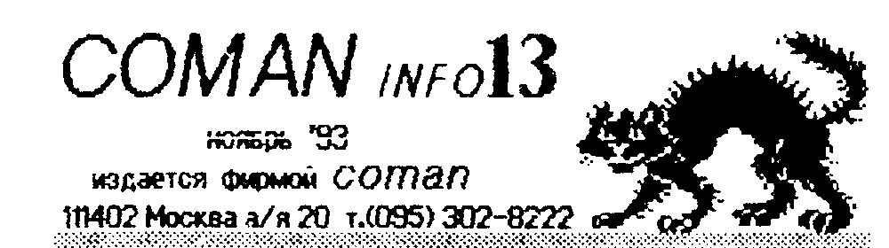
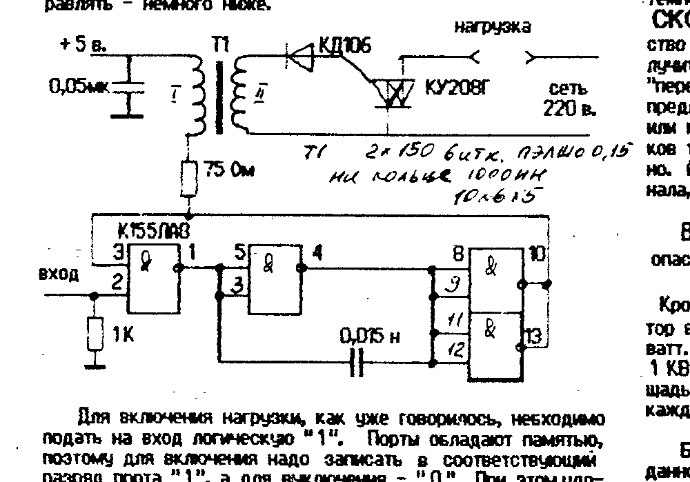

Издается фирмой COMAN, 111402 Москва а/я 20, т.(095) 302-8222.

## Устройство управления

Что и говорить, подавляющее большинство домашних ПК в основном работают как игрушки.
И при покупке своего первого комп'ютера, новоиспеченный владелец наверняка задавал себе вопрос — а сколько на нем игр?
Но ведь ПК — это универсальная штука, она может все, если ее этому научить и снабдить соответствующими орудиями труда.
Мы начинаем публикацию серии статей, посвященных таким несложным комп'ютерным «примочкам».
Они, не смотря на свою простоту, позволят в случае надобности существенно расширить возможности ПК.

Первое из этих устройств — УСТРОЙСТВО УПРАВЛЕНИЯ.
Что оно может: — включать и выключать любые приборы, питающиеся от сети, а так же регулировать в некоторых случаях их мощность.
Устройство имеет полную гальваническую развязку от сети.

Как оно работает.
Устройство представляет собой генератор, работающий с частотой 5 - 7 КГц.
Генератор нагружен на импульсный трансформатор.
На вторичной обмотке трансформатора вырабатываются импульсы, которые после выпрямления открывают симистор или тиристор.
Генератор начинает работать при подаче на его вход логической единицы.

Питается устройство от самого ПК.
Но если подобных устройств более 10 - 15, то лучше питать их от отдельного источника (конечно, если нет запаса по мощности у БП ПК).

Сколько вообще подобных устройств можно подключить к ПК?
Столько, сколько у вас есть свободных разрядов в портах.
Например, к Вектору можно подключить до 24-х устройств, к Львову — до 16-ти.
Как это сделать и как ими управлять — немного ниже.



Для включения нагрузки, как уже говорилось, необходимо подать на вход логическую «1».
Порты обладают памятью, поэтому для включения надо записать в соответствующий разряд порта «1», а для выключения — «0».
При этом удобно пользоваться логическими операциями.
Состояние порта следует хранить в ячейке памяти, и проведя с ней необходимые преобразования, выводить ее содержимое в порт.

К Вектору удобно подключать данное устройство в раз'ем «ПУ».
Оттуда же можно взять и питание.
Ниже приведена таблица, которая облегчит вам подключение и управление устройствами (вид на ПК сзади).

| | 1 | 2 | 3 | 4 | 5 | 6 | 7 | 8 | 9 | 10 |
| --- | --- | --- | --- | --- | --- | --- | --- | --- | --- | --- |
| C | 0 | 0 | 0 | 0 | 0 | 0 | 0 | 0 | 0 | 0 |
| B | 0 | 0 | 0 | 0 | 0 | 0 | 0 | 0 | 0 | 0 |
| A | 0 | 0 | 0 | 0 | 0 | 0 | 0 | 0 | 0 | 0 |

+5 В. — С10 и А1
Общ. — А10 и С1

- Порт 05Н: конт. с C9 по C2 вкл.; биты с 0-го по 7-й
- Порт 06Н: конт. с B9 по B2 вкл.; биты с 0-го по 7-й
- Порт 07Н: конт. с A9 по A2 вкл.; биты с 0-го по 7-й соответственно.

Аналогичная таблица и для ПК Львов:

| 39 | 35 | 31 | 27 | 23 | 19 | 15 | 11 | 7 | 5 | 3 | 1 |
| --- | --- | --- | --- | --- | --- | --- | --- | --- | --- | --- | --- |
| 0 | 0 | 0 | 0 | 0 | 0 | 0 | 0 | 0 | 0 | 0 | 0 |
| 0 | 0 | 0 | 0 | 0 | 0 | 0 | 0 | 0 | 0 | 0 | 0 |
| 40 | 36 | 32 | 28 | 24 | 20 | 16 | 12 | 8 | 6 | 4 | 2 |

| Порт | разр. данных | номер контакта | примечание |
| --- | --- | --- | --- |
| С1Н | 0 | 5 | порт С1 задействован для формирования цветовой палитры. |
| — | 1 | 3 | |
| — | 2 | 1 | |
| — | 3 | 7 | |
| — | 4 | 9 | |
| — | 5 | 11 | |
| — | 6 | 13 | |
| — | 7 | 15 | |
| С2Н | 2 | 6 | инверсный |
| — | 3 | 8 | инверсный |
| — | 5 | 19 | |
| — | 6 | 21 | |
| — | 7 | 23 | |
| С0Н | 0-7 | 39, 37, 35, 33, 31, 29, 27, 25 соответ. | |

Для чего можно применить подобное устройство.
Самое простое применение — вкл/выкл периферийных устройств вашего ПК — принтера, вентилятора, осветителя, какого либо исполнительного устройства — станочка и др.

В некоторых случаях возможно управление мощностью коммутируемых приборов, особенно если речь идет о нагревательных устройствах.
Это делается периодическим включением и выключением устройства.
Поскольку быстродействие ПК, и следовательно способность обновлять состояние порта, во много раз превышает частоту сети, включать и выключать прибор можно много раз за одну секунду.
Частота сети — 50 Гц, и за 1 секунду через включенный прибор проходит 100 полупериодов тока.
Написав программу, которая на A циклов включает прибор, а на B циклов выключает, и меняя соотношение A и B, можно управлять его температурой (этого прибора).

СКОРО НОВЫЙ ГОД.
И применив подобное устройство для организации праздничной иллюминации, можно получить такую крутую световую картинку, что ни с каким «переключателем гирлянд» не сравнить.
Вы можете даже предложить свои услуги какой-нибудь местной дискотеке, или клубу.
Ведь ваш ПК может запомнить несколько десятков тысяч комбинаций, или вообще «генерить» их бесконечно.
А если вы задействуете ПК «на всю катушку» — 24 канала, то световой экран-панно — не фантастика.

ВНИМАНИЕ!
Устройство имеет высокое напряжение, опасное для жизни.
БУДЬТЕ ОСТОРОЖНЫ!!!

Кроме того, необходимо учитывать, что симистор или тиристор без радиатора способен коммутировать нагрузку до 300 ватт.
Если вы хотите работать с приборами мощностью до 1 КВт, то симистор следует разместить на радиаторе, площадь которого должна быть не менее 20 - 30 квадр. см на каждые 100 ватт мощности коммутируемого прибора.

Быть может вы напишете об остроумном применении данного устройства?

ЛЕНИВО САМИМ СОБИРАТЬ?
Вы можете приобрести готовое устройство у нас.

Устройство управления (без радиатора) — 800 руб./шт.
Пересылка — 200 руб.

Для покупки следует сделать почтовый перевод на соответствующую сумму по адресу: 111402 Москва а/я 20 Тимошенко К.А.

> ## Друг по переписке
>
> 400029 Волгоград ул. Гремяченская д. 10-А кв. 2 Свидлов С.Н. ПК «Вектор 06Ц»
>
> 282023 Украина г. Тернополь ул. Киевская д. 12 кв. 118 Криницкий В.Я. ПК «Львов» и «Поиск»

## Букварь программиста

Прежде, чем завести разговор о выводе спрайта на экран на «Векторе», следует рассмотреть очень серьезный вопрос — о прерываниях.
Что такое «прерывания» и зачем они.

Процессор, как вы знаете, работает следующим образом: пришла команда — обработал — выбрал следующую — и т.д.
Однако, в каждом типе процессора есть «запрос прерываний».
По приходу запроса прерываний, процессор выполняет следующую процедуру: запрещает прерывания (что бы не было наложения запросов друг на друга) — записывает в стек адрес возврата (значение, который имел программный счетчик в тот момент, когда его застал запрос на прерывание) — устанавливает программный счетчик в значение, соответствующее уровню прерывания (попросту говоря, переходит на этот адрес, как на подпрограмму).
По другому можно сказать, что по приходу прерывания, процессор ПРЕРЫВАЕТ выполнение текущей программы, где бы он не находился, и начинает выполнение другой, которая называется «обработка прерывания».

Процессор 580ВМ80 имеет, вообще говоря, восьмиуровневую систему прерываний: RST0 - RST7.
При получении определенного запроса, процессор переходит на КОНКРЕТНЫЙ адрес, соответствующий данному прерыванию.
Это свойство процессора и список этих адресов имеется в справочной литературе.

Запрос прерываний может поступать как программно (таким образом можно вызывать п/программу не 3-х, а однобайтной командой), так и аппаратно — при помощи конкретного внешнего устройства или от внутренней схемы самого ПК.

Прерывания можно ЗАПРЕТИТЬ, и тогда процессор перестанет реагировать на их запросы, и РАЗРЕШИТЬ — и тогда по первому же прерыванию процессор «улетит» на его выполнение.
Команды запрета и разрешения так же описаны в системе команд каждого процессора.

Надо особо отметить, что ПК «Львов» не имеет аппаратно организованной системы прерываний.
Поэтому процессор начнет их обрабатывать только в случае, если встретится такая команда.
Все, что написано ниже, в основном относится к Вектору.

На «Векторе» имеется система аппаратного запроса прерывания RST7.
Если прерывания не были запрещены, то 50 раз в секунду процессор «бросает» основную программу, и переходит к выполнению той, которая начинается с адреса 038Н.
Поэтому, при написании программ, вы должны позаботиться либо о том, что бы прерывания были запрещены, либо о том, что бы в этих адресах была какая либо программа, которая а) сохраняет содержимое регистров и восстанавливает их в конце своей работы, б) разрешает в конце своей работы прерывания.
Аппаратный запрос прерывания поступает на процессор тогда, когда начинается ОБРАТНЫЙ ХОД ЛУЧА в видеоконтроллере, поэтому, желательно, что бы программа была не очень длинной, дабы успеть к следующему прерыванию и не искажать картинку на экране.
Кстати, обновлять и выводить спрайты (если они не большие) так же можно во время работы прерывания, (а равно как опрашивать клавиатуру, порты и т.д.).
Тогда по спрайтам не будет пробегать помеха-полоска.
Вот в основном все, что надо знать о прерываниях ПК.
Прерывания как бы синхронизируют работу ПК с работой видеоконтроллера (в данном случае).
Графически это можно представить так:

| Прямой ход луча и рисов. изображен. | Обрат. ход изобр. неизмен. | Прямой ход | Обрат. |
| --- | --- | --- | --- |
| работа основн. прогр. | работа програм. обраб. прерыв. | ----- | ----- |

Процессор выполняет как бы 2 программы поочередно.
Однако из-за того, что время прямого хода луча многократно больше времени обратного хода, эти программы несоизмеримы по величине.

К прерываниям надо относиться с особой осторожностью, т.к. очень часто их неправильная обработка приводит к тому, что программа работает плохо или не работает вообще.

Теперь вернемся к выводу спрайта.
Вы конечно уже нарисовали небольшой спрайт, размером 16 х 8 пиксел и в одной плоскости (для простоты) и даже вывели его в формате ассемблера.
Введя его в текстовый редактор, вы должны увидеть примерно следующее (спрайт выведен Рембрандтом):

```
; SPR - ЗАГОЛОВОК ФАЙЛА
SPRPAL:                            ; МЕТКА ПАЛИТРЫ СПРАЙТА
        DB 60H, 52H, 98H, 42H, 0CH, 22H, 20H, 0F3H
        DB 36H, 0KH, 68H, 46H, 40H, 10H, 27H, 00H
SPRELX: DB 02H ; РАЗМЕР ПО ГОР. 2 БАЙТА (В ПИКСЕЛ)
SPRELY: DB 08H ; РАЗМЕР ПО ВЕРТ. В СТРОК
SPRSCR: DB 01  ; СПРАЙТ В 1-Й ПЛОСКОСТИ - ПЕРВОЙ, БУДУТ
               ; ЗАДЕЙСТВОВАНЫ ПОДЧЕРКНУТ. ЦВЕТА, ОСТАЛЬНЫЕ
               ; НАДО ОБНУЛИТЬ ДЛЯ "ОТКЛ." ПЛОСКОСТЕЙ
        DB 04H, 04H, 00H, 00H, 01H, 0F0H, 02H, 08H ; ТЕЛО
        DB 00H, 0FFH, 00H, 08H, 01FH, 05H, 00H, 00H ; СПРАЙТА
```

Тут, кстати, надо отметить, что из-за ошибки в программе, Рембрандт может «недодать» несколько байт информации при выводе в формате Ассемблера (5-й формат).
Что бы этого не случилось, рекомендуем оставлять на спрайте «защитную» строку внизу.
В текстовом редакторе ее следует удалить и скорректировать размер по вертикали.

Содержимое палитры так же можно удалить, если рабочая палитра уже установлена.
Если же нет, но надо «обнулить» (не удалять!) первые 14-ть цветов, освобив подчеркнутые — матем. цвет первой плоскости и цвет фона.
Затем следует установить палитру.
(Когда мы говорим «установить палитру», это не значит, что надо тут же ее устанавливать.
Просто в вашу программу надо включить фрагмент «установка палитры», а содержимое ее надо взять из спрайта.)

Как мы уже неоднократно говорили, для того, что бы ваша картинка вылезла на экран, надо разместить ее в соответствующих ячейках видеоОЗУ.
Перед этим неплохо будет почистить экран от мусора, который там может быть.
Поскольку спрайт наш лежит в первой плоскости, то мусор, лежащий в трех других исчезнет (вернее станет невидимым) при установке палитры, а в «рабочей» мы его вычистим следующей программой.

```
CLS:    DI       ; П/П ОЧИСТКИ 1-Й ПЛОСКОСТИ И ЗАПР. ПРЕРЫВ.
        LXI B, 1E000H ; УСТАНОВКА ВСЕ В НАЧ. СОСТОЯН
OBNULL: XRA A     ; ОБНУЛ. АККУМУЛЯТОРА
        STAX B    ; ЗАПИСЬ "0" В ЯЧ. ПАМЯТИ
        INX B     ; ИНКРЕМ. АДРЕСА
        MOV A, B  ; ПРОВ. КОНЦА ЦИКЛА. КОНЕЦ ТОГДА, КОГДА
        ORA C     ; РЕГ. "B" И "C" БУДУТ = 0
        JNZ OBNULL ; ЕСЛИ НЕ - ЗНАЧЕНИЕ АККУМУЛЯТОРА (ПЕРЕХОД)
        EI        ; РАЗРЕШ. ПРЕРЫВ. (МАЛО-ЛИ, ЧТО...)
```

Программа не длинна и не сложна, но всегда хочется «извернуться».
Короче, экран можно чистить и так:

```
CLS:    DI        ; ОЧИСТКА ПЕРВОЙ ПЛОСКОСТИ И ЗАПР. ПРЕРЫВ.
        LXI H, 0000H ; УСТАНОВКА ПАРЫ HL В "0"
        SPHL      ; УСТАНОВКА СТЕКА В "0"
        LXI B, 2040H ; УСТАН. СЧЕТЧИКА
OBK:    PUSH H
        PUSH H
        PUSH H
        PUSH H
        DCX B
        MOV A, B
        ORA C
        JNZ OBK
        EI
```

Хоть вторая программа и длиннее, работает она быстрее первой.
Вы сами можете в этом убедиться, подсчитав такты.

Итак, экран чист как новое стекло, и мы выводим спрайт.
Он у нас начинается с левого верхнего угла и идет по строкам.
Вообще говоря, выводить спрайт можно 3-мя способами: 1) с запретом прерываний — самый простой и быстрый, но на больших спрайтах будет видна «рябь» во время вывода; 2) без запрета — помедленнее, и рябь видна заметнее, но обрабатываются прерывания (опрос клавиатуры, порты и т.д.); 3) без запрета, с синхронизацией по обратному ходу луча — самый медленный, но самый красивый способ.
При этом на спрайте не наблюдается никаких помех.

Мы не асы, поэтому начнем с чего попроще — вариант 1.

```
WYWSPR: DI        ; ЗАПРЕТ ПРЕРЫВАНИЙ
        LXI B, 0EF89H ; УСТАН. КООРДИНАТ ПОЧТИ ЦЕНТРА ЭКРАНА
        LXI D, SPRSCR ; УСТАНОВ. НА ПЕРВ. БАЙТ БАЙТ ПАЛ. УДАЛЕН
        LDA SPRELY    ; ЗАГР. РАЗМЕРА ПО ВЕРТ. В РЕГ. L
        MOV L, A
GORZAG: LDA SPRELX    ; ЗАГРУЗ. РАЗМ. ПО ГОР. В РЕГ. H
        MOV H, A
CYCL1:  LDAX D    ; ЗАГР. В АКК. БАЙТА СПРАЙТА
        STAX B    ; ВЫВОД БАЙТА НА ЭКРАН
        INX D     ; ПЕРЕХОД К СЛЕД. БАЙТУ
        INR B     ; ПЕРЕВОД АДР. СТОЛБЦА НА ЭКРАНЕ
        DCR H     ; УМЕНЬШ. СЧЕТЧИКА РАЗМ. ПО ГОР.
        JNZ CYCL1 ; КОНЕЦ СТРОКИ ?
        DCR C     ; ОПУСТИТЬСЯ НА СТРОКУ НИЖЕ
        PUSH D    ; СОХРАН. РЕГ. D В СТЕКЕ
        LDA SPRELX ; ЗАГР. РАЗМ. ПО ГОР. В РЕГ. D
        MOV D, A
        MOV A, B  ; ВОЗВРАТ В НАЧ. СТРОКИ (АДР. СТОЛБЦ. МИНУС
        SUB D     ; РАЗМЕР ПО ГОР.)
        MOV B, A  ; ВОЗВРАТ РЕГ. B
        POP D
        DCR L     ; УМЕНЬШЕНИЕ СЧЕТ. СТРОК
        JNZ GORZAG ; КОНЕЦ СПРАЙТА ?
        ....       ; МОЖНО ВЫПОЛНЯТЬ ЧТО ТО ДАЛЬШЕ.
```

Программа (кстати, далеко не идеальная) написана для вывода ОДНОПЛОСКОСТНОГО СПРАЙТА.
Если спрайт в нескольких плоскостях, то и выводить его следует так: первый байт первой — первый байт второй — к т.д.
Хотя для небольших спрайтов можно применить и построчный вывод.
А так же для получения различных эффектов можно применять по-плоскостной вывод.
Вобщем, тут кто во что горазд.

Рассматривая эту программу, вам наверное пришла в голову мысль о том, что весь этот «огород» устроен только для того, чтобы вывести несчастные 16 байт.
Мысль совершенно верная, поэтому совет: упаси вас Бог пытаться написать что то «универсальное», раз и навсегда.
Всегда подходите к проблеме творчески.
Спрайт маленький? — может лучше «тнать» его «в лоб», без циклов?
Программа будет длиннее, зато выполняться будет в 2 - 5 раз быстрее.
Вобщем, нет конкретных «законов».
Вот вам краски и кисточки — а там кто Рембрандт, а кто КуКрыНиксы.

В следующий раз мы поговорим о том, как написать уже хоть какую, но законченную программу.

## Программы для Вектора

| Индекс | Название | Описание |
| --- | --- | --- |
| 251 | Cheese (400) | Мышь, попавшая на сыроварню, должна с'есть все сыры. А в доме - 125 комнат-лабиринтов, и в каждой сторож - тигрокрыс. Музыка - AP2, план дома - Г5. |
| 252 | Superweapon (400) | Враги плотной толпой валят на ваши позиции. Но в вашем распоряжении супер-оружие. Постарайтесь разбить их завод, и тогда победа у вас в кармане. Если вы, конечно, убережете свои. Музыка - AP2. |
| 253 | Colorwar (400) | Вам надо закрасить в лабиринтах как можно больше территории - тогда они станут вашими. Все необходимое для этого имеется - краска и оружие (шары). В лабиринтах могут водиться всякие разные звери, поэтому не обольщайтесь первыми легкими победами. Кто-то из них враг, кто-то друг, а некоторых лучше убить, после того, как они вам помогут. Короче, разберетесь по ходу дела. |
| 254 | Exolon (400) | Отличная, накрученная игрушка. Десантник пробивается по вражеской космической базе. Управление - на заставке. |
| 255-265 | Putup-1F - 11F (по 100/шт.) | Очередные СУПЕР-этажи этой популярной игрушки. |
| 266 | Амбал/б (100) | Для любителей АМБАЛА - его бессмертная версия. |
| 267 | HNY (200) | (happy new year). Программа просто необходима тем, кто хочет купить, или собрать сам УУУ (универсальное устройство управления) - см. стр.1 этого бюллетеня. Программируется 8 каналов на срок от 1/50 секунды до 1,5 лет, после чего ее можно зациклить! И все с точностью 1мкс! |

## ROM-диск на 64 Кбайта в продаже! Правда пока только для Вектора.

Номер бюллетеня был совсем почти готов к печати, но мы успели завершить работы по ROM-диску и имеем честь предложить его вам.

ДИСКОВОД НЕ ВСЕМ ПО КАРМАНУ, но нормально работать, имеют право все.
Более подробно о ROM-диске — в следующем номере, а пока вкратце.

Диск собран на одной микросхеме AM27512 - ППЗУ УФ емкостью 64 Кбайта.
На плате установлена также пустая сакета (панель) под возможную вторую микросхему и переключатель выбора м/схем.

Диск условно разбит на 256 секторов (с 000 по 255-й) по 256 байт каждый.
Загрузка осуществляется при помощи СУПЕР-ПЗУ (см бюл. 10).
При нажатии <СС>+<БЛК>+<ВВОД> раздается звуковой сигнал, после которого надо ввести 3 цифры — номер сектора, начиная с которого размещена нужная вам программа.
В стандартной м/с, поставляемой нами находятся:

- Бейсик 2.5 (стандарт.) — с 000 по 063 сект.
- Рембрандт (магнитоф. вар.) — с 064 по 143 сект.
- Текстас (испр., с ассембл. и монит.) — с 144 по 198 сект.
- Монитор-монстр — с 199 по 247 сект.
- Сору-М (дораб., без сброса при ош.) — с 248 по 255 сект.

Например, для загрузки ГР «Рембрандт» вам надо нажать <СС>+<БЛК>+<ВВОД>, затем <0>,<6>,<4>; и после звукового сигнала замигает светодиод "РУС/ЛАТ".
Нажмите <БЛК>+<СБР> - и Рембрандт работает!
Все это займет НЕ БОЛЕЕ 5 СЕКУНД!!! (быстрее, чем с дискеты, кстати).

Как видите, в этот джентельменский набор входят все самые популярные программы.
Используя их, вы можете делать все, что хотите; писать просто тексты и тексты программ; транслировать их и отлаживать; загружать сторонние программы и ковыряться в них; рисовать спрайты; копировать программы, работать с Бейсиком, по прежнему любимом многими.
А поскольку у вас под рукой СУПЕР-ПЗУ (без нее невозможна эффективная работа с ROM-диском), вы все это можете распечатать на принтере в режиме "принт-скрин".
Впрочем тексты можно печатать и из Бейсика, и из Текстаса.

Надеемся, что наш диск произведет маленькую революцию в вашей работе с ПК.
Исчезнут утомительные загрузки/перезагрузки разных редакторов, трансляторов и т.д.
Вам остается хранить на внешнем носителе только РЕЗУЛЬТАТЫ РАБОТЫ, А ИНСТРУМЕНТЫ - ВСЕГДА ПОД РУКОЙ.

РОМ-диск полностью собран, отлажен и готов к работе.
Вам остается только подключить его в раз'ем "ПУ".
Кроме того, на плате имеется ДОПОЛНИТЕЛЬНЫЙ РАЗ'ЕМ для принтера (с расширителем строба) и вам не потребуется передергивать раз'емы, если вы захотите распечатать что-нибудь "тепленькое", свежесозданное.

> У ROM-диска только один НЕДОСТАТОК - поработав с ним однажды, вы не сможете работать без него.

Стоимость ROM-диска (с пересылкой)
- РОМ-диск (гарантия 1 мес.) — 12000 руб.
- РОМ-диск (гарантия 12 мес.) — 14000 руб.
- Супер-ПЗУ 573РФ2 (с сакетой) — 1500 руб.
- М/С AM27512 (чистая) — 5 $ (или руб. по бирж. курсу)

Осуществим прошивку м/с AM27512 информацией заказчика.
Информация должна быть предоставлена на КАССЕТЕ, в формате МОНИТОРА-ОТЛАДЧИКА "Вектора-06ц", 3-5 копий подряд, с приложением сопроводительного письма (пожелания, варианты и т.д.)
Фирма не несет ответственности за логические ошибки в информации заказчика.

Стоимость прошивки (со стоимостью микросхемы)
6 $ (или руб. по курсу) плюс 100 (сто) рублей за каждый полный и неполный килобайт информации.

## О «мировых ценах»

В условиях продолжающейся инфляции и непрерывного роста цен, неплохо знать, до какого уровня они будут расти.
Вообще говоря, цены на электронику и вычтехнику особенно, не повышаются, а понижаются, если брать не абсолютное их значение, а в привязке к заработной плате.
Посудите сами, когда появились ПК в широкой продаже, они стоили 700 - 1000 руб. при средней зарплате 250 - 350 руб.
Т.е. 2-3 зарплаты.
Сейчас аналогичный ПК можно приобрести за 30 - 60 тыс. руб.
Средняя зарплата составляет примерно такую-же величину.
Фактически, ПК стал в 2-3 раза доступней.

Как обстоят дела в мире с этим делом.
Ниже мы приводим средние цены на ПК и периферию в $ США, что показать, к чему будут стремиться цены и у нас в стране.
Пересчет в рубли вы можете произвести сами, по текущему курсу ММВБ.

- ПК по мощ. аналог. Вектору или Спектруму — 80 - 200$
- То же, типа Поиск, Ассистент — 120 - 300$
- Дисковод 1Мб неформат. — 35 - 45 $
- Дисковод 1,2 или 1,44 Мб. — 40 - 50 $
- Накоп. типа Винчестер — прим. 1-2$/1Мб.
- Накоп. на МЛ бытов. спец. — 50 $
- Дискеты 5'25" и 3'5" — 0,5 - 5 $
- Кассеты С90 — 1 - 10 $
- Цв. мониторы 14' — 150 - 300$
- Стриммеры — 150 - 300$
- Модемы — 30 - 200$
- Игровые программы для ПК — 1 - 10$/копия

Цены на профессиональную вычтехнику с той или иной конфигурацией, вы можете узнать из обильной рекламы.

Теперь немного о планах нашей фирмы.
Многие спрашивают, будем ли мы "цеплять" "Винчестер" к Вектору?
Очевидно нет, т.к. контроллер достаточно сложен и дорог.
А сам парк ПК в ближайшие годы, очевидно, подвергнется сильному изменению.
Например, ПК "Львов" умирает прямо на глазах.
К "Синклеру", в его обычной интерпретации, проявляет живой интерес лишь детвора 10 - 13 лет, которая в силу отстствия жизненного опыта, не знает про другие ПК или действует по принципу "у друга Петьки тоже такой".
Скорее всего, на арену выйдут ПК на 286-м и 386-м процессоре.
Причем ПК будут иметь стандартную архитектуру.
По началу ПК будут иметь минимальную конфигурацию (для сохранения невысокой цены, в пределах 100 - 200 $).
Затем владелец сможет докупать стандартные платы, расширяющие возможности своего ПК.

Наша фирма также начинает работу по внедрению в домашний обиход комп'ютеров на процессоре 286 и 386.
Конечно, тем кто имеет дома "Вектор", "Львов", "Синклер" или что то другое, аналогичное по мощности, довольно трудно расстаться со стереотипом, но давайте порассуждаем.

То, что мы сейчас имеем дома - это то, что весь остальной мир имел лет 10 назад.
Надеяться на то, что отечественная промышленность выдаст нечто подобное по мощности, но гораздо дешевле - по меньшей мере глупо.
Отставание технологии это серьезно.
Обидно, конечно, но что поделаешь...
Цены стремительно двигаются к мировым, и что касается вычтехники - то они давно мировые.

Полный комплект 8-ми разрядной машины (имеется в виду с дисководом, "расширенной" памятью до 128 или даже 256 К, сейчас стоит 100 - 150 тыс. руб (80 - 130$)).
При всем при этом учтите, что литературы по этим ПК очень мало, т.к. на них уже никто не работает - это была заря ПК.

Многие, понимая ущербность имеющегося ПК и отсутствие перспектив, кидаются в нечто "IBM-совместимое", растрачивая огромные средства.
В итоге получается монстр, иногда даже с "винчестером" и ОЗУ в 640 Кб, стоимостью 200-300 тыс. руб. с тактовой частотой 4,77 и 8-ми разрядным процессором.
Короче этот путь совершенно тупиковый, т.к. получившееся подобие PC/XT в самом убогом варианте - тоже, к сожалению, анахронизм - нигде в мире с ними уже не работают и не выпускают.

Есть ли альтернатива сложившейся ситуации?
Есть, и вот какая.
Перешагнуть через несколько ступеней развития вычтехники, минуя трату средств на увеличение мощности своего ПК (с заведомо плохим результатом), "IBM-совместимость", рожденную в агонии "догоним/перегоним".
Просто перейти на НОРМАЛЬНЫЕ КОМПЬЮТЕРЫ.
Не "совместимые", а нормальные.
На которых работает весь остальной мир, для которых существует десятки тысяч программ, обилие литературы и сетей, созданы огромные базы данных, которыми вы в принципе, сможете пользоваться.
И программа, написанная на НОРМАЛЬНОМ ПК и на НОРМАЛЬНОМ языке, будет понятна любому программисту в любой стране.
Согласитесь, заманчиво....

Конечно, любителям "Денди" и "игрунам" эти аргументы - пустой звук, но тем, кто действительно хочет иметь КОМПЬЮТЕР - пища для размышлений.

Вот, например, параметры минимальной конфигурации, в которой мы начинаем продавать 286 и 386-е машины (Сядьте на крепкий стул и сравните с тем, что имеете):

- Тактовая частота процессора - 16-20-25-33-40 МГц.
- Разрядность шины данных - 16-32
- ОЗУ - 1-2-4 Мегабайта.
- Графический адаптер - EGA (640 x 320) 16 цв. из 256
- Дисковод 720 Кб - 1,2 Мегабайт - 1,44 Мегабайт.
- Клавиатура русифицир. - 101 клавиша.

Это тот минимум, (см. левые цифры), с которого следует начинать работу.
Подключение - к монитору или ТВ.

При этом вы уже будете работать с "Нортоном" и подавляющим большинством программ.
Затем, по мере освоения и появления желания и средств, вы сможете приобрести для своего ПК накопитель "винчестер" на 40-200 Мегабайт, расширить ОЗУ, увеличить тактовую частоту, подключить "мышь" и пр.
Вся мировая индустрия производства вычтехники будет работать на вас.

Все это конечно хорошо, скажете вы, но сколько это стоит?
Все это будет стоить 200-300 $ (240-360 тыс. руб. по курсу на 01.11.93).
Дорого?
Дорого, но это машина.
Думайте сами, как вам поступать - продолжать ковыряться с 580-м процессором или Z-80, и вас все равно будут сверлить мысли об ущербности и о том, что это когда то закончится, либо (пусть даже поднатужившись) присоединиться к остальным 30000000 владельцев ПК IBM/AT.

К следующему выпуску бюллетеня мы подготовим более подробный прайс на подобные машины, блоки и комплектующие.

Не торопитесь огорчаться, владельцы Векторов и Львовов.
Ваши динозавры еще послужат лет 5.
И мы не собираемся с ними "завязывать" и постараемся из них выжать все.
Просто мы открываем новое направление работы.

> ## Прайс-лист (ноябрь 1993 г.)
>
> - Контроллер дисковода (Вектор и Львов) — 10.000 руб.
> - Дисководы: МС5313 — 36.000 - 38.000 руб., TEAC (япон.) — 45.000 руб.
> - Блок дисководный (отлаж. + супер ПЗУ) — 65 - 70 тыс.
> - Принтер МС 6312 (струйный, с головкой) — 42.000 руб.
> - Головка термоструйная — 2000 руб.
> - Дискеты (Гонконг) 12 шт. в пласт. боксе — 3000 руб.

ВНИМАНИЕ!
Настойчиво просим при отправке телеграфных переводов в наш адрес обязательно до нас дозваниваться или посылать письма с содержанием заказа.
При телеграфном переводе обратный адрес отправителя НЕ ПЕРЕДАЕТСЯ, хотя вы его и пишите.
Просим не высылать деньги за бюллетень телеграфом с припиской "на продление подписки" - после ее окончания, ваш адрес автоматически удаляется из базы данных и нам он становится неизвестен.

Для подписки на бюллетень надо выслать почтовый перевод на сумму, кратную 50-ти руб. и указать, с какого номера вы хотите получать его.
Перевод высылать по адресу:
111402 Москва а/я 20 Тимошенко К.А.
с пометкой "за бюллетень с ... номера".

АНОНС!
В 14-м номере:
РОМ-диск на 64 Кб для Вектора и Львова
Букварь программиста
Состав чернил для заправки головок
и другая полезная информация....

Читайте бюллетень - источник знаний!!!
