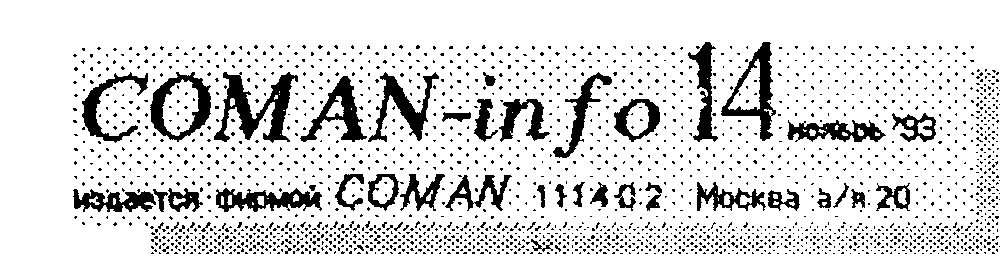
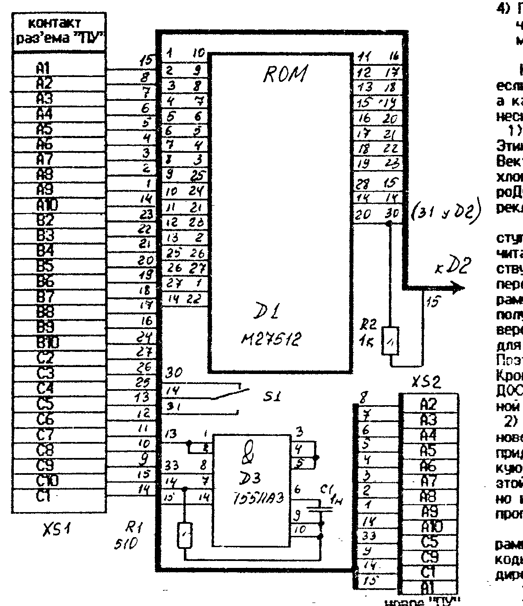
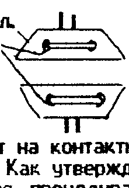
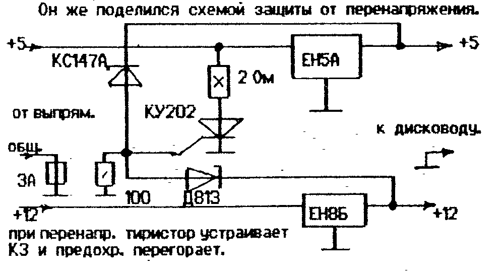
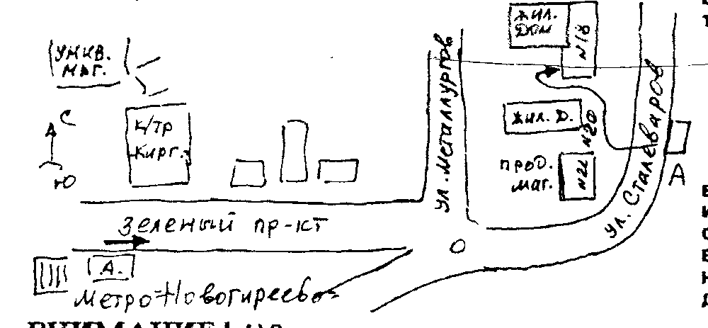
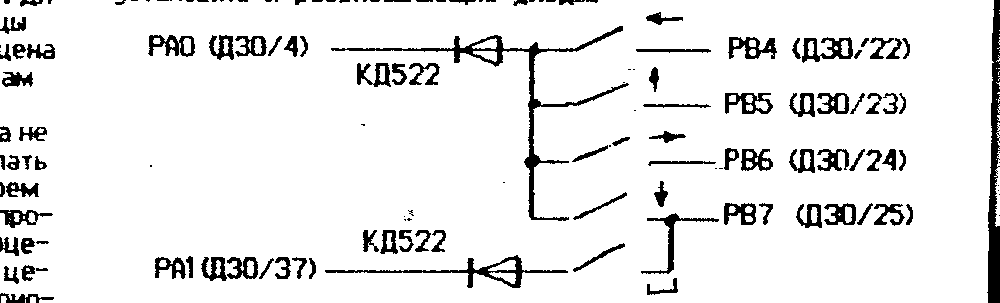

Издается фирмой COMAN, 111402 Москва а/я 20.

## ROM-ДИСК для ПК «Вектор» на 64Кб.

В предыдущем бюллетене мы уже кратко рассказали о ROM-диске.
Сейчас расскажем о нем подробнее.

Как оказалось, к микросхемам применим тот же метод оценки рентабельности, что и к грузовикам: чем «грузопод'емней», тем рентабельней (в том смысле, что меньше стоит хранение одного байта информации).
Наиболее доступной и удобной по части управления оказалась м/с M27512 - 64 Килобата информации.
Применив специальную упаковку, удалось разместить в ней одной весь «джентельменский набор», необходимый для мало-мальской нормальной работы.

Сначала приведем схему, которая чрезвычайно проста.



ROM-диск собран на печатной плате размером 65 х 75 мм и при подключении не «затеняет» ни один из раз'емов ПК.
Более того, он практически не увеличивает габаритов ПК, т.к. плата расположена вертикально.

На плате также расположен расширитель импульса строба для принтера.
Дело в том, что «Вектор» выдает строб «не по ГОСТу», и некоторые принтеры работают неустойчиво, особенно на длинных кабелях.
Кроме того, очень неудобно постоянно дергать раз'емы то ROM-диска, то принтера.
Ввод на плату специального принтерного раз'ема и организация бесконфликтной работы диск/принтер, позволил решить эту проблему.

ROM-диск поставляется с одной м/с M27512, в которой «зашиты» программы.
Но на плате имеется панель под вторую микросхему и переключатель микросхем.
Вы можете установить в эту панель микросхему с другой информацией и таким образом увеличить об'ем диска до 128 Кб.

Условия прошивки нами микросхем были опубликованы в предыдущем бюллетене.
Можем только добавить, что мы прошиваем ТОЛЬКО СВОИ МИКРОСХЕМЫ и ТОЛЬКО M27512.
Если вам надо прошить только часть микросхемы, то это не значит, что потом вы не сможете туда что то дописать.
Когда вам потребуется ее пополнить, вы ее вышлете нам и мы ее прошьем дальше.

Но гораздо удобнее иметь программатор ППЗУ УФ у себя дома, под рукой.
Очень просто его можно изготовить из ROM-диска, т.к. трассировка платы одинакова на 99%.
Как это сделать, мы расскажем в следующем бюллетене.

Напомним, как пользоваться ROM-диском.

1) Вставьте диск в раз'ем «ПУ» Вектора 06ц
2) Нажмите кл. <СС>+<БЛК>+<ВВОД> и дождитесь звукового сигнала.
3) Нажмите цифровые клавиши, соответствующие номеру сектора, начиная с которого лежит требуемая программа в ROM-диске.
   Каждое нажатие сопровождается длительным звуковым сигналом (не спешите).
   Номер всегда должен состоять из 3-х цифр, пусть даже "000".
4) После того, как замигает светодиод «РУС/ЛАТ» и прозвучит звуковой сигнал, нажмите кл. <БЛК>+<СБР>.
   Программа запущена!

Конечно, такой порядок допустим только в том случае, если у вас уже установлено СУПЕР-ПЗУ нашей фирмы.
Ну а как быть тем, у кого ее нет?
Решений у этой проблемы несколько.

1) Приобретите СУПЕР-ПЗУ у нас и установите в свой ПК.
Этим самым вы существенно расширите возможности своего Вектора (см. описание СУПЕР-ПЗУ) и избавите себя от многих хлопот в будущем.
Даже если у вас стоит загрузчик «МикроДОС», лучше посадить СУПЕР-ПЗУ сверху и добавить переключатель, нежели работать как описано в п.2.

Впрочем, при наличии загрузчика «МикроДОС» можно поступать по-другому.
Дело в том, что этот загрузчик может читать наш диск, но только со 128-го блока (далее он действует аналогично - размещает программу с адреса 0000Н и передает ей управление).
Если написать небольшую программу и прошить ее в 128-й блок, то с ее помощью можно получить доступ ко всему пространству.
Мы выпускаем две версии прошивки ПЗУ - для загрузки через «МикроДОС» и для загрузки через СУПЕР-ПЗУ или магнитофон (см. ниже).
Поэтому при заказе просим указывать желаемую версию.
Кроме того, следует отметить, что в версии диска «МикроДОС» отсутствует магнитофонный копировщик (из-за сервисной программы).

2) Если вы ни под каким видом не хотите устанавливать новое ПЗУ, но очень хотите работать с ROM-диском, вам придется поступать следующим образом: написать короткую программу (2-3 блока) - загрузчик диска и пользоваться этой программой.
Конечно, это не так удобно, как вариант 1, но и загружать 2-3 блока загрузчика вместо 50 - 100 блоков программы - это уже хорошо.

Что бы вы не морочили себе голову, как и какую программу писать для загрузки с ROM-диска, мы приводим ее коды.
Вам надо загрузить Монитор-Отладчик и при помощи директивы S100 набрать следующие коды:

```
100  F3 01 01 80 21 00 80 AF 77 23 08 78 B1 C2 07 00
110  31 F9 FF 21 29 00 11 00 EE 01 5E 01 7E 12 23 13
120  08 78 B1 C2 1C 00 C3 00 E0 F3 3E C9 32 38 00 CD
130  3D E1 3E 36 D3 08 3E 00 D3 0B 3E 06 D3 0B 3E 19
140  CD 27 E1 3E 36 D3 08 3E 08 16 64 CD 30 E1 32 38 E1 16
150  CD 27 E1 3E 28 D3 08 3E 0C D3 08 3E 19
160  0A CD 30 E1 3A 38 E1 81 32 38 E1 16 01 CD 30 E1
170  3A 38 E1 81 47 0E 00 11 00 00 21 01 00 3E 82 D3
180  3A 38 E1 81 47 0E 00 11 00 00 21 01 00 3E 82 D3
190  C2 59 E0 C3 00 00 01 80 00 70 1F 57 D2 79 E0 78
1A0  83 47 78 1F 47 79 1F 4F D2 7E E0 C9 3A 3C E1 1E
1B0  00 FE FE C8 1E 01 FE FD C8 1E 02 FE FB C8 1E 03
1C0  FE F7 C8 1E 04 FE EF C8 1E 05 FE DF C8 1E 06 FE
1D0  BF C8 1E 07 FE 7F C9 1E 08 FE 02 C8 1E 09 FB
1E0  76 3E 8A D3 44 3E FB D3 03 DB 02 3C C2 E7 E0 3E
1F0  F7 D3 03 DB 02 3C C2 07 E0 3E 88 D3 00 C3 B6 E0
200  3D E6 03 FE 01 CA E8 E0 FE 02 CA E8 E0 C3 D0 E0
210  3D 32 3C E1 3E 88 D3 00 3E 36 D3 08 3E 0A D3 08
220  3E 05 D3 08 3E 0A FB 76 3D C2 FD E0 3E 28 D3 08
230  C9 20 2A 2A 2A 20 50 4F 47 52 41 4D 40 20 42
240  59 20 41 2E 53 49 4E 49 43 59 4E 20 2A 2A 2A 20
250  3E 23 3D FB 76 C2 29 E1 C9 CD 86 E0 CD 83 E0 CD
260  6D E0 79 C9 00 00 26 10 16 10 01 0F 08 AF D3 02
270  FB 76 79 D3 02 7A D3 0C 40 79 D3 02 7A D3 0C 8D
280  EB 05 C2 44 E1 C9 00 00 00 00 00 00 00 00 00 ....
```

СМ. ПРОДОЛЖЕНИЕ НА СТР. 2

После набивки следует вывести программу на ленту директивой #0>1, 2, FF <ВК>.
Затем, после загрузки программы, работают с ней точно так же, как и с СУПЕР-ПЗУ (т.е. запуск, набор 3-х цифр, нажатие <БЛК>+<СБР>).

Ну, а тот, кто совсем ленивый, может приобрести готовую программу - загрузчик ROM-диска.
В каталог мы ее вводить не будем, поэтому она «именная» - romdisk, и стоит она 100 рублей.
Можете ее заказать в своем ближайшем заказе.

ЧТО и ГДЕ расположено в ROM-диске, мы писали в 13-м номере.
Впрочем, к каждому диску прилагается инструкция с конкретными адресами и правилами эксплуатации.

> ## А сколько все это стоит? - спросите вы
>
> - ROM-диск (гарант 1 мес.) — 12000 р.
> - ROM-диск (гарант 12 мес.) — 14000 р.
> - (при заказе не забудьте указать версию прошивки - "СУПЕР" или "МикроДОС")!
> - СУПЕР-ПЗУ — 1500 р. (если приобретаются ROM-диск и СУПЕР-ПЗУ одновременно, то стоимость СУПЕР-ПЗУ - 1000 руб.)
> - Плата ROM-диска (без раз'емов) — 1000 р.
> - Программатор M27512 (с драйвером на кассете или дискете и инструкцией) — 6000 р.
> - Драйвер программатора (M512) — 500 р.
> - Программатор универсальный (прошив. любых ППЗУ УФ, драйвер на кассете или дискете, инструкция) — 10000 р.
> - Драйвер универс. программатора — 1000 р.
> - Блок программирующих напряжений — 5000 р.
>
> Оплату за ROM-диск, как всегда, высылать по адресу: 111402 Москва а/я 20 Тимошенко К.А.

## ...читая письма

...почему так много информации по Вектору и так мало по Львову?

Львов умирает на глазах.
Его «тухлая» и мягко сказать, дурацкая архитектура не позволяет «довести его до ума».
Можно и для него расширить ОЗУ до 256 Кб, сделать 16-ть цветов и т.д., но это дается очень большой кровью.
Требуется серьезно перепахать ПК, после чего он перестает быть «Львовом».
Стоит это недешево, серьезного сбыта не найдет, а мы можем позволить себе заниматься только прибыльными вещами.
Кроме того, производство ПК прекращено еще год назад, и через 2 - 3 года рассыплются и те, что на руках.
Так за что бороться?
Поэтому никаких серьезных разработок мы по ПК «Львов» не ведем.

Что касается разработок новых программ, то тут все складывается так, как и предполагали - пираты сделали эти работы невыгодными.
Поэтому сейчас появляются только программы тех авторов, у которых «свербит».
А свербит обычно у начинающих, и качество этих программ ....сами понимаете.
Это не значит, что мы «завязываем» со Львовом, просто ведется работа над тем, что бы уменьшить количество пиратских копий.
Практика показала, что неохотно идет подписка на «сборники» - народ предпочитает дороже, но товар сразу.
Впредь так и будет.
Следите за рекламой!

....а у вас ошибка!

А у кого их нет?
Бюллетени в большинстве своем пишутся «с листа», поэтому туда и закрадываются ошибки, орфографические и технические.
Просим быть снисходительнее к нам, мы не специально их делаем.

....ну почему вы не высылаете заказы налож. платежом?

Потому, что для вас (да и для нас тоже) это очень не выгодно.
Посудите сами: при отправке перевода, с вас берут 10% за пересылку.
А при посылке товара наложенным платежом, на него налагается НДС (налог на доб. стоимость) - 30%, и еще 10% за пересылку денег от вас к нам.
Но поскольку эти проценты налагаются на конечные суммы, их следует увеличить еще процентов на 15.
Итого, почти 50 - 55%.

Принтер, который сейчас стоит 45 тысяч (15.11.93), при пересылке н/платежом обойдется вам в 70.000 руб.
Не надо быть Лобачевским, что бы понять, что 50.000 меньше 70.000.
Это во-первых.
Во-вторых, срок оборачиваемости средств при н/п примерно 1-2 месяца.
А при инфляции в 20% в месяц доход уже не покроет потери, если их не заложить сразу в цену.
И поэтому, тот же принтерок обойдется уже не в 70, а 80 - 90 тысяч (в зависимости от дальности заказчика).
Почувствуйте разницу!
В третьих, большинство пользователей ПК - подросткового или среднего возраста.
И если 30 - 50 тыс. еще туда-сюда, можно и пиратскими копиями заработать, то 100 - уже тяжелее.
И когда получаем письма, написанные детским почерком "...прошу выслать и принтер, и дисковод, и вообще все что у вас есть, но наложенным платежом...", то нет никакой уверенности, что все это будет выкуплено, и что об этом заказе знают папа/мама.
И рисковать уже как то не хочется.

Поэтому, уж извините, ребята, НАЛОЖЕННЫМ ПЛАТЕЖОМ МЫ НЕ РАБОТАЕМ.
Только мелкие недоразумения и расхождения в ценах устраняются при помощи н/п, например, просчитался человек в кассетах, или опоздал немного перевод.
Не доверяете нам - ваше право.
Как практика показывает, лучше иметь несколько сотен постоянных покупателей, с которыми установились почти дружеские отношения, чем с тысячей, которые тебя считают заведомо виноватым.

....ПОСТОЯННЫЕ СКИДКИ ДЛЯ ПОСТОЯННЫХ ПОКУПАТЕЛЕЙ!

Начиная с ноября, те, кто у нас что то покупает, получает талон (оригинального вида) на право скидки при следующей покупке (см. бюлл. 12).
ВНИМАНИЕ!
Срок действия талона - ТРИ МЕСЯЦА, а действие начинается через 5 дней после покупки.
Минимальная сумма заказа, при которой выписывается талон - 3000 руб. (т.е. талон на 300 руб.).

....Я хочу быть вашим дилером! Что мне делать?

Дилерство - это ВАШ бизнес, а не наш.
С чего его начать, особенно если стартовый капитал невелик.

1) Постарайтесь овладеть информацией - сколько ПК и какого типа распостранено в вашем регионе (город, село, район).
Ее можно узнать в магазине, где продавались ПК.
Хотя бы ориентировочно (единицы, десятки, сотни...).
2) Постарайтесь дать рекламу в местной газете, радио, ТВ.
Нет средств - расклеивайте об'явления на столбах и заборах.
Отбросьте дурацкие комплексы и улыбки - мы тоже с этого начинали.
Короче, вы должны знать, сколько у вас ПОТЕНЦИАЛЬНЫХ ПОКУПАТЕЛЕЙ, с которыми возможен ФИЗИЧЕСКИЙ контакт.
Почему физический?
Во-первых, по почте он и с фирмой - изготовителем свяжется; во-вторых, человеку психологически проще приобрести что-то по системе "деньги-товар", чем "вечером деньги, утром стулья, но деньги вперед", даже если это дороже.
Лишь отсутствие данного товара на месте заставляет его связываться с почтой.
В третьих, докажите ему на пальцах, что ему ВЫГОДНО покупать товар у вас.
Он экономит на пересылках, на риске, времени.
Он в вашем лице приобретает консультанта, который в случае чего поможет.
3) Поймите, что ваша выгода не в том, что вы тщательно вымарываете наш адрес или держите его в секрете, а в том, что вашему клиенту должно быть выгоднее работать с вами, чем с нами, а нам - с вами, чем с ним.

Чем мы можем вам помочь?
При покупке товара одного и того же наименования в количестве более 3 - 5 шт. и с целью продажи, мы, по вашему желанию, обеспечиваем вам БЕСПЛАТНУЮ рекламу в нашем бюллетене.
При второй покупке уже работает система скидок (талон), и его "вес" может вырасти с 10% до 20 - 30%.
Ну а если вы действительно серьезный компаньон, то и проблема отпуска товара в кредит перестанет быть проблемой.

Как видите, начать уже можно.
Хоть с 10.000 руб.
Дискеты, кассеты, СУПЕР-ПЗУ, бюллетени, сборники программ и т.д.

И вот вам пример:

> Купить СУПЕР-ПЗУ для Вектора можно по адресу: 392000 г.Тамбов ул. Маратовская д 2 кв 94 Кобзев С.Д.

Кто следующий?

## Букварь программиста

Торопясь научить вас писать программы на ассемблере, мы чуть было не забыли об одной важной вещи - СТЕКЕ!
Что такое стек?

Дословно СТЕК переводится как "магазин", "обойма".
Это область памяти, где доступным является только один элемент - последний.
Т.е. данные в стеке обрабатываются по принципу "первым пришел - последним уйдешь".
Вообще то под обработкой в стеке подразумевают хранение.
Операции со стеком достаточно популярны.
Дело в том, что с их помощью можно освобождать на время регистры процессора для других операций, производить взаимный обмен и т.д.
Операции со стеком достаточно быстры.
Если, например, вам надо записать данные из одной пары регистров в другую, то быстрее и проще, чем через стек, вам этого не сделать.
Или вам требуется очень быстро принять какие-либо данные от внешнего устройства - это тоже быстрее всего делать через стек.

Механизм работы со стеком реализован в самом процессоре.
В нем есть специальный регистр - указатель стека.
Подробно о работе стека написано в книге "От Бейсика к ассемблеру", мы лишь напомним, что при каждом обращении к стеку, его указатель изменяется на 2 (если не использовать разные хитрости).
Т.е. стек работает с парой регистров.

Работая со стеком надо быть осторожным, т.к. это не просто память, а все та же память, просто по другому организована.
И если она "наедет" на программу, то сбой неизбежен.
Неспроста, подавляющее большинство программ начинаются с команды установки стека, или эти команды расположены "в первых рядах".

Теперь, для полноценной работы на ассемблере, вам осталось только научиться опрашивать клавиатуру.
Но рассказ об этом в следующем номере.

Ну а теперь мы можем накропать уже что то толковое.

Конечно, лучше всего начинать писать первые программы в редакторе, а под управлением какой-либо оболочки, которая за вас будет (пока!) и клавиатуру опрашивать, и на экран что-то выводить.
Для тех, у кого есть дисковод, оптимальной средой является хsю.com, для бездисководных Векторов - Монитор-отладчик (они допускают написание мнемоники), для Львова - "Асс-91".
Впрочем, если вы уже освоили текстовый редактор и транслирование - работайте конечно с ними.

Прежде чем начать что-то писать, надо очень четко себе представлять, а что собственно вы хотите написать.
Вы должны сказать себе: "...я хочу сделать то и то. Для этого надо то и это".

Давайте начнем с чего-нибудь полезного.
Ну, например, программа перемещения области памяти.
Такие программы очень часто требуются для самых разных целей: адаптация программы под конкретные условия, упаковка, перемещение спрайта, спецэффекты и т.п.
Но мы не будем писать что то очень универсальное.

Итак, "я хочу переместить область памяти от 0100Н до 467АН в область памяти, которая начинается с 0000Н."
(стандартная операция при доработке программ, которые начинаются с нулевого блока на Векторе).
Здесь надо определиться, мы работаем с КОНКРЕТНОЙ программой, которую надо "посадить на место", или речь пойдет об универсальной программе.
Допустим, у нас есть конкретная программа, причем в наихудшем варианте - в ее начале отсутствуют 3 пустых команды, которые удобно использовать для передачи управления нашей программе.

Тогда мы имеем: программу надо передвинуть вверх на 3 байта стандартным монитором.
При этом верхняя граница поднимется на 3 байта и станет 476ЕН (первая свободная ячейка).
Тогда начиная с адреса 0100Н поставим команду

СЗ 6E 47 - переход на нашу программу.

А наша программа будет начинаться с директивы транслятору: ORG 0476EH.
По этой директиве он разместит нашу программу начиная с указанного адреса.
"Что я имею?"
Мне известны все параметры, необходимые для работы - адрес начала области, адрес конца, адрес начала нового размещения.
Неизвестен лишь об'ем этой области.
Дело в том, что мало начать перемещать, надо еще и вовремя остановиться.
Иначе программа наедет сама на себя и концов не найдете.
Нажать на тормоз можно двумя способами: - подсчитать количество байт, которое надо переместить (т.е. из адреса конца вычесть адрес начала) и заложить это число в счетчик циклов; - или отслеживать адрес конца и остановиться тогда, когда требуемая область вся переместится.

Первый способ, конечно, более логичен и очень просто реализуется - "забил" счетчик и адреса, взял оттуда - положил сюда - проверился - перевел адреса.
Но не ошибусь, если скажу, что большинство не очень любит шестнадцатиричную арифметику.
Поэтому опять альтернатива - рассчитать вручную или написать программу, которая это делает автоматически.
Но вычитание 2-х байтных чисел на ассемблере - громоздкая процедура.
Поэтому путь, выбираемый программистом, определяется тем, как часто ему требуются подобные программы.
(На 90% вопрос решается в пользу "ручного" вычитания.
При этом не теряется ни одного байта попусту).

При методе "сравнение адресов" приходится "тащить" за собой два двухбайтных адреса (но их приходится тащить и в первом варианте), зато никаких расчетов и программа более универсальна.
На ней и остановимся.

```
        ORG 476EH  ; РАЗМЕСТИТЬ С ЭТОГО АДРЕСА
        LXI B, 0103H ; УСТАНОВ. СЧЕТЧИКОВ АДРЕСА НАЧАЛА
        LXI H, 0476EH ; И КОНЦА ОБЛАСТИ
        LXI D, 0000H  ; И НАЧАЛА ОБЛ. РАЗМЕЩЕНИЯ
MOVER:  LDAX B    ; ПЕРЕМЕЩЕНИЕ БАЙТА
        STAX D
        INX B     ; ИНКРЕМЕНТ АДРЕСОВ
        INX D
        MOV A, H  ; СРАВНЕНИЕ СТАРШ. БАЙТА АДР.
        CMP B
        JNZ MOVER ; НЕРАВНЫ! КОРОТКИЙ ЦИКЛ
        MOV A, L  ; А ЭТО ДЛИННЫЙ, СРАВНЕН. МЛАДШИХ
        CMP C     ; ГОСПОДИ, КОГДА ОН ЗАКОНЧИТСЯ?
        JNZ MOVER ; ОПЯТЬ? ДА ВЫ ЧТО?
        ....
```

Как видите, программа не длинна, прозрачна и достаточно универсальна - меняются только входные данные.
Если вы ее используете в самом начале, то нет нужды заботиться о сохранении содержимого регистров.
Но если вы ее используете в своей программе, по перед этим полезно сохранить содержимое в стеке, что бы затем восстановить.

Программа, которая перемещает программу вверх, практически не отличается от этой.
Только начинать надо с конца области и адрес менять не инкрементом, а декрементом.
Впрочем, эту программу вы напишите сами.

*** Полезно завести рабочую тетрадочку, куда записывать всякие разные полезные программки.

После того, как ваша программа оттранслировалась, надо пристыковать ее при помощи Монитора к основной программе.

Внимание! в бюлл. 12, в п/п вывода спрайта для Львова во время набора допущена ошибка.
Метку "wyw" надо разместить на одну строку ниже - напротив оператора MOV A, M

Ошибки в печатаемых текстах программ - не редкость.
Не стоит паниковать по этому поводу.
Но нет худа без добра - выискивая ошибки вы приобретаете ценнейший опыт.
Вообще, старайтесь почаще лазить в чужие программы, смотреть, как работают другие.

## Всякая всячина

Емкостная клавиатура - уже притча во языцех.
Для устранения дребезга и улучшения контакта можно применить отрезки выводов р/деталей (лучше "желтые" и потоньше).
Припаивать их следует на контактные площадки клавиатуры, согласно рисунка.



Как утверждает наш читатель Д. Олейников (г.Тамбов), подобная процедура на его ПК, дала серьезный положительный эффект.

Он же поделился схемой защиты от перенапряжения.



При перенапр. тиристор устраивает КЗ и предохр. перегорает.

## Магазин

мы свой пока не открыли, но удалось договориться с одной командой, и она принимает наш товар к себе на комиссию.
Поэтому любителей очных контактов, просим посетить этот магазин.
В нем ЕСТЬ ВСЕ, чем торгуем мы, плюс масса всяких полезных вещей, связанных с электроникой, радиотехникой, а также сопутствующие товары.
Вобщем, приходите - сами увидите.

Те, кто живет в Москве или поблизости, перед приездом могут сделать заказ по телефону, а на следующий день выкупить свой заказ.
Программы в сборниках вы, конечно, можете купить и без предупреждения.
Равно как и готовый товар - принтеры, дисководы, блоки, расходные материалы и пр.

Как найти этот магазин?

1) Доезжаете до метро "Новогиреево" в первом вагоне (по ходу поезда).
2) В подземном переходе выходите НАПРАВО и сразу попадаете на остановку авт. 509 или 662.
3) Садитесь и едете 2 (две) остановки, выходите на остановке "Продмаг".
(Вообще можно и пешком, но это минут 15).

Магазин расположен: ул. Сталеваров д. 18

В своих действиях вы можете руководствоваться планом.



ВНИМАНИЕ!
1) Этот магазин имеет весьма косвенное отношение к нашей фирме, поэтому просим "не наезжать" на него, если вы имеете какие либо претензии к нам.
2) Поскольку "овес нынче дорог..." (в смысле, помещения), цены в магазине могут быть несколько выше тех, которые декларируем мы.
Обычно это 5 - 20%, в зависимости от товара.
Все скидки на наш товар (для постоянных покупателей) ДЕЙСТВУЮТ.

Добро пожаловать!

## ROM-ДИСК для ПК "Львов"

Равно как и для Вектора, для ПК "Львов" разработано расширение ПЗУ до 64 (128) Кб.
Схема его будет опубликована в ближайшем номере.
Подготовка к его серийному производству уже завершена и перед нами встал вопрос: А ЧТО ТУДА "ПРОШИВАТЬ"?
Поэтому мы обращаемся к вам, владельцы ПК "Львов", желающие стать и владельцами ROM-диска (цена его не привысит 15 тыс. с одной ПЗУ на 64 Кб.) - что там будет находиться?

Конечно, находиться там будут "полезные" программы, а не игрушки.
Мы очень просим заинтересованных лиц присылать нам списки программ, которые они хотели бы иметь в своем ПЗУ.
Это позволит нам 1) выбрать наиболее популярные программы и максимально удовлетворить ваши запросы, и 2) оценить число потенциальных покупателей, что скажется на цене диска (чем больше, тем дешевле).
Если вы хотите приобрести несколько ROM-дисков, просим также об этом сообщить.

ВНИМАНИЕ!
В связи с "неперспективностью" ПК "Львов" количество выпускаемых ROM-дисков для него будет ограничено (фактически - по числу заявок плюс еще чуть-чуть).
Поэтому - либо сейчас, либо никогда!

Пока на размещение в диске претендуют следующие прогр.

- Коммандер (среда управления диском) — 4 Кб.
- ТУРБО-копировщик — 3 Кб.
- Ассемблер-91 — 12 Кб.
- Монитор+ — 10 Кб.
- Самара (текст. ред.) — 6 Кб.
- Пикассо (граф. ред.) — 12 Кб.
- Блокнот (прогр. типа СУБД) — 4 Кб.
- Архиватор (прогр. - упаковщик) — 4 Кб.
- ??? пока свободно ???? — 9 Кб.

Что добавить?
Что убрать?
Ждем ваших писем (и быстро!)

## Дисковод на 3,5 дюйма. Очевидные преимущества.

Мы приступили к выпуску дисководных блоков с 3-х дюймовыми дисководами.
Какие выгоды это сулит вам и нам?

1) Цена на 5-ти дюймовые отеч. производства вплотную приблизилась к 3-х дюймовым ЯПОНСКИМ или аналог.
Разницу в уровне технологий вам, надеемся, доказывать не надо.
Поэтому лучше за те же деньги иметь более качественную вещь.
2) Габариты и вес полного блока с 3-хдюймовиком меньше, чем у блока с 5-ти дюймовым (сравните 100 х 80 х 160 и 160 х 100 х 350), поэтому он смотрится "как игрушечка".
3) Работа с этим блоком гораздо безопасней для дискеты, т.к. КАЖДАЯ дискета ВСЕГДА находится в индивидуальном боксе, и высовывается из него только тогда, когда уже находится внутри дисковода.
Шанс ее повредить очень мал.
Качество 3-х дюймовых дискет значительно выше, нежели 5-ти.
4) Дисководы - "ха'евые", т.е. могут работать с дискетами наивысшей плотности записи - 1,44 Мгб.
И при дальнейшем развитии вашего ПК, или при покупке 286 или 386 машины, вам не потребуется покупать дисковод еще раз - вы сможете использовать этот.
Смотрите чуть-чуть вперед!

Сравните сами:
блок с дисководом 5'25" - 65 - 70 тыс. руб.
то же ---- 3'5" - 70 - 72 тыс. руб.
* цены на дискеты одинаковые: 300 - 600 руб. "фирма".

Предвидя, что на первоначальном этапе (ближайший год), владельца 3-х дюймового дисковода (будь то Вектор, Львов или Спектрум) ждут некоторые неудобства, по части общения с другими владельцами дисководов (пока мало 3-х дюймовиков на руках), мы вводим СПЕЦИАЛЬНУЮ 20%-ю СКИДКУ на стоимость программ, если их заказывают на 3-х дюймовые дискеты!
Эта льгота действует весь 1994 год!

Потратился на НОРМАЛЬНЫЙ дисковод?
Не дрейфь!
С'экономишь на программах!
Каждая пятая - бесплатно!!!

Кроме того, магнитофоны еще никто не отменил, и в случае чего, можно его использовать как крайнее средство при обмене программами.

## Как подключить джойстик к емкостной клавиатуре

Владельцы Вектора с емкостной клавиатурой в этом вопросе иногда испытывают трудности.
Постараемся им помочь.
Вся схема, которая наворочена на плате клавиатуры, служит только для того, что бы имитировать нажатие контактов.

Если вы подключаете джойстик, то это лучше делать не к клавишам, а непосредственно к микросхеме К580ВВ55, которая отвечает за обслуживание клавиатуры.
Необходимо установить и развязывающие диоды.



Так же можно подключить джойстик к Вектору и с контактной клавиатурой.

Для подписки на бюллетень надо выслать любую сумму из расчета 50 руб. за номер по адресу: 111402 Москва а/я 20 Тимошенко К. А.

Внимание!
При отсутствии на переводе указания, с какого номера высылать бюллетень, высылка производится начиная с первого номера.
Претензии, в случае недоразумений по вине подписчика, не принимаются и возврат денег (или замена на другие номера) не производится.
Будьте внимательны при подписке.
