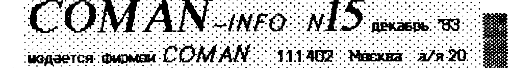
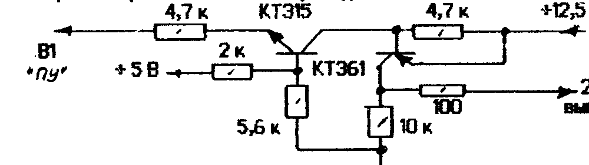
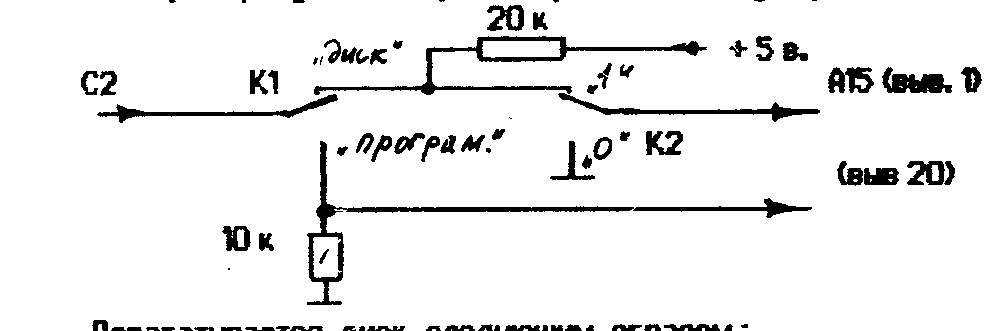
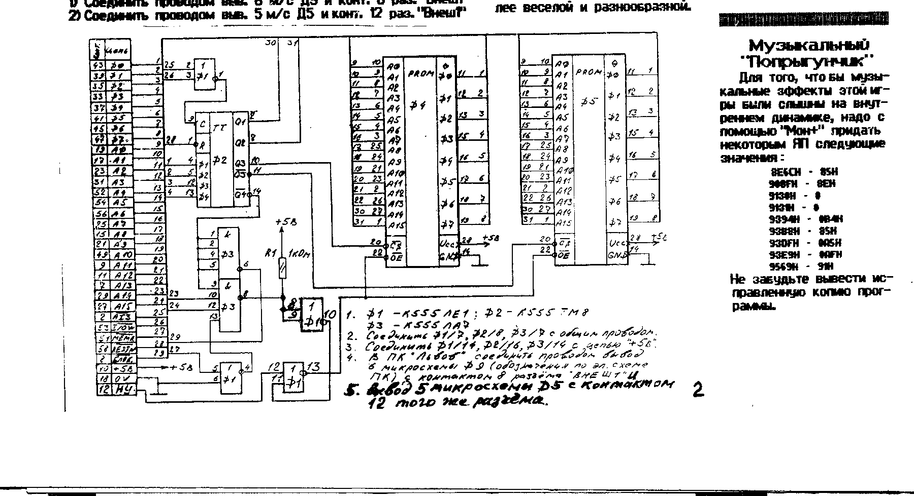

Издается фирмой COMAN, 111402 Москва а/я 20.

## ROM диск - программатор

В прошлом номере вы увидели потроха ROM-диска.
Теперь вы узнаете, как сделать из него программатор ППЗУ M27512.

Доработки потребуются минимальные, но вы должны сразу определиться, что вы будете делать - универсальную плату (ROMдиск/программатор) или приобретете чистую плату и будете терзать уже ее (второй вариант, вообще говоря, более предпочтителен).

Прежде чем приступить к сборке программатора (или к истязанию уже готового диска), мы напомним, каким образом происходит программирование ППЗУ УФ.
Каждая ячейка памяти м/с (каждый бит) представляет собой полупроводниковый элемент, способный достаточно долго (100000 часов) сохранять сообщенный ему электрический заряд.
Обрамленные соответствующими схемами выборки и управления, эти ячейки и являются, собственно ППЗУ.
Процесс программирования ППЗУ УФ - это ни что иное, как процесс зарядки.
Однако производится он не так, как, скажем, заряжается конденсатор.
Зарядка здесь (читай, программирование) производится подачей импульса определенной длительности и определенной амплитуды, именуемой НАПРЯЖЕНИЕМ ПРОГРАММИРОВАНИЯ.
У каждого типа микросхем эти параметры свои, поэтому не будем заострять на них наше внимание.

Для изготовления программатора вам потребуется собрать блок ключей, предназначенных для коммутации программирующего напряжения.
Схема приводится ниже.



В качестве напряжения программирования служит напряжение +12,5 В., которое должно поступать от внешнего источника.
Следует особо отметить, что микросхемы ППЗУ - существа нежные, поэтому при напряжении менее 12 В они вообще плохо программируются, а при 13-ти - обычно умирают.
Поэтому, ребята, уж будьте добры, обеспечте +12,5 В ± 0,25 В. и желательно, без пульсаций.
Но вообще говоря, напряжение программирования, обычно указано непосредственно на корпусе микросхемы.
Если оно равно 12,5 В., то иногда его не указывают.

У микросхемы M27512 выводов не так много, поэтому некоторые из них несут двойную нагрузку.
Поэтому кроме ключей, потребуется собрать еще блок коммутации.



Дорабатывается диск следующим образом:

- перерезать дорожку, идущую от конт. C2 "ТУ" к выв. 1 м/с.
- соединить конт. C2 с перекл. K1
- соединить K2 с выв. 1 м/с.
- соединить конт. B1 "ТУ" с блоком ключей.
- перерезать дорожку, идущую от 22 м/с к "земле".
- соединить выв. 22 м/с с блоком ключей.

Переключатель K1 коммутирует режим "диск"/"программирование".
Переключатель K2 коммутирует старшие/младшие 32 Кб. м/с.

В режиме "диск" переключатель K2 д.б. в состоянии "1"
Источник напряжения программирования должен иметь отдельный выключатель.

Текст драйвера программатора достаточно велик, что бы его печатать в бюллетене, поэтому его вы можете приобрести готовый.
Драйвер поставляется на кассете и имеет 2 варианта - дисковый и магнитофонный.
К кассете прилагается инструкция по работе с драйвером программатора.
Если у вас есть дисковод с CP/M-53, вы можете "слить" драйвер на диск, и пользоваться им с дискеты.
Следует отметить, что драйвер УНИВЕРСАЛЬНЫЙ, и при программировании вам надо выбирать тип м/с "27512".
Описание универсального программатора будет приведено в последующих номерах.

Стоимость драйвера (с кассетой и пересылкой) - 1000 руб.

Если вам лениво или невозможно самому собирать программатор, то вы можете приобрести готовый.

Программатор / ROM-диск (с драйв.) — 7000 руб.
Программатор M27512 (с драйверами) — 6000 руб.
Печатная плата ("голая") — 1000 руб.
Печатная плата с раз'ем. "ТУ" и панелью — 2000 руб.
Микросхема M27512 — 5$ (руб. по курсу ок. 6000)
А ROM-диск (64 Кб.) — 14000 р

## НЕКОТОРЫЕ ОСОБЕННОСТИ ROM-ДИСКА

Как вы знаете, на плате диска установлен новый раз'ем "ТУ", для того, что бы не дергать лишний раз провода.
Работа организована по "бесконфликтной" схеме, однако ВО ВРЕМЯ ЗАГРУЗКИ С ДИСКА, ПИТАНИЕ ПРИНТЕРА ДОЛЖНО БЫТЬ ВЫКЛЮЧЕНО.

## КАК ПОЛЬЗОВАТЬСЯ МОН-МОНСТРОМ

В ROM-диске "зашит" МОНИТОР-МОНСТР.
Основное отличие его от стандартного в том, что он без проблем загружает программы, записанные в формате ROM.

Для того, что бы произвести загрузку в монитор программы, записанной в формате ROM, надо сразу после запуска монитора, в тот момент, когда вам предлагается выбрать вариант размещения (1-й или 2-й), нажать клавишу с цифрой <3>.
После этого монитор запустится (в режиме 40 символов в строке), и вы можете задать одну из двух директив:

#B - загрузка в формате ROM по реальным адресам программы;

#BM - загрузка со смещением адреса на 0100Н - используется для загрузки программ, начинающихся с "нулевого" блока.

После этого на экране появляется карта загрузки, напоминающая карту загрузки стандартного копировщика и вы можете загружать программу.

Что касается остальных директив Мон-монстра, то они не отличаются от стандартного монитора.

## ЗАПУСК ПРОГРАММ ИЗ КОПИРОВЩИКА

Как вы знаете, наша фирма производит запись программ совместно с копировщиком COPY4.1, который при ошибке на приеме не сбрасывает программу.
Это позволило практически устранить рекламации по качеству записи.
Заказчик, получив от нас кассету, запускает копировщик и принимает в него подряд 2 копии программы (но обычно и первая "влетает" как к себе домой").
Затем выводит программу на свою ленту с привычной для себя скоростью, кол-вом проходов и т.д.

Единственным неудобством подобной системы являлось то, что когда получена НОВАЯ программа, и от нетерпения ее запустить лапки дрожат, как у пьяка, приходится возиться с загрузкой-перезагрузкой.
Но ведь можно запустить программу и из копировщика.

Для этого надо проделать следующие процедуры:

- загрузить и запустить COPY4.1
- загрузить в него программу
- нажать <РУС/ЛАТ>, затем <УС>
- снова нажать <РУС/ЛАТ> и после появления надписи "ЗАПИСЬ" быстро нажать клавиши <УС>+<Ц> и удерживать их до тех пор, пока программа не запустится (3-5 сек.)

Подобным образом запускается подавляющее большинство программ.

Информацией с нами поделился наш читатель В. Алексеев из дер. Ст. Муратово (Чувашия).
Мы попробовали - и точно!

> Друг по переписке: 344016 г Ростов-на-Дону А/Я 5703 Штейн В.А. ПК "Львов", "Вектор", "Спектрум"

## ROM-system для Львова

Как вы знаете из прошлого бюллетеня, для Львова также разработан ROM-диск.
Но используя опыт, полученный при разработке и эксплуатации диска для Вектора, мы немного модернизировали его и сделали на его основе ПЗУ-СИСТЕМУ.

В отличие от Вектора, где шла борьба за каждый свободный байт, и только благодаря упаковке удалось втиснуть в 64 Кб. пять программ, на Львове таких проблем не было.

Благодаря тому, что "Львов" имеет достаточно развитый внутренний блок п/программ, зашитый в штатном ПЗУ, а так же упрощенную (по сравнению с Вектором) графику, системные (да и игровые) программы на нем короче чем на Векторе в 2 - 3 раза.
Все это позволило сорганизовать сервисную систему типа "Коммандер".

Человек, приобретя ROM-СИСТЕМУ, подключает ее к своему ПК (в раз'ем "ВнешТ") и включает ПК.
Вместо порядком поднадоевшей заставки Бейсика на экране появляется нечто подобное этому:

```
ROM-SYSTEM  UM-GROUP

PROM1                    PROM2

BASIC2.0
ASS-91
MONITOR+
PICASSO
И Т.Д. (перечень уточняется)
```

Список программ, размещенных в ПЗУ-СИСТЕМЕ еще полностью не сформирован, но уже сейчас можно сказать, что он не беден, и включает в себя самые лучшие и популярные системные программы, а также вновь созданные специально для ПЗУ-С.
Такие, как "NOTEBOOK", "PACKER", и ряд других.
Очевидно, к январскому бюллетеню этот список будет сформирован.

Так вот, увидев на экране такую табличку, вам остается при помощи курсорных клавиш выбрать необходимую вам программу и нажать <ВК>.
Программа в течении 1 - 2 секунд будет загружена и запущена.
Согласитесь, очень приятно иметь под рукой большинство программ, которые постоянно нужны для работы.

Краткое описание программ будет приведено в следующем номере, но каждый ROM-диск будет снабжаться инструкцией, в которой будут подробно изложены особенности всех программ, находящихся в СИСТЕМЕ.

Используя внутренние особенности ПК "Львов", удалось обеспечить работоспособность системы с его минимальными переделками.
Единственное, что надо добавить в комп'ютер ... два провода, согласно нижеизложенной инструкции.
Причем это никак не сказывается на работе ПК в случае отсутствия ROM-диска.
Итак: (нумерация м/с по схеме ПК)

1) Соединить проводом выв. 6 м/с Д9 и конт. 8 раз. "ВнешТ"
2) Соединить проводом выв. 5 м/с Д5 и конт. 12 раз. "ВнешТ"

Схема ПЗУ-СИСТЕМЫ приведена на этой же странице, и любители могут сами ее собрать.



1. Ф1 - К555ЛЕ1; Ф2 - К555ТМ8
   Ф3 - К555ЛА3
2. Соединить Ф1/7, Ф2/8, Ф3/7 с общим проводом.
3. Соединить Ф1/14, Ф2/16, Ф3/14 с цепью "+5В".
4. В ПК "Львов" соедините проводом вывод 6 микросхемы Ф9 (обозначения по эл. схеме ПК) с контактом 8 раз'ема "ВНЕШТ".
5. Вывод 5 микросхемы Д5 с контактом 12 того же раз'ема.

Плата (голая) — 1000 руб.
Плата с раз'ем и панелями — 2000 руб.
ПЗУ M27512 (чистая) - 5$ (руб. по курсу)
ПЗУ M27512 (прошитая) - 6$ (руб. по курсу)
ПЗУ-СИСТЕМА (гар. 12 мес.) - 14000 руб.

Мы можем осуществить прошивку м/с информацией заказчика.
Информация д.б. предоставлена на кассете в бинарном формате (несколько копий).
Стоимость прошивки - 100 руб. за каждый полный и неполный Кб. информации плюс 6$ (руб. по курсу) за подготовку и микросхему.
Мы не несем ответственности за логические ошибки в информации заказчика.

Как вы заметили, на плате ROM-дисков и Вектора, и Львова осталось по одному свободному посадочному месту еще под одну м/с M27512.
Как нам кажется, очень немногие будут городить программатор и прошивать во вторую м/с что то специфическое.
Подавляющее большинство будет довольствоваться одной м/с или ждать, пока появится м/с с прошивкой новыми программами.
Поэтому просим вас, если появились какие то идеи, насчет того, что еще можно поместить в диск, сообщить нам.
Мы систематизируем результаты и выявим наиболее часто употребимые программы.

Кроме того, если вам не нравится (полностью или частично) содержимое диска (это касается как Вектора, так и Львова), вы можете связаться с нами и договориться о замене тех, или иных программ на другие.
Мы не думаем, что данная услуга будет дорога, договоримся.

## "КУРСИВ" НА ЛЬВОВЕ

Курсивом называют наклонный шрифт (как в этом заголовке).
Если вы хотите, что бы и ваш "Львов" начал писать курсивом, набейте и запустите следующую программу:

```
10 FOR Y=46304 TO 46079 STEP 8
20 FOR X=Y TO Y+3
30 A=PEEK(X): A=A/2: POKE X,A
40 NEXT: NEXT
```

Как видите, программа занимается тем, что извлекает содержимое знакогенератора, затем сдвигает верхнюю "половину" буквы вправо (равносильно делению на 2), и возвращает знак на место.
Этот механизм вам станет более понятен, если вы прочитаете об организации знакогенератора (бюл. 9).

Используя подобный механизм, вы можете менять знакогенератор "по ходу дела", когда надо выдать какое либо сообщение, отличающееся по внешнему виду от остального текста.

Ждем ваших программ, делающих жизнь вместе с ПК более веселой и разнообразной.

## Музыкальный "Попрыгунчик"

Для того, что бы музыкальные эффекты этой игры были слышны на внутреннем динамике, надо с помощью "Мон+" придать некоторым ЯП следующие значения:

8E6CH - 85H
906FH - 8EH
9134H - 0
9131H - 0
9394H - 0B4H
9388H - 85H
930FH - 0A5H
93E9H - 0AFH
9569H - 91H

Не забудьте вывести исправленную копию программы.

## TEXTAS: возможности

Об этом редакторе сложилось 2 полярных мнения: "..туфта! как вы на нем работаете?!", "вещь! больше ничего и не надо!".
Многие думают, что он был создан теми, кто "Ретекса" в глаза не видел.
Видели мы этот "Ретекс", и он нам не понравился.
Поэтому и был создан "Текстас".
Более того, он получил серьезное развитие в своей дисковой версии, приобретя элементы БАЗЫ ДАННЫХ.
Но об этом ниже.
Рассмотрим мнимые "недостатки" и особенности работы с редактором.
Может быть кто по новому взглянет на него.

Основная проблема - сила привычки.
По себе знаем, как тяжело менять инструмент, особенно если к нему привык и освоил.
ТЕКСТАС появился спустя год, после появления РЕТЕКСА, поэтому многие, уже имея РЕТЕКС, и более-менее освоив его, не стали глубоко влезать в ТЕКСТАС.
И не разобравшись, стали делать "глубокие" выводы.

Вторая проблема - отсутствие нормальной инструкции с раз'яснением всех возможностей ТЕКСТАСА.
Эту проблему мы и хотим решить, тем более, что ТЕКСТАС (магнитофонный вариант, со встроенным ассемблером и мини-монитором) зашивается в ROM-диск.
Данная инструкция имеет цель раз'яснить некоторые особенности этой версии.

Загрузив ТЕКСТАС (в дальн. ТР), и посмотрев на заголовок, вы переходите в режим редактирования.
Экран может быть заполнен разным мусором.
Все управление редактора сосредоточено на функциональных клавишах.
Система построена на двойных нажатиях клавиш- сначала одну, выбирая более старшее меню, затем другую, выбирая непосредственно функцию.
Например, если вы нажмете "F1", то в служебной строке вы увидите подсказку - перечень функций

Помощь Печать Печьблока Монитор Ассемблер

Это значит, что если вы нажмете еще раз "F1", то на экран будет выведена заставка-описание всех клавиш управления.
Если у вас есть принтер и супер-ПЗУ, лучше распечатать ее в режиме "принтскрин", что бы иметь всегда под рукой.
Если нет - не беда, можете вызывать ее когда она потребуется.

Управление перемещением курсора сосредоточено на клавишах стрелок и управляющих клавишах <СС> и <УС>.
Назначение их комбинаций достаточно ясно списано в "Помощи".

"вставка/замена" - <F5>,<F5> - в режиме "Вставка" производится вставка символа на позицию курсора, а часть строки справа от курсора сдвигается вправо на один символ.
В режиме "Замена" производится затирание старого символа и печать на его месте нового.

"очистка буфера" - <F5>,<F4> - после загрузки или плодотворной работы, на экране очень много мусора.
При нажатим этих клавиш, будет задан вопрос о санации буфера.

"акт. цвета" - <F5>,<F2> - если вам не нравится палитра, установленная при запуске, нажав эти клавиши, а затем <1>, <2>,<3> или <4>, подберите то, что вам нравится.

"информ." - <F5>,<F1> - выдается информация о том, где находится ваш текст, как много вы накропали и место, где находится курсор.

операции с блоком делают удобным обращение с текстом.
Все они начинаются с <F4>, затем <F1>...<F5>.
Блок выделяется МАРКЕРОМ.
Их вам позволят поставить не более 2-х, и все, что между ними, обзывается блоком.

"вставить маркер" <F4> - в текст будет вставлен маркер (спец. символ).
Прежде чем вызвать данный режим, установите курсор в желаемое место текста.

"удаление маркеров" <F5> - из текста удаляются оба маркера, и вы можете назначить новые.

"переместить блок" <F1> - помеченный блок перемещается в место, указанное курсором.
На прежнем месте текст подтягивается "снизу вверх".

"копировать блок" <F3> - блок остается на своем месте, а начиная с позиции курсора, появляется его дубликат.

"удалить блок" <F2> - помеченный блок перестает существовать.
Текст подтягивается на место блока.

Работа с магнитофоном <F3> делает возможным сохранять файлы, компановать из готовых блоков нечто целое.

"имя файла" <F3> - задается имя файла на вывод или ввод.

"вывести файл" <F1> - запись на МЛ

"ввод файла" <F2> - при подтверждении уничтожения текущего (если есть), файл принимается в начало буфера.
Прервать ввод можно перезапуском ТР <БЛК>+<СБР>.

"вывод блока" <F5> - производится для сохранения ни всего файла, а части, помеченной как блок.

"добавить" <F4> - принимаемый файл подстыковывается в конец к существующему.

словарь <F2>,<F1>.
В ТР существует система стенографического набора.
Наиболее часто употребимые слова можно занести в словарь.
Для этого надо подвести курсор на слово, подлежащее занесению в словарь, и нажав <F2>,<F1>, указать, в какую ячейку словаря поместить выбранное слово.
Выбор ячейки производится нажатием клавиш <УС>+<буква>.
В дальнейшей работе нажатие этого сочетания будет вызывать вставку в текст целого слова, занесенного в эту ячейку.

Общая длина буфера словаря - 256 символов.
Т.е. суммарная длина всех слов, занесенных в словарь д.б. не более 256 символов.

Постарайтесь освоить этот механизм, т.к. он потребуется в дальнейшем для многих специфических операций.

"поиск/замена" <F2>...делают очень удобной работу с большими текстами, особенно текстами программ.

"поиск" <F3> - задается контекст "что искать".
Окончание ввода - нажатие <ВК>.
После этого устанавливают курсор в начало текста (поиск всегда от начала к концу), и нажимают <F2>,<F2> - начать поиск.

"поиск и замена" <F4> - Задается контекст "что искать" и "на что менять".
Затем действия аналогичные поиску.
Найденный фрагмент будет заменен.

При отработке этих функций буферы контекстов сохраняются до следующего вызова, поэтому если вам надо искать или заменять несколько раз, можете просто начинать поиск.

печать: Делает возможным распечатки созданных текстов, получение "твердых копий".
Режим печати вызывается клавишами <F1>, <F2> или <F3>.
В первом случае будет распечатан весь файл, во втором - выделенный блок.
ВНИМАНИЕ.
К сожалению, автор ТР вставил в ТР готовые драйверы от "ЕДАСМ-а", поставляемого в базовом ПО вместе с Вектором.
А эти драйверы не имеют настройки порта печати.
Поэтому многие испытывали проблемы с печатью из ТЕКСТАСА.
Если до запуска ТР вы работали с какой-нибудь программой, которая настраивает порт "ТУ", то проблем не возникает.
Но если вы запустите редактор из "холодного" состояния ПК, то исправить ошибку автора вам придется самим.

Для этого надо активизировать МОНИТОР, встроенный в ТР.
Это делается нажатием клавиш <F1>,<F4>.
Затем выбрать режим редактирования дампа - <F1>.
И на вопрос "Адрес:", набрать, например, 6000 (любое число от 4000 до A000).
На экран будет выведен дамп с указанного адреса.
Затем следует набрать программу в кодах следующего содержания:

```
6000  3E 83 D3 04 C3 00 00
```

Это программа настройки порта для принтера.
После этого надо снова войти в МОНИТОР и выбрать функцию "Запуск" кл. <F5>.
На запрос "Адрес:" надо указать те же 6000.
Программа настройки отработает свое и вернется в монитор.
Как видите, обучение ТР печати заняло не более 1 минуты.

Вообще говоря, введение монитора в ТР оказалось чрезвычайно плодотворным, особенно при написании некрупных программ.
Поэтому, как вы заметили, мы настойчиво рекомендуем ТЕКСТАС, а не РЕТЕКС.
Вы можете написать любую программу, отработать ее (даже для того же текста), но об этом позже.

Коснувшись МОНИТОРА, упомянем его остальные функции.
ВЫВОД и ВВОД с МЛ, а также ПЕРЕМЕЩЕНИЕ области памяти.
Работа с ними проста и не требует комментариев.
Формат записи на МЛ совпадает с форматом МОНИТОРА-ОТЛАДЧИКА.

АССЕМБЛЕР встроенный в ТЕКСТАС, практически ничем не отличается от транслятора ассемблера ЕДАСМА, входящего в базовое ПО, поэтому описание его есть у вас в документации к Вектору.
Усовершенствование заключается в том, что его научили выдавать номера строк с ошибками.

В следующем номере мы раскажем о том, как управлять принтером из ТР.
Это можно делать либо при помощи МОНИТОРА, либо при помощи СЛОВАРЯ.

## Рембрандт и некоторые особенности работы

Редактор "Рембрандт" достаточно популярен, поэтому нам хотелось бы раз'яснить некоторые особенности работы в нем.

вывод в формате ассемблера.
Используется программистами при создании программ.
Следует обращать внимание на то, что файл в этом формате значительно больше по об'ему, нежели в формате монитора.
Это происходит потому, что описание информации отнимает много памяти.
Кроме того, файл перед выводом должен быть обработан, т.е. подготовлен, т.к. в процессе вывода не будет времени на обработку.
Поэтому выводимый в формате Ассемблера файл не может быть больше, чем буфер ГР.
При выводе в этом формате будьте осторожны, и не старайтесь вывести сразу все.
Если спрайт больше 10 - 20 Кб., лучше разбейте его на несколько.
Благо, что формат вывода (по строкам), позволяет стыковать кусочки без проблем в текстовом редакторе.
Не забудьте только изменить вертикальный размер спрайта перед трансляцией.

отключение плоскостей позволяет значительно уменьшить об'ем спрайтов и практически без потери качества.
Редко какой спрайт имеет более 4-8 цветов, и для их создания вовсе не требуется вся палитра.
Но для того, что бы цвета не искажались при последующем выводе на экран из программы, надо правильно подобрать палитру и правильно выбрать цвета из нее для рисования конкретного спрайта.
Поможет вам в этом приведенная таблица (столбцы - математический номер цвета палитры).

| Включен. плоскос. | 0 | 1 | 2 | 3 | 4 | 5 | 6 | 7 | 8 | 9 | 10 | 11 | 12 | 13 | 14 | 15 |
| --- | --- | --- | --- | --- | --- | --- | --- | --- | --- | --- | --- | --- | --- | --- | --- | --- |
| 1,2,3 | 0 | 1 | 2 | 3 | 4 | 5 | 6 | 7 | 0 | 1 | 2 | 3 | 4 | 5 | 6 | 7 |
| 1,2,4 | 0 | 1 | 2 | 3 | 0 | 1 | 2 | 3 | 8 | 9 | 10 | 11 | 8 | 9 | 10 | 11 |
| 1,3,4 | 0 | 1 | 0 | 1 | 4 | 5 | 4 | 5 | 8 | 9 | 8 | 9 | 12 | 13 | 12 | 13 |
| 2,3,4 | 0 | 0 | 2 | 2 | 4 | 4 | 6 | 6 | 8 | 8 | 10 | 10 | 12 | 12 | 14 | 14 |
| 1,2 | 0 | 1 | 2 | 3 | 0 | 1 | 2 | 3 | 0 | 1 | 2 | 3 | 0 | 1 | 2 | 3 |
| 1,3 | 0 | 1 | 0 | 1 | 4 | 5 | 4 | 5 | 0 | 1 | 0 | 1 | 4 | 5 | 4 | 5 |
| 1,4 | 0 | 1 | 0 | 1 | 0 | 1 | 0 | 1 | 8 | 9 | 8 | 9 | 8 | 9 | 8 | 9 |
| 2,3 | 0 | 0 | 2 | 2 | 4 | 4 | 6 | 6 | 0 | 0 | 2 | 2 | 4 | 4 | 6 | 6 |
| 2,4 | 0 | 0 | 2 | 2 | 0 | 0 | 2 | 2 | 8 | 8 | 10 | 10 | 8 | 8 | 10 | 10 |
| 3,4 | 0 | 0 | 0 | 0 | 4 | 4 | 4 | 4 | 8 | 8 | 8 | 8 | 12 | 12 | 12 | 12 |
| 1 | 0 | 1 | 0 | 1 | 0 | 1 | 0 | 1 | 0 | 1 | 0 | 1 | 0 | 1 | 0 | 1 |
| 2 | 0 | 0 | 2 | 2 | 0 | 0 | 2 | 2 | 0 | 0 | 2 | 2 | 0 | 0 | 2 | 2 |
| 3 | 0 | 0 | 0 | 0 | 4 | 4 | 4 | 4 | 0 | 0 | 0 | 0 | 4 | 4 | 4 | 4 |
| 4 | 0 | 0 | 0 | 0 | 0 | 0 | 0 | 0 | 8 | 8 | 8 | 8 | 8 | 8 | 8 | 8 |

Пользоваться этой таблицей надо следующим образом.
Например, вы хотите нарисовать спрайт, лежащий в 3 и 4 плоскостях.
Находите в таблице соответствующую строку и видите, что доступны вам только 4 математических цвета.
При помощи редактора палитры вы можете сделать их любыми физическими, но доступны только указанные.
Если вы выберете активным например 5-й цвет, то при выводе на экран он все равно будет таким же, как 4-й.

Для "отключения" плоскостей, как мы уже говорили, вы должны изменить палитру таким образом, что бы информация в отключаемых плоскостях стала невидимой.
Этого можно добиться, если цвета, которые "ответственны" за отображение в этих плоскостях, сделать равными цвету фона - 0-му цвету.

Играя в некоторые игры, вы наверное заметили, что неприятные впечатление оставляют моменты, когда подвижный спрайт "наезжая" на какой-либо фон, меняет свою окраску целиком или частично.
Это происходит из-за неправильно выбранных цветов палитры.
Для того, что этого не происходило, надо тщательно подбирать цвета еще при рисовании спрайта.
Поясним на примере.

Обычно игровой фон, на котором происходят события, располагают в одной-двух плоскостях, и про него забывают.
Подвижные же спрайты заставляют двигаться в оставшихся.
Это позволяет не заботиться о том, что подвижный спрайт может что то затереть на фоне.
Допустим, фон мы располагаем в первой плоскости, и он нарисован 1-м математ. цветом.
Подвижный об'ект мы выводим во вторую плоскость, и он нарисован 2-м цветом, соответственно.
Тогда, при наезде на фон, окажется, что у нас "заработали" уже две плоскости, которые дадут на экране 3-й математический цвет (см. таблицу).
Для того, что бы этого не произошло, надо в палитре сделать 3-й цвет таким же, как и второй (или 2-й как 3-й).
Тогда цвет подвижного об'екта не будет меняться.

Конечно, не стоит ломать голову над тем, что получится в том или ином случае.
Достаточно попробовать все это в самом граф. редакторе.

## Внимание! Наши заказчики, проживающие в Беларуси, могут обращаться к нашему региональному дилеру:

225320 г. Барановичи-9 а/я 37 Дудар Ю.М.

> 302-65-36 это телефон магазина, о котором мы писали в бюлл. 13.
> А это его адрес: м. Новогиреево ул. Сталеваров д.18

## Что год грядущий нам готовит?

Нам кажется, вас это тоже интересует, тем более, что у многих 15-й номер последний.
И перед ними встает вопрос, а стоит ли выписывать эту газетенку дальше.

Как вы заметили, темпы выпуска бюллетеней выросли и достигли почти расчетной величины - 3 - 3,5 недели (расчетная - 2 недели).
Уже начинает сказываться "тормознутость" почты.
В отдаленных от нас районах страны получают, не получают, а потом как получат 2-3 номера сразу.
То-то интересно читать!

Итак, немного о планах нашей фирмы (на предмет, а стоит ли иметь с нами дело).
Скажем честно, это не все, т.к. есть и коммерческие тайны.
Вот часть перечня проектов и разработок, которые уже в заделе, а также информация, которая будет опубликована на страницах нашего бюллетеня.

- Упаковка / распаковка информации....
- "Вечная жизнь" в программах....
- Новые этажи и лабиринты....
- Новые игровые и прикладные программы...
- Игровая программа - своими руками (и головой)...
- ПК в стиле а-ля-Денди, или игровые картриджи...
- Информация и инструкции к программам....
- Световое перо к ПК и его драйверы....
- Дигитайзер и его драйверы....
- Стриммер....
- Расширение ОЗУ до 256 - 512 Кб (не путать с квазидиском)
- Часы в ПК....
- Домашний доктор/диагност и описание датчиков....
- Модем и локальные сети....

И многое, многое другое.

Все вышеупомянутое относится как к Львову, так и к Вектору.
Также будут описаны всевозможные сопутствующие устройства и "прибамбасы".

Думайте сами, решайте сами, иметь или не иметь....

В то же время просим вас не быть безучастными читателями.
Просим присылать свои отзывы и пожелания, что бы вы хотели видеть на страницах бюллетеня.

## С НОВЫМ ГОДОМ!

А вот и новогодний подарочек:
В связи с очередным повышением цен на конверты, бумагу и полиграфические услуги, подписная цена = 80 руб за номер.
Оплату высылать почт. пер. по адресу: 111402 Москва а/я 20 Тимошенко К.А.
